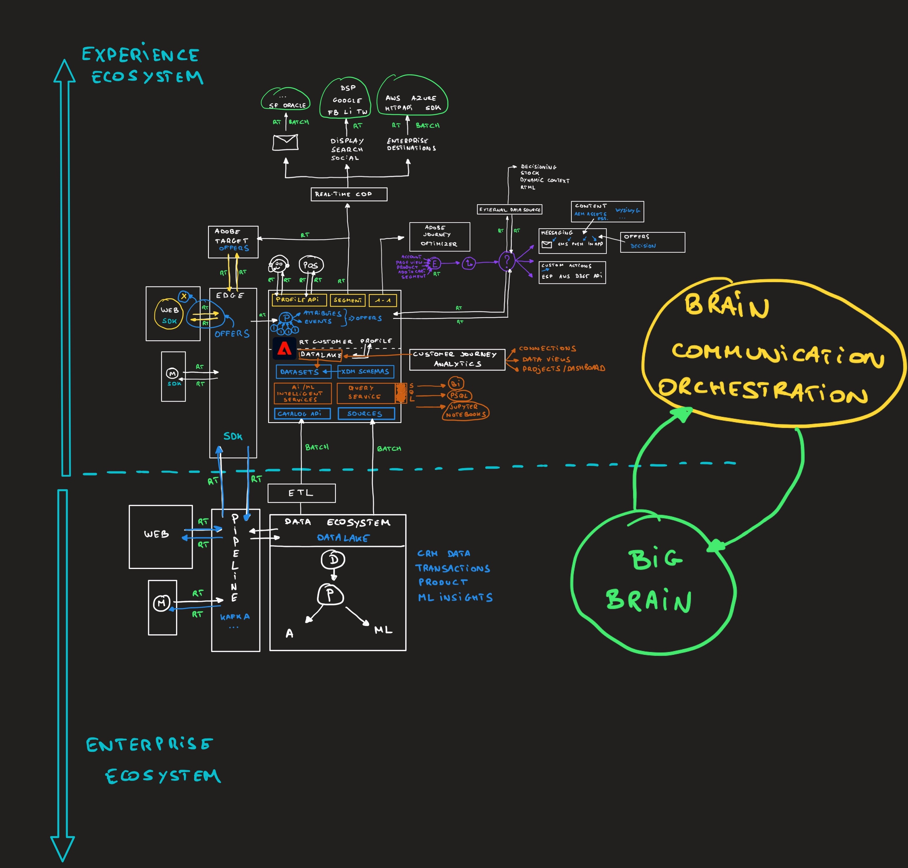

# 架构

## 学习目标

- 了解如何描述Adobe Experience Platform的架构和本教程
- 了解Adobe Experience Platform在贵组织的生态系统中的位置。

## YouTube

您可以找到其他有趣的视频 [在YouTube频道](https://www.youtube.com/channel/UCUKG2dkZ9pYuZUPebQ21jUw).

## Adobe Experience Platform架构概述

>[!VIDEO](https://video.tv.adobe.com/v/35266?quality=12&learn=on)

## 架构概述

以下是您在上述视频中看到白板正在创建的图像：

以下是指向Lucidchart文档的链接，您可以根据需要复制和重复使用该文档：

[Lucidchart架构](https://lucid.app/documents/view/69c2a0e4-9135-47d7-ae86-7f88cec9bc34)

[返回到所有模块](./overview.md)
