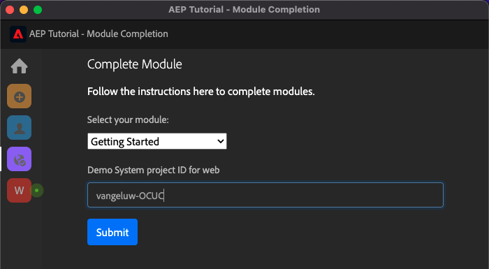
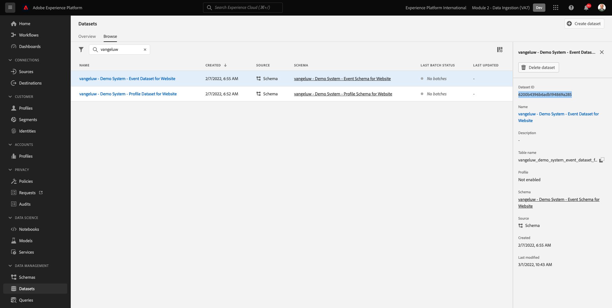
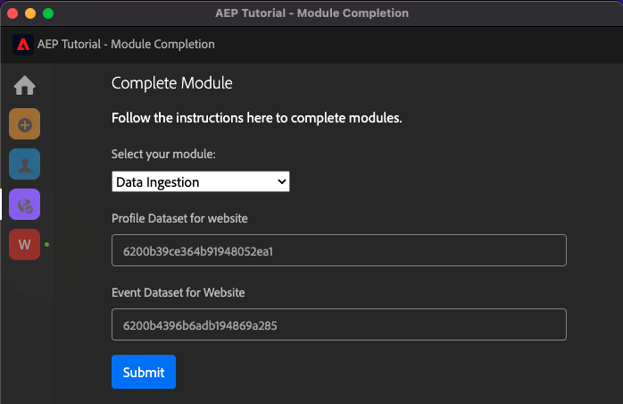
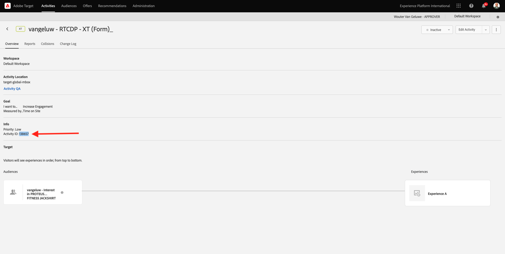
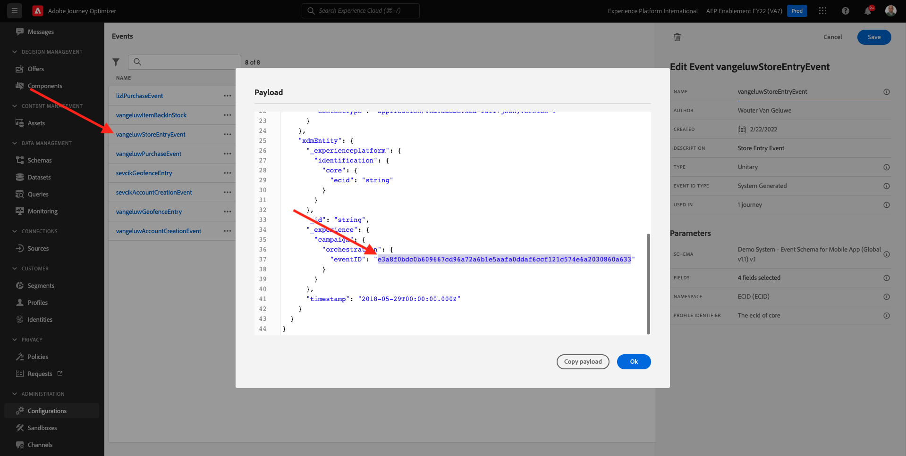
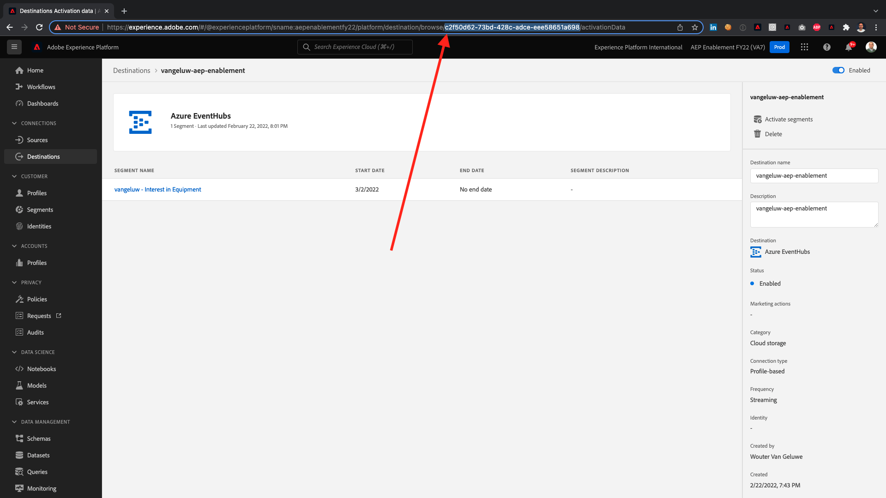
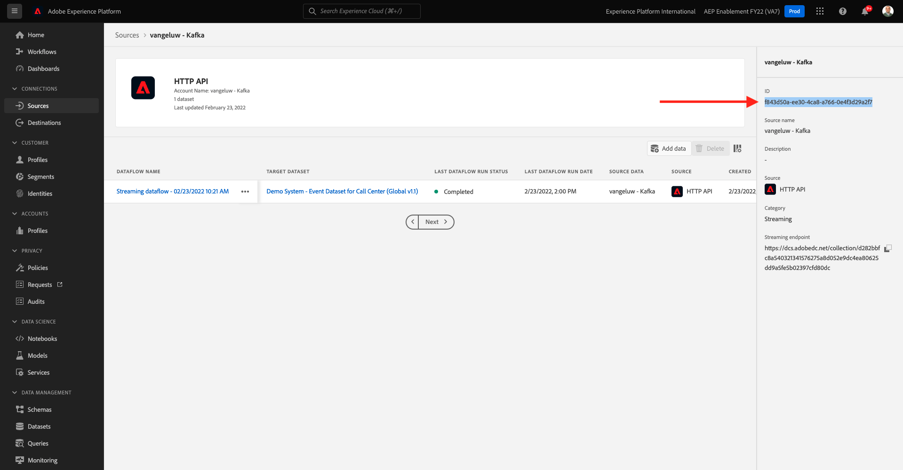

# Adobe Experience Platform的全面技术教程 — 如何测量完成？

您可以使用创建的Chrome扩展来更新Adobe Experience Platform综合技术教程的完成情况。

按照模块0中的说明，您输入了贵组织的 **配置ID** ，您便已注册。 此时，您的Chrome扩展应当如下所示。 单击紫色图标以提交模块的完成情况。

然后您将看到：

通过打开下拉菜单，您可以选择要完成的模块：

要完成模块，您需要提供完成证明。

以下是每个模块的预期完成校样。

## 快速入门

模块的预期完成证明 **快速入门** 是您创建的Web演示系统项目的ID。

Web格式的演示系统项目的ID如下所示： `--demoProfileLdap-- - OCUC`.

选择 **快速入门** 在下拉菜单中，输入 **演示系统项目的ID** ，然后单击 **提交**  — 按钮。

## 数据收集和Web SDK

模块的预期完成证明 **数据收集和Web SDK** 是Web的“数据收集”属性的名称。

Web格式的数据收集属性的名称如下所示： `--demoProfileLdap-- - Demo System (05/02/2022) (enablement) 1644046719474`.

选择 **数据收集和Web SDK** 在下拉菜单中，输入 **Web的数据收集属性名称** ，然后单击 **提交**  — 按钮。

## 数据引入

模块的预期完成证明 **数据摄取** 是您创建的2个数据集的数据集ID。

数据集ID格式如下所示： **5f069724723ef41916a8b5d2**.

`--demoProfileLdap-- - Demo System - Event Dataset for Website`

`--demoProfileLdap-- - Demo System - Profile Dataset for Website`

选择 **数据摄取** 在下拉菜单中，输入 **数据集ID** ，然后单击 **提交**  — 按钮。

## 实时客户资料

模块的预期完成证明 **实时客户资料** 是 **区段ID** 您通过UI创建的区段， `--demoProfileLdap-- - Male customers with interest in Montana Wind Jacket`.

区段ID格式如下所示： **8cb7034d-d4ae-4d26-a61f-a76559c12457**.

选择 **实时客户资料** 在下拉菜单中，输入 **区段ID** ，然后单击 **提交**  — 按钮。

## 查询服务

模块的预期完成证明 **查询服务** 是 `--demoProfileLdap--_callcenter_interaction_analysis`  — 完成模块后获取的数据集。

格式如下所示： **62076f68f14a9d194995d4e2**.

选择 **查询服务** 在下拉菜单中，输入 **数据集ID** ，然后单击 **提交**  — 按钮。

## Intelligent Services

模块的预期完成证明 **智能服务** 是 **产品购买倾向客户AI服务**.

格式如下所示： **12729** 并且，打开服务后，您可以从URL中检索该数据。

选择 **智能服务** 在下拉菜单中，输入 **Customer AI服务ID** ，然后单击 **提交**  — 按钮。

## Real-Time CDP

模块的预期完成证明 **Real-Time CDP** 是 **Adobe Target活动**.

格式如下所示： **111804**.

选择 **Real-Time CDP** 在下拉菜单中，输入 **Adobe Target Activity ID** ，然后单击 **提交**  — 按钮。

## AJO:编排

模块的预期完成证明 **AJO:编排** 是 `--demoProfileLdap--AccountCreationEvent`.

格式如下所示： **227402c540eb8f8855c6b2333adf6d54d7153d9d7d56fa475a6866081c574736**.

选择 **AJO:编排** 在下拉菜单中，在输入字段中输入**eventID**，然后单击 **提交**  — 按钮。

## AJO:自定义操作

模块的预期完成证明 **AJO:自定义操作** 是事件的eventID `--demoProfileLdap--GeofenceEntry`.

格式如下所示： **fa42ab7982ba55f039eacec24c1e32e5c51b310c67f0fa559ab49b89b63f4934**.

选择 **AJO:自定义操作** 在下拉菜单中，输入 **eventID** ，然后单击 **提交**  — 按钮。

## AJO:选件

模块的预期完成证明 **AJO:选件** 是 **选件决策** 创建的。

您可以在 **选件决策ID**，如下所示 **xcore:offer-activity:1122fcc4603ea499**，此处：

选择 **AJO:选件** 在下拉菜单中，输入 **选件决策ID** ，然后单击 **提交**  — 按钮。

## AJO:事件

模块的预期完成证明 **AJO:事件** 是 `--demoProfileLdap--StoreEntryEvent`.

格式如下所示： **e3a8f0bdc0b609667cd96a72a6b1e5aafa0ddaf6ccf121c574e6a2030860a633**.

选择 **AJO:事件** 在下拉菜单中，输入 **eventID** ，然后单击 **提交**  — 按钮。

## CJA

模块的预期完成证明 **CJA** 是您项目的ID `--demoProfileLdap-- - Omnichannel Analysis`.

格式如下所示： **6217344f6249ac70c726db60**，则可以在打开项目时的URL中找到该页面。

选择 **CJA** 在下拉菜单中，输入 **项目ID** ，然后单击 **提交**  — 按钮。

## CJA:BigQuery

模块的预期完成证明 **CJA:BigQuery** 是 **BigQuery** — 连接。

您可以在 **BigQuery连接ID**，如下所示 **85a2394d-8b94-410c-a239-4d8b94b10c38**，此处：

选择 **CJA:BigQuery** 在下拉菜单中，输入 **BigQuery连接ID** ，然后单击 **提交**  — 按钮。

## RTCDP:EventHub

模块的预期完成证明 **RTCDP:EventHub** 是 **Microsoft Azure事件中心** 目标位于Adobe Experience Platform。

您可以在 **Microsoft Azure事件中心目标ID**，如下所示 **fa3f7ce5-86fd-4096-bf7c-e586fdc096ba**，此处：

选择 **RTCDP:EventHub** 在下拉菜单中，输入 **Microsoft Azure事件中心目标ID** ，然后单击 **提交**  — 按钮。

## RTCDP连接

模块的预期完成证明 **RTCDP连接** 是 **事件转发属性ID**.

您可以在 **事件转发属性ID**，如下所示 **PR40f44184c888472e9c19d8d602aab0de**，此处：

选择 **RTCDP连接** 在下拉菜单中，输入 **事件转发属性ID** ，然后单击 **提交**  — 按钮。

## 阿帕奇·卡夫卡

模块的预期完成证明 **阿帕奇·卡夫卡** 是源连接器的ID `--demoProfileLdap-- - Kafka`.

ID如下所示 **f843d50a-ee30-4ca8-a766-0e4f3d29a2f7**，您可以在此处找到它：

选择 **阿帕奇·卡夫卡** 在下拉菜单中，输入 **流量ID** ，然后单击 **提交**  — 按钮。

[返回到所有模块](./overview.md)
