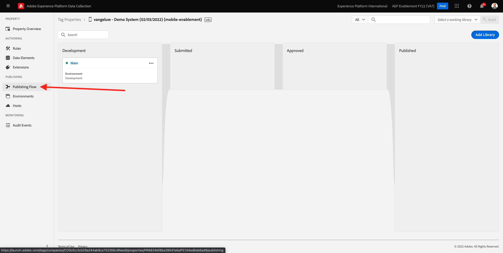

# 0.3创建数据流

转到 [https://experience.adobe.com/#/data-collection/](https://experience.adobe.com/#/data-collection/). 在上一个练习之后，您现在拥有两个数据收集属性：一个用于web，一个用于移动设备。

这些属性几乎已准备就绪，可供使用，但在开始使用这些属性收集数据之前，您需要设置数据流。 您将在练习1.2中获得有关数据流概念及其含义的更多信息。

现在，请执行以下步骤。

## 0.3.1创建Web数据流

单击 **[!UICONTROL 数据流]** 或 **[!UICONTROL 数据流（测试版）]**.

在屏幕的右上角，选择您的沙盒名称，该名称应为 `--aepSandboxId--`.

单击 **[!UICONTROL 新数据流]**.

对于 **[!UICONTROL 友好名称]**，对于可选描述，输入 `--demoProfileLdap-- - Demo System Datastream`. 对于事件架构，选择 **演示系统 — 网站的事件模式（全局v1.1）**. 单击&#x200B;**保存**。

然后你会看到这个。 单击 **添加服务**.

选择服务 **[!UICONTROL Adobe Experience Platform]**，将显示其他字段。 然后你会看到这个。

对于事件数据集，选择 **演示系统 — 网站事件数据集（全局v1.1）** 和对于配置文件数据集，选择 **演示系统 — 网站的配置文件数据集（全局v1.1）**. 单击&#x200B;**保存**。

你现在会看到这个。

现在就这样。 在 [模块1](./../module1/data-ingestion-launch-web-sdk.md) 您将了解有关Web SDK以及如何配置其所有功能的更多信息。

在左侧菜单中，单击 **[!UICONTROL 标记]**.

过滤搜索结果，以查看您的两个数据收集属性。 打开资产 **Web** 单击。

然后你会看到这个。 单击 **扩展**.

在Adobe Experience Platform Web SDK扩展上，单击 **配置**.

然后你会看到这个。 对于 **数据流**，您当前将看到一个虚设值设置为1。 现在，您需要单击 **从列表中选择** 按钮。 在下拉列表中，选择您之前创建的数据流。

确保已选择 **数据流**. 提示：您可以通过键入 `--demoProfileLdap--`.

向下滚动直到您看到 **数据收集**. 请确保 **启用点击数据收集** 未启用。 单击 **保存** 以保存更改。

转到 **发布流程**.

单击 **...** 表示 **主要**，然后单击 **编辑**.

单击 **Add All Changed Resources** 然后单击 **保存并构建以用于开发**.

您的更改现在正在发布中，几分钟后即可就绪。

## 0.3.2为移动设备创建数据流

转到 [https://experience.adobe.com/#/data-collection/](https://experience.adobe.com/#/data-collection/).

单击 **[!UICONTROL 数据流]** 或 **[!UICONTROL 数据流（测试版）]**.

在屏幕的右上角，选择您的沙盒名称，该名称应为 `--aepSandboxId--`.

单击 **[!UICONTROL 新数据流]**.

对于 **[!UICONTROL 友好名称]**，对于可选描述，输入 `--demoProfileLdap-- - Demo System Datastream (Mobile)`. 对于事件架构，选择 **演示系统 — 移动设备应用程序的事件模式（全局v1.1）**. 单击&#x200B;**保存**。

单击&#x200B;**[!UICONTROL 保存]**。

然后你会看到这个。 单击 **添加服务**.

选择服务 **[!UICONTROL Adobe Experience Platform]**，将显示其他字段。 然后你会看到这个。

对于事件数据集，选择 **演示系统 — 移动设备应用程序事件数据集（全局v1.1）** 和对于配置文件数据集，选择 **演示系统 — 移动设备应用程序的配置文件数据集（全局v1.1）**. 单击&#x200B;**保存**。

然后你会看到这个。

您的数据流现已准备好用于移动设备的Adobe Experience Platform数据收集客户端资产。

转到 **标记** 和会过滤搜索结果，以查看您的两个数据收集属性。 打开资产 **移动设备** 单击。

然后你会看到这个。 单击 **扩展**.

在 **Adobe Experience Platform边缘网络** 扩展，单击 **配置**.

然后你会看到这个。 您现在需要选择之前配置的正确沙盒和数据流。 要使用的沙盒为 `--aepSandboxId--` 并调用数据流 `--demoProfileLdap-- - Demo System Datastream (Mobile)`.

对于 **边缘网络域**，请使用默认域， **edge.adobedc.net**.

单击 **保存** 以保存更改。

转到 **发布流程**.

单击 **...** 下一页 **主要**，然后单击 **编辑**.

单击 **Add All Changed Resources**，然后单击 **保存并构建以用于开发**.

您的更改现在正在发布中，几分钟后即可就绪。

下一步： [0.4使用网站](./ex4.md)

[返回模块0](./getting-started.md)

[返回到所有模块](./../../overview.md)