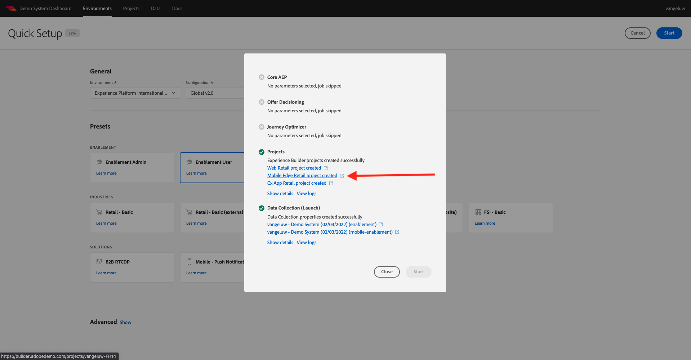

# 0.5使用移动设备应用程序

## 0.5.1下载应用程序

转到 [https://bit.ly/dx-demo-app](https://bit.ly/dx-demo-app) 在你的电脑上。 然后你会看到这个。

使用 **相机** 应用程序，以安装适用于设备操作系统的移动应用程序。 要启用此功能，您需要安装 **版本2.x** 使用Adobe Experience Platform Mobile SDK的。

>[!NOTE]
>
>首次在iOS设备上安装应用程序后，您在尝试打开应用程序时可能会收到一条错误消息，其中显示： **不受信任的企业开发人员**. 要修复此问题，您需要转到 **设置>常规>设备管理> Adobe Systems Inc.** 单击 **信托Adobe Systems公司**.

安装应用程序后，您将在设备的主屏幕上找到它。 单击图标以打开应用程序。

当您首次使用应用程序时，系统将要求您使用Adobe ID登录。 完成登录过程。

登录后，您将看到一条通知，请求您授予发送通知的权限。 我们将在教程中发送通知，因此请单击 **允许**.

然后，您将看到应用程序的主页。 转到 **设置**.

在设置中，您将看到 **公共项目** 会在应用程序中加载。 单击 **自定义项目**.

您现在可以加载自定义项目。 单击二维码可轻松加载项目。

练习0.1后，你得到了这个结果。 单击以打开 **移动设备零售项目** 是为你创建的。

如果您意外关闭了浏览器窗口，或者未来的演示或启用会议，您还可以转到 [https://builder.adobedemo.com/projects](https://builder.adobedemo.com/projects). 使用Adobe ID登录后，您将看到此内容。 单击您的移动设备应用程序项目以将其打开。

然后你会看到这个。 单击 **集成**.

您需要为练习0.1中创建的移动设备选择数据收集属性。接下来，单击 **运行**.

然后，您将看到此弹出窗口，其中包含二维码。 从移动设备应用程序内扫描此二维码。

然后，您将在应用程序中看到您的项目ID，随后您可以单击 **保存**.

现在，返回 **主页** 中。 您的应用程序现已准备就绪，可供使用。

您现在已完成模块0。

[返回模块0](./getting-started.md)

[返回到所有模块](./../../overview.md)
