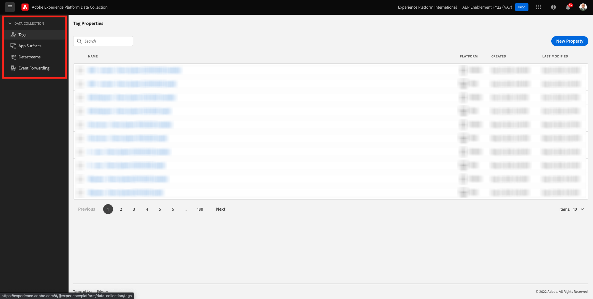

# 1.1了解Adobe Experience Platform数据收集

## 上下文

Adobe Experience Platform数据收集由品牌用于多个用例。 它是新一代Tag Management系统(TMS)，为客户提供了一种简单的方式来部署和管理所有用来改善相关客户体验的分析、营销和广告解决方案。 Adobe Experience Platform数据收集无需额外付费，它可供任何Adobe Experience Cloud客户使用。 品牌可以使用Adobe Experience Platform数据收集来：

- 实施Adobe Experience Cloud应用程序和Adobe Experience Platform。
- 通过为组织不同部分提供各自的需求，来管理组织不同部分的不同需求 **属性** 来管理。
- 允许测试和生命周期管理。
- 插入自定义javascript和第三方标记，所有这些标记都在一个位置进行管理。

## 浏览UI

转到 [Adobe Experience Platform数据收集](https://experience.adobe.com/#/data-collection/).

转到 **标记**. 您现在看到 **[!UICONTROL 属性]** 中。 此处列出的属性用于教程管理。 这些属性表示……

- 应用程序和Web属性
- 以不同方式为客户提供服务的不同网站。 例如，Luma Retail将拥有一个资产，Luma Travel将拥有另一个资产
- 旧版和当前网站
- 多个不同网站通用的特定Adobe Analytics设计
- 内部内部网页和外部站点

现在，请看左边栏。

- **[!UICONTROL 标记]** 提供了所有客户端属性的概述
- **[!UICONTROL 应用程序曲面]** 概述了启用推送通知的所有应用程序配置（与Project Sierra结合使用/启用）
- **[!UICONTROL 数据流]** 在 [下一次练习](./ex2.md)
- **[!UICONTROL 事件转发]** 概述了 [模块14 - Real-Time CDP连接：事件转发](../module14/aep-data-collection-ssf.md)

## 更多信息

Adobe Experience Platform数据收集是一款非常高级的工具，其范围不在Adobe Experience Platform教程之外。 组织可能不会使用Adobe Experience Platform数据收集来实现其标签管理功能，而是使用非Adobe标签管理解决方案来插入代码和管理标签。 Adobe和Adobe Professional Services支持使用非Adobe标签管理解决方案。
以下为有兴趣进一步了解Adobe Experience Platform数据收集的人士提供了一些进一步的阅读。

- [Adobe Experience Platform数据收集用户指南](https://experienceleague.adobe.com/docs/experience-platform/tags/home.html?lang=zh-Hans)
- [“利用 Web SDK 实施 Adobe Experience Cloud”教程](https://experienceleague.adobe.com/docs/platform-learn/implement-web-sdk/overview.html?lang=zh-Hans)
- [设置用户权限](https://experienceleague.adobe.com/docs/experience-platform/tags/admin/user-permissions.html)
- [API文档](https://developer.adobelaunch.com/api/)

下一步： [1.2边缘网络、数据流和服务器端数据收集](./ex2.md)

[返回到模块1](./data-ingestion-launch-web-sdk.md)

[返回到所有模块](./../../overview.md)
