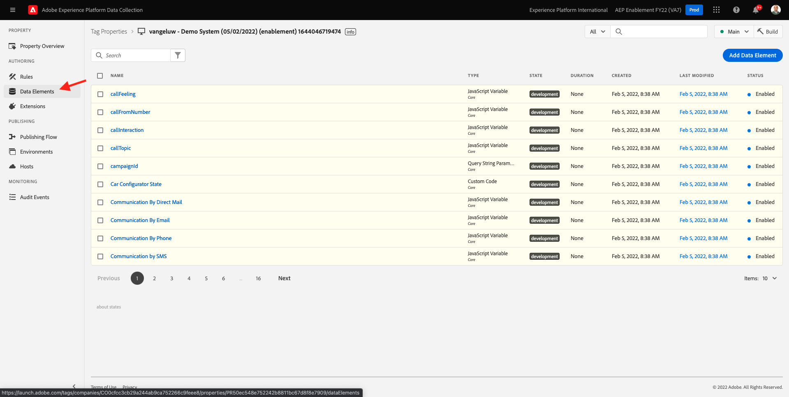
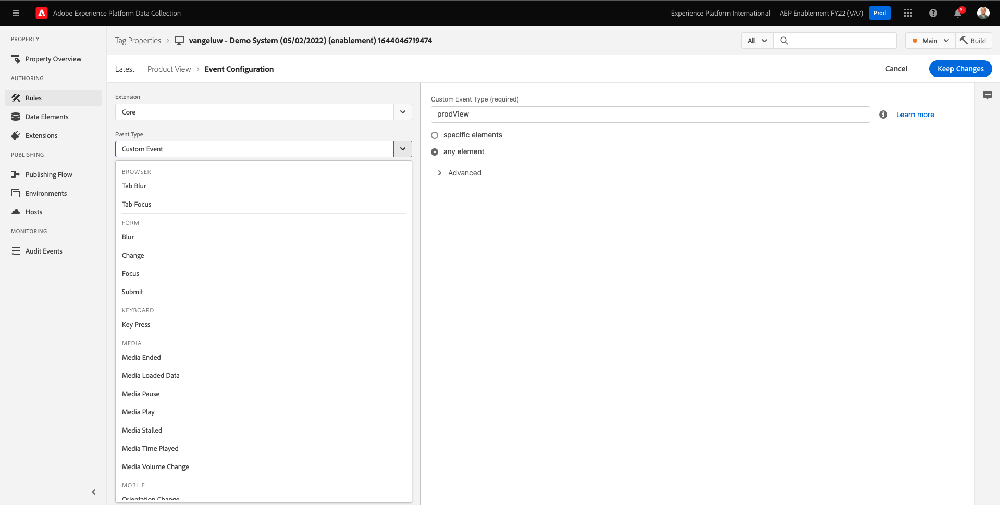

# 1.3 -Adobe Experience Platform数据收集简介

## 上下文

现在，让我们更深入地了解Adobe Experience Platform数据收集的构建基块，以了解您的演示网站上安装了哪些内容。 您将详细了解Adobe Experience Platform Web SDK扩展，将配置数据元素和规则，并了解如何发布库。

## 1.3.1 - Adobe Experience Platform Web SDK扩展

扩展是一组打包的代码，用于扩展Adobe Experience Platform数据收集界面和库功能。 Adobe Experience Platform数据收集是一个平台，扩展就像是在该平台上运行的应用程序。 本教程中使用的所有扩展都由Adobe创建和管理，但第三方可以自行创建扩展以限制Adobe Experience Platform数据收集用户必须管理的自定义代码量。

转到 [Adobe Experience Platform数据收集](https://experience.adobe.com/launch/) 选择 **标记**.

这是您之前看到的Adobe Experience Platform数据收集属性页面。

在模块0中，演示系统为您创建了两个客户端属性：一个用于网站，一个用于移动设备应用程序。 通过搜索来查找 `--demoProfileLdap--` 在 **[!UICONTROL 搜索]** 框中。

打开 **Web** 属性。

然后，您将看到资产概述页面。 单击 **[!UICONTROL 扩展]** 中。 单击 **[!UICONTROL 配置]** 按钮。

欢迎使用Adobe Experience Platform Web SDK! 在此，您可以使用您在中创建的数据流配置扩展 [练习0.2](./../module0/ex2.md) 以及一些更高级的配置。 您将只为本练习配置两个设置。

默认的边缘域始终为 **edge.adobedc.net**. 如果您在Adobe Experience Cloud或Adobe Experience Platform环境中实施了CNAME配置，则需要更新 **[!UICONTROL 边缘域]**. 您的Adobe Experience Platform实例正在使用此边缘域： `--webSdkEdgeDomain--`.

如果您实例的边缘域与默认域不同，请更新边缘域。 通过边缘域，可以配置第一方跟踪服务器，该服务器随后在后端使用CNAME配置，以确保将数据收集到Adobe中。

现在，确保 **[!UICONTROL 从列表中选择]** 单选按钮 **[!UICONTROL 数据流]** ，然后选择名为的数据流： `--demoProfileLdap-- - Demo System Datastream`，从 **[!UICONTROL 数据流]** 框中。

单击 **[!UICONTROL 保存]** 返回到扩展视图。

## 1.3.2数据元素

数据元素是数据字典（或数据映射）的构建块。使用数据元素可跨市场营销和广告技术收集、组织和交付数据。

单个数据元素是一个变量，其值可以映射到查询字符串、URL、Cookie 值、JavaScript 变量等。您可以在整个Adobe Experience Platform数据收集中通过其变量名称引用此值。 此数据元素集合将成为可用于构建规则（事件、条件和操作）的已定义数据的字典。所有Adobe Experience Platform数据收集中都会共享此数据字典，以便与您添加到资产中的任何扩展一起使用。

您现在将以Web SDK友好格式编辑现有的数据元素。

单击左边栏中的数据元素，以转到数据元素页面。

>[!NOTE]
>
>您只在此练习中编辑数据元素，但您可以看到 **[!UICONTROL 添加数据元素]** 按钮，用于向数据字典中添加新变量。 然后，可以在整个Adobe Experience Platform数据收集中使用该数据。 您可以随意查看一些其他已有的数据元素，这些数据元素大多使用本地存储作为数据源。

在搜索栏中，键入 **XDM — 产品查看** 并单击返回的数据元素。

此屏幕显示您要编辑的XDM对象。 体验数据模型(XDM)是一个概念，在本技术教程中将会进一步探索，但现在，只需将其理解为Adobe Experience Platform Web SDK所需的格式即可。 您将为在演示网站的文章页面上收集的数据添加更多信息。

单击旁边的加号按钮 **web** 在树的底部。

单击旁边的加号按钮 **webPageDetails**.

单击 **siteSection**. 你现在看到了 **siteSection** 尚未链接到任何数据元素。 让我们改变它。

向上滚动，然后输入文本 `%Product Category%`. 单击&#x200B;**[!UICONTROL 保存]**。

此时，已安装Adobe Experience Platform Web SDK扩展，并且您已更新数据元素以根据XDM结构收集数据。 接下来，让我们检查将在正确时间发送数据的规则。

## 1.3.3规则

Adobe Experience Platform数据收集是一个基于规则的系统。 它可查找用户交互及关联数据。如果满足您的规则中所列的标准，则规则会触发您已识别的扩展、脚本或客户端代码。

构建规则可将数据与营销和广告技术的功能整合到一起，从而将不同的产品统一到单个解决方案中。

让我们对在文章页面上发送数据的规则进行划分。

单击 **[!UICONTROL 规则]** 中。

**[!UICONTROL 搜索]** 表示 `Product View`.

单击返回的规则。

让我们查看构成此规则的各个元素。 对于所有规则如果 **[!UICONTROL 事件]** 发生， **[!UICONTROL 条件]** 将评估，然后指定 **[!UICONTROL 操作]** 根据需要进行。

单击事件 **自定义事件 — 产品视图**. 这是加载的视图。

单击 **事件类型** 下拉。

此列表列出了在条件为true时，可用于向Adobe Experience Platform数据收集发出信号以运行操作的一些标准交互。

单击 **[!UICONTROL 取消]** 回到规则。

单击操作 **将“产品查看”事件发送到AEP**.

在这里，您可以看到Adobe Experience Platform Web SDK正在发送到Adobe Edge的数据。 更具体地说，这是使用 **合金** **[!UICONTROL 实例]** Web SDK的ID。 设置其他 **[!UICONTROL 实例]** 允许使用不同的数据流，除其他外。 您已指定事件 **[!UICONTROL 类型]** as **commerce.productViews** 而您发送的XDM数据是 **XDM — 产品查看** 之前更改的数据元素。

现在，您已查看规则，接下来可以在Adobe Experience Platform数据收集中发布所有更改。

## 1.3.4在库中发布

最后，为了验证您刚才更新的规则和数据元素，您需要发布一个库，其中包含我们资产中已编辑的项目。 在中，您需要执行一些快速步骤 **[!UICONTROL 发布]** Adobe Experience Platform数据收集部分。

单击 **[!UICONTROL 发布流程]** 在左侧导航中

单击现有库，该库名为 **主要**.

单击 **Add All Changed Resources** 按钮。

向下滚动以查看大多数资源将保持为 **版本1（最新版本）**&#x200B;但是我们改变了两个。 **数据元素：ruleArticlePages** 和 **扩展：Adobe Experience Platform Web SDK** 将标记为 **最新**.

单击 **保存并构建以用于开发** 按钮。

库可能需要几分钟时间才能构建完成，它将在库名称左侧显示一个绿色圆点。

正如您在“发布流程”屏幕上所看到的，Adobe Experience Platform数据收集中的发布流程有更多内容，这不在本教程的涵盖范围内。 我们将在开发环境中使用单个库。

下一步： [1.4客户端Web数据收集](./ex4.md)

[返回到模块1](./data-ingestion-launch-web-sdk.md)

[返回到所有模块](./../../overview.md)
