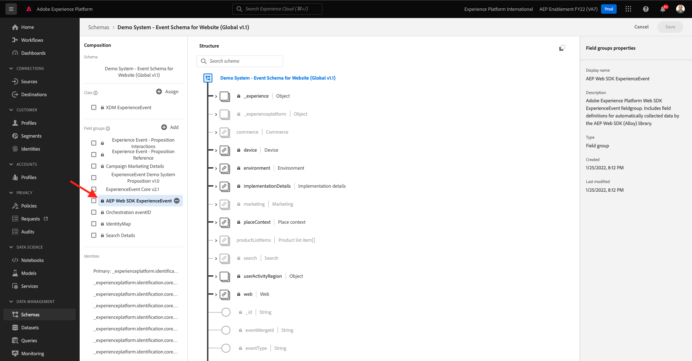

# 1.7 Adobe Experience Platform中的XDM架构要求

为确保Web SDK和alloy.js能够将数据摄取到Adobe Experience Platform中，需要将特定XDM Mixin加入Adobe Experience Platform的XDM架构中。

转到 [https://experience.adobe.com/platform](https://experience.adobe.com/platform) 并登录。

登录后，通过单击文本选择相应的沙盒 **生产产品** 的蓝线。 选择沙盒 `--aepSandboxId--`.

选择沙盒后，您将看到屏幕发生更改，现在您就位于沙盒中。

在左侧菜单中，转到 **模式** 打开 **演示系统 — 网站的事件模式（全局v1.1）** 架构。

在该架构上，您将看到字段组 **AEP Web SDK ExperienceEvent Mixin** 已添加。 此字段组将所有最低要求的字段添加到架构中。 Adobe Experience Platform中将由Web SDK使用的每个体验事件架构都将始终要求该字段组成为架构的一部分。

在 [模块2](./../module2/data-ingestion.md) 您将了解如何将字段组添加到架构。

下一步： [摘要和优点](./summary.md)

[返回到模块1](./data-ingestion-launch-web-sdk.md)

[返回到所有模块](./../../overview.md)
