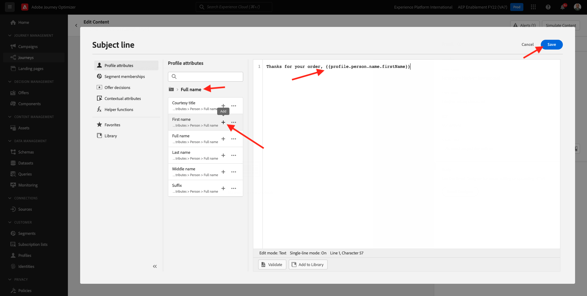
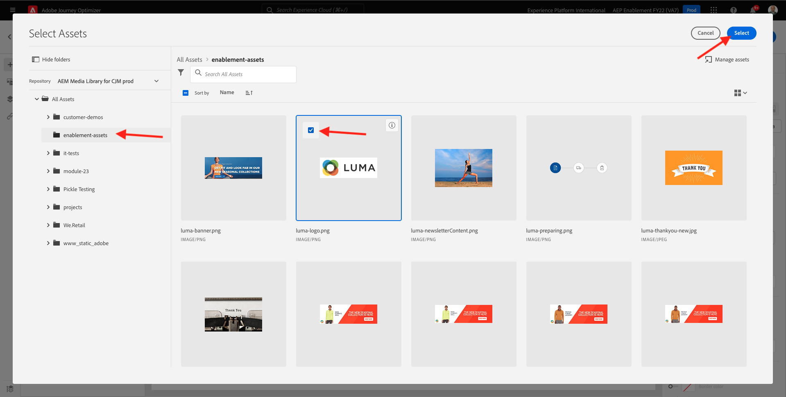
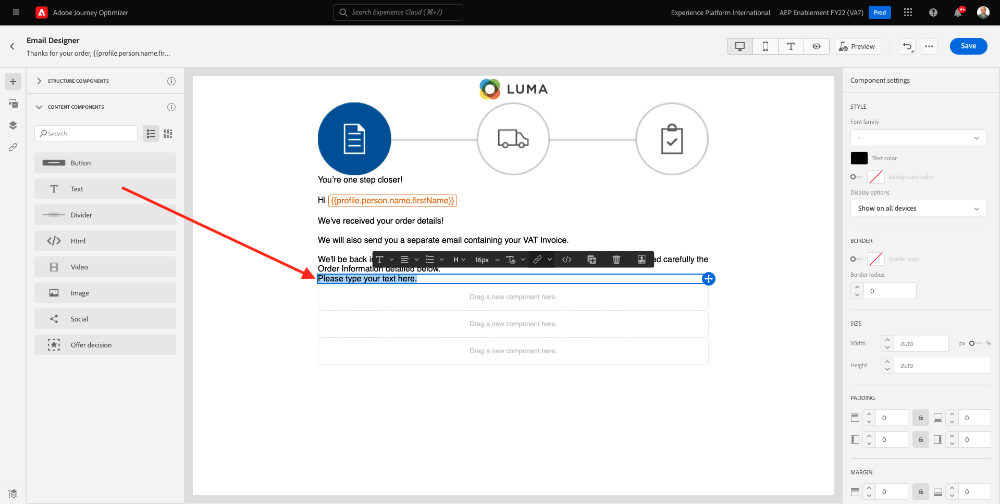
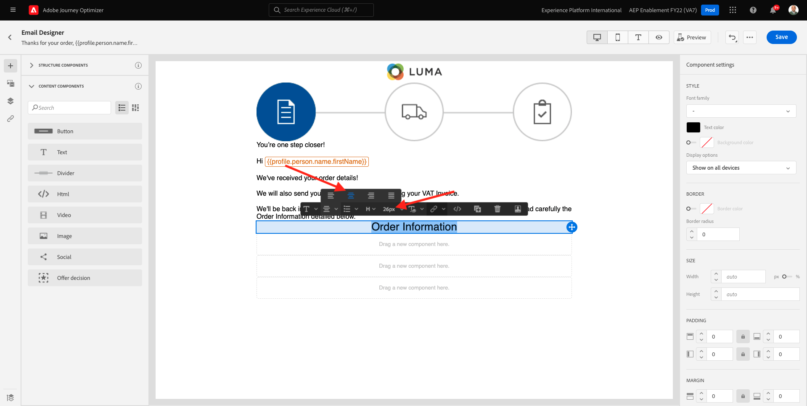
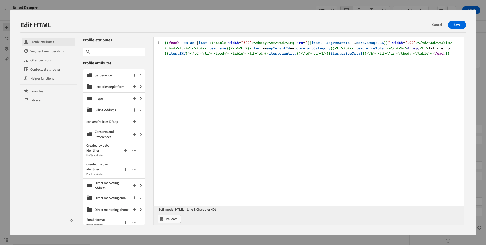
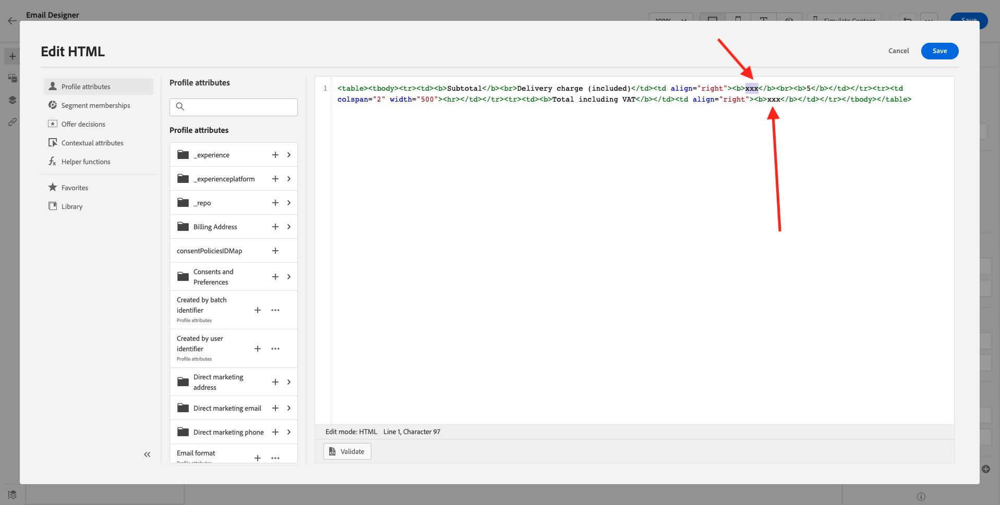

# 10.1配置基于触发器的历程 — 订单确认

通过转到Adobe Journey Optimizer [Adobe Experience Cloud](https://experience.adobe.com). 单击 **Journey Optimizer**.


您将被重定向到 **主页**  查看Journey Optimizer。 首先，确保您使用的是正确的沙盒。 要使用的沙盒称为 `--aepSandboxId--`. 要从一个沙盒更改为另一个沙盒，请单击 **生产产品(VA7)** 并从列表中选择沙盒。 在此示例中，沙盒名为 **2022财年AEP启用**. 然后你会在 **主页** 沙盒视图 `--aepSandboxId--`.


## 10.1.1创建事件

在菜单中，转到 **配置** 单击 **管理** 在 **事件**.


在 **事件** 屏幕上，您将看到与此类似的视图。 单击 **创建事件**.


然后，您将看到空事件配置。


首先，为您的事件指定如下名称： `--demoProfileLdap--PurchaseEvent`，并添加如下描述： `Purchase Event`.


接下来是 **事件类型** 选项。 选择 **单一**.


接下来是 **事件ID类型** 选项。 选择 **系统生成**


接下来是架构选择。 为本练习准备了一个模式。 请使用架构 `Demo System - Event Schema for Website (Global v1.1) v.1`.


选择架构后，您将在 **负载** 中。 单击 **编辑/铅笔** 图标，以向此事件添加其他字段。


然后，您将看到此弹出窗口。 现在，您需要选中其他复选框，才能在触发此事件时访问其他数据。


首先，选中行上的复选框 `--aepTenantId--`.


接下来，向下滚动并选中行上的复选框 `productListItems`.


接下来，向下滚动并选中行上的复选框 `commerce`.


接下来，单击 **确定**.

然后，您将看到已向事件添加其他字段。 单击&#x200B;**保存**。


随后将共享新事件，您将在可用事件列表中看到您的事件。

再次单击您的事件以打开 **编辑事件** 屏幕。
将鼠标悬停在 **负载** 字段，以再次查看3个图标。 单击 **查看有效负载** 图标。


您现在将看到预期有效负载的示例。 您的事件具有唯一的编排事件ID，您可以通过在该有效负载中向下滚动直到您看到为止，来查找该事件 `_experience.campaign.orchestration.eventID`.


事件ID是需要发送到Adobe Journey Optimizer的内容，以便触发您在下一步中构建的历程。 记下此eventID，因为您将在后续步骤之一中需要它。
`"eventID": "ef6dd943c94fe1b4763c098ccd1772344662f2a9f614513106cb5ada8be36857"`

单击 **确定**，后跟 **取消**.

您的事件现已配置完毕，可供使用。

## 10.1.2创建历程

在菜单中，转到 **历程** 单击 **创建历程**.


然后你会看到这个。 为您的历程命名。 使用 `--demoProfileLdap-- - Order Confirmation journey`. 单击&#x200B;**确定**。


首先，您需要将事件添加为历程的起点。 搜索事件 `--demoProfileLdap--PurchaseEvent` 然后将其拖放到画布上。 单击&#x200B;**确定**。


下一个，下 **操作**，搜索 **电子邮件** 操作，并将其添加到画布上。


设置 **类别** to **营销** 并选择用于发送电子邮件的电子邮件界面。 在这种情况下，要选择的电子邮件界面是 **电子邮件**. 确保对应的复选框 **电子邮件的点击** 和 **电子邮件打开** 都已启用。


下一步是创建消息。 要实现此目的，请单击 **编辑内容**.


你现在看到这个。 单击 **主题行** 文本。


在文本区域中开始写入 **谢谢你的命令，**


主题行尚未完成。 接下来，您需要为字段引入个性化令牌 **名字** 存储在 `profile.person.name.firstName`. 在左侧菜单中，向下滚动以查找 **人员** > **全名** >  **名字** ，然后单击 **+** 图标，以将个性化令牌添加到主题行。 单击&#x200B;**保存**。



然后你会回来。 单击 **Email Designer** 以创建电子邮件的内容。


在下一个屏幕中，单击 **从头开始设计**.


在左侧菜单中，您将找到可用于定义电子邮件结构（行和列）的结构组件。

拖放8次a **1:1列** 在画布上，它应该为您提供以下内容：


转到 **内容组件**.


拖放 **图像** 组件。 单击&#x200B;**浏览**。


转到文件夹 **启用资产**，选择文件 **luma-logo.png** 单击 **选择**.



你现在回来了。 单击图像以将其选中，然后使用 **大小** 滑块使徽标图像稍小一些。


转到 **内容组件** 拖放 **图像** 组件。 选择 **图像组件** 但请勿单击“浏览”。


将此图像URL粘贴到字段中 **来源**: `https://parsefiles.back4app.com/hgJBdVOS2eff03JCn6qXXOxT5jJFzialLAHJixD9/29043bedcde632a9cbe8a02a164189c9_preparing.png`. 此图像在Adobe外托管。


当您将范围更改为其他字段时，图像将呈现出来，您将看到以下内容：


接下来，转到 **内容组件** 拖放 **文本** 组件。


选择该组件中的默认文本 **请在此处键入您的文本。** 并将其替换为以下文本：

```javascript
You’re one step closer!

Hi 

We've received your order details!

We will also send you a separate email containing your VAT Invoice.

We'll be back in touch with you as soon as we've finished packing your package. Please read carefully the Order Information detailed below.
```


将光标放在文本旁边 **你好** 单击 **添加个性化**.


导航到 **人员** > **全名** > **名字** ，然后单击 **+** 图标，以将个性化令牌添加到主题行。 单击&#x200B;**保存**。


然后您将看到：


接下来，转到 **内容组件** 拖放 **文本** 组件。



选择该组件中的默认文本 **请在此处键入您的文本。** 并将其替换为以下文本：

`Order Information`

将字体大小更改为 **26px** 并在这个单元格中对齐你的文字。 然后，您将拥有：



接下来，转到 **内容组件** 拖放 **HTML** 组件。 单击HTML组件，然后单击 **显示源代码**.


在 **编辑HTML** 弹出窗口，粘贴此HTML:

```<table><tbody><tr><td><b>Items purchased</b></td><td></td><td><b>Quantity</b></td><td><b>Subtotal</b></td></tr><tr><td colspan="4" width="500"><hr></td></tr></tbody></table>```

单击&#x200B;**保存**。


然后你会得到这个。 单击 **保存** 以保存进度。


转到 **内容组件** 拖放 **HTML** 组件。 单击HTML组件，然后单击 **显示源代码**.


在 **编辑HTML** 弹出窗口，粘贴此HTML:

```{{#each xxx as |item|}}<table width="500"><tbody><tr><td></td><td><table><tbody><tr><td><b>{{item.name}}</b><br>{{item.--aepTenantId--.core.subCategory}}<br><b>{{item.priceTotal}}</b><br>&nbsp;<br>Article no: {{item.SKU}}</td></tr></tbody></table></td><td>{{item.quantity}}</td><td><b>{{item.priceTotal}}</b></td></tr></tbody></table>{{/each}}```

然后，您将拥有：



你现在必须 **xx** 引用productListItems对象，该对象是触发历程的事件的一部分。


首先，删除 **xx** 在HTML代码中。


在左侧菜单中，单击 **上下文属性**. 此上下文将传递到历程中的消息。


然后你会看到这个。 单击旁边的箭头 **Journey Orchestration** 来深入研究。


单击旁边的箭头 **事件** 来深入研究。


单击旁边的箭头 `--demoProfileLdap--PurchaseEvent` 来深入研究。


单击旁边的箭头 **productListItems** 来深入研究。


单击 **+** 图标 **名称** 以将其添加到画布。 然后你会得到这个。 您现在需要选择  **.name** 如以下屏幕截图所示，然后您应该删除 **.name**.


然后你会得到这个。 单击&#x200B;**保存**。


您现在将回Email Designer。 单击 **保存** 以保存进度。


接下来，转到 **内容组件** 拖放 **HTML** 组件。 单击HTML组件，然后单击 **显示源代码**.


在 **编辑HTML** 弹出窗口，粘贴此HTML:

```<table><tbody><tr><td><b>Subtotal</b><br>Delivery charge (included)</td><td align="right"><b>xxx</b><br><b>5</b></td></tr><tr><td colspan="2" width="500"><hr></td></tr><tr><td><b>Total including VAT</b></td><td align="right"><b>xxx</b></td></tr></tbody></table>```

有2个 **xx** 在此HTML代码中。 现在，您必须将 **xx** 引用productListItems对象，该对象是触发历程的事件的一部分。



首先，删除第一个 **xx** 在HTML代码中。


在左侧菜单中，单击 **上下文属性**.


单击旁边的箭头 **Journey Orchestration** 来深入研究。


单击旁边的箭头 **事件** 来深入研究。


单击旁边的箭头 `--demoProfileLdap--PurchaseEvent` 来深入研究。


单击旁边的箭头 **商务** 来深入研究。


单击旁边的箭头 **订购** 来深入研究。


单击 **+** 图标 **总价** 以将其添加到画布。


然后你会得到这个。 现在，删除第二个 **xx** 在HTML代码中。


单击 **+** 图标 **总价** 再次将其添加到画布中。


您还可以添加字段 **货币** 从 **订购** 对象，如您在此处所见。
完成后，单击 **保存** 以保存更改。


然后，您将返回Email Designer。 单击 **保存** 再次。


通过单击 **箭头** 主题行文本旁边的。


单击左上角的箭头以返回您的历程。


单击 **确定** 以关闭电子邮件操作。


单击 **发布** 发布历程。


单击 **发布** 再次。


您的历程现已发布。


## 10.1.5更新Adobe Experience Platform数据收集客户端资产

转到 [Adobe Experience Platform数据收集](https://experience.adobe.com/Launch/) 选择 **标记**.

这是您之前看到的Adobe Experience Platform数据收集属性页面。


在模块0中，演示系统为您创建了两个客户端属性：一个用于网站，一个用于移动设备应用程序。 通过搜索来查找 `--demoProfileLdap--` 在 **[!UICONTROL 搜索]** 框中。 单击以打开 **Web** 属性。


转到 **数据元素**. 搜索并打开数据元素 **XDM — 购买**.


然后你会看到这个。 导航到字段 **_experience.campaign.orchestration.eventID** 并在此处填写您的eventID。 此处要填写的eventID是您在练习10.1.2中创建的eventID。单击 **保存** 或 **保存到库**.


在Client资产中保存所做更改，然后通过更新开发库来发布所做更改。


您的更改现已部署完毕，可进行测试。

## 10.1.6使用演示网站测试订单确认电子邮件

让我们通过在演示网站上购买产品来测试更新的历程。

转到 [https://builder.adobedemo.com/projects](https://builder.adobedemo.com/projects). 使用Adobe ID登录后，您将看到此内容。 单击您的网站项目以将其打开。


在 **Screens** 页面，单击 **运行**.


然后，您将看到您的演示网站已打开。 选择URL并将其复制到剪贴板。


打开新的隐身浏览器窗口。


粘贴您在上一步中复制的演示网站的URL。 然后，系统将要求您使用Adobe ID登录。


选择您的帐户类型并完成登录过程。


然后，您将在无痕浏览器窗口中看到您的网站已加载。 对于每个演示，您需要使用全新的、隐身的浏览器窗口来加载演示网站URL。


单击屏幕左上角的Adobe徽标图标以打开“配置文件查看器”。


查看“配置文件查看器”面板和“实时客户配置文件”，其中 **Experience CloudID** 作为此当前未知客户的主要标识符。


转到注册/登录页面。 单击 **创建帐户**.


填写详细信息并单击 **注册** 之后，您将被重定向到上一页。


将任何产品添加到购物车，然后转到 **购物车** 页面。 单击 **继续结帐**.


接下来，验证结帐页面上的字段并单击 **结帐**.


然后，您将在几秒内收到订单确认电子邮件。


您已完成此练习。

下一步： [10.2配置基于批量的新闻稿历程](./ex2.md)

[返回到模块10](./journeyoptimizer.md)

[返回到所有模块](../../overview.md)
