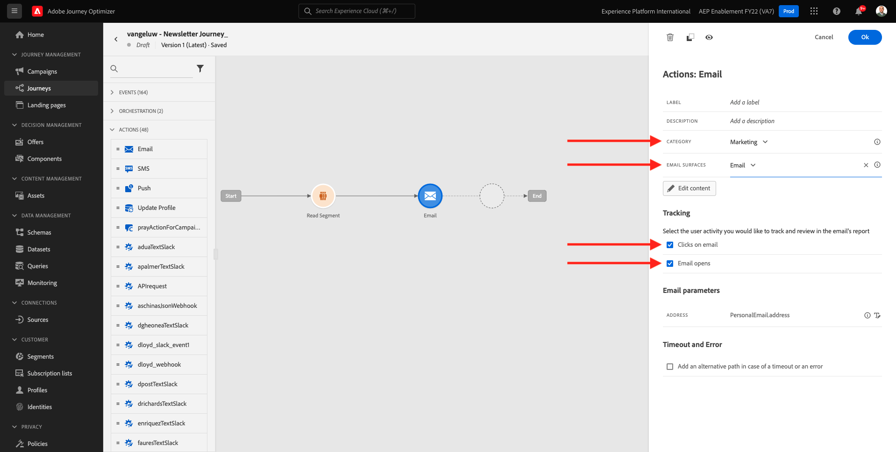
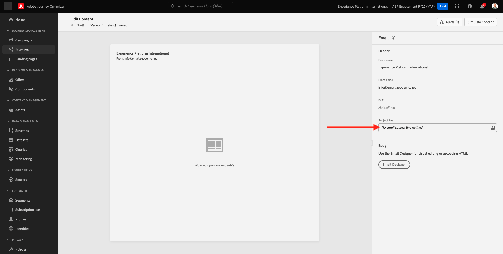

# 10.2配置基于批量的新闻稿历程

通过转到Adobe Journey Optimizer [Adobe Experience Cloud](https://experience.adobe.com). 单击 **Journey Optimizer**.

您将被重定向到 **主页**  查看Journey Optimizer。 首先，确保您使用的是正确的沙盒。 要使用的沙盒称为 `--aepSandboxId--`. 要从一个沙盒更改为另一个沙盒，请单击 **生产产品(VA7)** 并从列表中选择沙盒。 在此示例中，沙盒名为 **2022财年AEP启用**. 然后你会在 **主页** 沙盒视图 `--aepSandboxId--`.

## 10.2.1创建新闻稿历程

您现在将创建一个基于批的历程。 与上一个练习的基于事件的历程不同，基于批量的历程会根据传入体验事件或区段条目或退出来触发1个特定客户的历程，而根据新闻稿、一次性促销或通用信息等独特内容定位整个区段一次，或定期发送类似内容（例如生日促销活动和提醒）。

在菜单中，转到 **历程** 单击 **创建历程**.

在右侧，您将看到一个需要指定历程名称和描述的表单。 输入以下值：

- **名称**: `--demoProfileLdap-- - Newsletter Journey`. 例如： **vangeluw — 新闻稿历程**.
- **描述**:每月新闻稿

单击 **确定**.

在 **编排**，拖放 **读取区段** 放在画布上。 这意味着，发布后，历程将从检索整个区段受众开始，然后该受众成为历程和消息的目标受众。 单击 **选择区段**.

在 **选择区段** 弹出窗口，搜索ldap并选择在中创建的区段 [模块6 — 实时CDP — 构建区段并采取操作](../module6/real-time-cdp-build-a-segment-take-action.md) 已命名 `--demoProfileLdap-- - Interest in PROTEUS FITNESS JACKSHIRT`. 例如：vangeluw — 对PROTEUS FITNESS JACKTHIRT的兴趣。 单击&#x200B;**保存**。

单击 **确定**.

在左侧菜单中，找到 **操作** 拖放 **电子邮件** 操作。

设置 **类别** to **营销** 并选择用于发送电子邮件的电子邮件界面。 在这种情况下，要选择的电子邮件界面是 **电子邮件**. 确保对应的复选框 **电子邮件的点击** 和 **电子邮件打开** 都已启用。

下一步是创建消息。 要实现此目的，请单击 **编辑内容**.

你现在看到这个。 单击 **主题行** 文本。

为主题行输入以下文本： `Luma Newsletter - your monthly update has arrived.`. 单击&#x200B;**保存**。

然后你会回来。 单击 **Email Designer** 以开始创建电子邮件内容。

然后你会看到这个。 单击 **导入HTML**.

在弹出屏幕中，您需要拖放电子邮件的HTML文件。 您可以找到HTML模板 [此处](../../assets/html/ajo-newsletter.html.zip). 将包含HTML模板的zip文件下载到本地计算机，然后解压缩到桌面。

拖放文件 **ajo-newsletter.html** 上传到Journey Optimizer。 单击&#x200B;**导入**。

此电子邮件内容已准备就绪，因为它包含所有预期的个性化、图像和文本。 只有选件占位符留空。

您可能会收到一条错误消息： **尝试获取资产时出错**. 该信息已链接到电子邮件中的图像。

如果出现此错误，请选择图像，然后单击 **编辑图像** 按钮。

单击 **Assets Essentials** 返回到AEM Assets Essentials库。

然后，您将看到此弹出窗口。 导航到文件夹 **启用资产** 并选择图像 **luma-newsletterContent.png**. 单击&#x200B;**选择**。

您的基本新闻稿电子邮件现已准备就绪。 单击&#x200B;**保存**。

通过单击 **箭头** 主题行文本旁边的。

单击左上角的箭头以返回您的历程。

单击 **确定** 以关闭电子邮件操作。

您的新闻稿历程现已准备就绪，可供发布。 在执行此操作之前，请注意 **计划** 部分，您可以将此历程从一次性切换到定期营销活动。 单击 **计划** 按钮。

然后你会看到这个。 选择 **一次**.

选择下一小时内的日期和时间，以便测试您的历程。 单击 **确定**.

>[!NOTE]
>
>消息发送日期和时间必须在一小时内。

单击 **发布**.

单击 **发布** 再次。

您的基本新闻稿历程现已发布。 您的新闻稿电子邮件将在您的计划中定义时发送，并且一旦发送了最后一封电子邮件，您的历程将立即停止。

您已完成此练习。

下一步： [10.3在电子邮件中应用个性化](./ex3.md)

[返回到模块10](./journeyoptimizer.md)

[返回到所有模块](../../overview.md)
