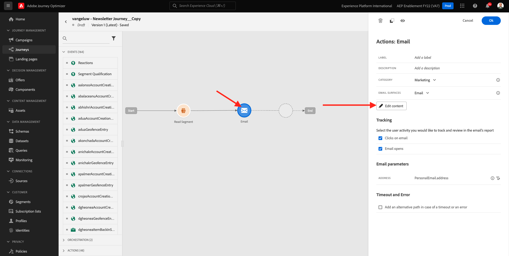
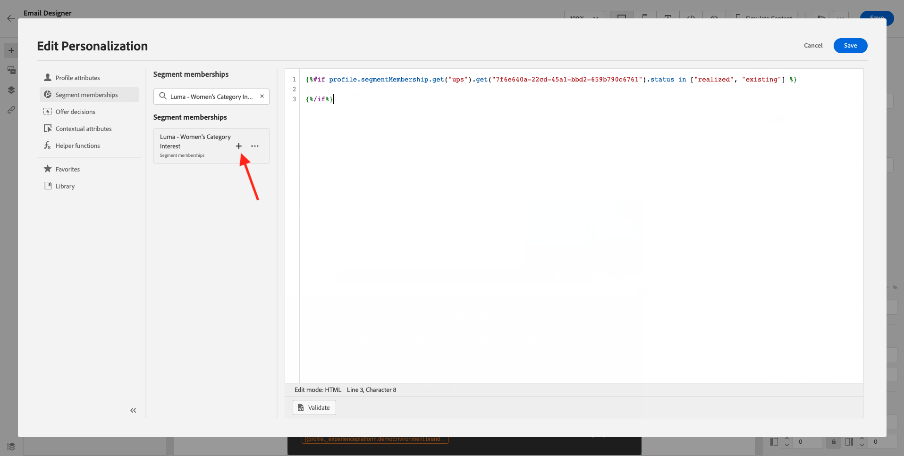

# 10.3在电子邮件中应用个性化

通过转到Adobe Experience Cloud [Adobe Experience Cloud](https://experience.adobe.com). 单击 **Adobe Journey Optimizer**.

您将被重定向到 **主页** 查看Journey Optimizer。 在继续之前，您需要选择 **沙盒**. 要选择的沙盒已命名 ``--aepTenantId--``. 您可以通过单击 **[!UICONTROL 生产产品]** 的蓝线。

## 10.3.1基于区段的个性化

在本练习中，您将使用基于区段成员资格的个性化文本来改进新闻稿电子邮件消息。

转到 **历程**. 查找您在上一个练习中创建的Newsletter历程。 搜索 `--demoProfileLdap-- - Newsletter`. 单击您的历程以将其打开。

然后你会看到这个。 单击 **复制**.

单击**复制**。

选择 **电子邮件** 操作并单击 **编辑内容**.

单击 **Email Designer**.

然后你会看到这个。

打开 **内容组件** 并拖动 **文本** 组件。

选择整个默认文本并将其删除。 然后，单击 **添加个性化** 按钮。

然后您将看到：

在左侧菜单中，单击 **区段成员资格**.

>[!NOTE]
>
>如果在此列表中找不到您的区段，请向下滚动一点以查找有关如何手动检索区段ID的说明。

选择区段 `Luma - Women's Category Interest` ，然后单击 **+** 图标，其应如下所示：

然后，您应当保持第一行原样，并使用以下代码替换第2行和第3行：

``
Psssst... a private sale in the women category will launch soon, we will keep you posted

Thanks for taking the time to read our newsletter. Here is a 10% promo code to use on the website: READER10

``

然后，您将拥有：

单击 **验证** 以确保代码正确。 单击&#x200B;**保存**。

现在，您可以通过单击 **保存** 按钮。 然后，单击 **模拟内容**.

选择您在本教程中创建的其中一个用户档案，然后单击 **预览**. 然后，您将看到配置的结果。

然后你会看到这个。 然后，单击 **关闭**.

通过单击 **箭头** 主题行文本旁边的。

单击左上角的箭头以返回您的历程。

单击 **确定** 以关闭电子邮件操作。

更改 **计划** to **一次** 并定义 **日期/时间**. 单击 **确定**.

>[!NOTE]
>
>消息发送日期和时间必须在一小时内。

单击 **发布** 按钮。

在弹出窗口中，单击 **发布** 再次。

您的基本新闻稿历程现已发布。 您的新闻稿电子邮件将根据您的计划发送，并且在发送最后一封电子邮件后，您的历程将立即停止。

您已完成此练习。

下一步： [10.4为iOS设置和使用推送通知](./ex4.md)

[返回到模块10](./journeyoptimizer.md)

[返回到所有模块](../../overview.md)
