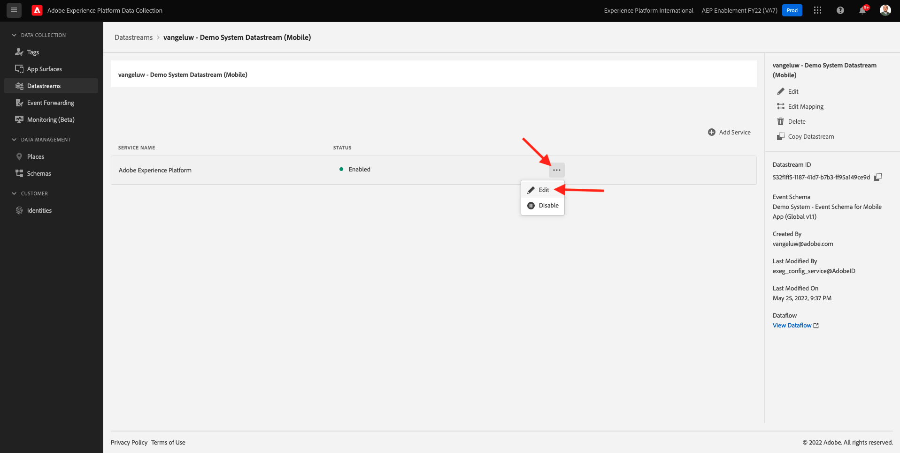
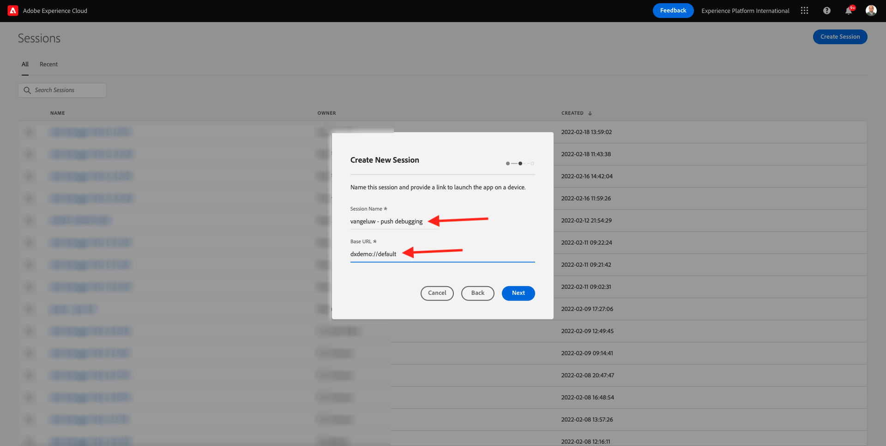

# 10.4为iOS设置和使用推送通知

要将推送通知与Adobe Journey Optimizer结合使用，需要检查和了解许多设置。

以下是要验证的所有设置：

- Adobe Experience Platform中的数据集和架构
- 移动设备的数据流
- 移动设备的数据收集属性
- 推送证书的应用程序界面
- 使用AEP保证测试推送设置

让我们逐一回顾一下。

通过转到Adobe Journey Optimizer [Adobe Experience Cloud](https://experience.adobe.com). 单击 **Journey Optimizer**.

您将被重定向到 **主页**  查看Journey Optimizer。 首先，确保您使用的是正确的沙盒。 要使用的沙盒称为 `--aepSandboxId--`. 要从一个沙盒更改为另一个沙盒，请单击 **生产产品(VA7)** 并从列表中选择沙盒。 在此示例中，沙盒名为 **2022财年AEP启用**. 然后你会在 **主页** 沙盒视图 `--aepSandboxId--`.

## 10.4.1推送数据集

Adobe Journey Optimizer使用数据集存储来自移动设备的推送令牌或与推送消息的交互等内容(例如：消息发送、消息打开等)。

您可以通过以下路径找到这些数据集： **[!UICONTROL 数据集]** 菜单。 要显示系统数据集，请单击过滤器图标。

启用选项 **显示系统数据集** 和搜索 **AJO**. 然后，您将看到用于推送通知的数据集。

## 10.4.2适用于移动设备的数据流

转到 [https://experience.adobe.com/#/data-collection/](https://experience.adobe.com/#/data-collection/).

在左侧菜单中，转到 **[!UICONTROL 数据流]** 并搜索您在 [练习0.2](./../module0/ex2.md)，该名称为 `--demoProfileLdap-- - Demo System Datastream (Mobile)`. 单击以将其打开。

单击 **编辑** 在 **Adobe Experience Platform** 服务。

然后，您将看到已定义的数据流设置，以及将存储哪些数据集事件和配置文件属性。

无需进行任何更改，您的数据流现已准备就绪，可用于移动设备的数据收集客户端属性。

## 10.4.3查看移动设备的数据收集资产

转到 [https://experience.adobe.com/#/data-collection/](https://experience.adobe.com/#/data-collection/). 作为 [练习0.1](./../module0/ex1.md)，创建了2个数据收集属性。
您已经将这些数据收集客户端属性用作以前模块的一部分。

单击以打开移动设备的数据收集属性。

在您的数据收集资产中，转到 **扩展**. 然后，您将看到移动设备应用程序所需的各种扩展。 单击以打开扩展 **Adobe Experience Platform边缘网络**.

然后，您将在此处看到您的移动数据流已链接。 接下来，单击 **取消** 返回扩展概述。

然后你回来。 您将看到的扩展 **AEP保证**. AEP Assurance可帮助您检查、校样、模拟和验证如何在移动设备应用程序中收集数据或提供体验。 您可以在此处阅读有关AEP保障和Project Griffon的更多信息 [https://aep-sdks.gitbook.io/docs/beta/project-griffon](https://aep-sdks.gitbook.io/docs/beta/project-griffon).

接下来，单击 **配置** 打开扩展 **Adobe Journey Optimizer**.

然后，您将看到用于跟踪推送事件的数据集已关联到此处。

无需对数据收集资产进行任何更改。

## 10.4.4查看应用程序界面设置

转到 [https://experience.adobe.com/#/data-collection/](https://experience.adobe.com/#/data-collection/). 在左侧菜单中，转到 **应用程序曲面** 和打开，App Surface for **DX演示应用程序APNS**.

然后，您将看到为iOS和Android配置的应用程序界面。

## 10.4.5使用AEP保证测试推送通知设置。

安装应用程序后，您将在设备的主屏幕上找到它。 单击图标以打开应用程序。

当您首次使用应用程序时，系统将要求您使用Adobe ID登录。 完成登录过程。

登录后，您将看到一条通知，请求您授予发送通知的权限。 我们将在教程中发送通知，因此请单击 **允许**.

然后，您将看到应用程序的主页。 转到 **设置**.

在设置中，您将看到 **公共项目** 会在应用程序中加载。 单击 **自定义项目**.

您现在可以加载自定义项目。 单击二维码可轻松加载项目。

练习0.1后，你得到了这个结果。 单击以打开 **移动设备零售项目** 是为你创建的。

如果您意外关闭了浏览器窗口，或者未来的演示或启用会议，您还可以转到 [https://builder.adobedemo.com/projects](https://builder.adobedemo.com/projects). 使用Adobe ID登录后，您将看到此内容。 单击您的移动设备应用程序项目以将其打开。

然后你会看到这个。 单击 **集成**.

您需要为练习0.1中创建的移动设备选择数据收集属性。接下来，单击 **运行**.

然后，您将看到此弹出窗口，其中包含二维码。 从移动设备应用程序内扫描此二维码。

然后，您将在应用程序中看到您的项目ID，随后您可以单击 **保存**.

现在，返回 **主页** 中。 您的应用程序现已准备就绪，可供使用。

现在，您需要扫描二维码，以将移动设备连接到AEP保障会话。

要启动AEP保证会话，请转到 [https://experience.adobe.com/#/@experienceplatform/griffon](https://experience.adobe.com/#/@experienceplatform/griffon). 单击 **创建会话**.

单击&#x200B;**开始**。

填写以下值：

- 会话名称：use `--demoProfileLdap-- - push debugging` 使用ldap替换ldap
- 基本URL:use **dxdemo://default**

单击&#x200B;**下一步**。

然后，您会在屏幕上看到一个二维码，您应该使用iOS设备扫描该二维码。

在移动设备上，打开相机应用程序并扫描AEP Assurance显示的二维码。

然后，您将看到一个弹出屏幕，要求您输入PIN代码。 从AEP Assurance屏幕中复制PIN代码，然后单击 **连接**.

然后你会看到这个。

在AEP保证中，您现在将看到设备已进入AEP保证会话。

转到 **推送调试**. 你会看到这样的东西。

一些解释：

- 第一栏， **客户端**，则会显示iOS设备上的可用标识符。 您将看到ECID和推送令牌。
- 第二列显示 **用户档案** 信息，其中包含有关推送令牌所在平台（APNS或APNSSandbox）的其他信息。 如果单击 **Inspect个人资料** 按钮，您将转到Adobe Experience Platform，并看到完整的实时客户资料。
- 第3列显示 **应用程序配置**，作为练习的一部分 **10.5.4在Launch中创建应用程序配置**

要测试推送配置设置，请单击 **发送推送通知** 按钮。

您需要确保 **DX演示** 在单击 **发送推送通知** 按钮。 如果应用程序处于打开状态，则可能会在后台收到推送通知，并且不可见。

然后，您的移动设备上会显示类似此类推送通知。

如果您收到推送通知，则表示您的设置正确且运行正常。

## 10.4.6创建新事件

在菜单中，转到 **历程管理** 单击 **管理** 在 **事件**.

在 **事件** 屏幕上，您将看到与此类似的视图。 单击 **创建事件**.

然后，您将看到空事件配置。

首先，为您的事件指定如下名称： `--demoProfileLdap--StoreEntryEvent` 将描述设置为 `Store Entry Event`.

接下来是 **事件类型** 选项。 选择 **单一**.

接下来是 **事件ID类型** 选项。 选择 **系统生成**

接下来是架构选择。 为本练习准备了一个模式。 请使用架构 `Demo System - Event Schema for Mobile App (Global v1.1) v.1`.

选择架构后，您将在 **负载** 中。 您的事件现已完全配置。

然后你应该看到这个。 单击&#x200B;**保存**。

您的事件现已配置并保存。 再次单击您的事件以打开 **编辑事件** 屏幕。

将鼠标悬停在 **负载** ，然后单击 **查看有效负载** 图标。

您现在将看到预期有效负载的示例。

您的事件具有唯一的编排事件ID，您可以通过在该有效负载中向下滚动直到您看到为止，来查找该事件 `_experience.campaign.orchestration.eventID`.

事件ID是需要发送到Adobe Experience Platform的历程，才能触发您在下一步中构建的事件。 记下此eventID，因为您将在下一步中需要它。
`"eventID": "e3a8f0bdc0b609667cd96a72a6b1e5aafa0ddaf6ccf121c574e6a2030860a633"`

单击 **确定**，后跟 **取消**.

## 10.4.7创建旅程

在菜单中，转到 **历程** 单击 **创建历程**.

然后你会看到这个。 为您的历程命名。 使用 `--demoProfileLdap-- - Store Entry journey`. 单击&#x200B;**确定**。

首先，您需要将事件添加为历程的起点。 搜索事件 `--demoProfileLdap--StoreEntryEvent` 然后将其拖放到画布上。 单击&#x200B;**确定**。

下一个，下 **操作**，搜索 **推送** 操作。
拖放 **推送** 操作。

设置 **类别** to **营销** ，然后选择可用于发送推送通知的推送表面。 在这种情况下，要选择的电子邮件界面是 **推送 — iOS-Android**.

下一步是创建消息。 要实现此目的，请单击 **编辑内容**.

然后你会看到这个。 单击 **个性化** 图标 **标题** 字段。

然后你会看到这个。 您现在可以直接从实时客户配置文件中选择任何配置文件属性。

搜索字段 **名字**，然后单击 **+** 图标 **名字**. 然后，您将看到正在添加的名字的个性化令牌： **{{profile.person.name.firstName}}**.

接下来，添加文本 **，欢迎光临我们的商店！** 背后 **{{profile.person.name.firstName}}**.

单击&#x200B;**保存**。

你现在有这个。 单击 **个性化** 图标 **正文** 字段。

输入此文本 **单击此处，即可在今天购买时享受10%的折扣！** 单击 **保存**.

然后你会得到这个。 单击左上角的箭头以返回您的历程。

单击 **确定** 以关闭推送操作。

单击 **发布**.

单击 **发布** 再次。

您的历程现已发布。

## 10.4.8测试历程和推送消息

在DX Demo 2.0移动应用程序中，转到 **设置** 屏幕。 单击 **存储条目** 按钮。

>[!NOTE]
>
>的 **存储条目** 按钮。 您尚未在应用程序中找到它。

确保在单击 **存储条目** 图标，否则将不显示推送消息。

几秒钟后，您将看到消息。

您已完成此练习。

下一步： [10.5创建业务事件历程](./ex5.md)

[返回到模块10](./journeyoptimizer.md)

[返回到所有模块](../../overview.md)
