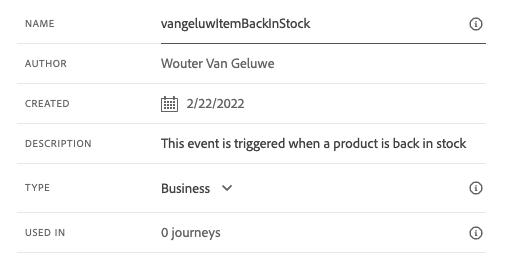
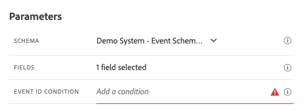
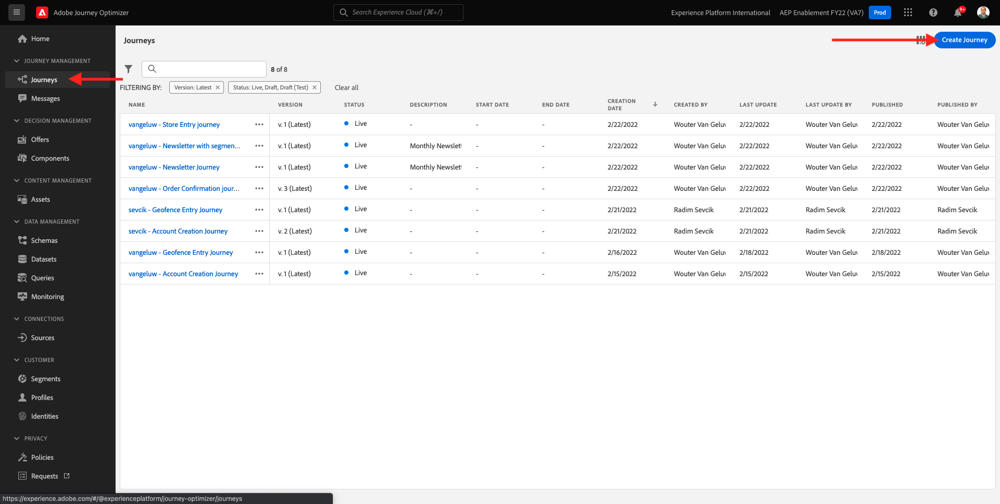
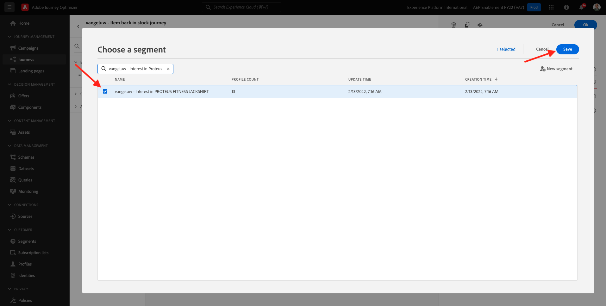

# 10.5创建业务事件历程

通过转到Adobe Journey Optimizer [Adobe Experience Cloud](https://experience.adobe.com). 单击 **Journey Optimizer**.


您将被重定向到 **主页**  查看Journey Optimizer。 首先，确保您使用的是正确的沙盒。 要使用的沙盒称为 `--aepSandboxId--`. 要从一个沙盒更改为另一个沙盒，请单击 **生产产品(VA7)** 并从列表中选择沙盒。 在此示例中，沙盒名为 **2022财年AEP启用**. 然后你会在 **主页** 沙盒视图 `--aepSandboxId--`.


## 10.5.1创建业务事件

在左侧菜单中，单击 **配置**. 单击 **管理** 按钮 **事件** 卡。


业务事件是您可以在Journey Optimizer中创建的一种新类型事件。 与 **单一** 您在以前的模块中创建的事件，业务事件不是由客户触发，而是由组织触发。 您现在将创建业务活动。

单击 **创建事件**.


在事件创建表单中输入以下值：

- **名称**: `--demoProfileLdap--ItemBackInStock`. 例如： **vangeluwItemBackInStock**
- **描述**:当产品重新存货时，将触发此事件
- **类型**:选择 **商业** 下拉框中



对于架构，选择 **演示系统 — JO业务事件（全局v1.1）v.1的事件模式**. 现在，您需要选择架构中用于我们的用例所需的字段。



请执行以下步骤：

单击 **铅笔** 图标 **已选择1个字段**.


选择架构中的所有可用字段，然后单击 **确定**.


对于条件：您需要指定此架构中将触发业务事件的记录。

请执行以下步骤：

单击 **铅笔** 图标 **添加条件**.


在左侧，展开 `--aepTenantId--` 对象，展开对象 **joBusinessEvents** 并拖放字段 **eventName** 放在画布上。


对于字段 **eventName**，输入以下值： `--demoProfileLdap--ItemBackInStock`. 例如：vangeluwItemBackInStock。
单击**确定**。


单击&#x200B;**确定**。


最后，事件创建表单应如下所示。 单击 **保存** 以保存您的业务事件。


## 10.5.2创建业务事件历程

您现在可以在历程中利用此业务事件和消息。 转到 **历程**. 单击 **创建历程**.



在右侧，您将看到一个需要指定历程名称和描述的表单。 输入以下值：

- **名称**: `--demoProfileLdap-- - Item back in stock journey`. 例如：vangeluw — 物料返回库存历程中
- **描述**:当项目重新存储到有兴趣的访客时，此历程会发送短信。

单击&#x200B;**确定**。


在左侧菜单的 **事件**，搜索ldap。 您将找到之前创建的业务事件 `--demoProfileLdap--ItemBackInStock`. 将此事件拖放到画布上，因为这将是历程的起点。


如您所见， **读取区段** 活动已自动添加到画布中。 这是因为业务事件仅发送历程的触发器以读取特定区段，然后该区段将检索该历程的用户档案列表。

单击 **读取区段** 活动。
的 **读取区段** 配置要求您选择要通知刚刚发生的业务事件的区段。 单击 **选择区段** 字段。


在 **选择区段** 弹出窗口，搜索ldap并选择在中创建的区段 [模块6 — 实时CDP — 构建区段并采取操作](../module6/real-time-cdp-build-a-segment-take-action.md) 已命名 `--demoProfileLdap-- - Interest in PROTEUS FITNESS JACKSHIRT`. 例如：vangeluw — 对PROTEUS FITNESS JACKTHIRT的兴趣。 单击&#x200B;**保存**。



接下来，单击 **确定**.


下一步是拖放要在此历程中执行的操作。 选择操作 **短信**，然后将其拖放到刚刚添加的条件之后。


设置 **类别** to **营销** 并选择一个短信界面，以便您发送短信。 在这种情况下，要选择的电子邮件界面是 **短信**.


下一步是创建消息。 要实现此目的，请单击 **编辑内容**.


您现在将看到消息仪表板，您可以在其中配置短信的文本。 单击 **撰写消息** 区域创建消息。


输入以下文本： `Hi {{profile.person.name.firstName}}, the Proteus Fitness Jackshirt is back in stock at Luma.`. 单击&#x200B;**保存**。


通过单击 **箭头** 主题行文本旁边的。


此时您将看到已完成的短信操作。 单击 **确定**.


您的历程现已准备就绪，可供发布。 单击 **发布**.


单击 **发布** 再次。


您的历程现已发布，您现在可以测试它！


## 10.5.3测试业务事件历程

您现在将通过针对 **演示系统 — JO业务事件（全局v1.1）v.1的事件模式** 使用Postman。

在左侧菜单中，单击 **源** 然后，单击 **帐户** 选项卡。


在 **帐户** 选项卡，您会找到名为 **Journey Optimizer业务事件**. 单击它以将其打开。


此帐户只有一个数据流，单击数据流名称以选择它。


单击 **复制架构负载** 中。 此选项将复制 **卷曲** 用于针对 **演示系统 — JO业务事件（全局v1.1）v.1的事件模式** 到剪贴板。


将Curl命令粘贴到文本编辑器中


让我们更仔细地了解这个请求，

- POST请求将发送到DCS入口ID
- 请求引用架构、数据集和组织ID。
- 最后，它包含xdmEntity节点，该节点表示要在数据集内创建的数据。

现在，您需要替换以下 `xdmEntity` 行……

```json
"xdmEntity": {
  "_experienceplatform": {
    "joBusinessEvents": {
      "eventDescription": "string",
      "eventName": "string",
      "stockEventId": "string"
    }
  },
  "_id": "/uri-reference",
  "eventType": "advertising.completes",
  "timestamp": "2018-11-12T20:20:39+00:00"
}
```

...通过此行，确保验证字段eventName（应该如是说） `--demoProfileLdap--ItemBackInStock`，表示您在业务事件中指定用于触发历程的条件。

```json
"xdmEntity": {
  "_experienceplatform": {
    "joBusinessEvents": {
      "eventDescription": "Product Proteus Fitness Jackshirt is back in stock",
      "eventName": "--demoProfileLdap--ItemBackInStock",
      "stockEventId": "1"
    }
  },
  "_id": "/uri-reference",
  "eventType": "productBackInStock",
  "timestamp": "2021-04-19T15:25:39+00:00"
}
```

已更新 **卷曲** 命令应如下所示：


选择所有组件，然后将其复制到剪贴板。

打开Postman。 在Postman的左侧，单击 **导入**.


选择 **原始文本** 选项卡，并粘贴之前复制的命令。 单击&#x200B;**继续**。


单击&#x200B;**导入**。


Postman已自动 **卷曲** 命令到REST命令中，只需按 **发送** 按钮，以请求在数据集内创建该记录。


验证您的请求是否已成功接收。 查找 **200 OK** 邮递员的状态。


短信可能需要几分钟才能到达您的手机。 如果没有，则 **Proteus Fitness Jacktrist的兴趣** 区段不能包含使用正确手机的用户档案。 如果是，请访问Luma网站，访问 **Proteus Fitness Jacktrisht** 产品和注册，同时确保提供正确的手机号码。


您现在已完成此练习。

下一步： [摘要和优点](./summary.md)

[返回到模块10](./journeyoptimizer.md)

[返回到所有模块](../../overview.md)
