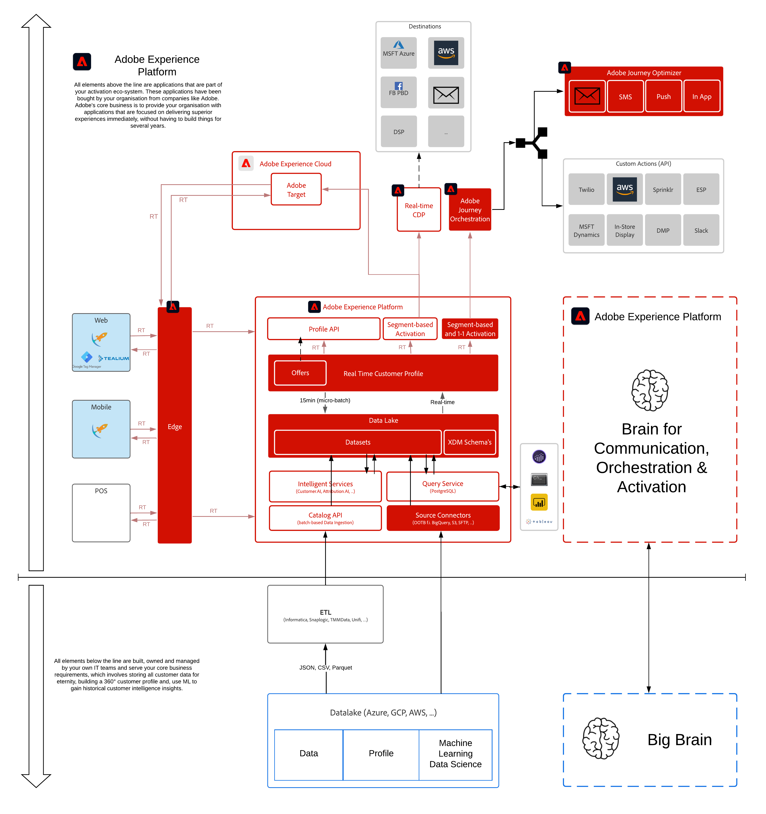

# 10.Adobe Journey Optimizer

**作者： [马克西姆·福特勒](https://www.linkedin.com/in/maximefoutrel/), [沃特·范·格鲁韦](https://www.linkedin.com/in/woutervangeluwe/)**

在本模块中，您将了解关于Adobe Journey Optimizer的所有信息，这有助于公司设计并向其客户提供连接、情境式和个性化的体验。

## 学习目标

- 熟悉Adobe Journey Optimizer
- 创建电子邮件和推送消息
- 配置基于触发器的历程和批量历程
- 在客户历程中发送电子邮件和推送通知

## 先决条件

- 访问Adobe Journey Optimizer
- **下载这些资产**:
   - [资产](./../../assets/ajo/ajo_assets.zip)

## 架构概述

请查看以下架构，其中重点介绍了将在本模块中讨论和使用的组件。

## 要使用的沙盒

对于本模块，请使用以下沙盒： `--aepSandboxId--`.

>[!NOTE]
>
>请不要忘记安装、配置和使用Chrome扩展，如 [0.1 — 安装适用于Experience League文档的Chrome扩展](../module0/ex1.md)

## 练习

[10.1配置基于事件的历程 — 订单确认](./ex1.md)

在本练习中，您将配置一个基于触发器的历程，以发出您在上一个练习中创建的电子邮件。

[10.2配置基于批量的新闻稿历程](./ex2.md)

在本练习中，您将配置一个基于批处理的历程，以发出您在上一个练习中创建的电子邮件。

[10.3在电子邮件中应用个性化](./ex3.md)

在本练习中，您将使用区段成员资格来定义要在电子邮件中显示的内容。

[10.4设置和使用推送通知](./ex4.md)

在本练习中，您将在iOS设备上安装移动应用程序，并配置推送通知并将其交付到设备。

[10.5创建业务事件历程](./ex5.md)

在本练习中，您将定义一个业务事件，该事件将通过短信向之前对该产品表现出兴趣但由于产品无现货而无法购买的客户发送现货消息。

[摘要和优点](./summary.md)

本模块的摘要和优势概述。

>[!NOTE]
>
>谢谢你花时间学习关于Adobe Experience Platform的一切。 如果您有任何疑问，想要分享对未来内容的建议的一般反馈，请直接联系Wouter Van Geluwe，方法是向 **vangeluw@adobe.com**.

[返回到所有模块](../../overview.md)
