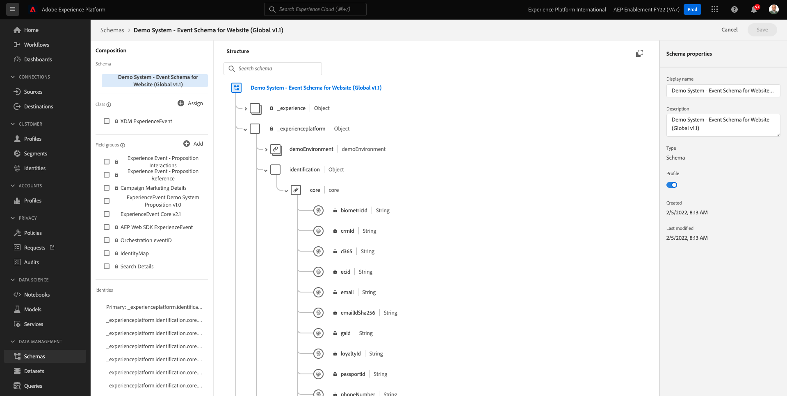
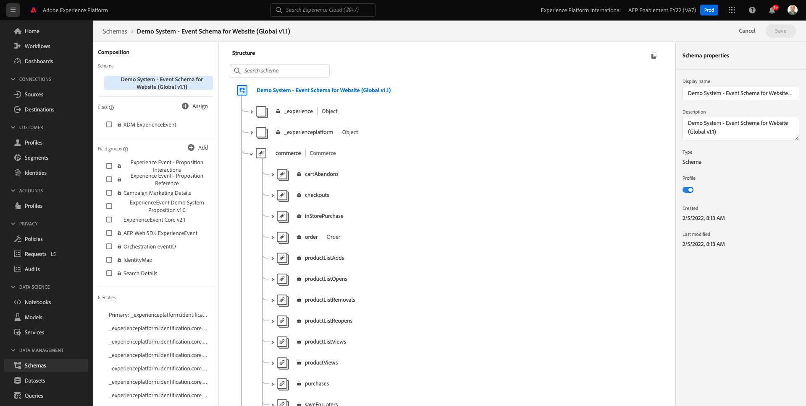

# 11.1Customer Journey Analytics101

## 目标

- 了解CJA应用程序服务
- 了解如何定位CJA
- 了解CJA工作流：从数据连接到分析

## 11.1.1什么是Customer Journey Analytics?

Customer Journey Analytics(CJA)为商业情报和数据科学团队提供了一个工具包，用于拼合和分析跨渠道数据（在线和离线）。 CJA中的功能为复杂的多渠道客户历程提供了上下文和清晰度。 提供的上下文有助于深入了解如何从客户转化流程中消除棘手问题，以及在最重要的时刻设计和提供卓越的体验。

CJA将Analysis Workspace带上Adobe Experience Platform。 Adobe Experience Platform是沟通和编排的大脑，借助CJA，品牌现在可以对所有数据进行情境化和可视化，以便业务和分析团队能够通过分析整个在线到离线客户历程从中学习。

通过Analysis Workspace的拖放、点击和用户友好UI，业务和Insight团队可以与CJA进行交谈、提出问题并即时获取答案。

## 11.1.2主要优势

客户的三大优势包括：

- 向所有人提供洞察的能力（即实现数据访问民主化）
- 在情境历程中查看客户的功能(即数据可以按顺序显示，跨多个渠道（在线和离线）
- 无需即可利用数据的强大功能（即，它让普通人能够使用数据获得深入的洞察和分析，从而激活营销）

## 11.1.3为何选择Customer Journey Analytics?

CJA不用于替换当前的BI应用程序，如Power BI、Microstrategy、Locker或Tableau。 这些BI应用程序用于可视化数据以创建公司功能板，以便组织中的每个人都可以快速查看重要量度。\
CJA的目标是为营销和业务团队带来分析功能，使其成为这些角色的“必备”分析工具。

传统上， BI应用程序一直无法实现真正的客户智能：

- 他们既无法进行归因，也无法进行客户历程分析。
- BI应用程序需要提前知道该问题
- 交互式查询受数据库结构的限制
- 需要SQL技能。
- BI应用程序不允许您询问发生什么。
- BI应用程序没有与客户接触点的直接连接。

由于上述原因，业务用户和分析人员几乎立刻就陷入了死胡同，导致分析变得昂贵、缓慢、不灵活，而且与行动系统脱节。

借助CJA，您可以360度地查看客户历程，使用离线和在线数据，以及使用适当的工具来缩短洞察时间，使企业用户在了解事情发生的原因以及如何响应方面变得独立。

## 11.1.4了解Customer Journey Analytics工作流

在开始下一个练习之前，务必要了解需要采取哪些步骤将Adobe Experience Platform中的数据导入CJA，才能将其可视化并获得一些深入的洞察。 我们称之为CJA工作流。 让我们看一下：

在开始上述步骤之前，请不要忘记步骤0，即了解Adobe Experience Platform中可用的数据。

**垃圾进去，垃圾出去。** 记得吗？ 您必须清楚知道哪些数据可用以及如何配置Adobe Experience Platform中的架构。 了解Adobe Experience Platform中的数据，不仅可以简化数据连接部分的操作，还可以在构建可视化图表和进行分析时，使操作更轻松。

## 11.1.5步骤0:了解Adobe Experience Platform模式和数据集

通过转到以下URL登录Adobe Experience Platform: [https://experience.adobe.com/platform](https://experience.adobe.com/platform).

登录后，您将登陆Adobe Experience Platform的主页。

在继续之前，您需要选择 **沙盒**. 要选择的沙盒已命名 ``--aepSandboxId--``. 您可以通过单击 **[!UICONTROL 生产产品]** 的蓝线。 选择相应的沙盒后，您将看到屏幕发生更改，现在您就位于专用沙盒中。

请查看Adobe Experience Platform中的这些架构和数据集。

| 数据集 | 架构 |
| ----------------- |-------------| 
| 演示系统 — 网站事件数据集（全局v1.1） | 演示系统 — 网站的事件模式（全局v1.1） |
| 演示系统 — 呼叫中心事件数据集（全局v1.1） | 演示系统 — 呼叫中心事件模式（全局v1.1） |
| 演示系统 — 语音助理事件数据集（全局v1.1） | 演示系统 — 语音助理事件模式（全局v1.1） |

请确保至少检查了以下内容：

- 身份：CRMID、phoneNumber、ECID、电子邮件。 哪些标识是主标识符，哪些是次标识符？
您可以通过打开架构并查看对象来查找标识符 `--aepTenantId--.identification.core`. 查看架构 [演示系统 — 网站的事件模式（全局v1.1）](https://experience.adobe.com/platform/schema).

- 浏览架构内的商务对象 [演示系统 — 网站的事件模式（全局v1.1）](https://experience.adobe.com/platform/schema).

- 预览所有 [数据集](https://experience.adobe.com/platform/dataset/browse?limit=50&amp;page=1&amp;sortDescending=1&amp;sortField=created) 并查看数据

您现在可以开始使用Customer Journey AnalyticsUI。

下一步： [11.2在Customer Journey Analytics中连接Adobe Experience Platform数据集](./ex2.md)

[返回到模块11](./customer-journey-analytics-build-a-dashboard.md)

[返回到所有模块](../../overview.md)
