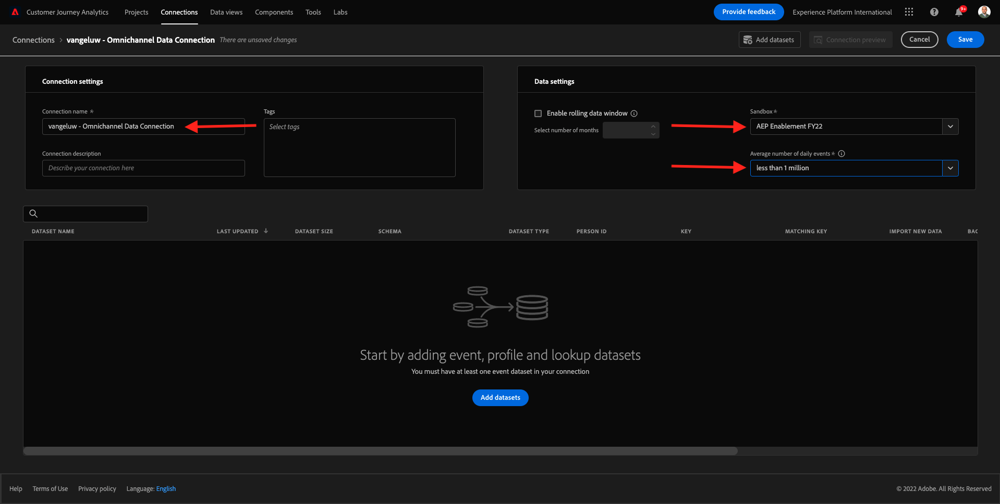

# 11.2在Customer Journey Analytics中连接Adobe Experience Platform数据集

## 目标

- 了解数据连接UI
- 将Adobe Experience Platform数据导入CJA
- 了解人员ID和数据拼合
- 了解Customer Journey Analytics中数据流的概念

## 11.2.1连接

转到 [analytics.adobe.com](https://analytics.adobe.com) 以访问Customer Journey Analytics。

在Customer Journey Analytics主页上，转到 **连接**.

在此，您可以看到CJA与平台之间建立的所有不同连接。 这些连接的目标与Adobe Analytics中的报表包相同。 但是，数据的收集却截然不同。 所有数据都来自Adobe Experience Platform数据集。

让我们创建您的第一个连接。 单击&#x200B;**“创建新连接”**。

然后您将看到 **创建连接** UI。

您现在可以为连接提供名称。

请使用此命名约定： `--demoProfileLdap-- – Omnichannel Data Connection`.

示例：`vangeluw - Omnichannel Data Connection`

您还需要选择要使用的正确沙盒。 在沙盒菜单中，选择您的沙盒，沙盒应为 `Bootcamp`. 在此示例中，要使用的沙盒为 **Bootcamp**. 您还需要将 **平均每日事件数** to **不到100万**.

选择沙盒后，可用的数据集将会更新。

## 11.2.2选择Adobe Experience Platform数据集

搜索数据集 `Demo System - Event Dataset for Website (Global v1.1)`. 单击 **+** 将数据集添加到此连接。

现在，搜索并选中复选框 `Demo System - Event Dataset for Voice Assistants (Global v1.1)` 和 `Demo System - Event Dataset for Call Center (Global v1.1)`.

然后你会得到这个。 单击&#x200B;**下一步**。

## 11.2.3人员ID和数据拼合

### 人员 ID

### 人员 ID

现在的目标是加入这些数据集。 对于您选择的每个数据集，您将看到一个名为 **人员ID**. 每个数据集都有其自己的“人员ID”字段。

如您所见，大多数客户会自动选择人员ID。 这是因为在Adobe Experience Platform的每个架构中都选择了主标识符。 例如，以下是 `Demo System - Event Schema for Call Center (Global v1.1)`，您可以看到主标识符设置为 `phoneNumber`.

但是，您仍可能会影响使用哪个标识符拼合连接数据集。 您可以使用在链接到数据集的架构中配置的任何标识符。 单击下拉菜单以浏览每个数据集上可用的ID。

如前所述，您可以为每个数据集设置不同的人员ID。 这允许您在CJA中将多个源中的不同数据集合在一起。 想象一下，引入NPS或调查数据，这些数据将非常有趣，有助于了解背景以及为什么发生了什么情况。

“人员ID”字段的名称并不重要，只要“人员ID”字段中的值对应。 假设我们有 `email` 在一个数据集中 `emailAddress` 在另一个定义为“人员ID”的数据集中。 如果 `delaigle@adobe.com` 是两个数据集上“人员ID”字段的相同值，CJA将能够拼合数据。

目前还存在一些其他限制，例如，我们拼合已知的匿名行为。 请在此处查看常见问题解答： [常见问题解答](https://experienceleague.adobe.com/docs/analytics-platform/using/cja-overview/cja-faq.html?lang=zh-Hans).

### 使用人员ID拼合数据

现在，您已了解使用人员ID拼合数据集的概念，接下来，让我们选择 `email` 作为每个数据集的人员ID。

转到每个数据集以更新人员ID。

现在，填写人员ID字段，选择 `email` 中。

拼合这三个数据集后，我们便可以继续。

| 数据集 | 人员 ID |
| ----------------- |-------------| 
| 演示系统 — 网站事件数据集（全局v1.1） | 电子邮件 |
| 演示系统 — 语音助理事件数据集（全局v1.1） | 电子邮件 |
| 演示系统 — 呼叫中心事件数据集（全局v1.1） | 电子邮件 |

您还需要确保为每个数据集启用以下选项：

- 导入所有新数据
- 回填所有现有数据

单击 **添加数据集**.

单击 **保存** 然后去下一个练习。
创建 **连接** 在CJA中提供数据可能需要几个小时。

下一步： [11.3创建数据视图](./ex3.md)

[返回到模块11](./customer-journey-analytics-build-a-dashboard.md)

[返回到所有模块](./../../overview.md)
