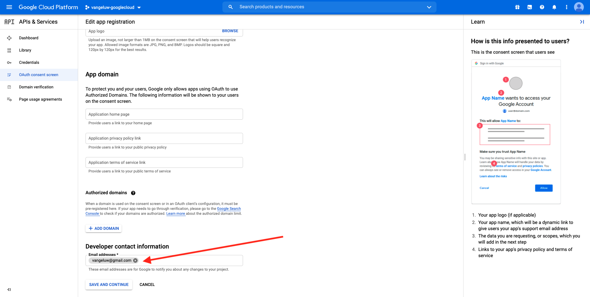
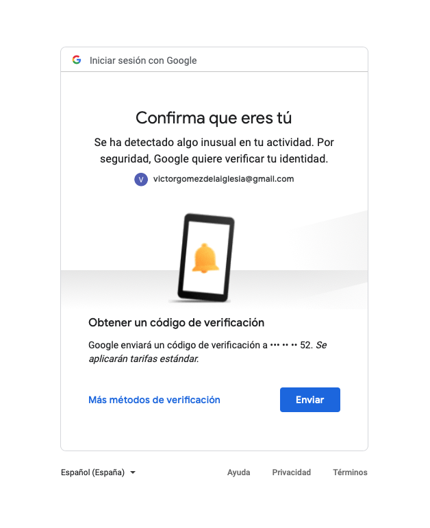

# 12.3将GCP和BigQuery连接到Adobe Experience Platform

## 目标

- 探索Google云平台中的API和服务
- 熟悉用于测试Google API的OAuth操场
- 在Adobe Experience Platform中创建您的第一个BigQuery连接

## 上下文

Adobe Experience Platform在 **源** 这将帮助您将BigQuery数据集导入Adobe Experience Platform。 此数据连接器基于Google BigQuery API。 因此，请务必正确准备Google云平台和BigQuery环境，以从Adobe Experience Platform接收API调用。

要在Adobe Experience Platform中配置BigQuery Source Connector，您需要以下4个值：

- 项目
- clientId
- clientSecret
- refreshToken

到目前为止，你只有第一个， **项目ID**. 此 **项目ID** 值是Google在练习12.1期间创建BigQuery项目时生成的随机ID。

请将项目ID复制到分隔的文本文件中。

| 凭据 | 命名 | 示例 |
| ----------------- |-------------| -------------|
| 项目ID | random | comperent-task-306413 |

您可以随时通过单击 **项目名称** 在顶部菜单栏中：

右侧将显示项目ID:

在本练习中，您将学习如何获取其他3个必填字段：

- clientId
- clientSecret
- refreshToken

## 12.3.1 Google云API和服务

要开始，请返回Google云平台主页。 要实现此目的，只需单击屏幕左上角的徽标。

进入主页后，转到左菜单，然后单击 **API和服务**，然后单击 **功能板**.

您现在将看到 **API和服务** 主页。

在此页面上，您可以看到各种Google API连接的使用情况。 要设置API连接以便Adobe Experience Platform能够从BigQuery读取，您需要执行以下步骤：

- 首先，您需要创建OAuth同意屏幕以启用将来的身份验证。 Google的安全原因还要求用户在允许程序化访问之前进行首次身份验证。
- 其次，您需要API凭据（clientId和clientSecret），以用于API身份验证和访问BigQuery Connector。

## 12.3.2 OAuth同意屏幕

让我们从创建OAuth同意屏幕开始。 在 **API和服务** 主页，单击 **OAuth同意屏幕**.

然后您将看到：

选择用户类型： **外部**. 接下来，单击 **创建**.

然后你就在 **OAuth同意屏幕配置** 窗口。

此处唯一要做的就是在 **应用程序名称** 字段，然后选择 **用户支持电子邮件**. 对于应用程序名称，请使用以下命名约定：

| 命名 | 示例 |
| ----------------- |-------------| 
| `--demoProfileLdap-- - AEP BigQuery Connector` | vangeluw - AEP BigQuery Connector |

接下来，向下滚动直到您看到 **开发人员联系信息** 并填写一个电子邮件地址。

单击 **保存并继续**.

然后你会看到这个。 单击 **保存并继续**.

然后你会看到这个。 单击 **保存并继续**.

然后你会看到这个。 单击 **返回功能板**.

然后你会看到这个。 单击 **发布应用程序**.

单击 **确认**.

然后你会看到这个。

在下一步骤中，您将完成API设置并获取API凭据。

## 12.3.3Google API凭据：客户端密钥和客户端ID

在左侧菜单中，单击 **凭据**. 然后您将看到：

单击 **+创建凭据** 按钮。

您将看到3个选项。 单击 **OAuth客户端ID**:

在下一个屏幕中，选择 **Web应用程序**.

将弹出多个新字段。 您现在需要输入 **名称** OAuth客户端ID的ID，并输入 **授权的重定向URI**.

请遵循以下命名约定：

| 字段 | 值 | 示例 |
| ----------------- |-------------| -------------| 
| 名称 | ldap - AEP BigQuery连接器 | vangeluw — 平台BigQuery连接器 |
| 授权的重定向URI | https://developers.google.com/oauthplayground | https://developers.google.com/oauthplayground |

的 **授权的重定向URI** 字段非常重要，因为您以后需要它来获取RefreshToken ，您需要该字段才能完成Adobe Experience Platform中BigQuery源连接器的设置。

在继续操作之前，您需要将 **输入** 按钮，以在 **授权的重定向URI** 字段。 如果您没有单击 **输入** 按钮时，您将在以后的阶段遇到问题，在 **OAuth 2.0操场**.

接下来，单击 **创建**:

现在，您将看到您的客户端ID和客户端密钥。

请复制这两个字段，并将其粘贴到桌面上的文本文件中。 您随时可以在稍后阶段访问这些凭据，但如果将它们保存在BigQuery项目ID旁的文本文件中，则会更加轻松。

作为Adobe Experience Platform中BigQuery Source Connector设置的回顾，您现在已具有以下可用值：

| BigQuery连接器凭据 | 值 |
| ----------------- |-------------| 
| 项目ID | 您自己的项目ID(例如:comment-task-306413) |
| clientid | yourclientid |
| cilsecret | yourclientsecret |

你还在错过 **refreshToken**. 出于安全原因，需要刷新令牌。 在API领域，令牌通常每24小时过期一次。 所以 **refreshToken** 需要每24小时刷新一次安全令牌，以便您的源连接器设置可以继续连接到Google云平台和BigQuery。

## 12.3.4 BigQuery API和refreshToken

有多种方法可获取refreshToken以访问Google云平台API。 其中一个选项是例如使用Postman。
但是，Google构建了一些更易于测试和使用其API的工具，该工具名为 **OAuth 2.0操场**.

访问 **OAuth 2.0操场**，转到 [https://developers.google.com/oauthplayground](https://developers.google.com/oauthplayground).

然后您将看到 **OAuth 2.0操场** 主页。

单击 **齿轮** 图标：

确保您的设置与在上图中看到的设置相同。

请仔细检查设置，以确保100%确定。

完成后，请勾选 **使用您自己的OAuth凭据**

应会显示两个字段，并且您为它们赋值。

请填写此表后面的字段：

| 操场API设置 | 您的Google API凭据 |
| ----------------- |-------------| 
| OAuth客户端ID | 您自己的客户端ID（在桌面上的文本文件中） |
| OAuth客户端密钥 | 您自己的客户端密钥（在桌面上的文本文件中） |

复制 **客户端ID** 和 **客户端密钥** 从您在桌面上创建的文本文件。

填写您的凭据后，请单击 **关闭**

在左侧菜单中，您可以看到所有可用的Google API。 搜索 **BigQuery API v2**.

接下来，选择下图所示的范围：

选择后，您应会看到一个蓝色按钮，其中显示 **授权API**. 单击它。

选择用于设置GCP和BigQuery的Google帐户。

你可能会看到一个大警告： **未验证此应用程序**. 之所以会出现这种情况，是因为您的Platform BigQuery Connector尚未得到正式审核，因此Google不知道它是否是正版应用程序。 您应忽略此通知。

单击 **高级**.

接下来，单击 **转到ldap - AEP BigQuery Connector（不安全）**.

您将被重定向到您创建的OAuth同意屏幕。

如果您使用双重身份验证(2FA)，请输入发送给您的验证代码。

Google现在将向您显示8个不同的 **权限** 提示。 单击 **允许** 8个许可请求。 （在API允许编程请求之前，必须由真实人员遵循并确认一次此过程）

再说一次， **8个不同的弹出窗口** 将不显示，您必须单击 **允许** 为所有人。

在发出八个权限请求后，您将看到此概述。 单击 **允许** 来完成这个过程。

在 **允许**-click，您将被发送回OAuth 2.0 Playround，您将看到以下内容：

单击 **令牌的Exchange授权代码**.

几秒钟后， **步骤2 — 令牌的Exchange授权代码** 视图将自动关闭，您将看到 **步骤3 — 配置对API的请求**.

你必须回去 **步骤2：令牌的Exchange授权代码**，因此单击 **步骤2：令牌的Exchange授权代码** 再次显示 **刷新令牌**.

您现在将看到 **刷新令牌**.

复制 **刷新令牌** 并将其与其他BigQuery源连接器凭据一起粘贴到桌面上的文本文件中：

| BigQuery源连接器凭据 | 值 |
| ----------------- |-------------| 
| 项目ID | 您自己的随机项目ID(例如:apt-summer-273608) |
| clientid | yourclientid |
| cilsecret | yourclientsecret |
| 刷新令牌 | yourrefreshtoken |

接下来，让我们在Adobe Experience Platform中设置您的源连接器。

## 练习12.3.5 — 将平台与您自己的BigQuery表连接

通过转到以下URL登录Adobe Experience Platform: [https://experience.adobe.com/platform](https://experience.adobe.com/platform).

登录后，您将登陆Adobe Experience Platform的主页。

在继续之前，您需要选择 **沙盒**. 要选择的沙盒已命名 ``--aepSandboxId--``. 您可以通过单击 **[!UICONTROL 生产产品]** 的蓝线。 选择相应的沙盒后，您将看到屏幕发生更改，现在您就位于专用沙盒中。

在左侧菜单中，转到“源”。 然后您将看到 **源** 主页。 在 **源** 菜单，单击 **数据库**. 单击 **Google BigQuery** 卡。 接下来，单击 **设置** 或 **+配置**.

此时您应该创建新连接。

单击 **新帐户**. 现在，您需要根据您在GCP和BigQuery中的设置填写以下所有字段。

让我们首先命名连接：

请使用此命名约定：

| BigQuery连接器凭据 | 值 | 示例 |
| ----------------- |-------------| -------------| 
| 帐户名称 | `--demoProfileLdap-- - BigQuery Connection` | vangeluw - BigQuery连接 |
| 描述 | `--demoProfileLdap-- - BigQuery Connection` | vangeluw - BigQuery连接 |

这应该会给您这样的信息：

接下来，填写GCP和BigQuery API **帐户身份验证** — 您存储在桌面上文本文件中的详细信息：

| BigQuery连接器凭据 | 值 |
| ----------------- |-------------| 
| 项目ID | 您自己的随机项目ID(例如:apt-summer-273608) |
| clientId | ... |
| clientSecret | ... |
| refreshToken | ... |

您的 **帐户身份验证** — 详细信息现在应如下所示：

填写完所有这些字段后，单击 **连接到源**.

如果 **帐户身份验证** 已正确填写详细信息，此时您应会通过查看 **已连接** 确认。

现在，您的连接已创建，请单击 **下一个**:

现在，您将看到在练习12.2期间创建的BigQuery数据集。

干得好！ 在下一个练习中，您将从该表加载数据，并将其映射到Adobe Experience Platform中的架构和数据集。

下一步： [12.4将数据从BigQuery加载到Adobe Experience Platform](./ex4.md)

[返回到模块12](./customer-journey-analytics-bigquery-gcp.md)

[返回到所有模块](./../../overview.md)
