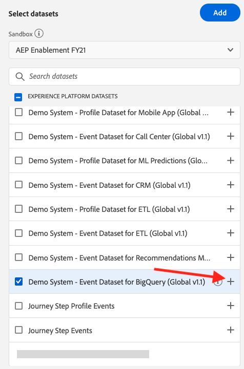
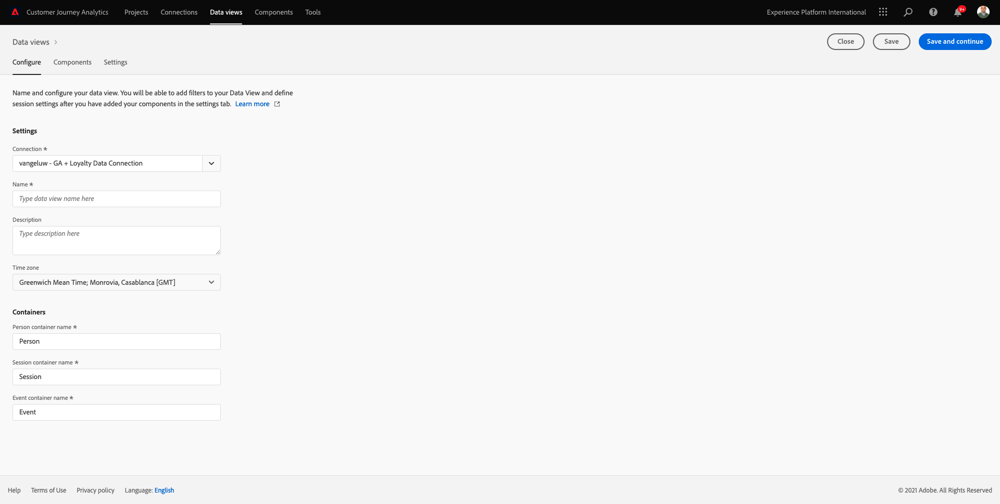
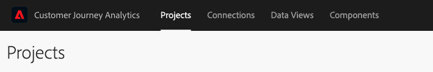
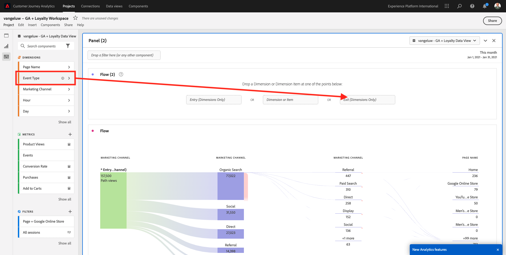

# 12.5使用Google Analytics分析Customer Journey Analytics数据

## 目标

- 将我们的BigQuery数据集连接到Customer Journey Analytics(CJA)
- 使用忠诚度数据连接和加入Google Analytics。
- 熟悉CJA UI

## 12.5.1创建连接

转到 [analytics.adobe.com](https://analytics.adobe.com) 以访问Customer Journey Analytics。

在Customer Journey Analytics主页上，转到 **连接**.

在此，您可以看到CJA与平台之间建立的所有不同连接。 这些连接的目标与Adobe Analytics中的报表包相同。 但是，数据的收集却截然不同。 所有数据都来自Adobe Experience Platform数据集。

单击&#x200B;**“创建新连接”**。

然后您将看到 **创建连接** UI。

首先，您需要选择要使用的正确沙盒。 在沙盒菜单中，选择您的沙盒，沙盒应为 `--aepSandboxId--`. 在此示例中，要使用的沙盒为 **2021财年AEP启用**.

选择沙盒后，可用的数据集将会更新。

在左侧菜单中，您可以看到所有可用的Adobe Experience Platform数据集。 搜索数据集 `Demo System - Event Dataset for BigQuery (Global v1.1)`. 单击 **+** 将数据集添加到此连接。

添加后，您将在连接中看到数据集。

您现在必须选择 **人员ID**. 请确保 **loyatyId** 被选为人员ID。

您现在将扩充Google Analytics网站与其他Adobe Experience Platform数据集的交互数据。

搜索数据集 `Demo System - Profile Dataset for Loyalty (Global v1.1)` 数据集，并将其添加到此连接。

然后您将看到：

要合并两个数据集，您需要选择 **人员ID** 包含相同类型ID的ID。 数据集 `Demo System - Profile Dataset for Loyalty (Global v1.1)` 使用 **loyatyId** 作为人员ID，其中包含与 `Demo System - Event Dataset for BigQuery (Global v1.1)`，它还使用 **loyatyId** 作为人员ID。

单击&#x200B;**下一步**。

然后您将看到：

您需要在此命名连接。

请使用此命名约定： `ldap - GA + Loyalty Data Connection`.

示例：`vangeluw - GA + Loyalty Data Connection`

在完成之前，还请激活 **从今天开始自动导入此连接中所有数据集的所有新数据。** 如下图所示。

这将每60分钟启动一次从Adobe Experience Platform到CJA的数据流，但是，如果数据量很大，则可能需要长达24小时。

您还需要回填历史数据，因此请选中 **导入所有现有数据** 选择 **不到100万** 在 **平均每日事件数**.

创建 **连接** 在CJA中提供数据可能需要几个小时。

单击 **保存** 然后去下一个练习。

然后，您将在可用连接列表中看到您的连接。

## 12.5.2创建数据视图

完成连接后，您现在可以进步来影响可视化图表。 Adobe Analytics与CJA的区别在于，CJA需要数据视图，以便在可视化之前清理和准备数据。

数据视图与Adobe Analytics中虚拟报表包的概念类似，在虚拟报表包中，您可以定义上下文感知访问定义、过滤，以及组件的调用方式。

每个连接至少需要一个数据视图。 但是，对于某些用例，最好为同一连接提供多个数据视图，以便对不同的团队提供不同的洞察。

如果您希望公司成为数据驱动型公司，则应调整每个团队查看数据的方式。 一些示例：

- 仅适用于UX设计团队的UX量度
- 将KPI和量度的名称用于Google Analytics，与Customer Journey Analytics的名称相同，以便Digital Analytics团队只能讲1种语言。
- 数据视图已过滤，以仅显示1个市场、1个品牌或仅移动设备的实例数据。

在 **连接** 屏幕上，选中您刚刚创建的连接前面的复选框。

现在，单击 **创建数据视图**.

您将被重定向到 **创建数据视图** 工作流。

您现在可以为数据视图配置基本定义。 时区、会话超时或数据视图过滤(区段部分类似于Adobe Analytics中的虚拟报表包)。

的 **连接** 您在上一个练习中创建的内容已被选中。 您的连接已命名 `ldap - GA + Loyalty Data Connection`.

接下来，按照此命名约定为数据视图指定一个名称： `ldap - GA + Loyalty Data View`.

为描述输入相同的值： `ldap - GA + Loyalty Data View`.

在进行任何分析或可视化之前，我们需要创建一个数据视图，其中包含所有字段、维度和量度及其归因设置。

| 字段 | 命名约定 | 示例 |
| ----------------- |-------------|-------------|  
| 名称连接 | LDAP - GA +忠诚度数据视图 | vangeluw - GA +忠诚度数据视图 |
| 描述 | LDAP - GA +忠诚度数据视图 | vangeluw - GA +忠诚度数据视图 |

单击 **保存并继续**.

您现在可以向数据视图中添加组件。 如您所见，某些量度和维度会自动添加。

将以下组件添加到数据视图：

| 组件名称 | 组件类型 | 组件路径 |
| -----------------|-----------------|-----------------|
| 级别 | 维度 | _experienceplatform.loyatyDetails.level |
| 点 | 量度 | _experienceplatform.loyatyDetails.points |
| commerce.checkouts.value | 量度 | commerce.checkouts.value |
| commerce.productListRemovals.value | 量度 | commerce.productListRemovals.value |
| commerce.productListAdds | 量度 | commerce.productListAdds |
| commerce.productViews.value | 量度 | commerce.productViews.value |
| commerce.purchases.value | 量度 | commerce.purchases.value |
| web.webPageDetails.pageViews | 量度 | web.webPageDetails.pageViews |
| Transaction ID | 维度 | commerce.order.payments.transactionID |
| channel.mediaType | 维度 | channel.mediaType |
| channel.typeAtSource | 维度 | channel.typeAtSource |
| 跟踪代码 | 维度 | marketing.trackingCode |
| gaid | 维度 | _experienceplatform.identification.core.gaid |
| web.webPageDetails.name | 维度 | web.webPageDetails.name |
| 事件类型 | 维度 | eventType |
| 供应商 | 维度 | environment.browserDetails.vendor |
| 标识符 | 维度 | _id |
| 时间戳 | 维度 | timestamp |
| 类型 | 维度 | device.type |
| loyatyId | 维度 | _experienceplatform.identification.core.loytactId |

然后，您将拥有：

接下来，您需要更改上述一些量度和维度的友好名称，以便在构建分析时轻松使用这些量度和维度。 为此，请选择量度或维度并更新 **名称** 字段，如下图所示。

| 组件原始名称 | 显示名称 |
| -----------------|-----------------|
| 级别 | 忠诚度级别 |
| 点 | 会员积分 |
| commerce.checkouts.value | 结账 |
| commerce.productListRemovals.value | 购物车减货 |
| commerce.productListAdds | 购物车添加次数 |
| commerce.productViews.value | 产品查看次数 |
| commerce.purchases.value | 购买 |
| web.webPageDetails.pageViews | Page Views |
| channel.mediaType | 流量媒介 |
| channel.typeAtSource | 流量源 |
| 跟踪代码 | 营销渠道 |
| gaid | Google AnalyticsID |
| 名称 | 页面标题 |
| 供应商 | 浏览器 |
| 类型 | Device Type |
| loyatyId | 忠诚度ID |

然后，您将获得如下内容：

接下来，您需要通过更改 **归因设置**.

请更改 **归因设置** 对于以下组件：

| 组件 |
| -----------------|
| 流量源 |
| 营销渠道 |
| 浏览器 |
| 流量媒介 |
| 设备类型 |
| Google AnalyticsID |
| 忠诚度ID |
| 忠诚度级别 |
| 会员积分 |

为此，请选择组件，单击 **使用自定义归因模型** 并设置 **模型** to **最近联系**&#x200B;和 **过期** to **人员（报告窗口）**. 对上述所有组件重复此步骤。

在对上述所有组件的归因设置进行更改后，您应该看到以下视图：

数据视图现已配置完成。 单击&#x200B;**保存**。

现在，您可以在Adobe Analytics Analysis Workspace中分析Google Analytics数据。 我们来做下一个练习。

## 12.5.3创建项目

在Customer Journey Analytics中，转到 **项目**.

然后您将看到：

通过单击 **创建新项目**.

您现在有一个空白项目：

首先，保存您的项目并为其命名。 您可以使用以下命令进行保存：

| 操作系统 | 短切 |
| ----------------- |-------------| 
| Windows | Control + S |
| Mac | Command + S |

您将看到此弹出窗口：

请使用此命名约定：

| 名称 | 描述 |
| ----------------- |-------------| 
| ldap - GA +忠诚度工作区 | ldap - GA +忠诚度工作区 |

接下来，单击 **保存项目**.

接下来，确保在屏幕的右上角选择正确的数据视图。 这是您在上一个练习中创建的数据视图，其命名约定为 `ldap - GA + Loyalty Data View`. 在此示例中，要选择的数据视图是 `ldap - GA + Loyalty Data View`.

### 12.5.3.1自由格式表

自由格式表或多或少可以用作Excel中的数据透视表。 您从左侧栏中选取某个内容，并将其拖放到自由格式中，您将获得一个表格报表。

自由格式表几乎无限。 您几乎可以执行任何操作，与Google Analytics相比，这会带来如此巨大的价值（因为此工具存在一些分析限制）。 这是将Google Analytics数据加载到其他分析工具的原因之一。

请查看以下两个示例，其中需要使用SQL、BigQuery，以及一些时间来回答在Google AnalyticsUI或Google Data Studio中无法回答的简单问题：

- 从按营销渠道拆分的Safari浏览器到达结帐点的人数是多少？ 请参阅Safari浏览器正在过滤结账量度。 我们刚刚将变量Browser = Safari拖放到结帐列的顶部。

- 作为分析师，我可以看到社交营销渠道的转化率较低。 我使用“最近联系”归因作为默认属性，但“首次联系”呢？ 将鼠标悬停在任何量度上，即会显示量度设置。 我可以在此处选择所需的归因模型。 您可以在GA中（不在Data Studio中）将归因作为独立活动，但不能在同一表中拥有与归因分析无关的其他量度或维度。

让我们在CJA中回答这些问题，并阅读Analysis Workspace的更多内容。

首先，选择正确的日期范围(**最近53周整**)。

然后，单击 **应用** 以应用日期范围。 请记住此步骤，以便进行下一个练习。

>[!NOTE]
>
>如果您刚刚创建 **数据连接** 和 **数据视图** 你可能需要等上几个小时。 当存在大量数据记录时，CJA需要一些时间来回填历史数据。

让我们拖放一些维度和量度来分析营销渠道。 首先使用维度 **营销渠道** 并将其拖放到 **自由格式表**. (单击 **显示全部** 如果“量度”菜单中没有立即显示该量度)

然后您将看到：

接下来，您需要将量度添加到自由格式表。 您应添加以下量度： **人员**, **会话**, **产品查看**, **结账**, **购买**, **转化率** （计算量度）。

您需要先创建计算量度，然后才能执行此操作 **转化率**. 要实现此目的，请单击 **+** 量度旁边的图标：

作为计算量度的名称，请使用 **转化率**. 然后，拖动量度 **购买** 和 **会话** 放在画布上。 已设置 **格式** to **百分比** 和 **小数位** to **2**. 最后，单击 **保存**.

接下来，为了在 **自由格式表**，将它们逐一拖放到上面 **自由格式表**. 请参阅以下示例。

你最终会得到一张这样的桌子：

如上所述， **自由格式表** 为您提供进行深入分析所需的自由度。 例如，您可以选取任何其他Dimension来划分表中的特定量度。

例如，转到维度并搜索，然后选择 **浏览器** 变量。

然后，您将看到此Dimension的可用值概述。

选择Dimension **Safari** 并将其拖放到量度上，例如 **结账**. 然后您将看到：

为此，您只是回答了一个潜在的问题：使用Safari进入结帐页面的人数（按营销渠道进行拆分）？

现在，让我们回答归因问题。

查找 **购买** 量度。

将鼠标悬停在量度和 **设置** 图标。 单击它。

将显示上下文菜单。 选中复选框 **非默认归因模型**.

在您将看到的弹出窗口中，您可以轻松更改归因模型和回顾窗口（使用SQL实现这一点相当复杂）。

选择 **首次接触** 作为归因模型。

选择 **人员** （针对回顾窗口）。

现在，单击 **应用**.

您现在可以看到，该特定量度的归因模型现在为“首次联系”。

您可以根据需要执行任意数量的划分，而不受变量、区段、维度或日期范围类型的限制。

更特别的是，能够从Adobe Experience Platform加入任何数据集，以扩充来自Google Analytics的数字行为数据。 例如，离线、呼叫中心、忠诚度或CRM数据。

要展示该功能，让我们配置第一个划分，将离线数据与在线数据结合在一起。 选取维度 **忠诚度级别** 并将其拖放到任何 **营销渠道**，例如， **自然搜索**:

接下来，我们分析一下 **设备类型** 由使用访问网站的客户使用 **自然搜索** 带有 **忠诚度级别** 表示 **铜**. 获取Dimension **设备类型** 然后拖放到 **铜**. 然后您将看到：

您可以看到，对于首次划分，会使用忠诚度级别。 此维度来自与用于BigQuery连接器的数据集不同的数据集和不同的架构。 人员ID **loyatyID** (演示系统 — 用于BigQuery(Global v1.1)的事件模式)和 **loyatyID** (演示系统 — 忠诚度的用户档案架构（全局v1.1）)相互匹配。 因此，您可以将Google Analytics中的体验事件与忠诚度架构中的用户档案数据合并。

我们可以不断将行与区段或特定日期范围（可能反映特定的电视促销活动）进行拆分，以便向Customer Journey Analytics提出问题并在移动中获得答案。

使用SQL和第三方可视化工具实现相同的最终结果是相当困难的。 特别是当你问问题，试图迅速得到答案时。 Customer Journey Analytics没有这一难题，它允许数据分析人员灵活、实时地查询数据。

## 12.5.3.2漏斗或流失分析

漏斗图是了解客户历程中主要步骤的一种非常好的机制。 这些步骤也可以来自离线交互（例如，来自呼叫中心），然后您可以将这些步骤与同一漏斗中的数字接触点组合在一起。

Customer Journey Analytics允许您执行上述操作，以及执行更多其他操作。 如果您还记得模块13，我们可以在其中右键单击并执行以下操作：

- 分析用户在执行流失步骤后的进展
- 从漏斗的任意点创建区段
- 在折线图可视化图表的任意阶段查看趋势

让我们看看另一件事：与上个月相比，本月的客户历程漏斗如何？ 移动设备与桌面设备有何区别？

在下面，您将创建两个面板：

- 漏斗分析（1月）
- 漏斗分析（2月）

您将看到我们正在比较按设备类型拆分的不同时间段（1月和2月）的漏斗。

此类分析在Google AnalyticsUI中不可能，或者非常有限。 因此，CJA会再次为Google Analytics捕获的数据添加大量值。

创建您的第一个流失可视化图表。 请关闭当前面板以从新面板开始。

查看面板的右侧，然后单击箭头将其关闭。

接下来，单击 **+** 创建新面板。

现在，选择 **流失** 可视化。

作为分析师，请想象一下，您希望了解主电子商务漏斗的最新动态：主页>内部搜索>产品详细信息>结帐>购买。

让我们首先向漏斗中添加一些新步骤。 要实现此目的，请打开 **页面名称** 维度。

然后，您将看到已访问的所有可用页面。

拖放 **主页** 第一步。

第二步，使用 **存储搜索结果**

现在，您需要添加一些电子商务操作。 在Dimension中，搜索Dimension **事件类型** 维度。 单击以打开维度。

选择 **Product_Detail_Views** 并将其拖放到下一步中。

选择 **Product_Checkouts** 并将其拖放到下一步中。

调整流失可视化图表的大小。

流失可视化现已准备就绪。

要开始分析和记录这些洞察，对于 **文本** 可视化图表。 添加 **文本** 可视化图表，单击 **图表** 图标以查看所有可用的可视化图表。 然后，拖放 **文本** 可视化图表。 调整大小并移动，使其与下图类似。

再次，调整其大小以适合功能板：

流失可视化图表还允许进行划分。 使用 **设备类型** 维度，方法是将其打开，然后逐个将一些值拖放到可视化上：

您最终将获得一个更高级的可视化图表：

Customer Journey Analytics允许您执行上述操作，以及执行更多其他操作。 通过右键单击流失中的任意位置，您可以……

- 分析用户从流失步骤进入的位置
- 从漏斗的任意点创建区段
- 折线图可视化图表中的任何步骤的趋势
- 以可视方式将任何漏斗与不同时间段进行比较。

例如，在流失的任何步骤中右键单击，即可查看其中的一些分析选项。

## 12.5.3.3流量分析和可视化图表

如果要使用Google Analytics进行高级流量分析，则需要使用SQL来提取数据，然后使用第三方解决方案来获取可视化部分。 Customer Journey Analytics将对此有所帮助。

在此步骤中，您将配置流量分析以回答以下问题：特定登陆页面之前的主要贡献渠道包括哪些。  作为分析师，只需执行两次拖放操作和一次单击操作，您便可以通过最后两次接触营销渠道，了解用户流向登陆页面的流程。

Customer Journey Analytics可帮助您解答的其他问题：

- 特定登陆页面之前的渠道主要组合是什么？
- 当用户到达Product_Checkout时，什么原因会导致用户退出会话？ 前面的步骤是什么？

让我们再从一个空白面板开始回答这些问题。 关闭当前面板，然后单击 **+**.

现在，选择 **流量** 可视化图表。

现在，我们来设置一个多路径营销渠道流量分析。 拖放 **营销渠道** 维度 **登录Dimension** 的上界。

现在，您可以看到第一个登入路径：

单击第一个路径可对其进行深入分析。

您现在可以看到下一个路径（营销渠道）。

我们再进行第三次深化。 单击新路径中的第一个选项， **反向链接**.

现在，您应会看到如下可视化图表：

让事情复杂化吧。 假设您想要分析在经过两个营销路径之后登陆页面的内容？ 要实现此目的，您可以使用辅助维度更改最后一个路径。 查找 **页面名称** 维度，并按如下方式拖放：

您现在将看到以下内容：

让我们再做一次流量分析。 此时，您将分析在特定退出点后发生的情况。 其他Analytics解决方案需要使用SQL/ETL，然后再次使用第三方可视化工具来实现相同的目的。

新 **流量可视化图表** 。

然后，您将拥有：

查找Dimension **事件类型** 然后拖放到 **退出维度** 的上界。

现在你可以看到 **事件类型**-paths将客户引导至退出。

让我们调查在退出结帐操作之前发生的情况。 单击 **Product_Checkouts** 路径：

将显示新的操作路径，其中包含一些不直观的数据。

让我们进一步分析！ 搜索Dimension **页面名称** 并将其拖放到新生成的路径中。

您现在可以在几分钟内完成高级流量分析。 您可以单击不同的路径，以查看它们从退出到前面步骤的连接方式。

您现在拥有一个功能强大的工具包，可分析漏斗并探索跨数字接触点以及离线接触点的客户行为路径。

不要忘记保存更改！

## 12.5.4共享项目

>[!IMPORTANT]
>
>以下内容旨在作为FYI — 您可以 **NOT** 必须与他人共享您的项目。

FYI — 您可以与同事共享此项目，以进行协作或共同分析业务问题。

下一步： [摘要和优点](./summary.md)

[返回到模块12](./customer-journey-analytics-bigquery-gcp.md)

[返回到所有模块](./../../overview.md)
