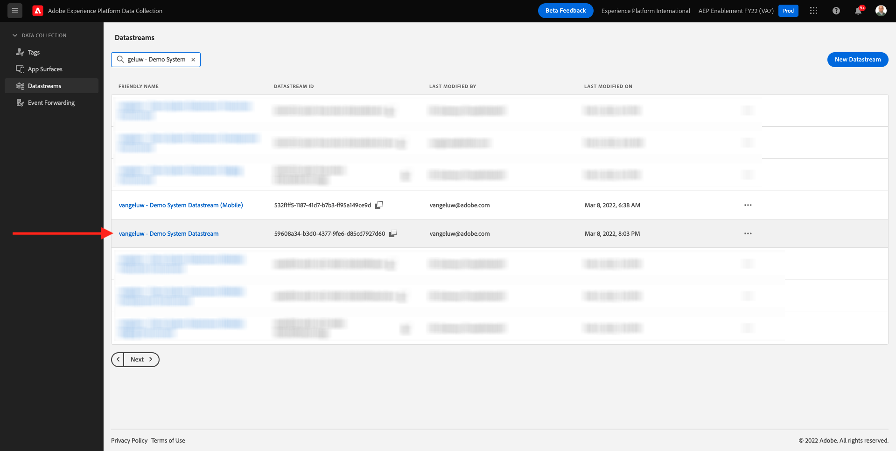

# 14.2更新数据流以使数据可用于Adobe Experience Platform数据收集服务器属性

## 14.2.1更新数据流

在 [练习0.2](./../../modules/module0/ex2.md)，您自己创建了 **[!UICONTROL 数据流]**. 然后使用名称 `--demoProfileLdap-- - Demo System Datastream`.

在本练习中，您需要配置 **[!UICONTROL 数据流]** 与 **[!DNL Data Collection Server property]**.

为此，请转至 [https://experience.adobe.com/#/data-collection/](https://experience.adobe.com/#/data-collection/). 然后你会看到这个。 在左侧菜单中，单击 **[!UICONTROL 数据流]**.

在屏幕的右上角，选择您的沙盒名称，该名称应为 `--aepSandboxId--`.

搜索 **[!UICONTROL 数据流]**，该名称为 `--demoProfileLdap-- - Demo System Datastream`. 单击 **[!UICONTROL 数据流]** 打开它。

然后你会看到这个。 单击 **[!UICONTROL +添加服务]**.

选择服务 **事件转发**. 这将显示另外2个设置。 选择您在上一个练习中创建且名为的事件转发属性 `--demoProfileLdap-- - Demo System (DD/MM/YYYY) (Edge)`. 然后选择 **开发** 在 **环境**. 单击&#x200B;**保存**。

您的数据流现已更新，可供使用。

您的数据流现已准备好与 **[!DNL Event Forwarding property]**.

下一步： [14.3创建和配置自定义Webhook](./ex3.md)

[返回到模块14](./aep-data-collection-ssf.md)

[返回到所有模块](./../../overview.md)
