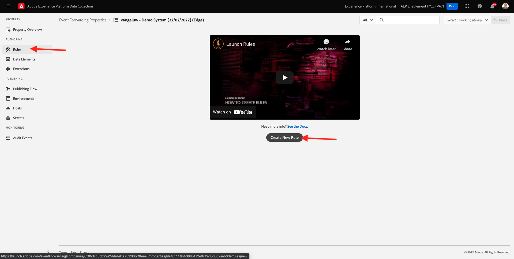
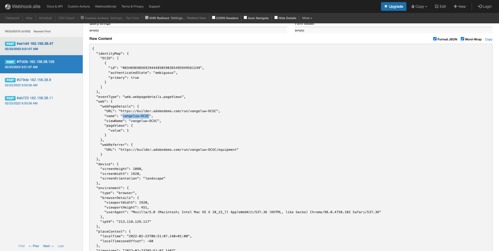

# 14.3创建和配置自定义Webhook

## 14.3.1创建自定义Webhook

转到 [https://webhook.site/](https://webhook.site/). 您将看到如下内容：

您将看到您的唯一URL，如下所示： `https://webhook.site/585126a1-41fc-4721-864b-d4aa8c268a1d`.

此网站现已为您创建此网页挂接，您将能够在 **[!DNL Event Forwarding property]** 以开始测试事件的转发。

## 14.3.2更新事件转发属性：创建数据元素

转到 [https://experience.adobe.com/#/data-collection/](https://experience.adobe.com/#/data-collection/) 然后转到 **事件转发**. 搜索您的事件转发属性并单击该属性以将其打开。

在左侧菜单中，转到 **数据元素**. 单击&#x200B;**创建新数据元素**。

然后，您将看到要配置的新数据元素。

进行以下选择：

- 作为 **名称**，输入 **XDM事件**.
- 作为 **扩展**，选择 **核心**.
- 作为 **数据元素类型**，选择 **路径**.
- 作为 **路径**，输入 **arc.event.xdm**. 通过输入此路径，您将过滤掉 **XDM** 章节(网站或移动设备应用程序发送到Adobe Edge的事件有效负载)。

你现在会得到这个。 单击&#x200B;**保存**。

>[!NOTE]
>
>在上述路径中，将引用 **弧**. **弧** 表示Adobe资源上下文和 **弧** 始终表示在服务器端上下文中可用的可用的最高对象。 扩充和转换可添加到 **弧** 对象。
>
>在上述路径中，将引用 **事件**. **事件** 表示一个唯一事件，Adobe Experience Platform数据收集服务器将始终单独评估每个事件。 有时，您可能会看到 **事件** 在由Web SDK客户端发送的有效负载中，但在Adobe Experience Platform数据收集服务器中，将单独评估每个事件。

## 14.3.3更新Adobe Experience Platform数据收集服务器属性：创建规则

在左侧菜单中，转到 **规则**. 单击&#x200B;**创建新规则**。

然后，您将看到要配置的新规则。 输入 **名称**: **所有页面**. 对于本练习，您无需配置条件。 相反，您将设置一个操作。 单击 **+添加** 按钮 **操作**.

然后你会看到这个。 进行以下选择：

- 选择 **扩展**: **Adobe云连接器**.
- 选择 **操作类型**: **进行获取调用**.

这应该给你这个 **名称**: **Adobe云连接器 — 进行获取调用**. 此时您应会看到以下内容：

接下来，配置以下内容：

- 将请求方法从GET更改为 **POST**
- 输入在 [https://webhook.site/](https://webhook.site/) 网站，如下所示： `https://webhook.site/585126a1-41fc-4721-864b-d4aa8c268a1d`

你现在应该有这个。 接下来，转到 **正文**.

然后你会看到这个。 单击数据元素图标，如下所示。

在弹出窗口中，选择数据元素 **XDM事件** 上一步中创建的。 单击&#x200B;**选择**。

然后你会看到这个。 单击 **Keep Changes**.

然后你会看到这个。 单击&#x200B;**保存**。

现在，您已在事件转发属性中配置了第一个规则。 转到 **发布流程** 以发布更改。
打开开发库 **主要** 单击 **编辑** 如所示。

单击 **Add All Changed Resources** 按钮，之后您将看到规则和数据元素显示在此库中。 接下来，单击 **保存并构建以用于开发**. 您的更改现已部署完成。

几分钟后，您将看到部署已完成并准备进行测试。

## 14.3.4测试配置

转到 [https://builder.adobedemo.com/projects](https://builder.adobedemo.com/projects). 使用Adobe ID登录后，您将看到此内容。 单击您的网站项目以将其打开。

您现在可以按照以下流程访问网站。 单击 **集成**.

在 **集成** 页面，您需要选择在练习0.1中创建的数据收集属性。

然后，您将看到您的演示网站已打开。 选择URL并将其复制到剪贴板。

打开新的隐身浏览器窗口。

粘贴您在上一步中复制的演示网站的URL。 然后，系统将要求您使用Adobe ID登录。

选择您的帐户类型并完成登录过程。

然后，您将在无痕浏览器窗口中看到您的网站已加载。 对于每个演示，您需要使用全新的、隐身的浏览器窗口来加载演示网站URL。

在打开浏览器的“开发人员视图”时，您可以检查网络请求，如下所示。 使用过滤器时 **交互**，您将看到Adobe Experience Platform数据收集客户端发送到Adobe Edge的网络请求。

如果选择原始有效负载，请转到 [https://jsonformatter.org/json-pretty-print](https://jsonformatter.org/json-pretty-print) 并粘贴有效负载。 单击 **漂亮**. 然后，您将看到JSON有效负载， **事件** 对象和 **xdm** 对象。 在前面的某个步骤中，当您定义数据元素时，会使用引用 **arc.event.xdm**，这会导致您解析 **xdm** 此有效负载的对象。

将视图切换到网站 [https://webhook.site/](https://webhook.site/) 在以前的任一步骤中使用。 现在，您应该有一个与此类似的视图，其中网络请求显示在左侧菜单中。 您正在查看 **xdm** 从上面显示的网络请求中过滤的有效负载。

在有效负载中向下滚动一位以查找页面名称，在本例中为 **万热卢 — 奥库克** （这是您的演示网站的项目名称）。

如果您现在在网站中导航，您将看到此自定义WebHook上实时提供的其他网络请求。

现在，您已将Web SDK/XDM负载的服务器端转发配置为外部自定义Webhook。 在接下来的练习中，您将配置类似的方法，并将相同的数据发送到Google和AWS环境。

下一步： [14.4创建和配置Google云函数](./ex4.md)

[返回到模块14](./aep-data-collection-ssf.md)

[返回到所有模块](./../../overview.md)
