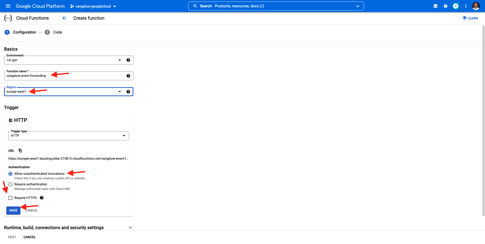
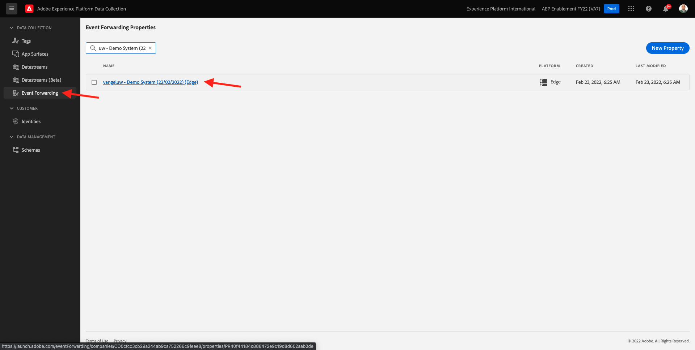
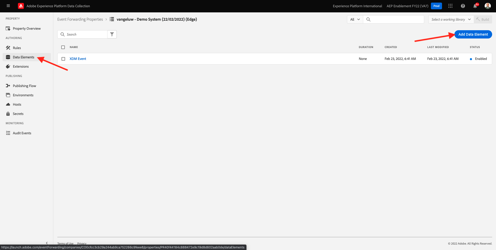
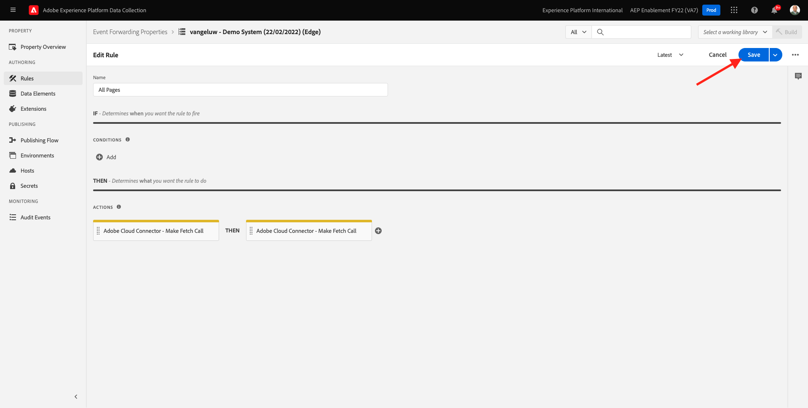

# 14.4创建和配置Google云函数

## 14.4.1创建Google云函数

转到 [https://console.cloud.google.com/](https://console.cloud.google.com/). 转到 **云函数**.


然后你会看到这个。 单击 **创建函数**.


然后你会看到这个。


做出以下选择：

- **函数名称**: `--demoProfileLdap---event-forwarding`
- **地区**:选择任意区域
- **触发器类型**:选择 **HTTP**
- **身份验证**:选择 **允许未经身份验证的调用**

你现在应该有这个。 单击&#x200B;**保存**。



单击 **下一个**.


然后您将看到：


做出以下选择：

- **运行时**:选择 **Node.js 16** （或更近）
- **入口点**:enter **helloAEP**

单击 **启用API** 启用 **云构建API**. 然后你会看到一个新窗口。 在该新窗口中，单击 **启用** 再次。


然后你会看到这个。 单击 **启用**.


一次 **云构建API** 已启用，您将看到此消息。


回到 **云函数**.
在云函数内联编辑器中，确保您在其中具有以下代码：

```javascript
/**
 * Responds to any HTTP request.
 *
 * @param {!express:Request} req HTTP request context.
 * @param {!express:Response} res HTTP response context.
 */
exports.helloAEP = (req, res) => {
  let message = req.query.message || req.body.message || 'Hello World!';
  res.status(200).send(message);
};
```

接下来，单击 **部署**.


然后你会看到这个。 您的云函数现在正在创建中。 这可能需要几分钟。


创建并运行函数后，您将看到此消息。 单击函数的名称以将其打开。


然后你会看到这个。 转到 **触发器**. 然后您将看到 **触发器URL** 这是您在Launch服务器端中定义端点时所使用的方法。


复制触发器URL，其外观如下所示： **https://europe-west1-dazzling-pillar-273812.cloudfunctions.net/vangeluw-event-forwarding**.

在后续步骤中，您将配置Adobe Experience Platform数据收集服务器以流式传输有关 **页面查看次数** 到Google云函数。 您不会按原样转发完整的负载，而是只会发送类似 **ECID**, **timestamp** 和 **页面名称** 到Google云函数。

下面是需要解析以过滤掉上述变量的有效负载示例：

```json
{
  "events": [
    {
      "xdm": {
        "eventType": "web.webpagedetails.pageViews",
        "web": {
          "webPageDetails": {
            "URL": "https://builder.adobedemo.com/run/vangeluw-OCUC",
            "name": "vangeluw-OCUC",
            "viewName": "vangeluw-OCUC",
            "pageViews": {
              "value": 1
            }
          },
          "webReferrer": {
            "URL": "https://builder.adobedemo.com/run/vangeluw-OCUC/equipment"
          }
        },
        "device": {
          "screenHeight": 1080,
          "screenWidth": 1920,
          "screenOrientation": "landscape"
        },
        "environment": {
          "type": "browser",
          "browserDetails": {
            "viewportWidth": 1920,
            "viewportHeight": 451
          }
        },
        "placeContext": {
          "localTime": "2022-02-23T06:51:07.140+01:00",
          "localTimezoneOffset": -60
        },
        "timestamp": "2022-02-23T05:51:07.140Z",
        "implementationDetails": {
          "name": "https://ns.adobe.com/experience/alloy/reactor",
          "version": "2.8.0+2.9.0",
          "environment": "browser"
        },
        "_experienceplatform": {
          "identification": {
            "core": {
              "ecid": "08346969856929444850590365495949561249"
            }
          },
          "demoEnvironment": {
            "brandName": "vangeluw-OCUC"
          },
          "interactionDetails": {
            "core": {
              "channel": "web"
            }
          }
        }
      },
      "query": {
        "personalization": {
          "schemas": [
            "https://ns.adobe.com/personalization/html-content-item",
            "https://ns.adobe.com/personalization/json-content-item",
            "https://ns.adobe.com/personalization/redirect-item",
            "https://ns.adobe.com/personalization/dom-action"
          ],
          "decisionScopes": [
            "eyJ4ZG06YWN0aXZpdHlJZCI6Inhjb3JlOm9mZmVyLWFjdGl2aXR5OjE0YzA1MjM4MmUxYjY1MDUiLCJ4ZG06cGxhY2VtZW50SWQiOiJ4Y29yZTpvZmZlci1wbGFjZW1lbnQ6MTRiZjA5ZGM0MTkwZWJiYSJ9",
            "__view__"
          ]
        }
      }
    }
  ],
  "query": {
    "identity": {
      "fetch": [
        "ECID"
      ]
    }
  },
  "meta": {
    "state": {
      "domain": "adobedemo.com",
      "cookiesEnabled": true,
      "entries": [
        {
          "key": "kndctr_907075E95BF479EC0A495C73_AdobeOrg_identity",
          "value": "CiYwODM0Njk2OTg1NjkyOTQ0NDg1MDU5MDM2NTQ5NTk0OTU2MTI0OVIPCPn66KfyLxgBKgRJUkwx8AH5-uin8i8="
        },
        {
          "key": "kndctr_907075E95BF479EC0A495C73_AdobeOrg_consent_check",
          "value": "1"
        },
        {
          "key": "kndctr_907075E95BF479EC0A495C73_AdobeOrg_consent",
          "value": "general=in"
        }
      ]
    }
  }
}
```

以下字段包含需要解析的信息：

- ECID: **events.xdm。_experienceplatform.identification.core.ecid**
- 时间戳： **timestamp**
- 页面名称： **events.xdm.web.webPageDetails.name**

现在，让我们转到Adobe Experience Platform数据收集服务器，以配置数据元素，从而实现这一点。

## 14.4.2更新事件转发属性：数据元素

转到 [https://experience.adobe.com/#/data-collection/](https://experience.adobe.com/#/data-collection/) 然后转到 **事件转发**. 搜索您的事件转发属性并单击该属性以将其打开。



在左侧菜单中，转到 **数据元素**. 单击 **Add Data Element**.



然后，您将看到要配置的新数据元素。


进行以下选择：

- 作为 **名称**，输入 **customerECID**.
- 作为 **扩展**，选择 **核心**.
- 作为 **数据元素类型**，选择 **路径**.
- 作为 **路径**，输入 `arc.event.xdm.--aepTenantId--.identification.core.ecid`. 通过输入此路径，您将过滤掉该字段 **ecid** 从网站或移动设备应用程序发送到Adobe Edge的事件有效负载。

>[!NOTE]
>
>在上述路径和下面的路径中，引用 **弧**. **弧** 表示Adobe资源上下文和 **弧** 始终表示在服务器端上下文中可用的可用的最高对象。 扩充和转换可添加到 **弧** 对象。
>
>在上述路径和下面的路径中，引用 **事件**. **事件** 表示一个唯一事件，Adobe Experience Platform数据收集服务器将始终单独评估每个事件。 有时，您可能会看到 **事件** 在由Web SDK客户端发送的有效负载中，但在Adobe Experience Platform数据收集服务器中，将单独评估每个事件。

你现在会得到这个。 单击&#x200B;**保存**。


单击 **Add Data Element**.


然后，您将看到要配置的新数据元素。


进行以下选择：

- 作为 **名称**，输入 **eventTimestamp**.
- 作为 **扩展**，选择 **核心**.
- 作为 **数据元素类型**，选择 **路径**.
- 作为 **路径**，输入 **arc.event.xdm.timestamp**. 通过输入此路径，您将过滤掉该字段 **timestamp** 从网站或移动设备应用程序发送到Adobe Edge的事件有效负载。

你现在会得到这个。 单击&#x200B;**保存**。


单击 **Add Data Element**.


然后，您将看到要配置的新数据元素。


进行以下选择：

- 作为 **名称**，输入 **pageName**.
- 作为 **扩展**，选择 **核心**.
- 作为 **数据元素类型**，选择 **路径**.
- 作为 **路径**，输入 **arc.event.xdm.web.webPageDetails.name**. 通过输入此路径，您将过滤掉该字段 **name** 从网站或移动设备应用程序发送到Adobe Edge的事件有效负载。

你现在会得到这个。 单击&#x200B;**保存**。


您现在已创建以下数据元素：


## 14.4.3更新事件转发属性：更新规则

在左侧菜单中，转到 **规则**. 在上一个练习中，您创建了规则 **所有页面**. 单击该规则以将其打开。


你会的。 单击 **+** 图标 **操作** 以添加新操作。


然后你会看到这个。


进行以下选择：

- 选择 **扩展**: **Adobe云连接器**.
- 选择 **操作类型**: **进行获取调用**.

这应该给你这个 **名称**: **Adobe云连接器 — 进行获取调用**. 此时您应会看到以下内容：


接下来，配置以下内容：

- 将请求协议从GET更改为 **POST**
- 输入您在之前的某个步骤中创建的Google云函数的URL，如下所示： **https://europe-west1-dazzling-pillar-273812.cloudfunctions.net/vangeluw-event-forwarding**

你现在应该有这个。 接下来，转到 **正文**.


然后你会看到这个。 单击 **JSON**.


配置 **正文** 如下所示：

| 键 | 值 |
|--- |--- |
| customerECID | {{customerECID}} |
| pageName | {{pageName}} |
| eventTimestamp | {{eventTimestamp}} |

然后你会看到这个。 单击 **Keep Changes**.


然后你会看到这个。 单击&#x200B;**保存**。



您现在已更新Adobe Experience Platform数据收集服务器属性中的现有规则。 转到 **发布流程** 以发布更改。 打开开发库 **主要** 单击 **编辑** 如所示。


单击 **Add All Changed Resources** 按钮，之后您将看到规则和数据元素显示在此库中。 接下来，单击 **保存并构建以用于开发**. 您的更改现已部署完成。


几分钟后，您将看到部署已完成并准备进行测试。


## 14.3.4测试配置

转到 [https://builder.adobedemo.com/projects](https://builder.adobedemo.com/projects). 使用Adobe ID登录后，您将看到此内容。 单击您的网站项目以将其打开。


您现在可以按照以下流程访问网站。 单击 **集成**.


在 **集成** 页面，您需要选择在练习0.1中创建的数据收集属性。


然后，您将看到您的演示网站已打开。 选择URL并将其复制到剪贴板。


打开新的隐身浏览器窗口。


粘贴您在上一步中复制的演示网站的URL。 然后，系统将要求您使用Adobe ID登录。


选择您的帐户类型并完成登录过程。


然后，您将在无痕浏览器窗口中看到您的网站已加载。 对于每个演示，您需要使用全新的、隐身的浏览器窗口来加载演示网站URL。


在打开浏览器的“开发人员视图”时，您可以检查网络请求，如下所示。 使用过滤器时 **交互**，您将看到Adobe Experience Platform数据收集客户端发送到Adobe Edge的网络请求。


将视图切换到Google云函数，然后转到 **日志**. 现在，您应该有一个与此类似的视图，并显示许多日志条目。 每次你看到 **函数已开始执行**，表示在Google云函数中接收了传入流量。


让我们更新一下您的函数以处理传入数据，并显示从Adobe Experience Platform数据收集服务器收到的信息。 转到 **来源** 单击 **编辑**.


在下一个屏幕中，单击 **下一个**.


更新您的代码，如下所示：

```javascript
/**
 * Responds to any HTTP request.
 *
 * @param {!express:Request} req HTTP request context.
 * @param {!express:Response} res HTTP response context.
 */
exports.helloAEP = (req, res) => {
  console.log('>>>>> Function has started. The following information was received from Event Forwarding:');
  console.log(req.body);

  let message = req.query.message || req.body.message || 'Hello World!';
  res.status(200).send(message);
};
```

然后你会得到这个。 单击 **部署**.


几分钟后，您的函数将再次部署。 单击您的函数名称以将其打开。


在您的演示网站上，导航到产品，例如 **德尔德雷松适卡普里酒店**.


将视图切换到Google云函数，然后转到 **日志**. 现在，您应该有一个与此类似的视图，并显示许多日志条目。

对于演示网站上的每次页面查看，您现在应会在Google云功能的日志中看到一个新的日志条目弹出窗口，其中显示了收到的信息。


现在，您已成功将Adobe Experience Platform数据收集收集的数据实时发送到Google云函数端点。 从此处，该数据可供任何Google Cloud Platform应用程序使用，例如BigQuery用于存储和报告或机器学习用例。

下一步： [14.5向AWS生态系统发展的事件](./ex5.md)

[返回到模块14](./aep-data-collection-ssf.md)

[返回到所有模块](./../../overview.md)
