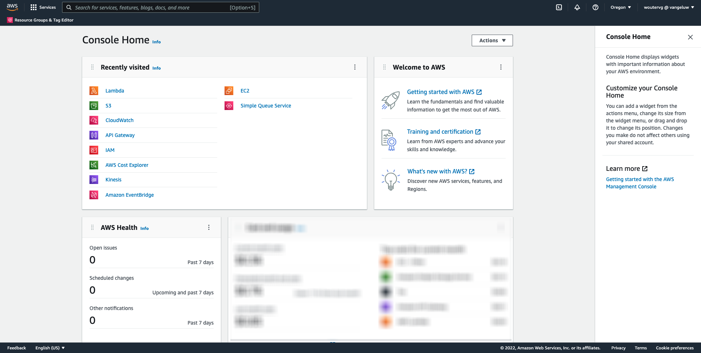
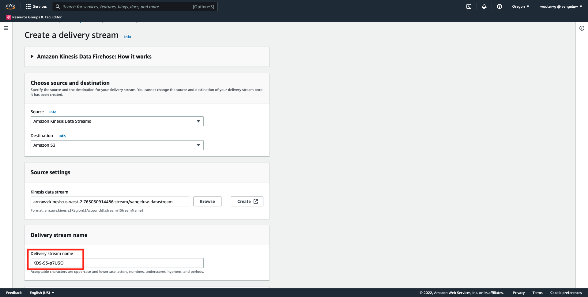

# 14.5向AWS生态系统发展的事件

>[!IMPORTANT]
>
>完成此练习是可选的，使用AWS Kinesis需要支付相应费用。 虽然AWS提供免费套餐帐户，让您无需支付任何费用即可测试和配置多项服务，但AWS Kinesis并不是免费套餐帐户的一部分。 因此，为了实施和测试此练习，使用AWS Kinesis将需要支付相应费用。

## 很高兴知道

Adobe Experience Platform支持将各种Amazon服务作为目标。
Kinesis和S3都 [配置文件导出目标](https://experienceleague.adobe.com/docs/experience-platform/destinations/destination-types.html?lang=en) 可用作Adobe Experience PlatformReal-Time CDP的一部分。
您可以轻松地将高价值区段事件和关联的配置文件属性馈送到您选择的系统中。

在本说明中，您将了解如何设置您自己的Amazon Kinesis流，以将来自Adobe Experience Platform Edge生态系统的事件数据流式传输到云存储目标，如Amazon S3。 如果您希望从Web资产和移动资产中收集体验事件，并将它们推送到数据库以进行分析和运行报告，则此功能非常有用。 数据通常以批量方式摄取数据，并且每日文件导入量较大，因此不会公开可与事件转发结合使用的公共http端点。

支持上述用例意味着，在将流数据写入文件之前，需要缓冲或将流数据置于队列中。 必须注意不要打开文件以跨多个进程进行写入访问。 将这项任务下放到专用系统是在确保服务水平的同时实现良好扩展的理想选择，这正是Kinesis的救助之地。

Amazon Kinesis数据流重点关注数据流的摄取和存储。 Kinesis Data Firehose重点关注将数据流交付到选定的目标，如S3存储段。

作为练习的一部分，你……

- 执行Kinesis数据流的基本设置
- 创建Firehose投放流并使用S3存储段作为目标
- 将Amazon API网关配置为rest api端点以接收事件数据
- 将原始事件数据从Adobe的Edge转发到Kinesis流

## 14.5.1配置AWS S3存储段

转到 [https://console.aws.amazon.com](https://console.aws.amazon.com) 然后使用您之前创建的Amazon帐户登录。


登录后，您将被重定向到 **AWS管理控制台**.



在 **查找服务** 菜单，搜索 **s3**. 单击第一个搜索结果： **S3 — 云中的可扩展存储**.


然后您将看到 **Amazon S3** 主页。 单击 **创建存储段**.


在 **创建存储段** 屏幕中，您需要配置两项内容：

- 名称：使用名称 `eventforwarding---demoProfileLdap--`. 例如，在本练习中，存储段名称为 **aepmodulertcdpvangeluw**
- 地区：使用区域 **EU（法兰克福）eu-central-1**


保留所有其他默认设置。 向下滚动并单击 **创建存储段**.


然后，您将看到正在创建存储段，并被重定向到Amazon S3主页。


## 14.5.2配置AWS Kinesis数据流

在 **查找服务** 菜单，搜索 **kinesis**. 单击第一个搜索结果： **Kinesis — 使用实时流数据**.


选择 **Kinesis数据流**. 单击 **创建数据流**.


对于 **数据流名称**，使用 `--demoProfileLdap---datastream`.


无需更改任何其他设置。 向下滚动并单击 **创建数据流**.


然后你会看到这个。 成功创建数据流后，您可以继续下一个练习。


## 14.5.3配置AWS Firehose投放流

在 **查找服务** 菜单，搜索 **kinesis**. 单击 **Kinesis Data Firehose**.


单击 **创建投放流**.


对于 **来源**，选择 **Amazon Kinesis数据流**. 对于 **目标**，选择 **Amazon S3**. 单击 **浏览** 来选择您的数据流。


选择您的数据流。 单击 **选择**.


然后你会看到这个。 记住 **投放流名称** 因为你以后会需要它。



向下滚动直到您看到 **目标设置**. 单击 **浏览** 来选择S3存储段。


选择您的S3存储段并单击 **选择**.


然后你会看到这样的东西。 更新以下设置：

- 动态分区：设置为 **已启用**
- 多记录解聚：设置为 **已禁用**
- 新行分隔符：设置为 **已启用**
- JSON的内联解析：设置为 **已启用**


向下滚动一下，您就会看到这个。 更新以下设置：

- 动态分区键
   - 键名称： **dynamicPartitioningKey**
   - JQ表达式： **.dynamicPartitioningKey**
- S3存储段前缀：添加以下代码：

```bash
!{partitionKeyFromQuery:dynamicPartitioningKey}/!{timestamp:yyyy}/!{timestamp:MM}/!{timestamp:dd}/!{timestamp:HH}/}
```

- S3存储段错误输出前缀：设置为 **错误**


最后，向下滚动一点，然后单击 **创建投放流**


几分钟后，将创建您的投放流，并且 **活动**.


## 14.5.4配置AWS IAM角色

在 **查找服务** 菜单，搜索 **iam**. 单击 **API网关**.


单击 **角色**.


搜索 **KinesisFirehose** 角色。 单击它以将其打开。


单击您的权限策略名称以将其打开。


在打开的新屏幕中，单击 **编辑策略**.


在 **Kinesis** - **操作**，请确保 **写入** 权限 **PutRecord** 启用。 单击 **审查策略**.


单击&#x200B;**保存更改**。


然后你会回来。 单击 **角色**.


搜索 **KinesisFirehose** 角色。 单击它以将其打开。


转到 **信任关系** 单击 **编辑信任策略**.


通过粘贴此代码以替换现有代码来覆盖当前信任策略：

```json
{
	"Version": "2012-10-17",
	"Statement": [
		{
			"Effect": "Allow",
			"Principal": {
				"Service": [
                    "firehose.amazonaws.com",
                    "kinesis.amazonaws.com",
                    "apigateway.amazonaws.com"
                ]
			},
			"Action": "sts:AssumeRole"
		}
	]
}
```

单击 **更新策略**


然后你会看到这个。 您需要指定 **ARN** ，以便在下一步中使用此角色。


## 14.5.5配置AWS API网关

Amazon API Gateway是一项AWS服务，用于创建、发布、维护、监控和保护任意规模的REST、HTTP和WebSocket API。 API开发人员可以创建访问AWS或其他Web服务的API，以及存储在AWS云中的数据。

您现在将通过HTTPS端点向Internet公开Kinesis数据流，随后Adobe服务（如事件转发）会直接使用该端点。

在 **查找服务** 菜单，搜索 **api网关**. 单击 **API网关**.


然后你会看到这样的东西。 单击 **创建API**.


单击 **生成** 在 **REST API** 卡。


然后你会看到这个。 填写如下设置：

- 选择协议：选择 **REST**
- 创建新API:选择 **新API**
- 设置:
   - API名称：use `--demoProfileLdap---eventforwarding`
   - 端点类型：选择 **地区**

单击 **创建API**.


然后你会看到这个。 单击 **操作** 然后单击 **创建资源**.


然后你会看到这个。 已设置 **资源名称** to **流**. 单击 **创建资源**.


然后你会看到这个。 单击 **操作** 然后单击 **创建方法**.


在下拉菜单中，选择 **POST** ，然后单击 **v** 按钮。


然后你会看到这个。 填写如下设置：

- 集成类型： **AWS服务**
- AWS地区：选择您的Kinesis数据流使用的区域，在此例中为： **us-west-2**
- AWS服务：选择 **Kinesis**
- AWS子域：留空
- HTTP方法：选择 **POST**
- 操作类型：选择 **使用操作名称**
- 操作：enter **PutRecord**
- 执行角色：粘贴 **ARN** Kinesis Data Firehose所使用的执行角色的ID（如上一练习中所述）
- 内容处理：选择 **直通**
- 使用默认超时：启用复选框

单击&#x200B;**保存**。


然后你会看到这个。 单击 **集成请求**.


单击 **HTTP头**.


向下滚动一点，然后单击 **添加标题**.


已设置 **名称** to **Content-Type**，设置 **映射自** to `'application/x-amz-json-1.1'`. 单击 **v** 图标以保存更改。


然后你会看到这个。 对于 **请求正文通过**，选择 **未定义模板时（推荐）**. 接下来，单击 **添加映射模板**.


在 **Content-Type**，输入 **application/json**. 单击 **v** 图标以保存更改。


向下滚动以查找代码编辑器窗口。 将以下代码粘贴到此处：

```json
{
  "StreamName": "$input.path('StreamName')",
  "Data": "$util.base64Encode($input.json('$.Data'))",
  "PartitionKey": "$input.path('$.PartitionKey')"
}
```

单击&#x200B;**保存**。


接下来，向上滚动并单击 **&lt; — 方法执行** 回去。


单击 **测试**.


向下滚动，并将此代码粘贴到 **请求正文**. 单击 **测试**.

```json
{
  "Data": {
    "message": "Hello World",
    "dynamicPartitioningKey": "v2"
  },
  "PartitionKey": "1",
  "StreamName": "--demoProfileLdap---datastream"
}
```


然后，您将看到类似的结果：


然后你会看到这个。 单击 **操作** 然后单击 **部署API**.


对于 **部署阶段**，选择 **新阶段**. 作为 **阶段名称**，输入 **prod**. 单击 **部署**.


然后你会看到这个。 单击&#x200B;**保存更改**。答：图像中的URL是用于向发送数据的URL(在本例中为：https://vv1i5vwg2k.execute-api.us-west-2.amazonaws.com/prod)。


您可以使用以下cURL请求来测试设置，您只需将以下URL替换为您的请求即可。 `https://vv1i5vwg2k.execute-api.us-west-2.amazonaws.com/prod` 在本例中，添加 `/stream` 在URL的末尾。

```json
curl --location --request POST 'https://vv1i5vwg2k.execute-api.us-west-2.amazonaws.com/prod/stream' \
--header 'Content-Type: application/json' \
--data-raw '{
    "Data": {
        "userid": "--demoProfileLdap--@adobe.com",
        "firstName":"--demoProfileLdap--",
        "offerName":"10% off on outdoor gears",
        "offerCode": "10OFF-SPRING",
        "dynamicPartitioningKey": "campaign"
    },
    "PartitionKey": "1",
    "StreamName": "--demoProfileLdap---datastream"
}'
```

将上述更新代码粘贴到“终端”窗口中，然后按Enter。 然后，您将看到此响应，与上面测试时看到的响应类似。


## 14.5.6更新事件转发属性

您现在可以通过AWS API网关激活到AWS Kinesis数据流，因此现在可以将原始体验事件发送到AWS生态系统。 使用Real-Time CDP连接和事件转发，您现在可以轻松地启用到新创建的AWS API网关端点的事件转发。

### 14.5.6.1更新事件转发属性：创建数据元素

转到 [https://experience.adobe.com/#/data-collection/](https://experience.adobe.com/#/data-collection/) 然后转到 **事件转发**. 搜索您的事件转发属性并单击该属性以将其打开。


在左侧菜单中，转到 **数据元素**. 单击 **Add Data Element**.


然后，您将看到要配置的新数据元素。


进行以下选择：

- 作为 **名称**，输入 **awsDataObject**.
- 作为 **扩展**，选择 **核心**.
- 作为 **数据元素类型**，选择 **自定义代码**.

你现在会得到这个。 单击 **&lt;/> Open Editor**.


在编辑器中，将以下代码粘贴到第3行。 单击&#x200B;**保存**。

```javascript
const newObj = {...arc.event.xdm, dynamicPartitioningKey: "event_forwarding"}
return JSON.stringify(newObj);
```


>[!NOTE]
>
>在上述路径中，将引用 **弧**. **弧** 表示Adobe资源上下文和 **弧** 始终表示在服务器端上下文中可用的可用的最高对象。 扩充和转换可添加到 **弧** 对象。
>
>在上述路径中，将引用 **事件**. **事件** 表示一个唯一事件，Adobe Experience Platform数据收集服务器将始终单独评估每个事件。 有时，您可能会看到 **事件** 在由Web SDK客户端发送的有效负载中，但在Adobe Experience Platform数据收集事件转发中，将单独评估每个事件。

然后你会回来。 单击 **保存** 或 **保存到库**.


### 14.5.6.2更新Adobe Experience Platform数据收集服务器属性：更新规则

在左侧菜单中，转到 **规则**. 单击以打开规则 **所有页面** 您在之前的一个练习中创建的。


然后你会看到这个。 单击 **+** 图标以添加新操作。


然后你会看到这个。 进行以下选择：

- 选择 **扩展**: **Adobe云连接器**.
- 选择 **操作类型**: **进行获取调用**.

这应该给你这个 **名称**: **Adobe云连接器 — 进行获取调用**. 此时您应会看到以下内容：


接下来，配置以下内容：

- 将请求方法从GET更改为 **POST**
- 输入您在以前的任一步骤中创建的AWS API网关端点的URL，如下所示： `https://vv1i5vwg2k.execute-api.us-west-2.amazonaws.com/prod/stream`

你现在应该有这个。 接下来，转到 **标题**.


在标题下，添加带键的新标题 **Content-Type** 和值 **application/json**. 接下来，转到 **正文**.


然后你会看到这个。 将以下代码粘贴到字段中 **正文(Raw)**. 单击 **Keep Changes**.

```json
{
    "Data":{{awsDataObject}},
    "PartitionKey": "1",
    "StreamName": "--demoProfileLdap---datastream"
}
```


然后你会看到他回来。 单击 **保存** 或 **保存到库**.


现在，您已在事件转发属性中配置了第一个规则。 转到 **发布流程** 以发布更改。
通过单击 **主要**.


单击 **Add All Changed Resources** 按钮，此后您将看到规则和数据元素更改显示在此库中。 接下来，单击 **保存并构建以用于开发**. 您的更改现已部署完成。


几分钟后，您将看到部署已完成并准备进行测试。


## 14.5.7测试配置

转到 [https://builder.adobedemo.com/projects](https://builder.adobedemo.com/projects). 使用Adobe ID登录后，您将看到此内容。 单击您的网站项目以将其打开。


您现在可以按照以下流程访问网站。 单击 **集成**.


在 **集成** 页面，您需要选择在练习0.1中创建的数据收集属性。


然后，您将看到您的演示网站已打开。 选择URL并将其复制到剪贴板。


打开新的隐身浏览器窗口。


粘贴您在上一步中复制的演示网站的URL。 然后，系统将要求您使用Adobe ID登录。


选择您的帐户类型并完成登录过程。


然后，您将在无痕浏览器窗口中看到您的网站已加载。 对于每个演示，您需要使用全新的、隐身的浏览器窗口来加载演示网站URL。


在打开浏览器的“开发人员视图”时，您可以检查网络请求，如下所示。 使用过滤器时 **交互**，您将看到Adobe Experience Platform数据收集客户端发送到Adobe Edge的网络请求。


如果选择原始有效负载，请转到 [https://jsonformatter.org/json-pretty-print](https://jsonformatter.org/json-pretty-print) 并粘贴有效负载。 单击 **漂亮**. 然后，您将看到JSON有效负载， **事件** 对象和 **xdm** 对象。 在前面的某个步骤中，当您定义数据元素时，会使用引用 **arc.event.xdm**，这会导致您解析 **xdm** 此有效负载的对象。


将视图切换为 **AWS**. 通过打开您的数据流并进入 **监控** 选项卡，您现在将看到传入流量。


当您随后打开投放流并进入 **监控** 选项卡，您还会看到传入流量。


最后，当您查看S3存储段时，您现在会注意到由于数据摄取而在该位置创建了文件。


下载此类文件并使用文本编辑器将其打开时，您会看到该文件包含转发事件的XDM有效负载。


下一步： [摘要和优点](./summary.md)

[返回到模块14](./aep-data-collection-ssf.md)

[返回到所有模块](./../../overview.md)
