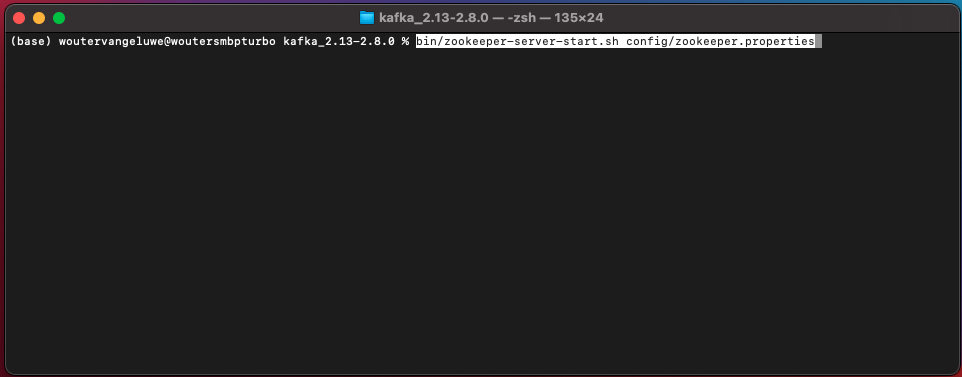

# 15.2安装和配置Kafka群集

## 15.2.1下载Apache Kafka

转到 [https://kafka.apache.org/downloads](https://kafka.apache.org/downloads) 并下载最新版本。 选择最新的二进制版本，在此例中为 **斯卡拉2.13**.

然后你被带到镜子站。 单击建议的链接以下载Kafka。

在桌面上创建一个名为 **Kafka_AEP** 并将下载的文件放在该目录中。

打开 **终端** 窗口，方法是右键单击您的文件夹并单击 **文件夹中的新终端**.

在“终端”窗口中运行此命令以解压缩下载的文件：

`tar -xvf kafka_2.13-3.1.0.tgz`

>[!NOTE]
>
>请验证上述命令是否与您下载的文件版本匹配。 如果您的版本较新，则需要更新上述命令以匹配该版本。

然后您将看到：

解压缩该文件后，您现在有一个类似此目录的目录：

在该目录中，您将看到以下子目录：

返回到“终端”窗口。 输入以下命令：

`cd kafka_2.13-3.1.0`

>[!NOTE]
>
>请验证上述命令是否与您下载的文件版本匹配。 如果您的版本较新，则需要更新上述命令以匹配该版本。

接下来，输入命令 `bin/kafka-topics.sh`.

然后，您应会看到此响应。 这意味着Kafka已正确安装，Java运行正常。 (提醒：您需要安装Java 8 JDK或Java 11 JDK才能正常工作！ 您可以使用命令查看已安装的Java版本 `java -version`.)

## 15.2.2开始Kafka

为了开始Kafka，你需要启动Kafka Zookeeper和Kafka，按此顺序。

打开 **终端** 窗口，方法是右键单击您的文件夹 **kafka_2.13-3.1.0** 单击 **文件夹中的新终端**.

输入以下命令：

`bin/zookeeper-server-start.sh config/zookeeper.properties`

然后您将看到：

在练习这些练习时，保持此窗口处于打开状态！

打开另一个新 **终端** 窗口，方法是右键单击您的文件夹 **kafka_2.13-3.1.0** 单击 **文件夹中的新终端**.

输入以下命令：

`bin/kafka-server-start.sh config/server.properties`

然后您将看到：

在练习这些练习时，保持此窗口处于打开状态！

## 15.2.3创建Kafka主题

打开 **终端** 窗口，方法是右键单击您的文件夹 **kafka_2.13-3.1.0** 单击 **文件夹中的新终端**.

输入此命令以创建名为的新Kafka主题 **aeptest**. 本主题将用于本练习中的测试。

`bin/kafka-topics.sh --create --topic aeptest --bootstrap-server localhost:9092`

然后，您将看到类似的确认信息：

输入此命令以创建名为的新Kafka主题 **aep**. 本主题将由您将在下一个练习中配置的Adobe Experience Platform Sink连接器使用。

`bin/kafka-topics.sh --create --topic aep --bootstrap-server localhost:9092`

然后，您将看到类似的确认信息：

## 15.2.4制作事件

返回到在其中创建第一个Kafka主题的“终端”窗口，然后输入以下命令：

`bin/kafka-console-producer.sh --broker-list 127.0.0.1:9092 --topic aeptest`

然后你会看到这个。 按下Enter按钮后，每添加一行新消息都会在主题中发送新消息 **aeptest**.

输入 `Hello AEP` 按Enter。 您的第一个事件现在已发送到您本地的Kafka实例中，转到了主题中 **aeptest**.

输入 `Hello AEP again.` 按Enter。

输入 `AEP Data Collection is the best.` 按Enter。

您现在在本主题中制作了3个活动 **aeptest**. 现在，可能需要该数据的应用程序可以使用这些事件。

在键盘上，单击 `Control` 和 `C` 同时关闭你的制片人。

## 15.2.4使用事件

在用于生成事件的“终端”窗口中，输入以下命令：

`bin/kafka-console-consumer.sh --bootstrap-server 127.0.0.1:9092 --topic aeptest --from-beginning`

然后，您将看到在上一个主题练习中生成的所有消息 **aeptest**，显示在消费者中。 Apache Kafka的工作方式如下：生产者在管道中创建事件，而消费者则消费这些事件。

在键盘上，单击 `Control` 和 `C` 同时关闭你的制片人。

在本练习中，您已经完成了设置本地Kafka群集、创建Kafka主题、生成事件和使用事件的所有基础知识。

此模块的目标是模拟在真实组织已实施Apache Kafka群集，并希望将数据从其Kafka群集流到Adobe Experience Platform时会发生什么情况。

为便于实施，创建了Adobe Experience Platform Sink连接器，可使用Kafka Connect实施。 您可以在此处找到Adobe Experience Platform Sink Connector的文档： [https://github.com/adobe/experience-platform-streaming-connect](https://github.com/adobe/experience-platform-streaming-connect).

在接下来的练习中，您将实施从您自己的本地Kafka群集中使用Adobe Experience Platform Sink Connector所需的所有功能。

关闭终端窗口。

您已完成此练习。

下一步： [15.3在Adobe Experience Platform中配置HTTP API端点](./ex3.md)

[返回到模块15](./aep-apache-kafka.md)

[返回到所有模块](../../overview.md)
