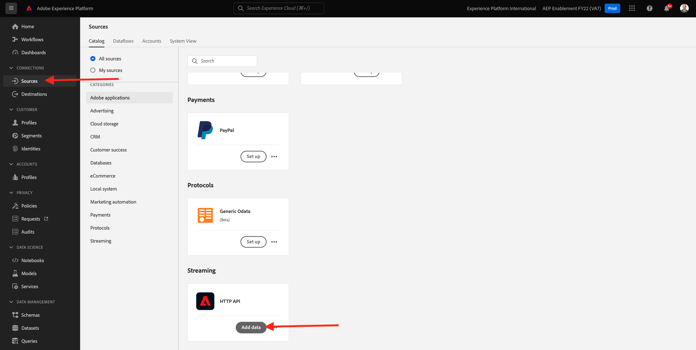

# 15.3在Adobe Experience Platform中配置HTTP API流端点

在Kafka中设置Adobe Experience Platform Sink连接器之前，您需要在Adobe Experience Platform中创建HTTP API源连接器。 设置Adobe Experience Platform Sink连接器时需要HTTP API流端点URL。

要创建HTTP API源连接器，请转到以下URL以登录Adobe Experience Platform: [https://experience.adobe.com/platform](https://experience.adobe.com/platform).

登录后，您将登陆Adobe Experience Platform的主页。

在继续之前，您需要选择 **沙盒**. 要选择的沙盒已命名 ``--aepSandboxId--``. 您可以通过单击 **[!UICONTROL 生产产品]** 的蓝线。 选择相应的沙盒后，您将看到屏幕发生更改，现在您就位于专用沙盒中。

在左侧菜单中，转到 **源** 并在 **源目录** 直到你看到 **HTTP API**. 单击 **添加数据**.

单击 **新帐户**. 使用 `--demoProfileLdap-- - Kafka` 作为HTTP API连接的名称，在本例中为 **万杰卢 — 卡夫卡**. 为启用复选框 **兼容XDM**. 单击 **连接到源**.

然后，您将看到此内容，单击 **下一个**.

选择 **现有数据集**，打开下拉菜单。 搜索并选择数据集 **演示系统 — 呼叫中心事件数据集（全局v1.1）**.

单击&#x200B;**下一步**。

单击&#x200B;**下一步**。

单击&#x200B;**完成**。

然后，您将看到刚刚创建的HTTP API源连接器的概述。

您需要复制 **流端点** URL，类似于下面的URL，因为您将在下一个练习中需要它。

`https://dcs.adobedc.net/collection/d282bbfc8a540321341576275a8d052e9dc4ea80625dd9a5fe5b02397cfd80dc`

您已完成此练习。

下一步： [15.4安装和配置Kafka Connect和Adobe Experience Platform Sink连接器](./ex4.md)

[返回到模块15](./aep-apache-kafka.md)

[返回到所有模块](../../overview.md)
