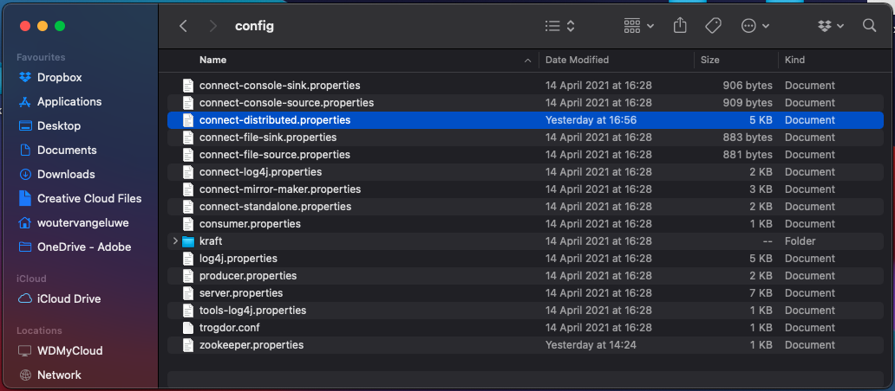
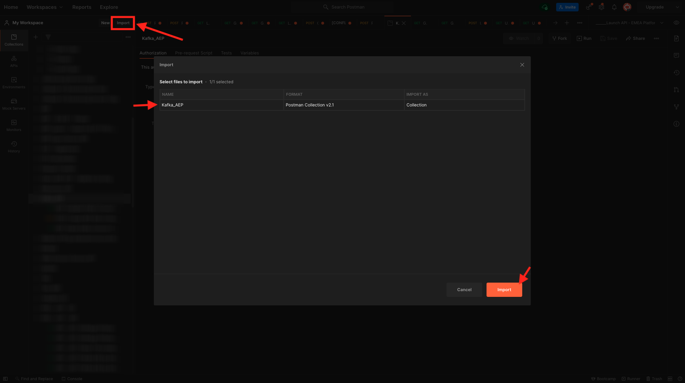
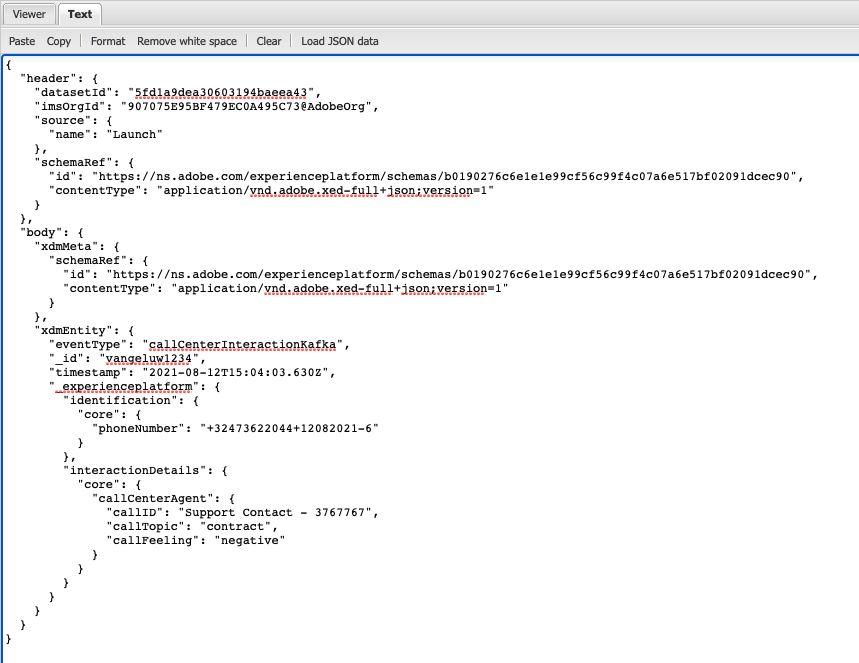

# 15.4安装和配置Kafka Connect和Adobe Experience Platform Sink连接器

## 15.4.1下载Adobe Experience Platform Sink连接器

转到 [https://github.com/adobe/experience-platform-streaming-connect/releases](https://github.com/adobe/experience-platform-streaming-connect/releases) 并下载最新的正式版Adobe Experience Platform Sink Connector。


放置下载文件， **streaming-connect-sink-0.0.14-java-11.jar**，放到桌面上。


## 15.4.2配置Kafka Connect

转到桌面上名为 **Kafka_AEP** 并导航到文件夹 `kafka_2.13-3.1.0/config`.
在该文件夹中，打开文件 **connect-distributed.properties** 使用任何文本编辑器。



在文本编辑器中，转到第34行和第35行，并确保设置字段 `key.converter.schemas.enable` 和 `value.converter.schemas.enable` to `false`

```json
key.converter.schemas.enable=false
value.converter.schemas.enable=false
```

保存对此文件所做的更改。


接下来，返回到文件夹 `kafka_2.13-3.1.0` 并手动创建新文件夹，然后将其命名为 `connectors`.


右键单击文件夹，然后单击 **文件夹中的新终端**.


然后你会看到这个。 输入命令 `pwd` 以检索该文件夹的完整路径。 选择完整路径，并将其复制到剪贴板。


返回到文本编辑器，转到文件 **connect-distributed.properties** 并向下滚动到最后一行（屏幕截图中的第86行）。 您应取消对以开头的行的注释 `# plugin.path=` 并且您应该粘贴名为 `connectors`. 结果应类似于以下内容：

`plugin.path=/Users/woutervangeluwe/Desktop/Kafka_AEP/kafka_2.13-3.1.0/connectors`

保存对文件所做的更改 **connect-distributed.properties** 并关闭文本编辑器。


接下来，将您下载的Adobe Experience Platform Sink Connector的最新正式版本复制到名为 `connectors`. 您之前下载的文件已命名 **streaming-connect-sink-0.0.14-java-11.jar**，您只需将其移动到 `connectors` 文件夹。


接下来，在 **kafka_2.13-3.1.0** 文件夹。 右键单击该文件夹，然后单击 **文件夹中的新终端**.

在“终端”窗口中，粘贴以下命令： `bin/connect-distributed.sh config/connect-distributed.properties` 单击 **输入**. 此命令将启动Kafka Connect，并加载Adobe Experience Platform Sink连接器的库。


几秒钟后，您将看到如下内容：


## 15.4.3使用Postman创建Adobe Experience Platform Sink连接器

您现在可以使用Postman与Kafka Connect进行交互。 为此，请下载 [此Postman收藏集](../../assets/postman/postman_kafka.zip) 并将其解压缩到桌面上的本地计算机。 然后，您会得到一个名为 `Kafka_AEP.postman_collection.json`.


您需要在Postman中导入此文件。 为此，请打开Postman，单击 **导入**，拖放文件 `Kafka_AEP.postman_collection.json` 进入弹出窗口并单击 **导入**.



然后，您将在Postman的左侧菜单中找到此收藏集。 单击第一个请求， **GET可用的Kafka Connect连接器** 打开它。


然后你会看到这个。 单击蓝色 **发送** 按钮，此后您应会看到空响应 `[]`. 空响应是由于当前未定义Kafka Connect连接器。


要创建连接器，请单击以打开Kafka集合中的第二个请求， **POST创建AEP Sink连接器**. 然后你会看到这个。 在11号线，上面写着 **&quot;aep.endpoint&quot;:&quot;**，则需要在练习结束时收到的HTTP API流端点URL中进行粘贴 [15.3](./ex3.md). HTTP API流端点URL如下所示： `https://dcs.adobedc.net/collection/d282bbfc8a540321341576275a8d052e9dc4ea80625dd9a5fe5b02397cfd80dc`.


粘贴后，请求正文应如下所示。 单击蓝色 **发送** 按钮创建连接器。 创建连接器后，您会立即收到响应。


单击第一个请求， **GET可用的Kafka Connect连接器** 以再次将其打开，然后单击蓝色 **发送** 按钮。 此时您将看到已创建Kafka Connect连接器。


接下来，打开Kafka收藏集中的第三个请求， **GET检查Kafka Connect连接器状态**. 单击蓝色 **发送** 按钮，您将收到类似于下面的响应，指示连接器正在运行。


## 15.4.4制作体验事件

打开新 **终端** 窗口，方法是右键单击您的文件夹 **kafka_2.13-3.1.0** 单击 **文件夹中的新终端**.


输入以下命令：

`bin/kafka-console-producer.sh --broker-list 127.0.0.1:9092 --topic aep`


然后你会看到这个。 按下Enter按钮后，每添加一行新消息都会在主题中发送新消息 **aep**.


您现在可以发送一条消息，该消息将导致Adobe Experience Platform Sink连接器使用，并将实时摄取到Adobe Experience Platform。

让我们做个小演示来测试这个。

转到 [https://builder.adobedemo.com/projects](https://builder.adobedemo.com/projects). 使用Adobe ID登录后，您将看到此内容。 单击您的网站项目以将其打开。


在 **Screens** 页面，单击 **运行**.


然后，您将看到您的演示网站已打开。 选择URL并将其复制到剪贴板。


打开新的隐身浏览器窗口。


粘贴您在上一步中复制的演示网站的URL。 然后，系统将要求您使用Adobe ID登录。


选择您的帐户类型并完成登录过程。


然后，您将在无痕浏览器窗口中看到您的网站已加载。 对于每个演示，您需要使用全新的、隐身的浏览器窗口来加载演示网站URL。


单击屏幕左上角的Adobe徽标图标以打开“配置文件查看器”。


查看“配置文件查看器”面板和“实时客户配置文件”，其中 **Experience CloudID** 作为此当前未知客户的主要标识符。


转到注册/登录页面。 单击 **创建帐户**.


填写详细信息并单击 **注册** 之后，您将被重定向到上一页。


打开“配置文件查看器”面板，然后转到“实时客户配置文件”。 在“配置文件查看器”面板上，您应会看到显示的所有个人数据，如新添加的电子邮件和电话标识符。


您可能会看到一些基于过去活动的体验事件。


让我们将其更改，并将呼叫中心体验活动从Kafka发送到Adobe Experience Platform。

采用以下体验事件有效负载示例，并将其复制到文本编辑器中。

```json
{
  "header": {
    "datasetId": "61fe23fd242870194a6d779c",
    "imsOrgId": "--aepImsOrgID--",
    "source": {
      "name": "Launch"
    },
    "schemaRef": {
      "id": "https://ns.adobe.com/experienceplatform/schemas/b0190276c6e1e1e99cf56c99f4c07a6e517bf02091dcec90",
      "contentType": "application/vnd.adobe.xed-full+json;version=1"
    }
  },
  "body": {
    "xdmMeta": {
      "schemaRef": {
        "id": "https://ns.adobe.com/experienceplatform/schemas/b0190276c6e1e1e99cf56c99f4c07a6e517bf02091dcec90",
        "contentType": "application/vnd.adobe.xed-full+json;version=1"
      }
    },
    "xdmEntity": {
      "eventType": "callCenterInteractionKafka",
      "_id": "",
      "timestamp": "2022-02-23T09:54:12.232Z",
      "_experienceplatform": {
        "identification": {
          "core": {
            "phoneNumber": ""
          }
        },
        "interactionDetails": {
          "core": {
            "callCenterAgent": {
              "callID": "Support Contact - 3767767",
              "callTopic": "contract",
              "callFeeling": "negative"
            }
          }
        }
      }
    }
  }
}
```

然后你会看到这个。 您需要手动更新2个字段：

- **_id**:请将其设置为随机id，类似于 `--demoProfileLdap--1234`
- **timestamp**:将时间戳更新为当前日期和时间
- **phoneNumber**:输入在演示网站上刚刚创建的帐户的phoneNumber。 您可以在“配置文件查看器”面板上的 **标识**.

您还需要检查并更新以下字段：
- **datasetId**:您需要复制数据集演示系统的数据集ID — 呼叫中心事件数据集（全局v1.1）
- **imsOrgID**:您的IMS组织ID是 `--aepImsOrgId--`

>[!NOTE]
>
>字段 **_id** 对于每次数据摄取，必须是唯一的。 如果您生成多个事件，请确保更新字段 **_id** 每次获得新的唯一值时。


然后，您应该拥有如下内容：


接下来，将完整的体验事件复制到剪贴板。 需要清空JSON有效负载的空格，为此，我们将使用在线工具。 转到 [http://jsonviewer.stack.hu/](http://jsonviewer.stack.hu/) 来做那个。


将您的体验事件粘贴到编辑器中，然后单击 **删除空格**.



接下来，选择所有输出文本，并将其复制到剪贴板。


返回到“终端”窗口。


将不带空格的新有效负载粘贴到“终端”窗口中，然后单击 **输入**.


接下来，返回到您的演示网站并刷新页面。 此时，您应会在配置文件的下方看到一个体验事件 **其他事件**，如下所示：


>[!NOTE]
>
>如果希望呼叫中心交互显示在“配置文件查看器”面板上，则需要添加以下标签并在您的项目中对 [https://builder.adobedemo.com/projects](https://builder.adobedemo.com/projects)，方法是转到选项卡 **配置文件查看器**.


您已完成此练习。

下一步： [摘要和优点](./summary.md)

[返回到模块15](./aep-apache-kafka.md)

[返回到所有模块](../../overview.md)
