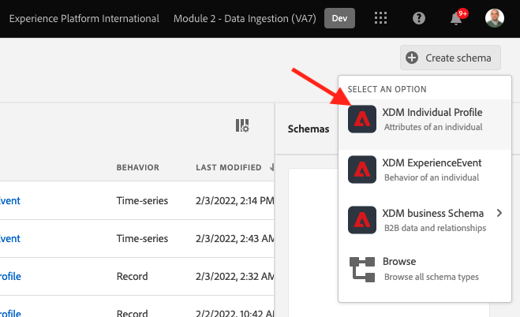
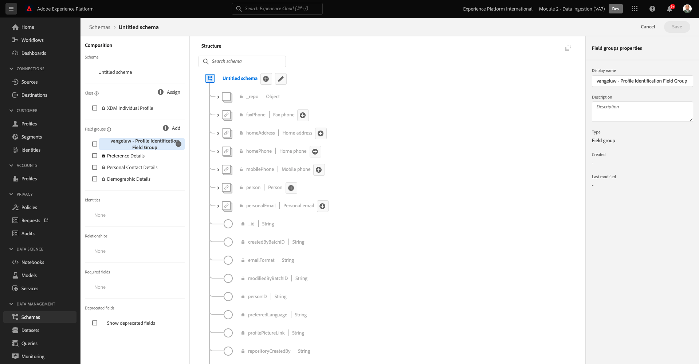
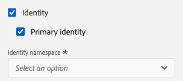

# 2.2配置架构和设置标识符

在本练习中，您将配置所需的XDM架构，以对用户档案信息和客户行为进行分类。 在每个XDM架构中，您还必须配置一个主标识符，以将所有信息链接到。

## Story

在您开始配置XDM架构并设置主标识符之前，我们需要考虑我们尝试执行的操作的业务上下文：

- 您需要数据
- 您希望将数据关联到客户
- 您希望构建累进的实时客户用户档案

我们要捕获以下两种类型的数据：

- 这位客户是谁？
- 此客户会怎么做？

但是，问题 **这位客户是谁？** 是一个非常开放的问题，有很多答案。 当您的公司想要看到此问题已回答时，您正在查找诸如名字、姓氏和地址等人口统计信息。 此外，还可获取电子邮件地址或手机号码等联系信息。 此外，还可以获取与语言、选择启用/选择禁用，甚至个人资料图片相关的信息。 最后，您真正需要了解的是，我们将如何在您公司使用的各种系统中识别此客户。

问题也是一样的 **此客户会怎么做？**&#x200B;的问题。这是一个很开放的问题，有很多答案。 当您的公司希望看到此问题已回答时，您需要查找客户与您的任何在线和离线资产进行的任何交互。 访问了哪些页面或产品？ 此客户是否将产品添加到购物车或购买了产品？ 使用了哪些设备和浏览器来浏览网站？ 此客户需要哪种信息？我们如何使用这些信息来配置此客户并提供令人愉快的体验？ 最后，我们真正需要了解的是，我们将如何在贵公司将使用的各种系统中识别此客户。

## 2.1.1 — 此客户是谁

捕获 **这位客户是谁？** 通过登录/注册页面为您的公司完成。

从模式的角度，我们将此视为 **类**. 问题是： **这位客户是谁？** 是我们在类里定义的 **[!UICONTROL XDM个人配置文件]**.

因此，当您创建XDM架构以捕获 **这位客户是谁？**&#x200B;首先，您需要创建并定义1个引用类的架构 **[!UICONTROL XDM个人配置文件]**.

要指定可以给出该问题的答案类型，您需要定义 [!UICONTROL 字段组]. [!UICONTROL 字段组] 是配置文件类的扩展，具有非常特定的配置。 例如，诸如名字、姓氏、性别和生日等人口统计信息是 [!UICONTROL 字段组]: **[!UICONTROL 人口统计详细信息]**.

其次，您的公司需要决定如何识别此客户。 对于您的公司，已知客户的主要标识符可能是特定的客户ID，例如电子邮件地址。 但从技术上讲，还有其他方法可以识别您公司的客户，如使用手机号码。
在本实验中，我们将将电子邮件地址定义为主标识符，将电话号码定义为次标识符。

最后，区分捕获数据的渠道很重要。 在这种情况下，我们将讨论“网站注册”，需要定义的架构需要反映 **where** 已捕获注册数据。 渠道还将在影响捕获的数据方面发挥重要作用。 因此，最好为所收集的渠道、主要标识符和数据类型的每个组合定义架构。

基于上述，您将需要在Adobe Experience Platform中配置架构。

通过转到以下URL登录Adobe Experience Platform: [https://experience.adobe.com/platform](https://experience.adobe.com/platform).

登录后，您将登陆Adobe Experience Platform的主页。

在继续之前，您需要选择 **沙盒**. 要选择的沙盒已命名 ``--module2sandbox--``. 您可以通过单击 **[!UICONTROL 生产产品]** 的蓝线。 选择相应的沙盒后，您将看到屏幕发生更改，现在您就位于专用沙盒中。

在Adobe Experience Platform中，单击 **[!UICONTROL 模式]** 菜单。 您将看到可用列表 [!UICONTROL 模式].

您应该创建新架构。 要创建新架构，请单击按钮 **[!UICONTROL +创建架构]** 选择 **[!UICONTROL XDM个人配置文件]**.

单击 **[!UICONTROL +创建架构]** 按钮，此时将创建一个新架构，系统将提示您选择或创建 **字段组**.

现在，您需要定义对问题的答案 **这位客户是谁？** 应该是这样。
在本实验的介绍中，我们注意到需要以下属性来定义客户：

- 名字、姓氏和地址等人口统计信息
- 联系信息，如家庭地址、电子邮件地址或手机号码
- 与语言、选择启用/选择禁用甚至个人资料图片链接的其他信息。
- 客户的主要标识符

要将该信息纳入您的架构，您需要添加以下内容 [!UICONTROL 字段组] 到您的架构：

- 人口统计详细信息（人口统计信息）
- 个人联系详细信息（联系信息）
- 首选项详细信息（其他信息）
- 您公司的自定义用户档案标识字段组（主要和次要标识符）

在 **[!UICONTROL 添加字段组]** 屏幕，选择 [!UICONTROL 字段组] **[!UICONTROL 人口统计详细信息]**, **[!UICONTROL 个人联系详细信息]** 和 **[!UICONTROL 首选项详细信息]**.

单击 **[!UICONTROL 添加字段组]** 按钮以添加 [!UICONTROL 字段组] 到您的架构。

您现在将拥有：

接下来，您需要一个 [!UICONTROL 字段组] 以捕获 **[!UICONTROL 标识符]** 用于数据收集。 正如您在上一个练习中所看到的，主标识符和次标识符是一个概念。 主要标识符是最重要的标识符，因为所有收集的数据都将链接到此标识符。

您现在将创建自己的自定义 [!UICONTROL 字段组] 因此，您会将 [!UICONTROL XDM架构] 以满足您自己公司的要求。

单击 **[!UICONTROL +添加]** 按钮开始添加 [!UICONTROL 字段组].

而不是重用现有 [!UICONTROL 字段组]，您现在将创建自己的 [!UICONTROL 字段组]. 您可以通过选择 **[!UICONTROL 新建字段组]**.

您现在需要提供 **[!UICONTROL 显示名称]** 和 **[!UICONTROL 描述]** 新 [!UICONTROL 字段组].

作为架构的名称，我们将使用：
`--demoProfileLdap-- - Profile Identification Field Group`

例如，对于ldap **[!UICONTROL 万热卢]**，此应为架构的名称：

**[!UICONTROL vangeluw — 配置文件标识字段组]**

这应该会给你这样的东西：

单击 **[!UICONTROL 添加字段组]** 按钮以添加新创建的 [!UICONTROL 字段组] 到您的架构。

此时，您应该拥有此架构结构。

您的新 [!UICONTROL 字段组] 仍为空，因此现在您必须向其添加字段 [!UICONTROL 字段组].
在 [!UICONTROL 字段组]-list，单击您的自定义 [!UICONTROL 字段组].

现在，您会看到许多新按钮。

在架构的顶级，单击 **[!UICONTROL +添加字段]** 按钮。

单击 **[!UICONTROL +添加字段]** 按钮，您现在会看到新的 **[!UICONTROL 对象]** 在您的架构中。 此对象表示自定义 **[!UICONTROL 对象]** ，以Adobe Experience Platform租户ID命名。 您的Adobe Experience Platform租户ID为 `--aepTenantId--`.

您现在将在该租户下添加新对象。 要实现此目的，请单击 **[!UICONTROL 新建字段]** 在tenant-object下。

使用以下对象定义：

- 字段名称： **[!UICONTROL 识别]**
- 显示名称：  **[!UICONTROL 识别]**
- 类型： **[!UICONTROL 对象]**

单击 **[!UICONTROL 应用]** 以保存更改。

单击 **[!UICONTROL 应用]**&#x200B;现在，您将看到 **[!UICONTROL 识别]** 对象。

您现在将在  **[!UICONTROL 识别]** 对象：

- ecid:
   - 字段名称： **[!UICONTROL ecid]**
   - 显示名称：  **[!UICONTROL ecid]**
   - 类型：**[!UICONTROL 字符串]**

- emailId
   - 字段名称： **[!UICONTROL emailId]**
   - 显示名称：  **[!UICONTROL emailId]**
   - 类型：**[!UICONTROL 字符串]**

- mobilenr
   - 字段名称： **[!UICONTROL mobilenr]**
   - 显示名称：  **[!UICONTROL mobilenr]**
   - 类型：**[!UICONTROL 字符串]**

每个字段都将定义为类型 **[!UICONTROL 字符串]** 我们将这些字段配置为 **[!UICONTROL 标识]**. 对于架构 **[!UICONTROL 网站注册架构]**，我们假定客户始终通过其电子邮件地址进行标识，这意味着您必须配置字段 **[!UICONTROL emailId]** as a **[!UICONTROL 主要]** 标识符，而其他字段则作为 **[!UICONTROL 辅助]** 标识符。

要添加字段，请单击 **[!UICONTROL +]** 按钮 **[!UICONTROL 识别]** 对象。

现在，您有一个空字段。 您需要按照指示配置上述3个字段。

这是每个字段在初始字段配置后的外观。

单击 **[!UICONTROL +]** 按钮 **[!UICONTROL 识别]** 对象来创建新字段并按指示填写字段。

- ecid

要保存字段，请在 **[!UICONTROL 字段属性]** 直到你看到按钮 **[!UICONTROL 应用]**. 单击 **[!UICONTROL 应用]** 按钮。

单击 **[!UICONTROL +]** 按钮 **[!UICONTROL 识别]** 对象来创建新字段并按指示填写字段。

- emailId

要保存字段，请在 **[!UICONTROL 字段属性]** 直到你看到按钮 **[!UICONTROL 应用]**. 单击 **[!UICONTROL 应用]** 按钮。

单击 **[!UICONTROL +]** 按钮 **[!UICONTROL 识别]** 对象来创建新字段并按指示填写字段。

- mobilenr

要保存字段，请在 **[!UICONTROL 字段属性]** 直到你看到按钮 **[!UICONTROL 应用]**. 单击 **[!UICONTROL 应用]** 按钮。

您现在有3个字段，但这些字段尚未定义为 **[!UICONTROL 身份]** — 字段。

要开始将这些字段定义为 **[!UICONTROL 身份]**-fields，请执行以下步骤：

- 选择字段 **[!UICONTROL emailId]**.
- 在右侧的字段属性中，向下滚动直到您看到 **[!UICONTROL 身份]**. 选中复选框 **[!UICONTROL 身份]**.

   

- 现在，选中复选框 **[!UICONTROL 主标识]**.

   

- 最后，选择命名空间 **[!UICONTROL 电子邮件]** 从 **[!UICONTROL 命名空间]**. Adobe Experience Platform中的身份图使用命名空间来对命名空间中的标识符进行分类，并定义这些命名空间之间的关系。

   

- 最后，单击 **[!UICONTROL 应用]** 以保存更改。

   

接下来，您必须为 **[!UICONTROL ecid]** 和 **[!UICONTROL mobilenr]** 作为辅助标识符。

- 选择字段 **[!UICONTROL ecid]**.
- 在右侧的字段属性中，向下滚动直到您看到 **[!UICONTROL 身份]**. 选中复选框 **[!UICONTROL 身份]**.

   

- 接下来，选择命名空间 **[!UICONTROL ECID]** 从 **[!UICONTROL 命名空间]**. A [!UICONTROL 命名空间] Adobe Experience Platform中的身份图用于对命名空间中的标识符进行分类，并定义这些命名空间之间的关系。

   

- 单击 **[!UICONTROL 应用]** 以保存更改。

   

- 选择字段 **[!UICONTROL mobilenr]**.
- 在右侧的字段属性中，向下滚动直到您看到 **[!UICONTROL 身份]**. 选中复选框 **[!UICONTROL 身份]**.

   

- 确保选择命名空间 **[!UICONTROL 电话]** 从 **[!UICONTROL 命名空间]**. Adobe Experience Platform中的身份图使用命名空间来对命名空间中的标识符进行分类，并定义这些命名空间之间的关系。

   

- 单击 **[!UICONTROL 应用]** 以保存更改。

   

的 **[!UICONTROL 识别]** 对象现在应该如下所示，其中3个id字段现在还显示 **[!UICONTROL 指纹]** 图标，以显示它们已定义为标识符。

现在，让我们为您的架构命名。 选择字段 **无标题架构**.

作为我们架构的名称，您将使用：

`--demoProfileLdap-- - Demo System - Profile Schema for Website`

替换 **[!UICONTROL ldap]** 的URL。 例如，对于ldap **[!UICONTROL 万热卢]**，此应为架构的名称：

**[!UICONTROL vangeluw — 演示系统 — 网站的用户档案模式]**

这应该会给你这样的东西：

您现在已定义架构，并已关联现有架构和新创建的架构 [!UICONTROL 字段组] 和已定义标识符。

单击 **[!UICONTROL 保存]** 以保存更改。

在此，最后一项操作是激活要链接到的架构 **[!UICONTROL 用户档案]**.
通过启用架构以获取用户档案，您可以确保根据此架构发送到Adobe Experience Platform的所有数据都将包含在实时客户用户档案环境中，这可确保所有数据都可以实时用于查询、分段和激活。

为此，我们选择架构的名称。

在架构的右侧选项卡中，您将看到 **[!UICONTROL 配置文件切换]**，当前已停用。

激活 [!UICONTROL 用户档案]  — 通过单击进行切换。

您将看到以下消息：

单击 **[!UICONTROL 启用]** 为用户档案启用此架构。

您的架构现已配置为 [!UICONTROL 实时客户资料].

最后，单击 **[!UICONTROL 保存]** 以保存您的架构。

### 2.1.2 — 此客户有何用途

捕捉问题的答案 **此客户会怎么做？** 例如，通过产品页面上的产品查看，完成对贵公司的访问。

从模式角度，我们将此视为 **[!UICONTROL 类]**. 问题是： **此客户会怎么做？** 是我们在课堂上定义的 **[!UICONTROL ExperienceEvent]**.

因此，当您创建 [!UICONTROL XDM架构] 以捕获 **此客户会怎么做？**&#x200B;首先，您需要创建并定义1个引用类的架构 **[!UICONTROL ExperienceEvent]**.

要指定可以给出该问题的答案类型，您需要定义 [!UICONTROL 字段组]. [!UICONTROL 字段组] 是的扩展 [!UICONTROL ExperienceEvent]类，且具有非常特定的配置。 例如，有关客户查看或添加到购物车中的产品类型的信息包含在 [!UICONTROL 字段组] **商务详细信息**.

其次，您的公司需要决定如何识别此客户的行为。 由于我们讨论的是网站上的交互，因此您的公司可能了解客户，但同样可能的是，一个未知的匿名访客在网站上处于活动状态。 因此，我们无法使用诸如电子邮件地址之类的标识符。 在这种情况下，您的公司可能会决定使用 [!UICONTROL Experience CloudID(ECID)] 作为主标识符。

最后，区分捕获数据的渠道很重要。 在本例中，我们将讨论网站交互，需要定义的架构需要反映 **where** 已捕获交互数据。 渠道还将在影响捕获的数据方面发挥重要作用。 因此，最好为所收集的渠道、主要标识符和数据类型的每个组合定义架构。

基于上述，您将需要在Adobe Experience Platform中配置架构。

登录后，您将登陆Adobe Experience Platform的主页。

在继续之前，您需要选择 **[!UICONTROL 沙盒]**. 的 [!UICONTROL 沙盒] 选择的名称 ``--module2sandbox--``. 您可以通过单击 **[!UICONTROL 生产产品]** 的蓝线。 选择相应的沙盒后，您将看到屏幕发生更改，现在您就位于专用沙盒中。

在Adobe Experience Platform中，单击 **[!UICONTROL 模式]** 菜单。

在 [!UICONTROL 模式]，您将看到所有现有架构。

您应该创建新架构。 要创建新架构，请单击按钮 **[!UICONTROL +创建架构]** 选择 **[!UICONTROL XDM ExperienceEvent]**.

单击 **[!UICONTROL +创建架构]** 按钮，此时将创建一个新架构，系统将提示您选择或创建 **字段组**.

现在，您需要定义对问题的答案 **此客户会怎么做？** 应该是这样。
在本实验的介绍中，我们注意到需要以下属性来定义客户的操作：

- 访问了哪些页面或产品？
- 此客户是否将产品添加到购物车或购买了产品？
- 使用了哪些设备和浏览器来浏览网站？
- 此客户需要哪种信息？我们如何使用这些信息来配置此客户并提供令人愉快的体验？
- 客户的主要标识符

要将该信息纳入您的架构，您需要添加以下内容 [!UICONTROL 字段组] 到您的架构：

- Web详细信息
- 商务详细信息
- 环境详细信息
- 您公司的自定义用户档案标识 [!UICONTROL 字段组] （主标识符和次标识符）

在 **[!UICONTROL 添加字段组]** 屏幕，选择 [!UICONTROL 字段组] **[!UICONTROL Web详细信息]**, **[!UICONTROL 商务详细信息]** 和 **[!UICONTROL 环境详细信息]**.

单击 **[!UICONTROL 添加字段组]** 按钮将字段组添加到架构中。

然后，您将拥有：

接下来，您需要创建一个 [!UICONTROL 字段组] 以捕获 **[!UICONTROL 标识符]** 用于数据收集。 正如您在上一个练习中所看到的，主标识符和次标识符是一个概念。 主要标识符是最重要的标识符，因为所有收集的数据都将链接到此标识符。

您现在将创建自己的自定义 [!UICONTROL 字段组] 因此，您会将 [!UICONTROL XDM架构] 以满足您自己公司的要求。

A [!UICONTROL 字段组] 链接到 [!UICONTROL 类]，这表示您不能简单地重复使用之前创建的 [!UICONTROL 字段组].

单击 **[!UICONTROL +添加]** 按钮开始添加 [!UICONTROL 字段组].

而不是重用现有 [!UICONTROL 字段组]，您现在将创建自己的 [!UICONTROL 字段组]. 您可以通过选择 **[!UICONTROL 新建字段组]**.

您现在需要提供 **[!UICONTROL 显示名称]** 和 **[!UICONTROL 描述]** 为新字段组。

作为字段组的名称，请使用以下代码：

`--demoProfileLdap-- - ExperienceEvent Identification Field Group`

例如，对于ldap **[!UICONTROL 万热卢]**，此应为架构的名称：

**[!UICONTROL vangeluw — 体验事件标识字段组]**

这应该会给你这样的东西：

单击 **[!UICONTROL 添加字段组]** 按钮以添加新创建的 [!UICONTROL 字段组] 到您的架构。

您现在应该拥有此 [!UICONTROL 架构] 结构就位。

您的新 [!UICONTROL 字段组] 仍为空，因此现在您必须向该字段组添加字段。
在 [!UICONTROL 字段组]-list，单击您的自定义 [!UICONTROL 字段组].

现在，您会看到许多新按钮。

在架构的顶级中，在架构 — 名称旁边，单击 **[!UICONTROL +]** 按钮。

单击 **[!UICONTROL +]** 按钮，您现在会看到新的 **[!UICONTROL 对象]** 在您的架构中。 此对象表示自定义 **[!UICONTROL 对象]** 在 [!UICONTROL 架构] 和以您的Adobe Experience Platform租户ID命名。 您的Adobe Experience Platform租户ID为 `--aepTenantId--`.

您现在将在该租户下添加新对象。 要实现此目的，请单击 **[!UICONTROL 新建字段]** 在tenant-object下。

使用以下对象定义：

- 字段名称： **[!UICONTROL 识别]**
- 显示名称：  **[!UICONTROL 识别]**
- 类型： **[!UICONTROL 对象]**

向下滚动并单击 **[!UICONTROL 应用]** 以保存更改。

单击 **[!UICONTROL 应用]**&#x200B;现在，您将看到 **[!UICONTROL 识别]** 对象。

您现在将在  **[!UICONTROL 识别]** 对象。

单击 **[!UICONTROL +]** 按钮 **[!UICONTROL 识别]** 用于创建新字段的对象。

ECID字段将定义为类型 **[!UICONTROL 字符串]** 然后，您将该字段配置为 **[!UICONTROL 身份]**. 对于架构 **[!UICONTROL 演示系统 — 网站的事件模式]**，我们假定客户始终由其 [!UICONTROL ECID]，这表示您必须配置字段 **[!UICONTROL ECID]** as a **主要** 标识符

现在，您有一个空字段。 您需要按照所示配置上述字段。

- ecid:

   - 字段名称： **[!UICONTROL ecid]**
   - 显示名称：  **[!UICONTROL ecid]**
   - 类型：**[!UICONTROL 字符串]**

这就是 [!UICONTROL ecid]-field应该考虑初始字段配置：

向下滚动并单击 **[!UICONTROL 应用]**.

您现在有一个新字段，但该字段尚未定义为 **[!UICONTROL 身份]** — 字段。

要开始将这些字段定义为 **[!UICONTROL 身份]**-fields，请执行以下步骤：

- 选择字段 **[!UICONTROL ecid]**.
- 在右侧的字段属性中，向下滚动直到您看到 **[!UICONTROL 身份]**. 选中复选框 **[!UICONTROL 身份]**.

- 现在，选中复选框 **[!UICONTROL 主标识]**.

- 最后，选择命名空间 **[!UICONTROL ECID]** 从 **[!UICONTROL 命名空间]**. A [!UICONTROL 命名空间] 的 [!UICONTROL 身份图] 在Adobe Experience Platform中，对命名空间中的标识符进行分类，并定义这些命名空间之间的关系。

   

- 最后，单击 **[!UICONTROL 应用]** 以保存更改。

   

的 **[!UICONTROL 识别]** 对象现在应该如下所示，其中ecid-field现在还显示 **指纹** 图标，以显示它们已定义为标识符。

现在，让我们为您的架构命名。 选择字段 **无标题架构**.

作为架构的名称，我们将使用：
`--demoProfileLdap-- - Demo System - Event Schema for Website`

例如，对于ldap **[!UICONTROL 万热卢]**，此应为架构的名称：

**[!UICONTROL vangeluw — 演示系统 — 网站事件模式]**

这应该会给你这样的东西：

单击 **[!UICONTROL 保存]** 以保存更改。

请务必注意，最终根据此模式摄取数据时，需要填写一些字段。
例如， **[!UICONTROL _id]** 和 **[!UICONTROL timestamp]** 是必填字段。

- 特定数据摄取需要包含唯一id(_I)
- 时间戳需要是此点击的时间戳，格式为 **[!UICONTROL &quot;YYYY-MM-DDTHH:MM:SSSZ”]**，例如： **[!UICONTROL &quot;2019-04-08T07&quot;:20:000Z”]**

您现在已定义一个架构，并已关联现有架构和新创建的架构 [!UICONTROL 字段组] 和已定义标识符。

在此，最后一项操作是激活要链接到的架构 **[!UICONTROL 用户档案]**.
通过为 [!UICONTROL 用户档案]，您将确保根据此架构发送到Adobe Experience Platform的所有数据都将包含在实时客户资料中，从而确保所有数据都可以实时用于查询、分段和激活。

为此，我们选择架构的名称。

在架构的右侧选项卡中，您将看到 **[!UICONTROL 用户档案] 切换**，当前已停用。

激活 [!UICONTROL 用户档案]  — 通过单击进行切换。

您将看到以下消息：

单击 **[!UICONTROL 启用]** 为用户档案启用此架构。

您的架构现已配置为包含在实时客户资料中。

最后，单击 **[!UICONTROL 保存]** 以保存您的架构。

您现在已完成构建架构，这些架构已激活以用于实时客户资料。

让我们在下一个练习中查看数据集。

下一步： [2.3配置数据集](./ex3.md)

[返回到模块2](./data-ingestion.md)

[返回到所有模块](../../overview.md)
