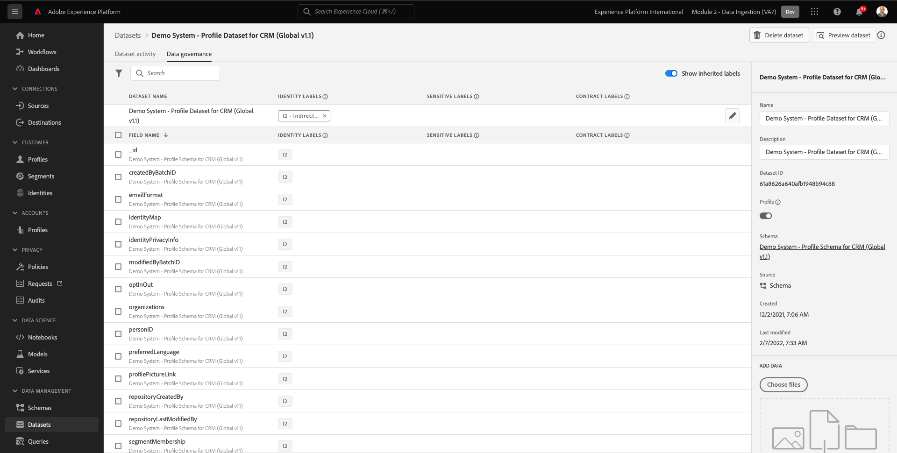

# 2.4从离线源摄取数据

在本练习中，目标是在平台中载入外部数据，如CRM数据。

## 学习目标

- 了解如何生成测试数据
- 了解如何摄取CSV
- 了解如何使用Web UI通过工作流进行数据摄取
- 了解Experience Platform的数据管理功能

## 资源

- 模仿UI: [https://www.mockaroo.com/](https://www.mockaroo.com/)
- Experience PlatformUI: [https://experience.adobe.com/platform/](https://experience.adobe.com/platform/)

## 任务

- 创建具有演示日期的CSV文件。 利用可用的工作流，在Adobe Experience Platform中摄取CSV文件。
- 了解Adobe Experience Platform中的数据管理选项

## 2.4.1通过数据生成器工具创建CRM数据集

为此，您需要1000行CRM数据示例。

通过转到 [https://www.mockaroo.com/12674210](https://www.mockaroo.com/12674210).

在模板上，您会注意到以下字段：

- id
- first_name
- last_name
- 电子邮件
- 性别
- birthDate
- home_latitude
- home_longitude
- country_code
- city
- 国家

所有这些字段都已定义为生成与Platform兼容的数据。

要生成CSV文件，请单击 **[!UICONTROL 下载数据]** 按钮，以向您提供一个包含1000行演示数据的CSV文件。

在Microsoft Excel中打开CSV文件以可视化其内容。

在CSV文件就绪后，您可以继续针对XDM映射它。

### 2.4.2在Adobe Experience Platform中验证CRM载入数据集

打开 [Adobe Experience Platform](https://experience.adobe.com/platform) 然后转到 **[!UICONTROL 数据集]**.

在继续之前，您需要选择 **[!UICONTROL 沙盒]**. 要选择的沙盒已命名 ``--module2sandbox--``. 您可以通过单击 **[!UICONTROL 生产产品]** 的蓝线。 选择相应的 [!UICONTROL 沙盒]，您将看到屏幕更改，现在，您已加入您的专述 [!UICONTROL 沙盒].

在Adobe Experience Platform中，单击 **[!UICONTROL 数据集]** 菜单。

您将使用基于此启用的共享数据集。 已创建共享数据集，该数据集名为 **[!UICONTROL 演示系统 — CRM的配置文件数据集（全局v1.1）]**.

打开数据集 **[!UICONTROL 演示系统 — CRM的配置文件数据集（全局v1.1）]**.

在“概述”屏幕上，您可以看到3个主要信息。

首先， [!UICONTROL 数据集活动] 功能板显示数据集中CRM记录总数以及摄取的批次及其状态

其次，通过在页面上向下滚动，可以检查摄取了多批数据，载入了多少条记录，以及是否成功载入了批记录。 的 **[!UICONTROL 批处理ID]** 是特定批处理作业的标识符， **[!UICONTROL 批处理ID]** 非常重要，因为它可用于排除特定批次未成功载入的原因。

最后， [!UICONTROL 数据集信息] 选项卡显示 [!UICONTROL 数据集ID] （同样，从疑难解答的角度来看，也很重要）、数据集的名称以及数据集是否已为配置文件启用。

此处最重要的设置是数据集与架构之间的链接。 架构定义可摄取的数据以及该数据的外观。

在本例中，我们使用 **[!UICONTROL 演示系统 — CRM的配置文件架构（全局v1.1）]**，针对的类映射 **[!UICONTROL 用户档案]** 和已实施扩展，也称为字段组。

通过单击架构的名称，您将转到 [!UICONTROL 架构] 概述：您可以看到为此架构激活的所有字段。

每个架构都需要定义一个自定义的主描述符。 对于CRM数据集，架构已定义字段 **[!UICONTROL crmId]** 应为主标识符。 如果要创建架构并将其链接到 [!UICONTROL 实时客户资料]，您需要定义自定义 [!UICONTROL 字段组] 指主描述符。

在以上屏幕截图中，您可以看到我们的描述符位于 `--aepTenantId--.identification.core.crmId`，设置为 [!UICONTROL 主标识符]，链接到 [!UICONTROL 命名空间] of **[!UICONTROL 演示系统 — CRMID]**.

应在 [!UICONTROL 实时客户资料] 应该有一个 [!UICONTROL 主要标识符]. 此 [!UICONTROL 主标识符] 是该数据集中客户的品牌标识符用户。 对于CRM数据集，它可能是电子邮件地址或CRM ID，对于呼叫中心数据集，它可能是客户的移动电话号码。

最佳做法是为每个数据集创建一个单独的特定架构，并为每个数据集设置描述符，以专门匹配品牌使用的当前解决方案的运行方式。

### 2.4.3使用工作流将CSV文件映射到XDM模式

其目标是在平台中载入CRM数据。 在平台中摄取的所有数据都应映射到特定的XDM架构。 您当前拥有的是一个CSV数据集，其中一侧包含1000行，另一侧包含链接到架构的数据集。 要在该数据集中加载该CSV文件，需要进行映射。 为了促进此映射练习，我们 **[!UICONTROL 工作流]** 在Adobe Experience Platform中提供。

的 [!UICONTROL 工作流] 我们用的，是 [!UICONTROL 工作流] 已命名 **[!UICONTROL 将CSV映射到XDM架构]** 在 [!UICONTROL 数据摄取] 菜单。

单击 **[!UICONTROL 将CSV映射到XDM架构]** 按钮。 单击 **[!UICONTROL Launch]** 以启动该过程。

在下一个屏幕中，您需要选择一个数据集以将文件摄取到中。 您可以选择选择现有数据集，也可以选择创建新数据集。 在本练习中，我们将重复使用现有的一个：请选择 **[!UICONTROL 演示系统 — CRM的配置文件数据集（全局v1.1）]** 如下所示，并将其他设置保留为默认设置。

单击 **[!UICONTROL 下一个]** 来执行下一步。

拖放CSV文件或单击 **[!UICONTROL 浏览]** ，然后在计算机上导航到桌面，然后选择CSV文件。

选择CSV文件后，将立即上传该文件，您将在几秒内看到文件预览。

单击 **[!UICONTROL 下一个]** 来执行下一步。 文件完全处理可能需要几秒钟的时间。

现在，您需要在 **[!UICONTROL 演示系统 — CRM的配置文件数据集]**.

Adobe Experience Platform已经为你提出了一些建议，试图把 [!UICONTROL 源属性] 和 [!UICONTROL 目标架构字段].

对于 [!UICONTROL 架构映射],Adobe Experience Platform已尝试将字段链接在一起。 但是，并非所有的测绘建议都是正确的。 您现在需要 **接受目标字段** 一一。

#### birthDate

源架构字段 **birthDate** 应链接到目标字段 **person.birthDate**.

#### 城市

源架构字段 **城市** 应链接到目标字段 **homeAddress.city**.

#### 国家

源架构字段 **国家** 应链接到目标字段 **homeAddress.country**.

#### country_code

源架构字段 **country_code** 应链接到目标字段 **homeAddress.countryCode**.

#### 电子邮件

源架构字段 **电子邮件** 应链接到目标字段 **personalEmail.address**.

#### crmid

“源架构”字段** crmid**应链接到目标字段 **`--aepTenantId--`.identification.core.crmId**.

#### first_name

源架构字段 **first_name** 应链接到目标字段 **person.name.firstName**.

#### 性别

源架构字段 **性别** 应链接到目标字段 **person.gender**.

#### home_latitude

源架构字段 **home_latitude** 应链接到目标字段 **homeAddress。_schema.latitude**.

#### home_longitude

源架构字段 **home_longitude** 应链接到目标字段 **homeAddress。_schema.longitude**.

#### id

源架构字段 **id** 应链接到目标字段 **_id**.

#### last_name

源架构字段 **last_name** 应链接到目标字段 **person.name.lastName**.

您现在应该具有：

单击 **[!UICONTROL 完成]** 按钮以完成工作流。

单击 **[!UICONTROL 完成]**，然后您将看到 **数据流** 概述，几分钟后，您可以刷新屏幕，以查看工作流是否成功完成。 单击 **Target数据集名称**.

然后，您将看到已处理摄取的数据集。

在数据集上，您将看到 [!UICONTROL 批处理ID] 现在已摄取了1000条记录，并且状态为 **[!UICONTROL 成功]**.

单击 **[!UICONTROL 预览数据集]** — 按钮，以快速查看数据集的小样本，以确保加载的数据正确无误。

加载数据后，您可以为数据集定义正确的数据管理方法。

### 2.5.4向数据集添加数据管理

现在，您已摄取客户数据，因此需要确保此数据集受到正确管理以用于使用和导出控制。 单击 **[!UICONTROL 数据管理]** 选项卡，并注意您可以设置三种类型的限制：合同数据、身份数据和敏感数据。

您可以找到有关不同标签的更多信息以及将来如何通过此链接上的策略框架强制执行这些标签： [https://www.adobe.io/apis/experienceplatform/home/dule/duleservices.html](https://www.adobe.io/apis/experienceplatform/home/dule/duleservices.html)

让我们限制整个数据集的身份数据。 将鼠标悬停在数据集名称上，然后单击“铅笔”图标以编辑设置。

转到 **[!UICONTROL 身份数据]** 你会看到 **[!UICONTROL I2]** 选项 — 这将假定此数据集中的所有信息都至少可以间接识别给人员。

单击 **[!UICONTROL 保存更改]** 并观察 **[!UICONTROL I2]** 现在已为数据集中的所有数据字段设置。

您还可以为各个数据字段设置这些标记 — 例如， **[!UICONTROL firstName]** 字段可能会被分类为 **[!UICONTROL I1]** 级别，以了解直接可识别信息。

选择字段 **[!UICONTROL firstName]** 选中复选框并单击 **[!UICONTROL 编辑管理标签]** 的上角。

转到 **[!UICONTROL 身份数据]** 你会看到 **[!UICONTROL I2]** 选项（继承自数据集）。 字段firstName还具有字段特定的配置，并设置为 **[!UICONTROL I1 — 直接可识别数据]**.

借助此功能，您现在已在Adobe Experience Platform中成功摄取和分类CRM数据。

下一步： [2.5数据登陆区](./ex5.md)

[返回到模块2](./data-ingestion.md)

[返回到所有模块](../../overview.md)
