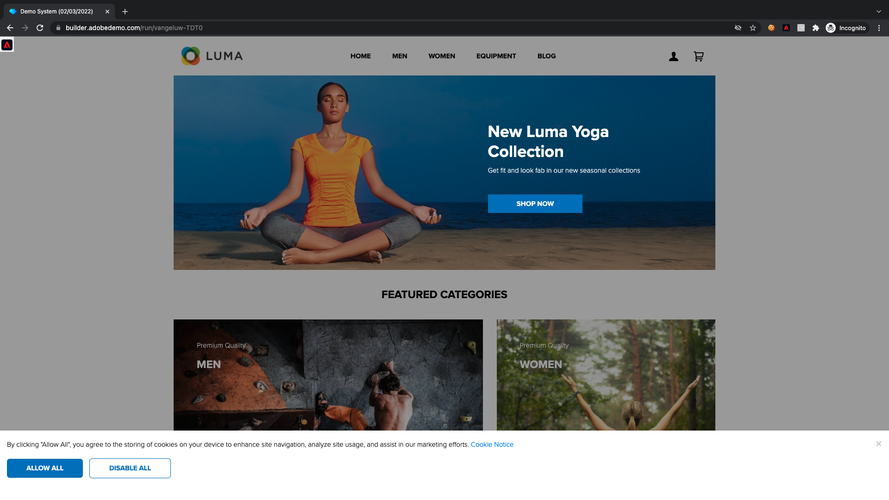
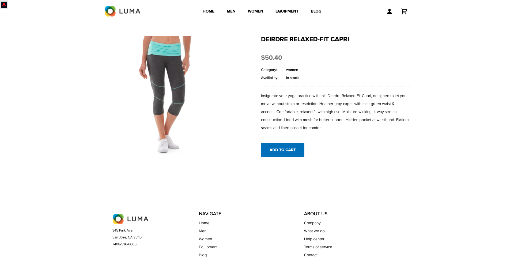

# 3.1从网站上的未知到已知

## 上下文

从未知到已知的历程是当今品牌中最重要的主题之一，从客户获取到客户维系的历程也是如此。

Adobe Experience Platform在这个历程中扮演着重要角色。 平台是沟通的大脑，“经验记录系统”。

平台是一个环境，在该环境中，客户一词比已知客户更广。 从Platform的角度来看，网站上的未知访客也是客户，因此，作为未知访客的所有行为也会发送到Platform。 多亏了这种方法，当这位访客最终成为已知客户时，品牌也可以直观地显示此刻之前发生的情况。 这有助于从归因和体验优化的角度进行分析。

## 客户历程流程

转到 [https://builder.adobedemo.com/projects](https://builder.adobedemo.com/projects). 使用Adobe ID登录后，您将看到此内容。 单击您的网站项目以将其打开。

在 **Screens** 页面，单击 **运行**.

然后，您将看到您的演示网站已打开。 选择URL并将其复制到剪贴板。

打开新的隐身浏览器窗口。

粘贴您在上一步中复制的演示网站的URL。 然后，系统将要求您使用Adobe ID登录。

选择您的帐户类型并完成登录过程。

然后，您将在无痕浏览器窗口中看到您的网站已加载。 对于每个演示，您需要使用全新的、隐身的浏览器窗口来加载演示网站URL。

单击屏幕左上角的Adobe徽标图标以打开“配置文件查看器”。

查看“配置文件查看器”面板和“实时客户配置文件”，其中 **Experience CloudID** 作为此当前未知客户的主要标识符。

您还可以查看根据客户行为收集的所有体验事件。 列表当前为空，但很快会发生更改。

转到 **男** 产品类别。 接下来，单击产品 **蒙大拿风衣**.

然后，您将看到产品详细信息页面。 类型的体验事件 **产品查看** 现已使用您在模块1中查看的Web SDK实施发送到Adobe Experience Platform。

打开“配置查看器”面板，并查看 **体验事件**.

返回到 **女性** 类别页面，然后单击其他产品。 另一个体验事件已发送到Adobe Experience Platform。

打开“配置文件查看器”面板。 您现在将看到2个类型的体验事件 **产品查看**. 虽然行为是匿名的，但我们能够跟踪每次点击，并将其存储在Adobe Experience Platform中。 一旦匿名客户知晓，我们便能够自动将所有匿名行为与已知用户档案合并。

转到注册/登录页面。 单击 **创建帐户**.

填写详细信息并单击 **注册** 之后，您将被重定向到上一页。

打开“配置文件查看器”面板，然后转到“实时客户配置文件”。 在“配置文件查看器”面板上，您应会看到显示的所有个人数据，如新添加的电子邮件和电话标识符。

在“配置文件查看器”面板上，转到体验事件。 您将在“配置文件查看器”面板上看到之前查看过的2个产品。 这两个事件现在都已关联到您的“已知”用户档案。

您现在已将数据摄取到Adobe Experience Platform，并且已将该数据关联到ECID和电子邮件地址等标识符。 其目标是了解您将要执行的操作的业务环境。 在下一个练习中，您将开始配置实现所有数据摄取所需的所有功能。

### 导航移动设备应用程序

成为已知客户后，便可开始使用移动设备应用程序。 在iPhone上打开移动设备应用程序，然后登录到该应用程序。

如果您尚未安装该应用程序，或者如果您无法记住如何安装该应用程序，请在此处查看： [0.5使用移动设备应用程序](../module0/ex5.md)

按照说明安装应用程序后，您将看到加载了Luma品牌的应用程序的登陆页面。 单击屏幕左上角的帐户图标。

在“登录”屏幕上，使用您在桌面网站上使用的电子邮件地址登录。 单击&#x200B;**登录**。

转到应用程序的主屏幕，然后单击以打开任何产品。

然后，您将看到产品详细信息页面。

转到应用程序的主屏幕，然后在屏幕上向左轻扫以查看“配置文件查看器”面板。 然后，您将在 **体验事件** ，以及之前网站会话中的所有产品查看。

现在，返回您的台式计算机并刷新主页，随后您将看到该产品也出现在该处。

您现在已将数据摄取到Adobe Experience Platform，并且已将该数据关联到ECID和电子邮件地址等标识符。 本练习的目的是了解您将要执行的操作的业务环境。 现在，您已经有效地构建了实时跨设备客户配置文件。 在下一个练习中，您将在Adobe Experience Platform中显示您的用户档案。

下一步： [3.2可视化您自己的实时客户用户档案 — UI](./ex2.md)

[返回到模块3](./real-time-customer-profile.md)

[返回到所有模块](../../overview.md)
