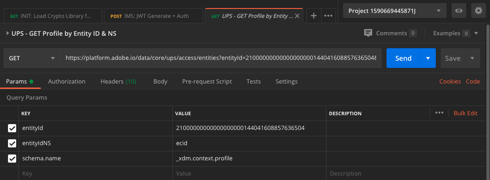

# 3.3可视化您自己的实时客户资料 — API

在本练习中，您将使用Postman和Adobe I/O查询Adobe Experience Platform的API，以查看您自己的实时客户资料。

## Story

在“实时客户资料”中，所有资料数据都与事件数据以及现有区段成员资格一起显示。 显示的数据可以从任何位置、Adobe应用程序和外部解决方案获取。 这是Adobe Experience Platform最有力的观点，是记录体验系统。

实时Adobe资料可供所有客户应用程序使用，也可供呼叫中心或商店内客户服务应用程序等外部解决方案使用。 实现此目的的方法是将这些外部解决方案连接到Adobe Experience Platform API。

## 3.3.1您的标识符

在网站的“配置文件查看器”面板上，您可以找到多个身份。 每个身份都链接到一个命名空间。


在X光面板上，我们可以看到4种不同的ID和命名空间组合：

| 标识 | 命名空间 |
|:-------------:| :---------------:|
| Experience Cloud ID (ECID) | 12507560687324495704459439363261812234 |
| 电子邮件ID | woutervangeluwe+06022022-01@gmail.com |
| 手机号码ID | +32473622044+06022022-01 |

请记住这些标识符以用于下一步。

记住这些ID后，转到Postman。

## 3.3.2设置Adobe I/O项目

在本练习中，您将会非常密集地使用Adobe I/O来查询Platform的API。 请按照以下步骤设置Adobe I/O。

转到 [https://developer.adobe.com/console/home](https://developer.adobe.com/console/home)


确保在屏幕的右上角选择正确的Adobe Experience Platform实例。 您的实例为 `--envName--`.


单击 **创建新项目**.

 或


选择 **+添加到项目** 选择 **API**.


然后您将看到：


单击 **Adobe Experience Platform** 图标。


单击 **Experience PlatformAPI**.


单击&#x200B;**下一步**。


现在，您可以选择让Adobe I/O生成您的安全密钥对，或上传现有密钥对。

选择 **选项1 — 生成键对**.


单击 **生成密钥对**.


你会看到旋转器30秒。


然后，您将看到此内容，并且生成的密钥对将下载为zip文件： **config.zip**.

解压缩文件 **config.zip** 在桌面上，您将看到它包含2个文件：


- **certificate_pub.crt** 是您的公钥证书。 从安全角度来看，这是免费用于设置与在线应用程序集成的证书。
- **private.key** 是您的私钥。 这永远不应该和任何人分享。 私钥是您用于对API实施进行身份验证的密钥，应为密钥。 如果您与任何人共享您的私钥，他们便可以访问您的实施，并滥用API将恶意数据摄取到平台中，并提取位于平台中的所有数据。


确保保存 **config.zip** 文件，因为您在后续步骤中以及将来访问Adobe I/O和Adobe Experience Platform API时都需要此文件。

单击&#x200B;**下一步**。


您现在必须选择 **产品配置文件** ，以便进行集成。

选择所需的产品配置文件。

**FYI**:在您的Adobe Experience Platform实例中，产品配置文件将具有不同的名称。 您需要至少选择一个具有适当访问权限的产品配置文件，这些权限在Adobe Admin Console中设置。


单击 **保存配置的API**.


你会看到旋转器几秒钟。


接下来，您将看到集成。


单击 **下载Postman版** 按钮，然后单击 **服务帐户(JWT)** 要下载Postman环境（等到下载环境，可能需要几秒钟）。


向下滚动直到您看到 **服务帐户(JWT)**，您可以在其中找到用于配置与Adobe Experience Platform集成的所有集成详细信息。


您的IO项目当前具有通用名称。 您需要为集成提供一个易记名称。 单击 **项目1** (或类似名称，如


单击 **编辑项目**.


输入集成的名称和描述。 作为命名规范，我们将使用 `AEP API --demoProfileLdap--`. 将ldap替换为ldap。
例如，如果ldap为vangeluw，则集成的名称和描述将变为AEP API vangeluw。

输入 `AEP API --demoProfileLdap--` 作为 **项目标题**. 单击&#x200B;**保存**。


您的Adobe I/O集成现已完成。


## 3.3.3Postman身份验证以Adobe I/O

转到 [https://www.getpostman.com/](https://www.getpostman.com/).

单击 **入门**.


接下来，下载并安装Postman。


安装Postman后，启动应用程序。

在Postman中，有2个概念：环境和收藏集。

- “环境”包含所有或多或少一致的环境变量。 在环境中，您会找到诸如我们平台环境的IMSOrg之类的内容，以及诸如您的私钥和其他内容之类的安全凭据。 在上一个练习中的Adobe I/O设置过程中下载的环境文件，其名称如下所示： **service.postman_environment.json**.

- 该集合包含许多可供使用的API请求。 我们将使用2个集合
   - 1个用于对AdobeI/0进行身份验证的集合
   - 1收集本模块中的练习
   - 1个集合，用于Real-Time CDP模块中的练习，用于目标创作

请下载文件 [postman.zip](../../assets/postman/postman_profile.zip) 到本地桌面。

在此 **postman.zip** 文件中，您将找到以下文件：

- `_Adobe I-O - Token.postman_collection.json`
- `_Adobe Experience Platform Enablement.postman_collection.json`
- `Destination_Authoring_API.json`

解压缩 **postman.zip** 将这3个文件文件并存储在桌面上的文件夹中，以及从Adobe I/O下载的Postman环境中。您需要在该文件夹中包含以下4个文件：


回Postman。 单击&#x200B;**导入**。


单击 **上传文件**.


导航到桌面上的文件夹，您已在其中解压了4个下载的文件。 同时选择这4个文件并单击 **打开**.


单击后 **打开**, Postman将向您显示要导入的环境和收藏集的概述。 单击&#x200B;**导入**。


现在，您可以在Postman中获得开始通过API与Adobe Experience Platform交互所需的一切功能。

首先要确保你的身份正确。 要进行身份验证，您需要请求访问令牌。

在执行任何请求之前，请确保已选择正确的环境。 您可以通过验证右上角的环境下拉列表来检查当前选定的环境。

所选环境的名称应与以下名称类似：


单击 **眼睛** 图标，然后单击 **编辑** 更新环境文件中的私钥。


然后你会看到这个。 除字段外，所有字段都已预填充 **PRIVATE_KEY**.


在创建Adobe I/O项目时，已生成私钥。 它被下载为zip文件，名为 **config.zip**. 将该zip文件解压缩到桌面。


打开文件夹 **配置** 然后打开文件 **private.key** 选择文本编辑器。


然后，您将看到类似于此的内容，将所有文本复制到剪贴板。


返回Postman，并将私钥粘贴到变量旁边的字段中 **PRIVATE_KEY**，用于两个列 **初始值** 和 **当前值**. 单击&#x200B;**保存**。


您的Postman环境和收藏集现已配置完毕并可正常使用。 您现在可以从Postman到Adobe I/O进行身份验证。

要实现此目的，您需要加载一个外部库，该库将负责通信的加密和解密。 要加载此库，必须使用名称执行请求 **初始化：加载RS256加密库**. 在 **_Adobe I/O — 令牌集合** 你会看到它显示在屏幕中间。


单击蓝色 **发送** 按钮。 几秒钟后，您应会在 **正文** Postman部分：


现在加载加密库后，我们可以对Adobe I/O进行身份验证。

在 **\_Adobe I/O — 令牌集合**，选择名为的请求 **IMS:JWT生成+身份验证**. 再次重申，您将看到请求详细信息显示在屏幕中间。


单击蓝色 **发送** 按钮。 几秒钟后，您应会在 **正文** Postman部分：


如果配置成功，您应会看到包含以下信息的类似响应：

| 键 | 值 |
|:-------------:| :---------------:| 
| token_type | **载体** |
| access_token | **eyJ4NXUiOiJpbXNfbmEx..QT7mqZkumN1tdsPEioOEl4087Dg** |
| expires_in | **86399973** |

Adobe I/O给了您一个 **载体**-token ，具有特定值（这个非常长的access_token）和过期时间窗口。

我们收到的令牌现在有效24小时。 这意味着在24小时后，如果您要使用Postman进行Adobe I/O身份验证，则必须再次运行此请求以生成新令牌。

## 3.3.4实时客户资料API，架构：用户档案

现在，您可以继续操作，并将您的第一个请求发送到Platform的实时客户资料API。

在Postman中，找到收藏集 **_Adobe Experience Platform启用**.


在 **1. 统一配置文件服务**，选择名称为的第一个请求 **UPS — 按实体ID和NS划分的GET配置文件**.



对于此请求，有三个必需变量：

| 键 | 值 | 定义 |
|:-------------:| :---------------:| :---------------:| 
| entityId | **id** | 特定客户ID |
| entityIdNS | **namespace** | 适用于ID的特定命名空间 |
| schema.name | **_xdm.context.profile** | 要接收信息的特定架构 |

因此，如果您想要请求Adobe Experience Platform的API为您自己的ECID返回所有配置文件信息，则需要按如下方式配置请求：

| 键 | 值 |
|:-------------:| :---------------:| 
| entityId | **yourECID** |
| entityIdNS | **ecid** |
| schema.name | **_xdm.context.profile** |


您还应验证 **标题**  — 请求的字段。 转到 **标题**. 然后您将看到：


| 键 | 值 |
| ----------- | ----------- |
| x-sandbox-name | `--aepSandboxId--` |

>[!NOTE]
>
>您需要指定所使用的Adobe Experience Platform沙盒的名称。 您的x-sandbox-name应为 `--aepSandboxId--`.

单击 **发送** 向Platform发送请求。

您应会从Platform立即收到响应，并显示如下内容：


以下是Platform的完整响应：

```javascript
{
    "A28iM3aJBJRbEQpOnUh5HOM9": {
        "entityId": "A28iM3aJBJRbEQpOnUh5HOM9",
        "mergePolicy": {
            "id": "e632ccb8-882a-4b5e-8375-96a1ba3df1aa"
        },
        "sources": [
            "61fe23c5be4b5f19485dc379",
            "profile-streaming-segment",
            "61fe23cfa07c1219489b3ba4"
        ],
        "tags": [
            "1644130566774:1542:232:va7",
            "0a1e9dd4-940a-46ec-9114-7e371cf5c4d0",
            "aep_ups_partitioned_profile_cdc_low_lag_sla_0:106:1090888313",
            "a6fed09e-2c56-403e-8692-4e99e4779dfa:IRL1",
            "1644419616318:2989:31:va7",
            "aep_ups_profile_change_event_prod_va7:71:7946633524-8361f22c-c09e-4364-b24b-b57435c4d14f"
        ],
        "identityGraph": [
            "BUF9zMKLrXq72p4HpbsHv1SSBnr0LTAxQGdtYWlsLmNvbQ",
            "GkicrkFjgmCjUg",
            "GtCbrkFjgkSOFg",
            "A2-AP9zOsakzNTe9Rqwf7Wse",
            "BkFuK4QcJpSPByuSBnr0LTAx",
            "A28jSB484ziuECF3fEoXmFlF",
            "A28iM3aJBJRbEQpOnUh5HOM9"
        ],
        "entity": {
            "_experienceplatform": {
                "individualCharacteristics": {},
                "loyaltyDetails": {
                    "level": "Basic",
                    "points": 0
                },
                "identification": {
                    "core": {
                        "phoneNumber": "+32473622044+06022022-01",
                        "email": "woutervangeluwe+06022022-01@gmail.com",
                        "loyaltyId": "5415776",
                        "ecid": "12019606991718502754997192487345616673",
                        "crmId": "1478212"
                    }
                }
            },
            "personalEmail": {
                "address": "woutervangeluwe+06022022-01@gmail.com"
            },
            "_repo": {
                "createDate": "2022-02-06T06:56:06.424Z"
            },
            "testProfile": true,
            "homeAddress": {
                "postalCode": "1831",
                "city": "Diegem",
                "street1": "Culliganlaan 2F"
            },
            "mobilePhone": {
                "number": "+32473622044+06022022-01"
            },
            "segmentMembership": {
                "ups": {
                    "bc999ded-b6d7-40d4-87a7-d3a280b950e3": {
                        "lastQualificationTime": "2022-02-09T20:38:33Z",
                        "status": "exited"
                    },
                    "23b1cd4e-d62f-44bd-8392-3095a33109c4": {
                        "lastQualificationTime": "2022-02-09T20:38:33Z",
                        "status": "exited"
                    },
                    "f0807704-a1c8-4ac4-85dd-60db2fbf18f1": {
                        "lastQualificationTime": "2022-02-09T20:38:33Z",
                        "status": "existing"
                    }
                }
            },
            "person": {
                "name": {
                    "lastName": "Van Geluwe",
                    "firstName": "Wouter"
                },
                "gender": "female",
                "birthDate": "1982-07-08"
            },
            "userActivityRegions": {
                "IRL1": {
                    "captureTimestamp": "2022-02-09T15:21:11Z"
                }
            },
            "identityMap": {
                "email": [
                    {
                        "id": "woutervangeluwe+06022022-01@gmail.com"
                    }
                ],
                "crmid": [
                    {
                        "id": "1478212"
                    }
                ],
                "ecid": [
                    {
                        "id": "12507560687324495704459439363261812234"
                    },
                    {
                        "id": "12019606991718502754997192487345616673"
                    },
                    {
                        "id": "38335942889672702722192106363935964471"
                    }
                ],
                "phone": [
                    {
                        "id": "+32473622044+06022022-01"
                    }
                ],
                "loyaltyid": [
                    {
                        "id": "5415776"
                    }
                ]
            }
        },
        "lastModifiedAt": "2022-02-09T20:38:36Z"
    }
}
```

这是此ECID当前平台中所有可用的配置文件数据。

您无需使用ECID从Platform实时客户配置文件请求配置文件数据，您可以在任何命名空间中使用任何ID来请求此数据。

我们再回到Postman，假装我们是呼叫中心，然后向平台发送请求，指定的命名空间 **电话** 和手机号码。

因此，如果您希望请求Platform的API向您返回特定手机的所有用户档案信息，则需要按如下方式配置请求：

| 键 | 值 |
|:-------------:| :---------------:| 
| entityId | **您的电话号码** |
| entityIdNS | **手机** （电话替换ecid） |
| schema.name | **_xdm.context.profile** |

如果您的电话号码包含特殊符号，例如 **+**，则必须选择您的完整电话号码，然后右键单击并单击 **EncodeURIComponent**.


然后，您将拥有：


您还应验证 **标题**  — 请求的字段。 转到 **标题**. 然后您将看到：


| 键 | 值 |
| ----------- | ----------- |
| x-sandbox-name | `--aepSandboxId--` |

>[!NOTE]
>
>您需要指定所使用的Adobe Experience Platform沙盒的名称。 您的x-sandbox-name应为 `--aepSandboxId--`.

单击蓝色 **发送** 按钮并验证响应。


我们通过指定的命名空间，对您的电子邮件地址执行相同的操作 **电子邮件** 和你的电子邮件地址。

因此，如果您希望请求Platform API为您返回特定电子邮件地址的所有用户档案信息，则需要按如下方式配置请求：

| 键 | 值 |
|:-------------:| :---------------:| 
| entityId | **youremail** |
| entityIdNS | **电子邮件** （将电话替换为电子邮件） |
| schema.name | **_xdm.context.profile** |

如果您的电子邮件地址包含特殊符号，例如 **+**，则必须选择完整的电子邮件地址，右键单击并单击 **EncodeURIComponent**.


然后，您将拥有：


您还应验证 **标题**  — 请求的字段。 转到 **标题**. 然后您将看到：


| 键 | 值 |
| ----------- | ----------- |
| x-sandbox-name | `--aepSandboxId--` |

>[!NOTE]
>
>您需要指定所使用的Adobe Experience Platform沙盒的名称。 您的x-sandbox-name应为 `--aepSandboxId--`.

单击蓝色 **发送** 按钮并验证响应。


这是为品牌提供的一种非常重要的灵活性。 这意味着任何环境都可以使用其自身的ID和命名空间向Platform发送请求，而无需了解多个命名空间和ID的复杂性。

例如：

- 呼叫中心将使用命名空间从平台请求数据 **手机**
- 忠诚度系统将使用命名空间从平台请求数据 **电子邮件**
- 在线应用程序可能使用命名空间 **ecid**

呼叫中心不一定知道忠诚度系统中使用了哪种类型的标识符，而忠诚度系统也不一定知道在线应用程序使用了哪种类型的标识符。 每个系统都可以使用他们拥有和了解的信息，在需要时获得所需的信息。

## 3.3.5实时客户资料API，架构：用户档案和ExperienceEvent

成功查询Platform的API以获取用户档案数据后，现在让我们使用ExperienceEvent数据执行相同操作。

在Postman中，找到收藏集 **_Adobe Experience Platform启用**.


在 **1. 统一配置文件服务**，请使用名称选择第二个请求 **UPS — 按实体ID和NS划分的GET配置文件和EE**.


对于此请求，有四个必需变量：

| 键 | 值 | 定义 |
|:-------------:| :---------------:|  :---------------:| 
| schema.name | **_xdm.context.experienceevent** | 要接收信息的特定架构。 在这种情况下，我们会查找针对ExperienceEvent架构映射的数据。 |
| relatedSchema.name | **_xdm.context.profile** | 在我们查找针对ExperienceEvent架构映射的数据时，我们需要指定要接收该数据的标识。 有权访问标识的架构是配置文件架构，因此，此处的relatedSchema是配置文件架构。 |
| relatedEntityId | **id** | 具体的客户ID |
| relatedEntityIdNS | **命名空间** | 适用于ID的特定命名空间 |

因此，如果您希望请求Platform API为您自己的ecid返回所有配置文件信息，则需要按如下方式配置请求：

| 键 | 值 |
|:-------------:| :---------------:| 
| schema.name | **_xdm.context.experienceevent** |
| relatedSchema.name | **_xdm.context.profile** |
| relatedEntityId | **yourECID** |
| relatedEntityIdNS | **ecid** |


您还应验证 **标题**  — 请求的字段。 转到 **标题**. 然后您将看到：


| 键 | 值 |
| ----------- | ----------- |
| x-sandbox-name | `--aepSandboxId--` |

>[!NOTE]
>
>您需要指定所使用的Adobe Experience Platform沙盒的名称。 您的x-sandbox-name应为 `--aepSandboxId--`.

单击 **发送** 向Platform发送请求。

您应会从Platform立即收到响应，并显示如下内容：


以下是Platform的完整响应。 在此示例中，有八个ExperienceEvents已链接到此客户的ECID。 请查看下面的内容以查看请求中的不同变量，因为下面看到的是之前练习中您在Launch中进行配置的直接后果。

此外，当X射线面板显示ExperienceEvent信息时，它将使用以下有效负荷来解析和检索诸如产品名称（在以下有效负荷中搜索productName）和产品图像URL（在以下有效负荷中搜索productImageUrl）之类的信息。

```javascript
{
    "_page": {
        "orderby": "timestamp",
        "start": "d686ab8a-2d0c-4722-9ff5-bfc1020b0b55-0",
        "count": 31,
        "next": ""
    },
    "children": [
        {
            "relatedEntityId": "A28iM3aJBJRbEQpOnUh5HOM9",
            "entityId": "d686ab8a-2d0c-4722-9ff5-bfc1020b0b55-0",
            "timestamp": 1644127126596,
            "entity": {
                "environment": {
                    "ipV4": "213.118.129.117",
                    "type": "browser",
                    "browserDetails": {
                        "viewportHeight": 969,
                        "viewportWidth": 1920,
                        "userAgent": "Mozilla/5.0 (Macintosh; Intel Mac OS X 10_15_7) AppleWebKit/537.36 (KHTML, like Gecko) Chrome/98.0.4758.80 Safari/537.36"
                    }
                },
                "web": {
                    "webPageDetails": {
                        "pageViews": {
                            "value": 1
                        },
                        "name": "vangeluw-OCUC",
                        "URL": "https://builder.adobedemo.com/run/vangeluw-OCUC"
                    },
                    "webReferrer": {
                        "URL": "https://adobe.okta.com/"
                    }
                },
                "_experienceplatform": {
                    "interactionDetails": {
                        "core": {
                            "channel": "web"
                        }
                    },
                    "demoEnvironment": {
                        "brandName": "vangeluw-OCUC"
                    },
                    "identification": {
                        "core": {
                            "ecid": "12507560687324495704459439363261812234"
                        }
                    }
                },
                "implementationDetails": {
                    "name": "https://ns.adobe.com/experience/alloy/reactor",
                    "version": "2.8.0+2.9.0",
                    "environment": "browser"
                },
                "identityMap": {
                    "ECID": [
                        {
                            "id": "12507560687324495704459439363261812234",
                            "authenticatedState": "ambiguous",
                            "primary": true
                        }
                    ]
                },
                "eventType": "web.webpagedetails.pageViews",
                "_id": "d686ab8a-2d0c-4722-9ff5-bfc1020b0b55-0",
                "placeContext": {
                    "localTime": "2022-02-06T06:58:46.596+01:00",
                    "localTimezoneOffset": -60
                },
                "device": {
                    "screenOrientation": "landscape",
                    "screenWidth": 1920,
                    "screenHeight": 1080
                },
                "timestamp": "2022-02-06T05:58:46.596Z"
            },
            "lastModifiedAt": "2022-02-06T05:59:48Z"
        },
        {
            "relatedEntityId": "A28iM3aJBJRbEQpOnUh5HOM9",
            "entityId": "919a46bf-a591-4c32-9201-b72250d5f5d9-0",
            "timestamp": 1644127129876,
            "entity": {
                "environment": {
                    "ipV4": "213.118.129.117",
                    "type": "browser",
                    "browserDetails": {
                        "viewportHeight": 969,
                        "viewportWidth": 1920,
                        "userAgent": "Mozilla/5.0 (Macintosh; Intel Mac OS X 10_15_7) AppleWebKit/537.36 (KHTML, like Gecko) Chrome/98.0.4758.80 Safari/537.36"
                    }
                },
                "web": {
                    "webPageDetails": {
                        "pageViews": {
                            "value": 1
                        },
                        "name": "vangeluw-OCUC#",
                        "URL": "https://builder.adobedemo.com/run/vangeluw-OCUC#"
                    },
                    "webReferrer": {
                        "URL": "https://adobe.okta.com/"
                    }
                },
                "_experienceplatform": {
                    "interactionDetails": {
                        "core": {
                            "channel": "web"
                        }
                    },
                    "demoEnvironment": {
                        "brandName": "vangeluw-OCUC"
                    },
                    "identification": {
                        "core": {
                            "ecid": "12507560687324495704459439363261812234"
                        }
                    }
                },
                "implementationDetails": {
                    "name": "https://ns.adobe.com/experience/alloy/reactor",
                    "version": "2.8.0+2.9.0",
                    "environment": "browser"
                },
                "identityMap": {
                    "ECID": [
                        {
                            "id": "12507560687324495704459439363261812234",
                            "authenticatedState": "ambiguous",
                            "primary": true
                        }
                    ]
                },
                "eventType": "web.webpagedetails.pageViews",
                "_id": "919a46bf-a591-4c32-9201-b72250d5f5d9-0",
                "placeContext": {
                    "localTime": "2022-02-06T06:58:49.876+01:00",
                    "localTimezoneOffset": -60
                },
                "device": {
                    "screenOrientation": "landscape",
                    "screenWidth": 1920,
                    "screenHeight": 1080
                },
                "timestamp": "2022-02-06T05:58:49.876Z"
            },
            "lastModifiedAt": "2022-02-06T05:59:48Z"
        },
        {
            "relatedEntityId": "A28iM3aJBJRbEQpOnUh5HOM9",
            "entityId": "41a80489-00d4-446c-b456-8cb19c3f309a-0",
            "timestamp": 1644130597134,
            "entity": {
                "environment": {
                    "ipV4": "213.118.129.117",
                    "type": "browser",
                    "browserDetails": {
                        "viewportHeight": 1001,
                        "viewportWidth": 1920,
                        "userAgent": "Mozilla/5.0 (Macintosh; Intel Mac OS X 10_15_7) AppleWebKit/537.36 (KHTML, like Gecko) Chrome/98.0.4758.80 Safari/537.36"
                    }
                },
                "web": {
                    "webPageDetails": {
                        "pageViews": {
                            "value": 1
                        },
                        "name": "login",
                        "URL": "https://builder.adobedemo.com/run/vangeluw-OCUC/login"
                    },
                    "webReferrer": {
                        "URL": "https://builder.adobedemo.com/run/vangeluw-OCUC/login"
                    }
                },
                "_experienceplatform": {
                    "interactionDetails": {
                        "core": {
                            "channel": "web"
                        }
                    },
                    "demoEnvironment": {
                        "brandName": "vangeluw-OCUC"
                    },
                    "identification": {
                        "core": {
                            "ecid": "12507560687324495704459439363261812234"
                        }
                    }
                },
                "implementationDetails": {
                    "name": "https://ns.adobe.com/experience/alloy/reactor",
                    "version": "2.8.0+2.9.0",
                    "environment": "browser"
                },
                "identityMap": {
                    "ECID": [
                        {
                            "id": "12507560687324495704459439363261812234",
                            "authenticatedState": "ambiguous",
                            "primary": true
                        }
                    ]
                },
                "eventType": "web.webpagedetails.pageViews",
                "_id": "41a80489-00d4-446c-b456-8cb19c3f309a-0",
                "placeContext": {
                    "localTime": "2022-02-06T07:56:37.134+01:00",
                    "localTimezoneOffset": -60
                },
                "device": {
                    "screenOrientation": "landscape",
                    "screenWidth": 1920,
                    "screenHeight": 1080
                },
                "timestamp": "2022-02-06T06:56:37.134Z"
            },
            "lastModifiedAt": "2022-02-06T06:56:38Z"
        },
        {
            "relatedEntityId": "A28jSB484ziuECF3fEoXmFlF",
            "entityId": "8ACC7B6C-2320-4865-B414-3B0CFA01F628",
            "timestamp": 1644419615000,
            "entity": {
                "environment": {
                    "ipV4": "213.118.129.117",
                    "browserDetails": {
                        "userAgent": "Mozilla/5.0 (iPhone; CPU OS 15_3 like Mac OS X; en_BE)"
                    }
                },
                "eventType": "application.login",
                "_id": "8ACC7B6C-2320-4865-B414-3B0CFA01F628",
                "_experienceplatform": {
                    "interactionDetails": {
                        "core": {
                            "channel": "mobile"
                        }
                    },
                    "demoEnvironment": {
                        "brandName": "vangeluw-2L6V"
                    },
                    "identification": {
                        "core": {
                            "ecid": "12019606991718502754997192487345616673",
                            "email": "woutervangeluwe+06022022-01@gmail.com"
                        }
                    }
                },
                "timestamp": "2022-02-09T15:13:35Z",
                "identityMap": {
                    "ECID": [
                        {
                            "id": "12019606991718502754997192487345616673",
                            "authenticatedState": "ambiguous",
                            "primary": true
                        }
                    ]
                }
            },
            "lastModifiedAt": "2022-02-09T15:13:38Z"
        },
        {
            "relatedEntityId": "A28jSB484ziuECF3fEoXmFlF",
            "entityId": "54F68CE5-E9E1-4AD0-91B1-7B607A9285C4",
            "timestamp": 1644419658000,
            "entity": {
                "environment": {
                    "ipV4": "213.118.129.117",
                    "browserDetails": {
                        "userAgent": "Mozilla/5.0 (iPhone; CPU OS 15_3 like Mac OS X; en_BE)"
                    }
                },
                "_experienceplatform": {
                    "interactionDetails": {
                        "core": {
                            "channel": "mobile"
                        }
                    },
                    "demoEnvironment": {
                        "brandName": "vangeluw-2L6V"
                    },
                    "identification": {
                        "core": {
                            "ecid": "12019606991718502754997192487345616673"
                        }
                    }
                },
                "identityMap": {
                    "ECID": [
                        {
                            "id": "12019606991718502754997192487345616673",
                            "authenticatedState": "ambiguous",
                            "primary": true
                        }
                    ]
                },
                "eventType": "commerce.productViews",
                "_id": "54F68CE5-E9E1-4AD0-91B1-7B607A9285C4",
                "commerce": {
                    "productViews": {
                        "value": 1
                    }
                },
                "productListItems": [
                    {
                        "quantity": 1,
                        "productAddMethod": "Mobile",
                        "_experienceplatform": {
                            "core": {
                                "mainCategory": "Women",
                                "productURL": "product1",
                                "imageURL": "https://contentviewer.s3.amazonaws.com/helium/wh08-white_main.jpg"
                            }
                        },
                        "priceTotal": 42,
                        "name": "Cassia Funnel Sweatshirt",
                        "SKU": "product1",
                        "currencyCode": "USD"
                    }
                ],
                "timestamp": "2022-02-09T15:14:18Z"
            },
            "lastModifiedAt": "2022-02-09T15:14:21Z"
        },
        {
            "relatedEntityId": "A2-AP9zOsakzNTe9Rqwf7Wse",
            "entityId": "bfe26684-bc3b-40c5-9fe5-5aba854c3227-0",
            "timestamp": 1644420036035,
            "entity": {
                "environment": {
                    "ipV4": "193.105.139.131",
                    "type": "browser",
                    "browserDetails": {
                        "viewportHeight": 969,
                        "viewportWidth": 1920,
                        "userAgent": "Mozilla/5.0 (Macintosh; Intel Mac OS X 10_15_7) AppleWebKit/537.36 (KHTML, like Gecko) Chrome/98.0.4758.80 Safari/537.36"
                    }
                },
                "web": {
                    "webPageDetails": {
                        "pageViews": {
                            "value": 1
                        },
                        "name": "vangeluw-OCUC",
                        "URL": "https://builder.adobedemo.com/run/vangeluw-OCUC"
                    },
                    "webReferrer": {
                        "URL": "https://adobe.okta.com/"
                    }
                },
                "_experienceplatform": {
                    "interactionDetails": {
                        "core": {
                            "channel": "web"
                        }
                    },
                    "demoEnvironment": {
                        "brandName": "vangeluw-OCUC"
                    },
                    "identification": {
                        "core": {
                            "ecid": "38335942889672702722192106363935964471"
                        }
                    }
                },
                "implementationDetails": {
                    "name": "https://ns.adobe.com/experience/alloy/reactor",
                    "version": "2.8.0+2.9.0",
                    "environment": "browser"
                },
                "identityMap": {
                    "ECID": [
                        {
                            "id": "38335942889672702722192106363935964471",
                            "authenticatedState": "ambiguous",
                            "primary": true
                        }
                    ]
                },
                "eventType": "web.webpagedetails.pageViews",
                "_id": "bfe26684-bc3b-40c5-9fe5-5aba854c3227-0",
                "placeContext": {
                    "localTime": "2022-02-09T16:20:36.035+01:00",
                    "localTimezoneOffset": -60
                },
                "device": {
                    "screenOrientation": "landscape",
                    "screenWidth": 1920,
                    "screenHeight": 1080
                },
                "timestamp": "2022-02-09T15:20:36.035Z"
            },
            "lastModifiedAt": "2022-02-09T15:20:39Z"
        },
        {
            "relatedEntityId": "A2-AP9zOsakzNTe9Rqwf7Wse",
            "entityId": "0480c434-8fcd-4a80-b298-c561276ac989-0",
            "timestamp": 1644420037078,
            "entity": {
                "environment": {
                    "ipV4": "193.105.139.131",
                    "type": "browser",
                    "browserDetails": {
                        "viewportHeight": 969,
                        "viewportWidth": 1920,
                        "userAgent": "Mozilla/5.0 (Macintosh; Intel Mac OS X 10_15_7) AppleWebKit/537.36 (KHTML, like Gecko) Chrome/98.0.4758.80 Safari/537.36"
                    }
                },
                "web": {
                    "webPageDetails": {
                        "pageViews": {
                            "value": 1
                        },
                        "name": "vangeluw-OCUC#",
                        "URL": "https://builder.adobedemo.com/run/vangeluw-OCUC#"
                    },
                    "webReferrer": {
                        "URL": "https://adobe.okta.com/"
                    }
                },
                "_experienceplatform": {
                    "interactionDetails": {
                        "core": {
                            "channel": "web"
                        }
                    },
                    "demoEnvironment": {
                        "brandName": "vangeluw-OCUC"
                    },
                    "identification": {
                        "core": {
                            "ecid": "38335942889672702722192106363935964471"
                        }
                    }
                },
                "implementationDetails": {
                    "name": "https://ns.adobe.com/experience/alloy/reactor",
                    "version": "2.8.0+2.9.0",
                    "environment": "browser"
                },
                "identityMap": {
                    "ECID": [
                        {
                            "id": "38335942889672702722192106363935964471",
                            "authenticatedState": "ambiguous",
                            "primary": true
                        }
                    ]
                },
                "eventType": "web.webpagedetails.pageViews",
                "_id": "0480c434-8fcd-4a80-b298-c561276ac989-0",
                "placeContext": {
                    "localTime": "2022-02-09T16:20:37.078+01:00",
                    "localTimezoneOffset": -60
                },
                "device": {
                    "screenOrientation": "landscape",
                    "screenWidth": 1920,
                    "screenHeight": 1080
                },
                "timestamp": "2022-02-09T15:20:37.078Z"
            },
            "lastModifiedAt": "2022-02-09T15:20:39Z"
        },
        {
            "relatedEntityId": "A2-AP9zOsakzNTe9Rqwf7Wse",
            "entityId": "6b1b3983-6966-4551-a711-6b6e410fd819-0",
            "timestamp": 1644420045993,
            "entity": {
                "environment": {
                    "ipV4": "193.105.139.131",
                    "type": "browser",
                    "browserDetails": {
                        "viewportHeight": 969,
                        "viewportWidth": 1920,
                        "userAgent": "Mozilla/5.0 (Macintosh; Intel Mac OS X 10_15_7) AppleWebKit/537.36 (KHTML, like Gecko) Chrome/98.0.4758.80 Safari/537.36"
                    }
                },
                "web": {
                    "webPageDetails": {
                        "pageViews": {
                            "value": 1
                        },
                        "name": "login",
                        "URL": "https://builder.adobedemo.com/run/vangeluw-OCUC/login"
                    },
                    "webReferrer": {
                        "URL": "https://adobe.okta.com/"
                    }
                },
                "_experienceplatform": {
                    "interactionDetails": {
                        "core": {
                            "channel": "web"
                        }
                    },
                    "demoEnvironment": {
                        "brandName": "vangeluw-OCUC"
                    },
                    "identification": {
                        "core": {
                            "ecid": "38335942889672702722192106363935964471"
                        }
                    }
                },
                "implementationDetails": {
                    "name": "https://ns.adobe.com/experience/alloy/reactor",
                    "version": "2.8.0+2.9.0",
                    "environment": "browser"
                },
                "identityMap": {
                    "ECID": [
                        {
                            "id": "38335942889672702722192106363935964471",
                            "authenticatedState": "ambiguous",
                            "primary": true
                        }
                    ]
                },
                "eventType": "web.webpagedetails.pageViews",
                "_id": "6b1b3983-6966-4551-a711-6b6e410fd819-0",
                "placeContext": {
                    "localTime": "2022-02-09T16:20:45.993+01:00",
                    "localTimezoneOffset": -60
                },
                "device": {
                    "screenOrientation": "landscape",
                    "screenWidth": 1920,
                    "screenHeight": 1080
                },
                "timestamp": "2022-02-09T15:20:45.993Z"
            },
            "lastModifiedAt": "2022-02-09T15:20:47Z"
        },
        {
            "relatedEntityId": "A2-AP9zOsakzNTe9Rqwf7Wse",
            "entityId": "ae0f3551-7753-4467-8547-8fdbb66c2214-0",
            "timestamp": 1644420058565,
            "entity": {
                "environment": {
                    "ipV4": "193.105.139.131",
                    "type": "browser",
                    "browserDetails": {
                        "viewportHeight": 969,
                        "viewportWidth": 1920,
                        "userAgent": "Mozilla/5.0 (Macintosh; Intel Mac OS X 10_15_7) AppleWebKit/537.36 (KHTML, like Gecko) Chrome/98.0.4758.80 Safari/537.36"
                    }
                },
                "web": {
                    "webPageDetails": {
                        "URL": "https://builder.adobedemo.com/run/vangeluw-OCUC/home"
                    },
                    "webReferrer": {
                        "URL": "https://adobe.okta.com/"
                    }
                },
                "_experienceplatform": {
                    "interactionDetails": {
                        "core": {
                            "channel": "web"
                        }
                    },
                    "demoEnvironment": {
                        "brandName": "vangeluw-OCUC"
                    },
                    "identification": {
                        "core": {
                            "ecid": "38335942889672702722192106363935964471",
                            "email": "woutervangeluwe+06022022-01@gmail.com"
                        }
                    }
                },
                "implementationDetails": {
                    "name": "https://ns.adobe.com/experience/alloy/reactor",
                    "version": "2.8.0+2.9.0",
                    "environment": "browser"
                },
                "identityMap": {
                    "ECID": [
                        {
                            "id": "38335942889672702722192106363935964471",
                            "authenticatedState": "ambiguous",
                            "primary": true
                        }
                    ]
                },
                "eventType": "web.login",
                "_id": "ae0f3551-7753-4467-8547-8fdbb66c2214-0",
                "placeContext": {
                    "localTime": "2022-02-09T16:20:58.565+01:00",
                    "localTimezoneOffset": -60
                },
                "device": {
                    "screenOrientation": "landscape",
                    "screenWidth": 1920,
                    "screenHeight": 1080
                },
                "timestamp": "2022-02-09T15:20:58.565Z"
            },
            "lastModifiedAt": "2022-02-09T15:20:59Z"
        },
        {
            "relatedEntityId": "A2-AP9zOsakzNTe9Rqwf7Wse",
            "entityId": "5e67a9c9-b201-4e21-bd3a-4d10475f6156-0",
            "timestamp": 1644420058653,
            "entity": {
                "environment": {
                    "ipV4": "193.105.139.131",
                    "type": "browser",
                    "browserDetails": {
                        "viewportHeight": 969,
                        "viewportWidth": 1920,
                        "userAgent": "Mozilla/5.0 (Macintosh; Intel Mac OS X 10_15_7) AppleWebKit/537.36 (KHTML, like Gecko) Chrome/98.0.4758.80 Safari/537.36"
                    }
                },
                "web": {
                    "webPageDetails": {
                        "pageViews": {
                            "value": 1
                        },
                        "name": "home",
                        "URL": "https://builder.adobedemo.com/run/vangeluw-OCUC/home"
                    },
                    "webReferrer": {
                        "URL": "https://adobe.okta.com/"
                    }
                },
                "_experienceplatform": {
                    "interactionDetails": {
                        "core": {
                            "channel": "web"
                        }
                    },
                    "demoEnvironment": {
                        "brandName": "vangeluw-OCUC"
                    },
                    "identification": {
                        "core": {
                            "ecid": "38335942889672702722192106363935964471"
                        }
                    }
                },
                "implementationDetails": {
                    "name": "https://ns.adobe.com/experience/alloy/reactor",
                    "version": "2.8.0+2.9.0",
                    "environment": "browser"
                },
                "identityMap": {
                    "ECID": [
                        {
                            "id": "38335942889672702722192106363935964471",
                            "authenticatedState": "ambiguous",
                            "primary": true
                        }
                    ]
                },
                "eventType": "web.webpagedetails.pageViews",
                "_id": "5e67a9c9-b201-4e21-bd3a-4d10475f6156-0",
                "placeContext": {
                    "localTime": "2022-02-09T16:20:58.653+01:00",
                    "localTimezoneOffset": -60
                },
                "device": {
                    "screenOrientation": "landscape",
                    "screenWidth": 1920,
                    "screenHeight": 1080
                },
                "timestamp": "2022-02-09T15:20:58.653Z"
            },
            "lastModifiedAt": "2022-02-09T15:21:00Z"
        },
        {
            "relatedEntityId": "A2-AP9zOsakzNTe9Rqwf7Wse",
            "entityId": "33253c5a-6a7e-4858-a7d2-4e6d4a1c7901-0",
            "timestamp": 1644420061804,
            "entity": {
                "environment": {
                    "ipV4": "193.105.139.131",
                    "type": "browser",
                    "browserDetails": {
                        "viewportHeight": 969,
                        "viewportWidth": 1920,
                        "userAgent": "Mozilla/5.0 (Macintosh; Intel Mac OS X 10_15_7) AppleWebKit/537.36 (KHTML, like Gecko) Chrome/98.0.4758.80 Safari/537.36"
                    }
                },
                "web": {
                    "webPageDetails": {
                        "pageViews": {
                            "value": 1
                        },
                        "name": "vangeluw-OCUC",
                        "URL": "https://builder.adobedemo.com/run/vangeluw-OCUC"
                    },
                    "webReferrer": {
                        "URL": "https://builder.adobedemo.com/run/vangeluw-OCUC/home"
                    }
                },
                "_experienceplatform": {
                    "interactionDetails": {
                        "core": {
                            "channel": "web"
                        }
                    },
                    "demoEnvironment": {
                        "brandName": "vangeluw-OCUC"
                    },
                    "identification": {
                        "core": {
                            "ecid": "38335942889672702722192106363935964471"
                        }
                    }
                },
                "implementationDetails": {
                    "name": "https://ns.adobe.com/experience/alloy/reactor",
                    "version": "2.8.0+2.9.0",
                    "environment": "browser"
                },
                "identityMap": {
                    "ECID": [
                        {
                            "id": "38335942889672702722192106363935964471",
                            "authenticatedState": "ambiguous",
                            "primary": true
                        }
                    ]
                },
                "eventType": "web.webpagedetails.pageViews",
                "_id": "33253c5a-6a7e-4858-a7d2-4e6d4a1c7901-0",
                "placeContext": {
                    "localTime": "2022-02-09T16:21:01.804+01:00",
                    "localTimezoneOffset": -60
                },
                "device": {
                    "screenOrientation": "landscape",
                    "screenWidth": 1920,
                    "screenHeight": 1080
                },
                "timestamp": "2022-02-09T15:21:01.804Z"
            },
            "lastModifiedAt": "2022-02-09T15:21:03Z"
        },
        {
            "relatedEntityId": "A2-AP9zOsakzNTe9Rqwf7Wse",
            "entityId": "d8e81fb7-6de9-44c1-b9c6-60d93b520209-0",
            "timestamp": 1644420071737,
            "entity": {
                "environment": {
                    "ipV4": "193.105.139.131",
                    "type": "browser",
                    "browserDetails": {
                        "viewportHeight": 969,
                        "viewportWidth": 1920,
                        "userAgent": "Mozilla/5.0 (Macintosh; Intel Mac OS X 10_15_7) AppleWebKit/537.36 (KHTML, like Gecko) Chrome/98.0.4758.80 Safari/537.36"
                    }
                },
                "web": {
                    "webPageDetails": {
                        "pageViews": {
                            "value": 1
                        },
                        "name": "vangeluw-OCUC",
                        "URL": "https://builder.adobedemo.com/run/vangeluw-OCUC"
                    },
                    "webReferrer": {
                        "URL": "https://builder.adobedemo.com/run/vangeluw-OCUC/home"
                    }
                },
                "_experienceplatform": {
                    "interactionDetails": {
                        "core": {
                            "channel": "web"
                        }
                    },
                    "demoEnvironment": {
                        "brandName": "vangeluw-OCUC"
                    },
                    "identification": {
                        "core": {
                            "ecid": "38335942889672702722192106363935964471"
                        }
                    }
                },
                "implementationDetails": {
                    "name": "https://ns.adobe.com/experience/alloy/reactor",
                    "version": "2.8.0+2.9.0",
                    "environment": "browser"
                },
                "identityMap": {
                    "ECID": [
                        {
                            "id": "38335942889672702722192106363935964471",
                            "authenticatedState": "ambiguous",
                            "primary": true
                        }
                    ]
                },
                "eventType": "web.webpagedetails.pageViews",
                "_id": "d8e81fb7-6de9-44c1-b9c6-60d93b520209-0",
                "placeContext": {
                    "localTime": "2022-02-09T16:21:11.737+01:00",
                    "localTimezoneOffset": -60
                },
                "device": {
                    "screenOrientation": "landscape",
                    "screenWidth": 1920,
                    "screenHeight": 1080
                },
                "timestamp": "2022-02-09T15:21:11.737Z"
            },
            "lastModifiedAt": "2022-02-09T15:21:14Z"
        }
    ],
    "_links": {
        "next": {
            "href": ""
        }
    }
}
```

这是此ECID当前在Platform中可用的所有ExperienceEvent数据。

您无需使用ECID从Adobe Experience Platform的实时配置文件中请求ExperienceEvent数据，您可以在任何命名空间中使用任何ID来请求此数据。

下一步： [3.4创建区段 — UI](./ex4.md)

[返回到模块3](./real-time-customer-profile.md)

[返回到所有模块](../../overview.md)
