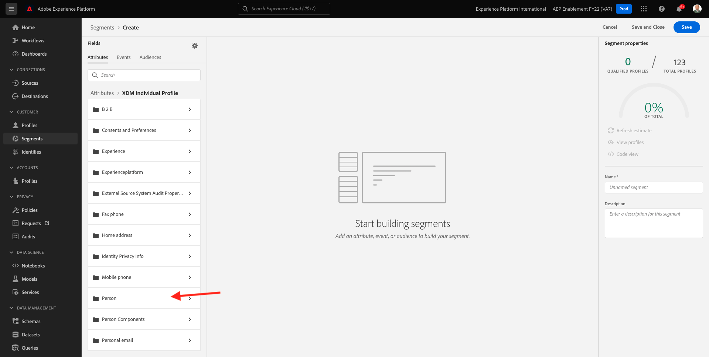
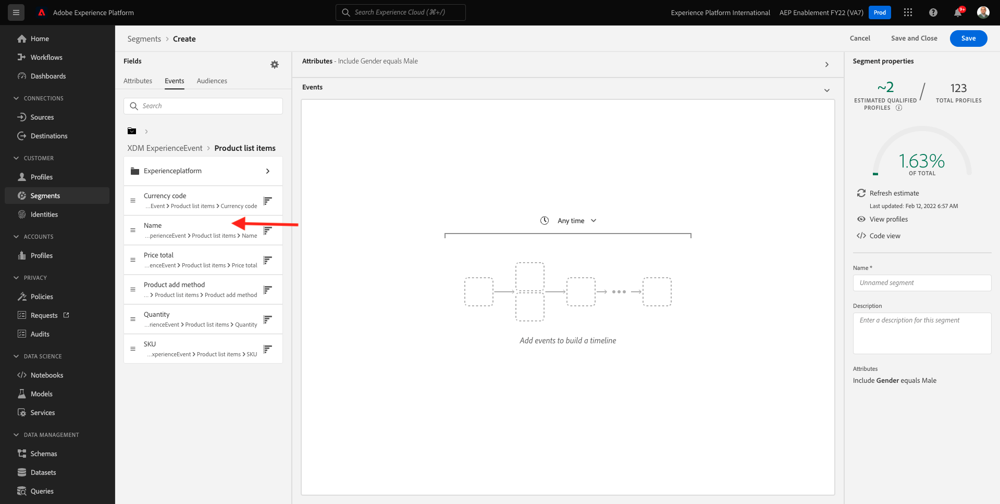

# 3.4创建区段 — UI

在本练习中，您将通过使用Adobe Experience Platform的区段生成器来创建一个区段。

## Story

转到 [Adobe Experience Platform](https://experience.adobe.com/platform). 登录后，您将登陆Adobe Experience Platform的主页。


在继续之前，您需要选择 **沙盒**. 要选择的沙盒已命名 ``--aepSandboxId--``. 您可以通过单击 **[!UICONTROL 生产产品]** 的蓝线。 选择相应的 [!UICONTROL 沙盒]，您将看到屏幕更改，现在，您已加入您的专述 [!UICONTROL 沙盒].


在左侧的菜单中，转到 **区段**. 在此页面上，您可以看到所有现有区段的概述。 单击 **+创建区段** 按钮以开始创建新区段。


进入新区段生成器后，您会立即注意到 **属性** 菜单选项和 **XDM个人配置文件** 引用。


由于XDM是支持体验业务的语言，因此XDM也是区段生成器的基础。 在Platform中摄取的所有数据都应当针对XDM进行映射，因此，无论数据来自何处，所有数据都将成为同一数据模型的一部分。 这为您在生成区段时提供了很大的优势，因为通过这个区段生成器UI，您可以在同一工作流中合并来自任何来源的数据。 可以在区段生成器中构建的区段可以发送到Adobe Target、Adobe Campaign和Adobe Audience Manager等解决方案以进行激活。

让我们构建一个包含所有 **男** 客户。

要获取性别属性，您需要了解和了解XDM。

“性别”是“人员”的属性，可在“属性”下找到。 所以要到达那里，你先点击 **XDM个人配置文件**. 然后你会看到这个。 从 **XDM个人配置文件** 窗口，选择 **人员**.



然后你会看到这个。 在 **人员**，您可以找到 **性别** 属性。 将“性别”属性拖动到区段生成器上。


现在，您可以从已预填充的选项中选择特定的性别。 在这个例子中，我们选择 **男**.


选择后 **男**，则可以通过推送 **刷新估计** 按钮。 这对业务用户非常有用，以便他们能够查看特定属性对生成的区段大小的影响。


然后，您将看到如下估计：


接下来，您应该对区段进行一些优化。 您需要构建一个区段，其中包含已查看产品的所有男性客户 **Proteus Fitness Jackthirt（橙色）**.

要构建此区段，您需要添加体验事件。 您可以通过单击 **事件** 图标 **字段** 菜单。


接下来，你将看到顶层， **XDM ExperienceEvents** 节点。 单击 **XDM ExperienceEvent**.


转到 **产品列表项**.


选择 **名称** 拖放 **名称** 对象（从左侧菜单转到区段生成器画布中） **事件** 中。



然后您将看到：


比较参数应为 **等于** 在输入字段中，输入 **蒙大拿风衣**.


每次向区段生成器中添加元素时，您都可以单击 **刷新估计** 按钮以获取区段中的人口新估计。

迄今为止，您只使用UI来构建区段，但还有一个用于构建区段的代码选项。

构建区段时，您实际上正在构建用户档案查询语言(PQL)查询。 要显示PQL代码，您可以单击 **代码视图** 区段生成器右上角的切换器。


现在，您可以看到完整的PQL语句：

```sql
person.gender in ["male"] and CHAIN(xEvent, timestamp, [C0: WHAT(productListItems.exists(name.equals("MONTANA WIND JACKET", false)))])
```

您还可以通过单击 **查看配置文件**.


最后，让我们为区段提供一个名称并保存该名称。

作为命名约定，请使用：

- `--demoProfileLdap-- - Male customers with interest in Montana Wind Jacket`


然后，单击 **保存并关闭** 按钮以保存区段，随后您将返回到区段概述页面。


您现在可以继续下一个练习，并通过API构建区段。

下一步： [3.5创建区段 — API](./ex5.md)

[返回到模块3](./real-time-customer-profile.md)

[返回到所有模块](../../overview.md)
