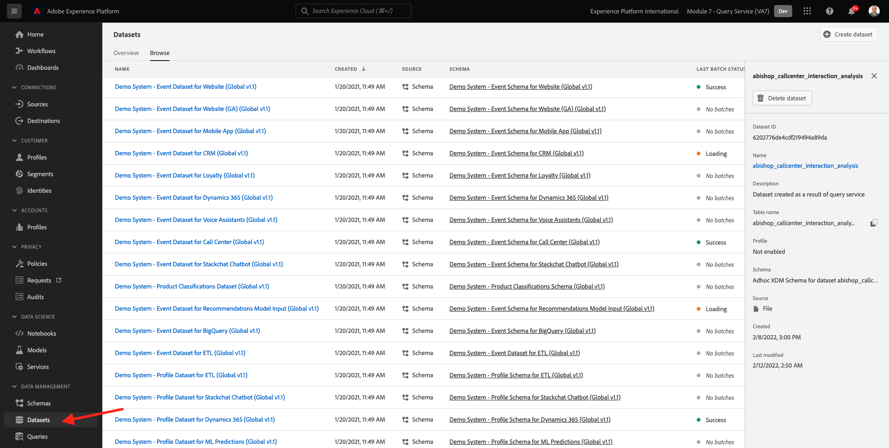
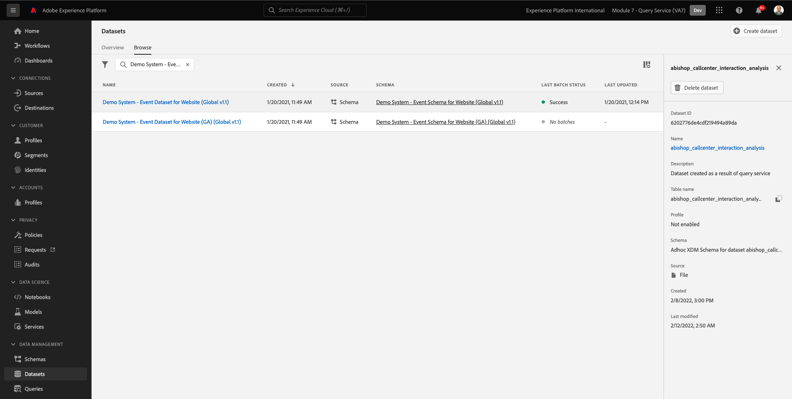

# 4.1快速入门

## 4.1.1熟悉Adobe Experience Platform UI

转到 [Adobe Experience Platform](https://experience.adobe.com/platform). 登录后，您将登陆Adobe Experience Platform的主页。

在继续之前，您需要选择 **沙盒**. 要选择的沙盒已命名 ``--module7sandbox--``. 您可以通过单击 **[!UICONTROL 生产产品]** 的蓝线。 选择相应的 [!UICONTROL 沙盒]，您将看到屏幕更改，现在，您已加入您的专述 [!UICONTROL 沙盒].

## 4.1.2在平台上浏览数据

对任何品牌而言，从不同渠道获取数据都是一项艰巨的任务。 在这个练习中，花旗信号客户正在与花旗信号(Citi Signal)的网站、其移动应用程序、购买数据由花旗信号的销售点系统收集，他们拥有CRM和忠诚度数据。 花旗信号正在使用Adobe Analytics和Launch在其网站、移动应用程序以及POS系统中捕获数据，因此这些数据已经流入Adobe Experience Platform。 让我们从探索Adobe Experience Platform已存在的花旗信号的所有数据开始。

在左侧菜单中，转到 **数据集**.

Citi Signal正在将数据流式传输到Adobe Experience Platform，此数据可在 `Demo System - Event Dataset for Website (Global v1.1)` 数据集。 搜索 `Demo System - Event Dataset for Website`.

Citi Signal的呼叫中心互动数据在 `Demo System - Event Dataset for Call Center (Global v1.1)` 数据集。 搜索 `Demo System - Event Dataset for Call Center` 数据。 单击数据集的名称以将其打开。

单击数据集后，您将获得数据集活动的概述，如摄取和失败的批次。

单击 **预览数据集** 查看 `Demo System - Event Dataset for Call Center (Global v1.1)` 数据集。 左侧面板显示此数据集的架构结构。

单击 **关闭** 按钮以关闭 **预览数据集** 窗口。

## 4.1.3查询服务简介

Adobe Experience Platform查询服务可通过单击 **查询** 中。

通过 **日志** 您将看到“查询列表”页，该页提供了在此组织中运行的所有查询的列表，顶部是最新的查询。

单击列表中的任何SQL查询，并查看右边栏中提供的详细信息。

您可以滚动窗口以查看整个查询，也可以单击下面突出显示的图标，将整个查询复制到记事本。 此时，您不必复制查询。

您不能只查看已执行的查询，此用户界面允许您通过查询创建新数据集。 这些数据集可以链接到Adobe Experience Platform的实时客户资料，或用作Adobe Experience Platform Data Science Workspace的输入。

## 4.1.4将PSQL客户端连接到查询服务

查询服务支持具有PostgreSQL驱动程序的客户端。 在本例中，我们将使用PSQL、命令行界面和Power BI或表格。 让我们连接到PSQL。

单击 **凭据**.

您将看到下面的屏幕。 “配置”屏幕提供用于对查询服务进行身份验证的服务器信息和凭据。 目前，我们将重点关注屏幕右侧，该屏幕中包含用于PSQL的connect命令。 单击复制按钮以将命令复制到剪贴板。

对于Windows:按Windows键并键入cmd ，然后单击命令提示符结果以打开命令行。

对于macOS:通过聚焦搜索打开terminal.app :

粘贴您从查询服务UI复制的连接命令，然后在命令提示符窗口中按Enter:

Windows:

MacOS:

您现在已使用PSQL连接到查询服务。

在接下来的练习中，将会与此窗口进行一些交互。 我们将它称为您的 **PSQL命令行界面**.

现在，您可以开始提交查询了。

下一步： [4.2使用查询服务](./ex2.md)

[返回到模块4](./query-service.md)

[返回到所有模块](../../overview.md)
