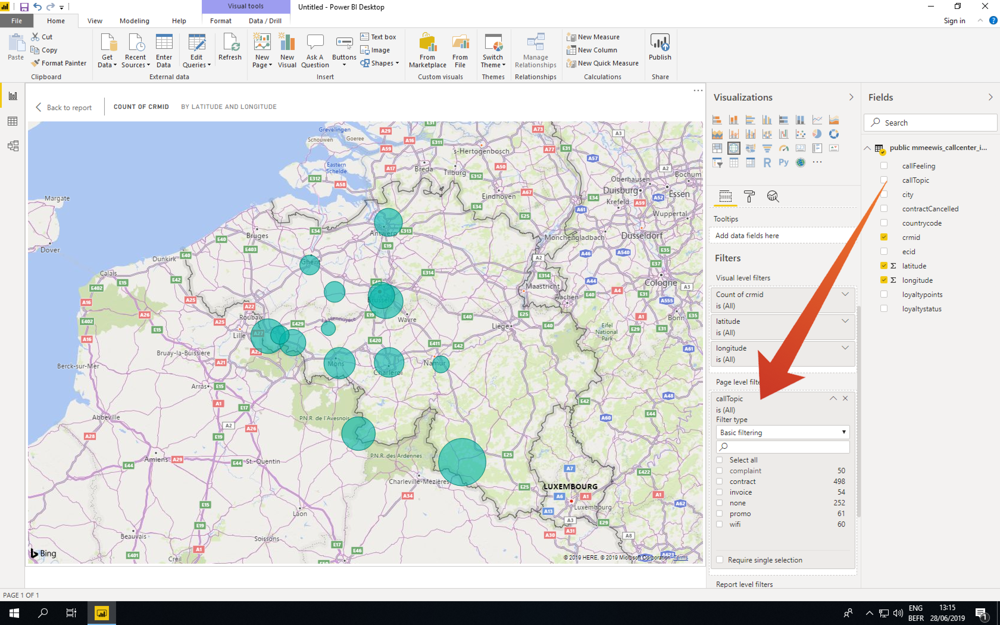
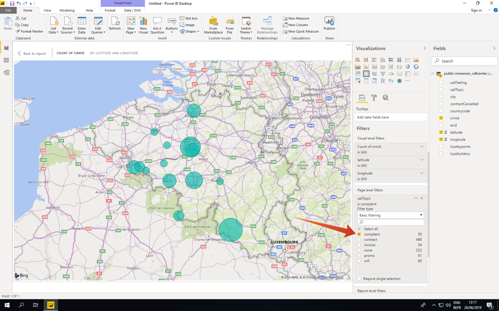

# 4.5查询服务和Power BI

打开MicrosoftPower BI桌面。

单击 **获取数据**.

搜索 **postgres** (1)选择 **Postgres** （二）名单和 **连接** (3)。

转到Adobe Experience Platform, **查询** 和 **凭据**.

从 **凭据** 页面，复制 **主机** 然后粘贴到 **服务器** 字段，并复制 **数据库** 然后粘贴到 **数据库** 字段，然后单击“确定”(2)。

>[!IMPORTANT]
>
>确保包含端口 **:80** 值结尾，因为查询服务当前未使用默认的PostgreSQL端口5432。

在下一个对话框中，使用 **凭据** 的问题。

在“导航”对话框中，将 **LDAP** 在搜索字段(1)中查找CTAS数据集，并选中每个(2)旁边的复选框。 然后，单击“加载(3)”。

确保 **报表** 选项卡(1)。

选择地图(1)，将其添加到报表画布后，放大地图(2)。

接下来，我们需要定义测量和维度，您可以通过从 **字段** 的相应占位符(位于 **可视化图表**)，如下所示：

作为衡量标准，我们将使用 **customerId**. 拖动 **crmid** 字段 **字段** 部分 **大小** 占位符：

最后，做点 **callTopic** 分析，让我们将 **callTopic** 字段 **页面级别过滤器** 占位符(您可能必须在 **可视化图表** 部分);

选择/取消选择 **callTopics** 调查：

你现在已经完成了这个练习。

下一步： [4.7查询服务API](./ex7.md)

[返回到模块4](./query-service.md)

[返回到所有模块](../../overview.md)
