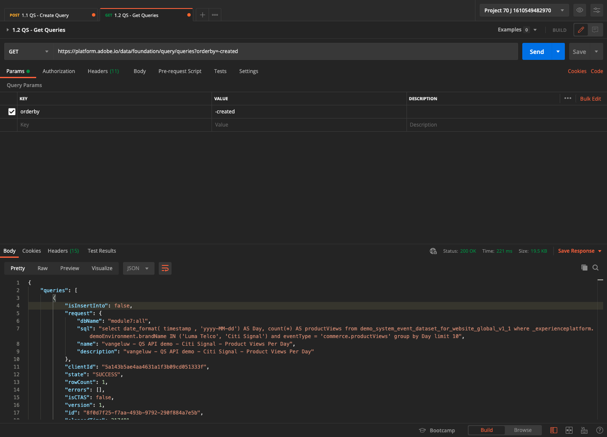
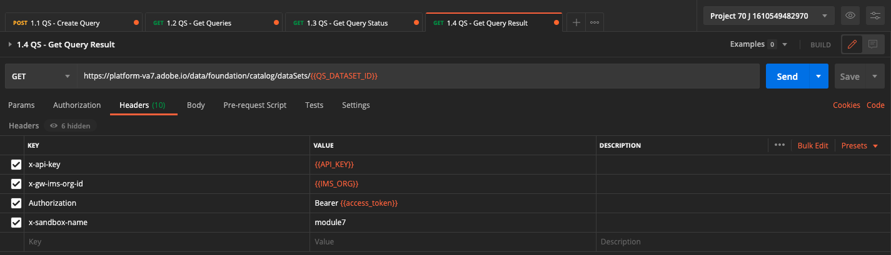

# 4.7查询服务API

## 目标

- 使用查询服务API管理查询模板和查询计划

## 上下文

在本练习中，您将执行API调用，以使用Postman集合管理查询模板和查询计划。 您将定义查询模板、执行常规查询和CTAS查询。 A **CTAS** 查询（作为选择查询创建表）将其结果集存储在显式数据集中。 常规查询存储在隐式（或系统生成）数据集中，通常以镶木文件格式导出。

## 文档

- [Adobe Experience Platform 查询服务帮助](https://experienceleague.adobe.com/docs/experience-platform/query/api/getting-started.html)
- [查询服务API](https://www.adobe.io/apis/experienceplatform/home/api-reference.html#!acpdr/swagger-specs/qs-api.yaml)

## 4.7.1查询服务API

查询服务API允许您管理针对Adobe Experience Platform数据湖的非交互式查询。

非交互式表示执行查询的请求不会立即产生响应。 将处理查询，并将其结果集存储为隐式或显式(CTAS:根据选择创建表)数据集。

## 4.7.2示例查询

作为示例查询，您将使用 [4.3 — 查询、查询、查询……和流失分析](./ex3.md):

我们每天有多少次产品查看？

**SQL**

```sql
select date_format( timestamp , 'yyyy-MM-dd') AS Day,
       count(*) AS productViews
from   demo_system_event_dataset_for_website_global_v1_1
where  --aepTenantId--.demoEnvironment.brandName IN ('Luma Telco', 'Citi Signal')
and eventType = 'commerce.productViews'
group by Day
limit 10;
```

## 4.7.3查询

在您的计算机上打开Postman。 在模块3中，您创建了Postman环境并导入了Postman集合。 按照 [练习3.3.3](./../module3/ex3.md) 以防你还没做。

作为导入的Postman集合的一部分，您将看到一个文件夹 **3. 查询服务**. 如果您看不到此文件夹，请重新下载 [Postman收藏集](../../assets/postman/postman_profile.zip) 并按照 [练习3.3.3](./../module3/ex3.md).


>[!NOTE]
>
>此时，仅显示文件夹 **1. 查询** 包含请求。 其他请求将添加到层阶段。

打开该文件夹，了解用于执行、监视和下载查询结果集的查询服务API调用。

POST调用 [/query/queryes] 通过以下有效负载，将触发查询的执行；

### 4.7.3.1创建查询

单击名为 **1.1 QS — 创建查询** 然后转到 **标题**. 然后您将看到：


让我们重点关注此标题字段：

| 键 | 值 |
| ----------- | ----------- |
| x-sandbox-name | `--module7sandbox--` |

>[!NOTE]
>
>您需要指定所使用的Adobe Experience Platform沙盒的名称。 标题字段 **x-sandbox-name** 应该 `--module7sandbox--`.

转到 **正文** 部分。 在 **正文** 在此请求中，您将看到以下内容：


```sql
{
    "name" : "ldap - QS API demo - Citi Signal - Product Views Per Day",
	"description": "ldap - QS API demo - Citi Signal - Product Views Per Day",
	"dbName": "module7:all",
	"sql": "select date_format( timestamp , 'yyyy-MM-dd') AS Day, count(*) AS productViews from demo_system_event_dataset_for_website_global_v1_1 where _experienceplatform.demoEnvironment.brandName IN ('Luma Telco', 'Citi Signal') and eventType = 'commerce.productViews' group by Day limit 10"
}
```

注意：请更新变量 **name** 在以下请求中，通过将 **ldap** 在您的 **ldap**.

添加特定 **ldap**，则正文应类似于以下内容：

```json
{
    "name" : "vangeluw - QS API demo - Citi Signal - Product Views Per Day",
	"description": "vangeluw - QS API demo - Citi Signal - Product Views Per Day",
	"dbName": "module7:all",
	"sql": "select date_format( timestamp , 'yyyy-MM-dd') AS Day, count(*) AS productViews from demo_system_event_dataset_for_website_global_v1_1 where _experienceplatform.demoEnvironment.brandName IN ('Luma Telco', 'Citi Signal') and eventType = 'commerce.productViews' group by Day limit 10"
}
```

>[!NOTE]
>
>键 **dbName** 上述JSON主体中的是指在Adobe Experience Platform实例中使用的沙盒。 如果您使用的是PROD沙盒，则dbName应为 **prod:all**，例如 **模块7**，则dbName应等于 **模块7:all**.

接下来，单击蓝色 **发送** 按钮以创建区段并查看该区段的结果。


成功后，POST请求将返回以下响应：

```json
{
    "isInsertInto": false,
    "request": {
        "dbName": "module7:all",
        "sql": "select date_format( timestamp , 'yyyy-MM-dd') AS Day, count(*) AS productViews from demo_system_event_dataset_for_website_global_v1_1 where _experienceplatform.demoEnvironment.brandName IN ('Luma Telco', 'Citi Signal') and eventType = 'commerce.productViews' group by Day limit 10",
        "name": "vangeluw - QS API demo - Citi Signal - Product Views Per Day",
        "description": "vangeluw - QS API demo - Citi Signal - Product Views Per Day"
    },
    "clientId": "5a143b5ae4aa4631a1f3b09cd051333f",
    "state": "SUBMITTED",
    "rowCount": 0,
    "errors": [],
    "isCTAS": false,
    "version": 1,
    "id": "8f0d7f25-f7aa-493b-9792-290f884a7e5b",
    "elapsedTime": 0,
    "updated": "2021-01-20T13:23:13.951Z",
    "client": "API",
    "userId": "A3392DB95FFF08EE0A495E87@techacct.adobe.com",
    "created": "2021-01-20T13:23:13.951Z",
    "_links": {
        "self": {
            "href": "https://platform-va7.adobe.io/data/foundation/query/queries/8f0d7f25-f7aa-493b-9792-290f884a7e5b",
            "method": "GET"
        },
        "soft_delete": {
            "href": "https://platform-va7.adobe.io/data/foundation/query/queries/8f0d7f25-f7aa-493b-9792-290f884a7e5b",
            "method": "PATCH",
            "body": "{ \"op\": \"soft_delete\"}"
        },
        "cancel": {
            "href": "https://platform-va7.adobe.io/data/foundation/query/queries/8f0d7f25-f7aa-493b-9792-290f884a7e5b",
            "method": "PATCH",
            "body": "{ \"op\": \"cancel\"}"
        }
    }
}
```

当前 **state** 的 **已提交**，一旦执行，其状态将变为 **成功**.

您还可以通过Adobe Experience Platform UI查找提交的查询，打开 [Adobe Experience Platform](https://experience.adobe.com/#/@experienceplatform/platform/home)，导航到 **查询**，更改为 **日志** 并选择查询：


### 4.7.3.2获取查询

单击名为 **1.2 QS — 获取查询** 然后转到 **标题**. 然后您将看到：


让我们重点关注此标题字段：

| 键 | 值 |
| ----------- | ----------- |
| x-sandbox-name | `--module7sandbox--` |

>[!NOTE]
>
>您需要指定所使用的Adobe Experience Platform沙盒的名称。 标题字段 **x-sandbox-name** 应该 `--module7sandbox--`.

转到 **参数**. 然后您将看到：


的 **orderby** 参数允许您根据 **已创建** 属性。 请注意 **&#39;-&#39;** 在创建前登录，这意味着查询列表的返回顺序将使用其创建日期(位于 **降序** 订单。 您的查询应位于列表顶部。

接下来，单击蓝色 **发送** 按钮以创建区段并查看该区段的结果。



成功后，请求将返回与下面类似的响应。 的 **state** 的 **已提交**, **IN_PROGRESS** 或 **成功**. 查询可能需要几分钟时间才能生成 **成功** 状态。 您可以重复发送此请求多次，直到您看到 **成功** 状态。

```json
{
    "queries": [
        {
            "isInsertInto": false,
            "request": {
                "dbName": "module7:all",
                "sql": "select date_format( timestamp , 'yyyy-MM-dd') AS Day, count(*) AS productViews from demo_system_event_dataset_for_website_global_v1_1 where _experienceplatform.demoEnvironment.brandName IN ('Luma Telco', 'Citi Signal') and eventType = 'commerce.productViews' group by Day limit 10",
                "name": "vangeluw - QS API demo - Citi Signal - Product Views Per Day",
                "description": "vangeluw - QS API demo - Citi Signal - Product Views Per Day"
            },
            "clientId": "5a143b5ae4aa4631a1f3b09cd051333f",
            "state": "SUCCESS",
            "rowCount": 1,
            "errors": [],
            "isCTAS": false,
            "version": 1,
            "id": "8f0d7f25-f7aa-493b-9792-290f884a7e5b",
            "elapsedTime": 217481,
            "updated": "2021-01-20T13:26:51.432Z",
            "client": "API",
            "userId": "A3392DB95FFF08EE0A495E87@techacct.adobe.com",
            "created": "2021-01-20T13:23:13.951Z",
            "_links": {
                "self": {
                    "href": "https://platform-va7.adobe.io/data/foundation/query/queries/8f0d7f25-f7aa-493b-9792-290f884a7e5b",
                    "method": "GET"
                },
                "soft_delete": {
                    "href": "https://platform-va7.adobe.io/data/foundation/query/queries/8f0d7f25-f7aa-493b-9792-290f884a7e5b",
                    "method": "PATCH",
                    "body": "{ \"op\": \"soft_delete\"}"
                },
                "referenced_datasets": [
                    {
                        "id": "60080ace62c49a19490c5870",
                        "href": "https://platform-va7.adobe.io/data/foundation/catalog/dataSets/60080ace62c49a19490c5870"
                    }
                ]
            }
        }
     ]
    },
    "version": 1
}
```

当状态为 **成功**，请继续下一个请求。

### 4.7.3.3获取查询状态

单击名为 **1.3 QS — 获取查询状态** 然后转到 **标题**. 然后您将看到：


让我们重点关注此标题字段：

| 键 | 值 |
| ----------- | ----------- |
| x-sandbox-name | `--module7sandbox--` |

>[!NOTE]
>
>您需要指定所使用的Adobe Experience Platform沙盒的名称。 标题字段 **x-sandbox-name** 应该 `--module7sandbox--`.

接下来，单击蓝色 **发送** 按钮以创建区段并查看该区段的结果。


成功后，请求将返回与下面类似的响应。

```json
{
    "isInsertInto": false,
    "request": {
        "dbName": "module7:all",
        "sql": "select date_format( timestamp , 'yyyy-MM-dd') AS Day, count(*) AS productViews from demo_system_event_dataset_for_website_global_v1_1 where _experienceplatform.demoEnvironment.brandName IN ('Luma Telco', 'Citi Signal') and eventType = 'commerce.productViews' group by Day limit 10",
        "name": "vangeluw - QS API demo - Citi Signal - Product Views Per Day",
        "description": "vangeluw - QS API demo - Citi Signal - Product Views Per Day"
    },
    "clientId": "5a143b5ae4aa4631a1f3b09cd051333f",
    "state": "SUCCESS",
    "rowCount": 1,
    "errors": [],
    "isCTAS": false,
    "version": 1,
    "id": "8f0d7f25-f7aa-493b-9792-290f884a7e5b",
    "elapsedTime": 217481,
    "updated": "2021-01-20T13:26:51.432Z",
    "client": "API",
    "userId": "A3392DB95FFF08EE0A495E87@techacct.adobe.com",
    "created": "2021-01-20T13:23:13.951Z",
    "_links": {
        "self": {
            "href": "https://platform-va7.adobe.io/data/foundation/query/queries/8f0d7f25-f7aa-493b-9792-290f884a7e5b",
            "method": "GET"
        },
        "soft_delete": {
            "href": "https://platform-va7.adobe.io/data/foundation/query/queries/8f0d7f25-f7aa-493b-9792-290f884a7e5b",
            "method": "PATCH",
            "body": "{ \"op\": \"soft_delete\"}"
        },
        "referenced_datasets": [
            {
                "id": "60080ace62c49a19490c5870",
                "href": "https://platform-va7.adobe.io/data/foundation/catalog/dataSets/60080ace62c49a19490c5870"
            }
        ]
    }
}
```

当查询达到 **成功**，则响应还将指示查询通过 **rowCount** 属性。 在我们的示例中，查询返回10行。 下面的部分中，让我们看看如何检索10行。

### 4.7.3.4检索查询结果

的 **成功** 上述响应包括 **referenced_datasets** 属性，该属性指向用于存储查询结果的隐式数据集。 要访问结果，我们使用 **href** 或 **id** 属性。

单击名为 **1.4 QS — 获取查询结果** 然后转到 **标题**. 然后您将看到：



让我们重点关注此标题字段：

| 键 | 值 |
| ----------- | ----------- |
| x-sandbox-name | `--module7sandbox--` |

>[!NOTE]
>
>您需要指定所使用的Adobe Experience Platform沙盒的名称。 标题字段 **x-sandbox-name** 应该 `--module7sandbox--`.

接下来，单击蓝色 **发送** 按钮以创建区段并查看该区段的结果。


此请求的响应将指向数据集文件：

```json
{
    "60080ace62c49a19490c5870": {
        "name": "Demo System - Event Dataset for Website (Global v1.1)",
        "description": "Demo System - Event Dataset for Website (Global v1.1)",
        "enableErrorDiagnostics": false,
        "tags": {
            "adobe/siphon/partition/definition": [
                "day(timestamp, _ACP_DATE)",
                "identity(_ACP_BATCHID)"
            ],
            "aep/siphon/partitions": [
                "_ACP_DATE",
                "_ACP_BATCHID"
            ],
            "acp_granular_plugin_validation_flags": [
                "identity:enabled",
                "profile:enabled"
            ],
            "adobe/siphon/buffered-promotion-recency": [
                "live"
            ],
            "adobe/siphon/use-buffered-promotion": [
                "true"
            ],
            "adobe/pqs/table": [
                "demo_system_event_dataset_for_website_global_v1_1"
            ],
            "aep/siphon/expire-snapshot-timestamp": [
                "1611141272703"
            ],
            "acp_granular_validation_flags": [
                "requiredFieldCheck:enabled"
            ],
            "acp_validationContext": [
                "enabled"
            ],
            "adobe/siphon/table/format": [
                "iceberg"
            ],
            "unifiedProfile": [
                "enabled:true",
                "enabledAt:2021-01-20 10:49:51"
            ],
            "unifiedIdentity": [
                "enabled:true"
            ]
        },
        "namespace": "ACP",
        "state": "DRAFT",
        "imsOrg": "907075E95BF479EC0A495C73@AdobeOrg",
        "sandboxId": "62cd9f38-8529-4b05-8d9f-388529db0540",
        "lastBatchId": "01EWFQZ15XRNNB1FPKPW5ETRVP",
        "lastBatchStatus": "success",
        "lastSuccessfulBatch": "01EWFQZ15XRNNB1FPKPW5ETRVP",
        "version": "1.0.6",
        "created": 1611139790698,
        "updated": 1611149266031,
        "createdClient": "750e24ee855b4ac18ccc4f4817f96ee1",
        "createdUser": "3A260B485E909A170A495E76@techacct.adobe.com",
        "updatedUser": "acp_foundation_dataTracker@AdobeID",
        "viewId": "60080ace62c49a19490c5871",
        "fileDescription": {
            "persisted": true,
            "containerFormat": "parquet",
            "format": "parquet"
        },
        "files": "@/dataSets/60080ace62c49a19490c5870/views/60080ace62c49a19490c5871/files",
        "schemaMetadata": {
            "delta": [],
            "gdpr": []
        },
        "schemaRef": {
            "id": "https://ns.adobe.com/experienceplatform/schemas/d9b88a044ad96154637965a97ed63c7b20bdf2ab3b4f642e",
            "contentType": "application/vnd.adobe.xed-full+json;version=1"
        }
    }
}
```

>[!NOTE]
>
>为帮助您与查询服务API进行交互，不久将添加更多练习。

下一步： [摘要和优点](./summary.md)

[返回到模块4](./query-service.md)

[返回到所有模块](../../overview.md)
