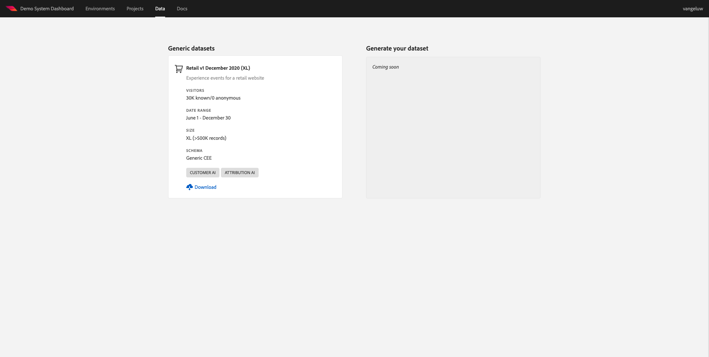

# 5.1客户AI — 数据准备（摄取）

为了使智能服务能够从营销事件数据中发现洞察，必须在语义上对数据进行扩充并以标准结构进行维护。 智能服务可利用Adobe的体验数据模型(XDM)架构来实现此目的。
具体而言，Intelligent Services中使用的所有数据集都必须符合 **消费者体验事件** XDM架构。

## 5.1.1创建架构

在本练习中，您将创建一个架构，其中包含 **消费者体验事件混合**，这是 **客户人工智能** 智能服务。

通过转到以下URL登录Adobe Experience Platform: [https://experience.adobe.com/platform](https://experience.adobe.com/platform).

登录后，您将登陆Adobe Experience Platform的主页。

在继续之前，您需要选择 **沙盒**. 要选择的沙盒已命名 ``--module10sandbox--``. 您可以通过单击 **[!UICONTROL 生产产品]** 的蓝线。 选择相应的沙盒后，您将看到屏幕发生更改，现在您就位于专用沙盒中。

在左侧菜单中，单击 **模式** 然后转到 **浏览**. 单击 **创建架构**.

在弹出窗口中，选择 **XDM ExperienceEvent**.

然后你会看到这个。

搜索并选择以下内容 **混合** 要添加到此架构，请执行以下操作：

- 消费者体验事件

   

- 最终用户ID详细信息

   

单击 **添加字段组**.

然后你会看到这个。 选择混合 **最终用户ID详细信息**.

导航到字段 **endUserIDs._experience.emailid.id**.

在字段的右侧菜单中 **endUserIDs._experience.emailid.id**，向下滚动并选中复选框 **身份**，请选中复选框 **主标识** ，然后选择 **身份命名空间** of **电子邮件**.

导航到字段 **endUserIDs._experience.mcid.id**. 选中复选框 **身份** ，然后选择 **身份命名空间** of **ECID**. 单击&#x200B;**应用**。

立即为架构命名。

作为我们架构的名称，您将使用：

- `--demoProfileLdap-- - Demo System - Customer Experience Event`

例如，对于ldap **万热卢**，此应为架构的名称：

- **vangeluw — 演示系统 — 客户体验事件**

这应该给你这样的东西。 单击 **+添加** 按钮以添加新 **混合**.

选择架构的名称。 现在，您应该为 **用户档案**，方法是 **用户档案** 切换。

然后你会看到这个。 单击 **启用**.

你现在应该有这个。 单击 **保存** 以保存您的架构。

## 5.1.2创建数据集

在左侧菜单中，单击 **数据集** 然后转到 **浏览**. 单击 **创建数据集**.

单击&#x200B;**使用模式创建数据集**。

在下一个屏幕中，选择您在上一个练习中创建的数据集，该数据集名为 **[!UICONTROL ldap — 演示系统 — 客户体验事件]**. 单击&#x200B;**下一步**。

作为数据集的名称，请使用 `--demoProfileLdap-- - Demo System - Customer Experience Event Dataset`. 单击&#x200B;**完成**。

数据集现已创建完成。 启用 **用户档案** 切换。

单击 **启用**.

您现在应该具有：

您现在可以开始摄取消费者体验事件数据并开始使用Customer AI服务。

## 5.1.3下载体验事件测试数据

一旦 **架构** 和 **数据集** 配置完成后，您现在可以摄取体验事件数据。 由于Customer AI需要跨 **至少2个季度**，则需要摄取外部准备的数据。

为体验事件准备的数据必须符合 [消费者体验事件XDM Mixin](https://github.com/adobe/xdm/blob/797cf4930d5a80799a095256302675b1362c9a15/docs/reference/context/experienceevent-consumer.schema.md).

请从以下位置下载包含示例数据的文件： [https://dashboard.adobedemo.com/data](https://dashboard.adobedemo.com/data). 单击 **下载** 按钮。

你现在下载了一个名为 **retail-v1-dec2020-xl.json.zip**. 将文件放在您计算机的桌面上并解压缩，之后您将看到一个名为 **retail-v1.json**. 在下一个练习中，您将需要此文件。

## 5.1.4摄取体验事件测试数据

在Adobe Experience Platform，转到 **数据集** 并打开您的数据集，该数据集名为 **[!UICONTROL ldap — 演示系统 — 客户体验事件数据集]**.

在数据集中，单击 **选择文件** 添加数据。

在弹出窗口中，选择文件 **retail-v1.json** 单击 **打开**.

然后，您将看到正在导入的数据，并在 **正在加载** 状态。 在上传文件之前，请勿从此页面导航。

上传文件后，您将看到 **正在加载** to **处理**.

摄取和处理数据可能需要10-20分钟。

数据摄取成功后，批处理状态将更改为 **成功**.

下一步： [5.2 Customer AI — 创建新实例（配置）](./ex2.md)

[返回到模块5](./intelligent-services.md)

[返回到所有模块](./../../overview.md)
