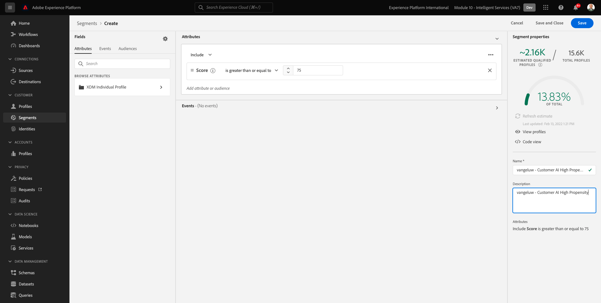

# 5.3客户AI — 评分仪表板和分段（预测并采取行动）

一旦您的Customer AI实例完成模型运行，您将能够显示评估的倾向得分，以预测客户在未来30天内执行购买。

>[!NOTE]
>
>仅状态为 **成功** 将允许您预览服务的分析。

## 5.3.1倾向预测

现在，让我们查看一下Customer AI实例模型生成的预测倾向。 单击实例名称以查看功能板。

Customer AI功能板显示有关得分、群体分布以及模型评估的影响因素的摘要。

将鼠标悬停在影响因素上可查看数据分布的进一步划分。

## 5.3.2业务行动

### 5.3.2.1客户细分

Customer AI功能板允许通过单击定义区段。 单击 **创建区段** 按钮。

您将看到区段定义已自动创建。

根据以下命名约定，为区段提供一个名称： `--demoProfileLdap-- - Customer AI High Propensity`. 单击&#x200B;**保存**。

现在，您可以使用此区段进行定位，例如使用Real-time CDP、Journey Orchestration和Adobe Target。

### 5.3.2.2用户档案概述

由于Customer AI倾向分数成为实时客户资料的一部分，因此您可以查看单个客户的分数。

在Adobe Experience Platform，转到 **用户档案** 在左侧菜单中，选择 **浏览**.

使用任何标识符搜索用户档案，例如 **电子邮件hbirkenshawa@businessweek.com**，在您摄取的JSON文件中可用。 单击 **配置文件ID** 打开用户档案。

然后您将看到：

转到 **属性**，其中包含来自您的Customer AI模型的输出。

向下滚动以查看由Customer AI模型计算的倾向得分。

下一步： [摘要和优点](./summary.md)

[返回到模块5](./intelligent-services.md)

[返回到所有模块](./../../overview.md)
