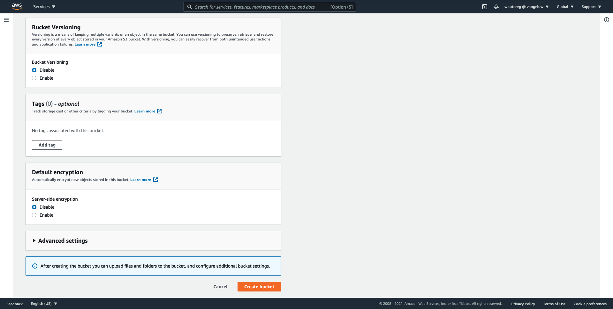
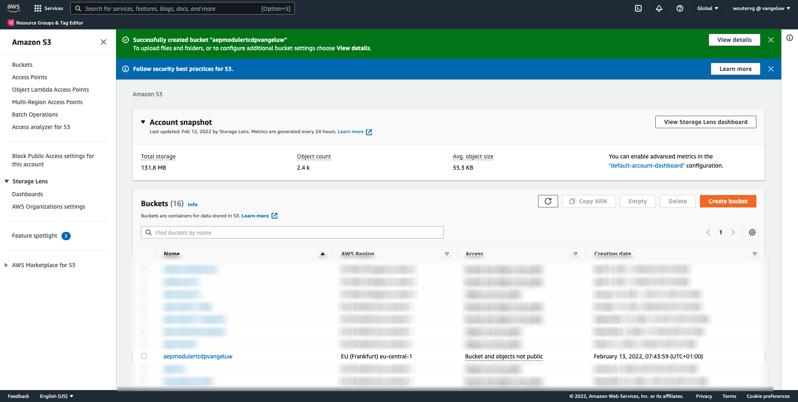
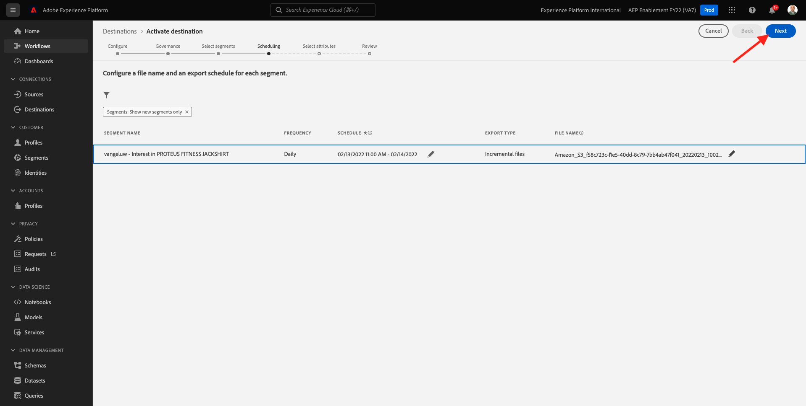
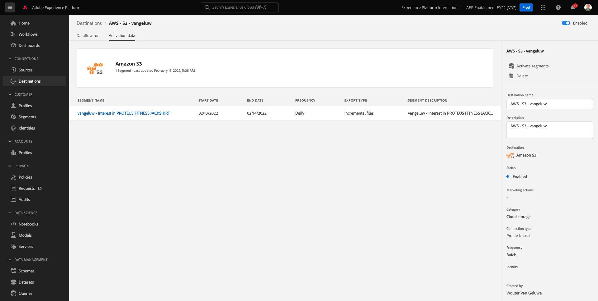

# 6.4采取行动：将区段发送到S3目标

Adobe Experience Platform还能够将受众共享到电子邮件营销目标，例如SalesforceMarketing Cloud、OracleEloqua、OracleResponsys和Adobe Campaign。

您可以将FTP或SFTP用作每个电子邮件营销目标的专用目标的一部分，也可以使用AWS S3在Adobe Experience Platform与这些电子邮件营销目标之间交换客户列表。

在本模块中，您将通过使用AWS S3存储段来配置此类目标。

## 6.4.1创建S3存储段

转到 [https://console.aws.amazon.com](https://console.aws.amazon.com) 然后使用您之前创建的Amazon帐户登录。

登录后，您将被重定向到 **AWS管理控制台**.

在 **查找服务** 菜单，搜索 **s3**. 单击第一个搜索结果： **S3 — 云中的可扩展存储**.

然后您将看到 **Amazon S3** 主页。 单击 **创建存储段**.

在 **创建存储段** 屏幕中，您需要配置两项内容：

- 名称：使用名称 `aepmodulertcdp--demoProfileLdap--`. 例如，在本练习中，存储段名称为 **aepmodulertcdpvangeluw**
- 地区：使用区域 **EU（法兰克福）eu-central-1**

保留所有其他默认设置。 向下滚动并单击 **创建存储段**.

然后，您将看到正在创建存储段，并被重定向到Amazon S3主页。

## 6.4.2设置访问S3存储段的权限

下一步是设置对S3存储段的访问权限。

为此，请转至 [https://console.aws.amazon.com/iam/home](https://console.aws.amazon.com/iam/home).

对AWS资源的访问由Amazon Identity and Access Management(IAM)控制。

您现在将看到此页面。

在左侧菜单中，单击 **用户**. 然后您将看到 **用户** 屏幕。 单击 **添加用户**.

接下来，配置您的用户：

- 用户名：use `s3_--demoProfileLdap--_rtcdp` 作为名称，因此在此示例中，名称为 `s3_vangeluw_rtcdp`.
- AWS访问类型：选择 **访问密钥 — 程序化访问**.

单击 **下一个：权限**.

然后，您将看到此权限屏幕。 单击 **直接附加现有策略**.

输入搜索词 **s3** 查看所有相关的S3策略。 选择策略 **AmazonS3FullAccess**. 单击 **下一个：标记**.

在 **标记** 屏幕，无需配置任何内容。 单击 **下一个：审阅**.

查看配置。 单击 **创建用户**.

您的用户现已创建完成，您将看到用于访问S3环境的凭据。 这是你唯一一次看到你的凭据，请写下来。

单击 **显示** 要查看您的密钥访问密钥，请执行以下操作：

>[!IMPORTANT]
>
>将您的凭据存储在计算机的文本文件中。
>
> - 访问密钥ID:...
> - 密钥访问密钥：...
>
> 单击 **关闭** 你再也看不到你的证件了！

单击&#x200B;**关闭**。

现在，您已成功创建了AWS S3存储段，并且已创建了有权访问此存储段的用户。

## 6.4.3在Adobe Experience Platform中配置目标

转到 [Adobe Experience Platform](https://experience.adobe.com/platform). 登录后，您将登陆Adobe Experience Platform的主页。

在继续之前，您需要选择 **沙盒**. 要选择的沙盒已命名 ``--aepSandboxId--``. 您可以通过单击 **[!UICONTROL 生产产品]** 的蓝线。 选择相应的 [!UICONTROL 沙盒]，您将看到屏幕更改，现在，您已加入您的专述 [!UICONTROL 沙盒].

在左侧菜单中，转到 **目标**，然后转到 **目录**. 然后您将看到 **目标目录**.

单击 **云存储**，然后单击 **设置** 按钮 **激活区段**，具体取决于您的环境) **Amazon S3** 卡。

根据您的环境，您可能必须单击 **+配置新目标** 以开始创建目标。

选择 **新帐户** 作为帐户类型。 请使用上一步中为您提供的S3凭据：

| 访问密钥ID | 密钥访问密钥 |
|:-----------------------:| :-----------------------:|
| AKIA..... | Cm5Ln..... |

单击 **连接到目标**.

然后，您将看到一条可视确认消息，确认此目标现已连接。

您必须提供名称和文件夹，以便Adobe Experience Platform能够连接到S3存储段。

作为命名约定，请使用以下内容：

| 访问密钥ID | 密钥访问密钥 |
|:-----------------------:| :-----------------------:|
| 名称 | `AWS - S3 - --demoProfileLdap--` |
| 描述 | `AWS - S3 - --demoProfileLdap--` |
| 存储段名称 | `aepmodulertcdp--demoProfileLdap--` |
| 文件夹路径 | / |

单击&#x200B;**下一步**。

您现在可以选择将数据管理策略附加到新目标。 单击&#x200B;**下一步**。

在区段列表中，搜索在练习1中创建的区段，然后将其选中。 单击&#x200B;**下一步**。

然后你会看到这个。 如果需要，可以单击 **铅笔** 图标。 **创建计划**.

定义您选择的计划。 选择 **导出增量文件** 并将频率设置为 **每小时** 每个 **3小时**. 单击&#x200B;**创建**。

然后你会得到这个。 单击&#x200B;**下一步**。

您现在可以选择用于导出到AWS S3的属性。 单击 **添加新字段** 确保现场 `--aepTenantId--.identification.core.ecid` 添加和标记为 **重复数据删除键**.

（可选）您可以根据需要添加任意数量的其他字段。

添加所有字段后，单击 **下一个**.

查看配置。 单击 **完成** 完成配置。

然后，您将返回到目标激活屏幕，并看到您的区段已添加到此目标。

如果要添加更多区段导出，可以单击 **激活区段** 重新启动该过程并添加更多区段。

下一步： [6.5采取行动：将区段发送到Adobe Target](./ex5.md)

[返回到模块6](./real-time-cdp-build-a-segment-take-action.md)

[返回到所有模块](../../overview.md)
