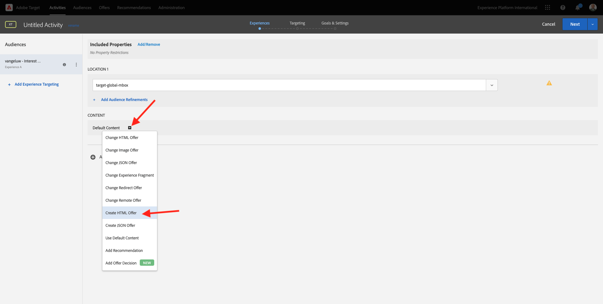
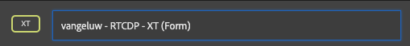

# 6.5采取行动：将区段发送到Adobe Target

转到 [Adobe Experience Platform](https://experience.adobe.com/platform). 登录后，您将登陆Adobe Experience Platform的主页。


在继续之前，您需要选择 **沙盒**. 要选择的沙盒已命名 ``--aepSandboxId--``. 您可以通过单击 **[!UICONTROL 生产产品]** 的蓝线。 选择相应的 [!UICONTROL 沙盒]，您将看到屏幕更改，现在，您已加入您的专述 [!UICONTROL 沙盒].


## 6.5.1验证数据流

Real-Time CDP中的Adobe Target目标已连接到用于将数据摄取到Adobe边缘网络的数据流。 如果要设置Adobe Target目标，您首先需要验证您的数据流是否已为Adobe Target启用。 您的数据已在 [练习0.2创建数据流](./../module0/ex2.md) 并且已命名 `--demoProfileLdap-- - Demo System Datastream`.

转到 [https://experience.adobe.com/#/data-collection/](https://experience.adobe.com/#/data-collection/)，然后单击 **数据流** 或 **数据流（测试版）**.


在屏幕的右上角，选择您的沙盒名称，该名称应为 `--aepSandboxId--`.


在数据流中，搜索名为 `--demoProfileLdap-- - Demo System Datastream`. 单击您的数据流以将其打开。


然后，您将看到此内容，单击 **...** 下一页 **Adobe Experience Platform** 然后单击 **编辑**.


选中两个复选框 **边缘分割** 和 **个性化目标**. 单击&#x200B;**保存**。


接下来，单击 **+添加服务**.


选择服务 **Adobe Target**. 单击&#x200B;**保存**。


您的数据流现已配置为Adobe Target。


## 6.5.2配置Adobe Target目标

Adobe Target可作为Real-Time CDP的目的地。 要设置Adobe Target集成，请转到 **目标**，更改为 **目录**.


单击 **个性化** 在 **类别** 菜单。 然后您将看到 **Adobe Target** 目标卡。 单击 **激活区段** (或 **设置** 取决于您的环境)。


根据您的环境，您可能必须单击 **+配置新目标** 以开始创建目标。


然后你会看到这个。


在 **配置新目标** 屏幕中，您需要配置两项内容：

- 名称：使用名称 `--demoProfileLdap-- - Adobe Target (Web)`，其应如下所示： **vangeluw - Adobe Target(Web)**.
- 数据流ID:您需要选择您在 [练习0.2创建数据流](./../module0/ex2.md). 数据流的名称应为： `--demoProfileLdap-- - Demo System Datastream`.

单击&#x200B;**下一步**。


在下一个屏幕中，您可以选择选择管理策略。 无需选择一个，在这种情况下，无需选择，因此请单击 **创建**.


您的目标现已创建完成，并将显示在列表中。 选择您的目标并单击 **下一个** 开始将区段发送到目标。


在可用区段列表中，选择您在中创建的区段 [练习6.1创建区段](./ex1.md)，该名称为 `--demoProfileLdap-- - Interest in PROTEUS FITNESS JACKSHIRT`. 然后，单击 **下一个**.


在下一页，单击 **下一个**.


单击&#x200B;**完成**。


您的区段现在已激活到Adobe Target。


>[!IMPORTANT]
>
>当您刚在Real-Time CDP中创建了Adobe Target目标后，该目标可能需要长达一小时才能正式启用。 由于设置了后端配置，这是一次性等待时间。 完成初始1小时等待时间和后端配置后，发送到Adobe Target目标的新添加的边缘区段将可用于实时定位。

## 6.5.3配置Adobe Target基于表单的活动

现在，您的Real-Time CDP区段已配置为发送到Adobe Target，接下来可以在Adobe Target中配置体验定位活动。 在本练习中，您将配置一个基于表单的活动。

转到Adobe Experience Cloud主页 [https://experiencecloud.adobe.com/](https://experiencecloud.adobe.com/). 单击 **Target** 打开它。


在 **Adobe Target** 主页，您将看到所有现有活动。


单击 **+创建活动** 创建新活动。


选择 **体验定位**.


选择 **表单** 选择 **无资产限制**. 单击&#x200B;**下一步**。


现在，您可以使用基于表单的活动编辑器。


对于字段 **位置1**，选择 **target-global-mbox**.


默认受众当前为 **所有访客**. 单击 **3点** 下一页 **所有访客** 单击 **更改受众**.


现在，您会看到可用受众的列表，之前创建并发送到Adobe Target的Adobe Experience Platform区段现在已包含在此列表中。 选择您之前在Adobe Experience Platform中创建的区段。 单击 **分配受众**.


您的Adobe Experience Platform区段现在是此体验定位活动的一部分。


现在，我们更改网站主页上的主页图像。 单击以打开旁边的下拉列表 **默认内容** 单击 **创建HTML选件**.



粘贴以下代码。 然后，单击 **下一个**.

```javascript
<script>document.querySelector("#home > div > div > div > div > div.banner_img.d-none.d-lg-block > img").src="https://parsefiles.back4app.com/hgJBdVOS2eff03JCn6qXXOxT5jJFzialLAHJixD9/ff92fdc3885972c0090ad5419e0ef4d4_Luma - Product - Proteus - Hero Banner.png"; document.querySelector(".banner_text > *").remove()</script>
```


然后，您将看到所选受众的新体验以及新图像。


单击左上角活动的标题以对其重命名。


对于名称，请使用：

- `--demoProfileLdap-- - RTCDP - XT (Form)`



单击&#x200B;**下一步**。


在 **目标和设置**  — 页面，转到 **目标量度**.


将主要目标设置为 **参与度** - **网站逗留时间**.


单击“**保存并关闭**”。


你现在在 **活动概述** 页面。 您仍需要激活活动。


单击字段 **不活动** 选择 **激活**.


然后，您会收到一则可视确认消息，确认您的活动现已启动。


您的活动现已上线，可在演示网站上进行测试。

>[!IMPORTANT]
>
>当您刚在Real-Time CDP中创建了Adobe Target目标后，该目标可能需要长达一小时才能正式启用。 由于设置了后端配置，这是一次性等待时间。 完成初始1小时等待时间和后端配置后，发送到Adobe Target目标的新添加的边缘区段将可用于实时定位。

如果您现在返回演示网站并访问PROTEUS FITNESS JACKSHIRT的产品页面，那么您将立即有资格访问您创建的区段，并且您将看到Adobe Target活动实时显示在主页上。


下一步： [6.6外部受众](./ex6.md)

[返回到模块6](./real-time-cdp-build-a-segment-take-action.md)

[返回到所有模块](../../overview.md)
