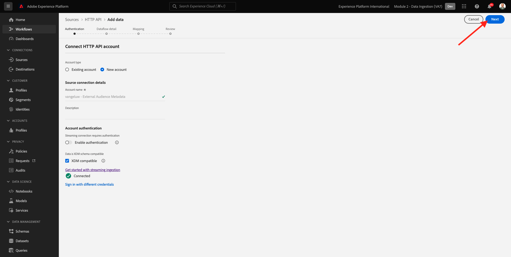
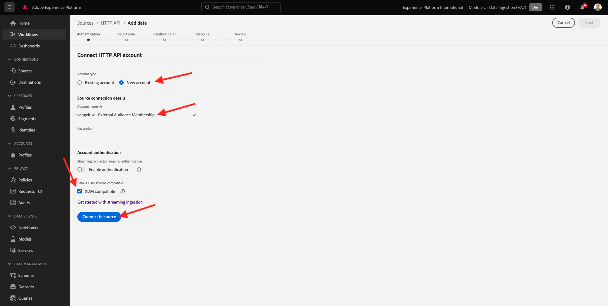
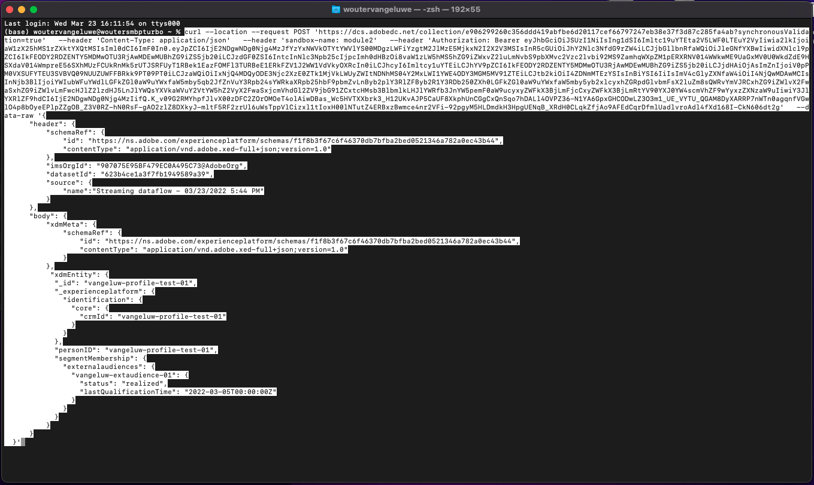
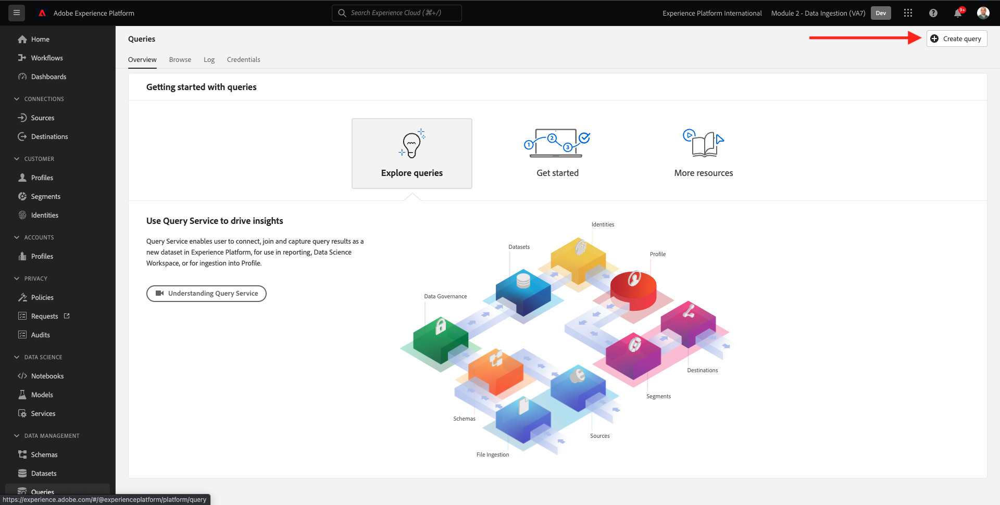
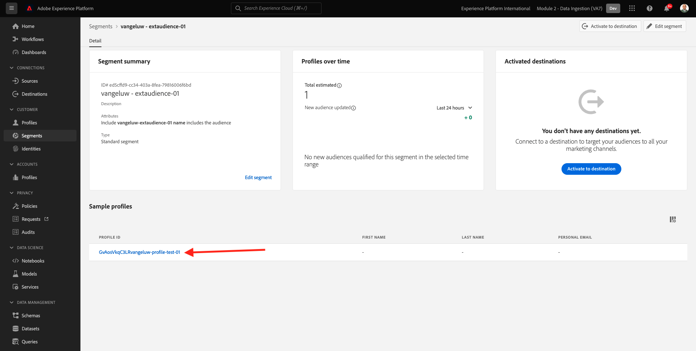

# 6.6外部受众

在许多情况下，您的公司可能希望使用来自其他应用程序的现有区段来丰富Adobe Experience Platform中的客户资料。
这些外部受众可能已根据数据科学模型或使用外部数据平台进行定义。

通过Adobe Experience Platform的外部受众功能，您可以专注于外部受众的摄取及其激活，而无需在Adobe Experience Platform中详细定义相应的区段定义。

整个过程分为三个主要步骤：

- 导入外部受众元数据：此步骤旨在将外部受众元数据（如受众名称）摄取到Adobe Experience Platform中。
- 将外部受众成员分配给客户配置文件：此步骤旨在使用外部区段成员资格属性扩充客户配置文件。
- 在Adobe Experience Platform中创建区段：此步骤旨在根据外部受众成员资格创建可操作的区段。

## 6.6.1元数据

转到 [Adobe Experience Platform](https://experience.adobe.com/platform). 登录后，您将登陆Adobe Experience Platform的主页。


>[!IMPORTANT]
>
>本练习使用的沙盒为 ``--module2sandbox--``!

在继续之前，您需要选择 **沙盒**. 要选择的沙盒已命名 ``--module2sandbox--``. 您可以通过单击 **[!UICONTROL 生产产品]** 的蓝线。 选择相应的 [!UICONTROL 沙盒]，您将看到屏幕更改，现在，您已加入您的专述 [!UICONTROL 沙盒].


虽然区段数据为用户档案成为区段一部分的条件进行定义，但区段元数据是有关区段的信息，如区段的名称、描述和状态。 由于外部受众元数据将存储在Adobe Experience Platform中，因此您需要使用身份命名空间在Adobe Experience Platform中摄取元数据。

## 6.6.1.1外部受众的身份命名空间

已为与 **外部受众**.
要查看已创建的身份，请转到 **标识**，并搜索 **外部**. 单击“外部受众”项目。

请注意：

- 身份符号 **外部受众** 将在后续步骤中使用，以引用外部受众标识。
- 的 **非人员标识符** 类型用于此身份命名空间，因为此命名空间不用于识别客户配置文件，而用于识别区段。


## 6.6.1.2创建外部受众元数据架构

外部受众元数据基于 **区段定义架构**. 您可以在 [XDM Github存储库](https://github.com/adobe/xdm/blob/master/docs/reference/classes/segmentdefinition.schema.md).

在左侧菜单中，转到架构。 单击 **+创建架构** 然后单击 **浏览**.


要分配类，请搜索 **区段定义**. 选择 **区段定义** 类和单击 **分配类**.


然后你会看到这个。 单击 **取消**.


然后你会看到这个。 选择字段 **_id**. 在右侧菜单中，向下滚动并启用 **身份** 和 **主标识** 复选框。 选择 **外部受众** 身份命名空间。 单击&#x200B;**应用**。


接下来，选择架构名称 **无标题架构**. 将名称更改为 `--demoProfileLdap-- - External Audiences Metadata`.


启用 **用户档案** 切换并确认。 最后，单击 **保存**.


## 6.6.1.3创建外部受众元数据数据集

在 **模式**，转到 **浏览**. 搜索并单击 `--demoProfileLdap-- - External Audiences Metadata` 架构。 接下来，单击 **从架构创建数据集**.


对于字段 **名称**，输入 `--demoProfileLdap-- - External Audience Metadata`. 单击 **创建数据集**.


然后你会看到这个。 不要忘记启用 **用户档案** 切换！


## 6.6.1.4创建HTTP API源连接

接下来，您需要配置HTTP API源连接器，以将元数据引入数据集。

转到 **源**. 在搜索字段中，输入 **HTTP**. 单击&#x200B;**“添加数据”**。


输入以下信息：

- **帐户类型**:选择 **新帐户**
- **帐户名称**:enter `--demoProfileLdap-- - External Audience Metadata`
- 选中复选框 **XDM兼容盒**

接下来，单击 **连接到源**.


然后你会看到这个。 单击&#x200B;**下一步**。



选择 **现有数据集** 在下拉菜单中，搜索并选择数据集 `--demoProfileLdap-- - External Audience Metadata`.

验证 **数据流详细信息** 然后单击 **下一个**.


然后你会看到这个。

的 **映射** 向导的步骤为空，因为您将要将符合XDM的有效负载摄取到HTTP API源连接器中，因此不需要映射。 单击&#x200B;**下一步**。


在 **审阅** 步骤您可以选择查看连接和映射详细信息。 单击&#x200B;**完成**。


然后你会看到这个。


## 6.6.1.5摄取外部受众元数据

在源连接器概述选项卡上，单击 **...** 然后单击 **复制架构负载**.


在计算机上打开文本编辑器应用程序并粘贴您刚刚复制的有效负载，如下所示。 接下来，您需要更新 **xdmEntity** 对象。


对象 **xdmEntity** 需要由以下代码替换。 复制以下代码，并通过将 **xdmEntity** 对象。

```
"xdmEntity": {
    "_id": "--demoProfileLdap---extaudience-01",
    "description": "--demoProfileLdap---extaudience-01 description",
    "segmentIdentity": {
      "_id": "--demoProfileLdap---extaudience-01",
      "namespace": {
        "code": "externalaudiences"
      }
    },
    "segmentName": "--demoProfileLdap---extaudience-01 name",
    "segmentStatus": "ACTIVE",
    "version": "1.0"
  }
```

然后，您应会看到以下内容：


接下来，打开一个新 **终端** 窗口。 复制文本编辑器中的所有文本并将其粘贴到终端窗口中。


下一步，点击 **输入**.

然后，您将在“终端”窗口中看到数据摄取的确认消息：


刷新HTTP API源连接器屏幕，此时您将看到正在处理数据：


## 6.6.1.6验证外部受众元数据摄取

完成处理后，您可以使用查询服务检查数据集中的数据可用性。

在右侧菜单中，转到 **数据集** ，然后选择 `--demoProfileLdap-- - External Audience Metadata` 之前创建的数据集。


在右侧菜单中，转到“查询”并单击 **创建查询**.


输入以下代码，然后点击 **SHIFT + ENTER**:

```
select * from --demoProfileLdap--_external_audience_metadata
```

在查询结果中，您将看到您摄取的外部受众的元数据。


## 6.6.2区段会员资格

利用可用的外部受众元数据，您现在可以获取特定客户配置文件的区段成员资格。

您现在需要准备一个针对区段成员资格架构扩充的用户档案数据集。 您可以在 [XDM Github存储库](https://github.com/adobe/xdm/blob/master/docs/reference/datatypes/segmentmembership.schema.md).

## 6.6.2.1创建外部受众成员资格架构

在右侧菜单中，转到 **模式**. 单击 **创建架构** 然后单击 **XDM个人配置文件**.


在 **添加字段组** 弹出窗口，搜索 **用户档案核心**. 选择 **配置文件核心v2** 字段组。


接下来，在 **添加字段组** 弹出窗口，搜索 **区段成员资格**. 选择 **区段成员资格详细信息** 字段组。 接下来，单击 **添加字段组**.


然后你会看到这个。 导航到字段 `--aepTenantId--.identification.core`. 单击 **crmId** 字段。 在右侧菜单中，向下滚动并检查 **身份** 和 **主标识** 复选框。 对于 **身份命名空间** 选择 **演示系统 — CRMID**.

单击&#x200B;**应用**。


接下来，选择架构名称 **无标题架构**. 在显示名称字段中，输入 `--demoProfileLdap-- - External Audiences Membership`.


接下来，启用 **用户档案** 切换并确认。 单击&#x200B;**保存**。


## 6.6.2.2创建外部受众成员资格数据集

在 **模式**，转到 **浏览**. 搜索并单击 `--demoProfileLdap-- - External Audiences Membership` 架构。 接下来，单击 **从架构创建数据集**.


对于字段 **名称**，输入 `--demoProfileLdap-- - External Audiences Membership`. 单击 **创建数据集**.


然后你会看到这个。 不要忘记启用 **用户档案** 切换！


## 6.6.2.3创建HTTP API源连接


接下来，您需要配置HTTP API源连接器，以将元数据引入数据集。

转到 **源**. 在搜索字段中，输入 **HTTP**. 单击&#x200B;**“添加数据”**。


输入以下信息：

- **帐户类型**:选择 **新帐户**
- **帐户名称**:enter `--demoProfileLdap-- - External Audience Membership`
- 选中复选框 **XDM兼容盒**

接下来，单击 **连接到源**.



然后你会看到这个。 单击&#x200B;**下一步**。


选择 **现有数据集** 在下拉菜单中，搜索并选择数据集 `--demoProfileLdap-- - External Audiences Membership`.

验证 **数据流详细信息** 然后单击 **下一个**.


然后你会看到这个。

的 **映射** 向导的步骤为空，因为您将要将符合XDM的有效负载摄取到HTTP API源连接器中，因此不需要映射。 单击&#x200B;**下一步**。


在 **审阅** 步骤您可以选择查看连接和映射详细信息。 单击&#x200B;**完成**。


然后你会看到这个。


## 6.6.2.4摄取外部受众会员数据

在源连接器概述选项卡上，单击 **...** 然后单击 **复制架构负载**.


在计算机上打开文本编辑器应用程序并粘贴您刚刚复制的有效负载，如下所示。 接下来，您需要更新 **xdmEntity** 对象。


对象 **xdmEntity** 需要由以下代码替换。 复制以下代码，并通过将 **xdmEntity** 对象。

```
  "xdmEntity": {
    "_id": "--demoProfileLdap---profile-test-01",
    "_experienceplatform": {
      "identification": {
        "core": {
          "crmId": "--demoProfileLdap---profile-test-01"
        }
      }
    },
    "personID": "--demoProfileLdap---profile-test-01",
    "segmentMembership": {
      "externalaudiences": {
        "--demoProfileLdap---extaudience-01": {
          "status": "realized",
          "lastQualificationTime": "2022-03-05T00:00:00Z"
        }
      }
    }
  }
```

然后，您应会看到以下内容：


接下来，打开一个新 **终端** 窗口。 复制文本编辑器中的所有文本并将其粘贴到终端窗口中。



下一步，点击 **输入**.

然后，您将在“终端”窗口中看到数据摄取的确认消息：


刷新HTTP API源连接器屏幕，几分钟后，您现在将看到正在处理数据：


## 6.6.2.5验证外部受众成员资格摄取

完成处理后，您可以使用查询服务检查数据集中的数据可用性。

在右侧菜单中，转到 **数据集** ，然后选择 `--demoProfileLdap-- - External Audiences Membership ` 之前创建的数据集。


在右侧菜单中，转到“查询”并单击 **创建查询**.



输入以下代码，然后点击 **SHIFT + ENTER**:

```
select * from --demoProfileLdap--_external_audiences_membership
```

在查询结果中，您将看到您摄取的外部受众的元数据。


## 6.6.3创建区段

现在，您便可以对外部受众采取操作。
在Adobe Experience Platform中，可通过创建区段、填充各个受众并将这些受众共享到相应目标，来实现您的行动。
您现在将使用刚刚创建的外部受众创建区段。

在左侧菜单中，转到 **区段** 单击 **创建区段**.


转到 **受众**. 然后你会看到这个。 单击 **外部受众**.


选择您之前创建的外部受众，该受众名为 `--demoProfileLdap---extaudience-01`. 将受众拖放到画布上。


为区段指定名称，使用 `--demoProfileLdap-- - extaudience-01`. 单击&#x200B;**保存并关闭**。


然后你会看到这个。 您还会注意到，为其摄取区段成员资格的配置文件现在显示在 **示例用户档案**.



您的区段现已准备就绪，可以发送到要激活的目标。

## 6.6.4可视化客户用户档案

您现在还可以在客户用户档案中显示区段资格。 转到 **用户档案**，使用身份命名空间 **演示系统 — CRMID** 提供身份 `--demoProfileLdap---profile-test-01`，在练习6.6.2.4时使用，然后单击 **查看**. 接下来，单击 **配置文件ID** 打开用户档案。


转到 **区段成员资格**，此时您将看到外部受众。


下一步： [6.7目标SDK](./ex7.md)

[返回到模块6](./real-time-cdp-build-a-segment-take-action.md)

[返回到所有模块](../../overview.md)
