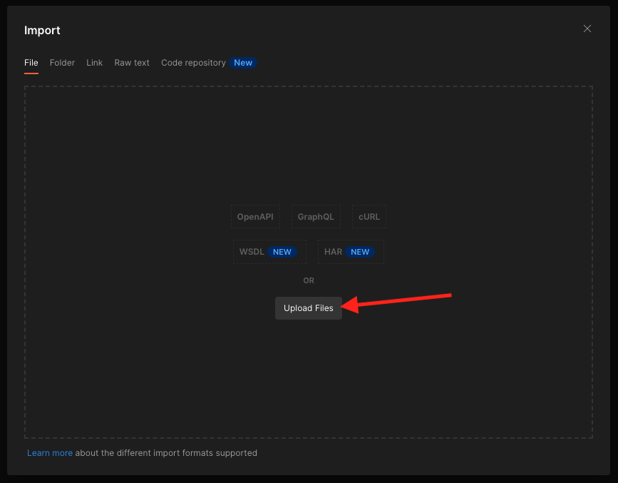

# 6.7目标SDK

## 6.7.1设置您的Adobe I/O项目

>[!IMPORTANT]
>
>如果您在2021年12月之后创建了Adobe I/O项目，则可以重复使用该项目，跳过本练习，并立即转到练习6.7.2。
>
>如果您在2021年12月之前创建了Adobe I/O项目，请创建一个新项目，以确保它与目标创作API兼容。

在本练习中，您将会非常密集地使用Adobe I/O来查询Platform的API。 请按照以下步骤设置Adobe I/O。

转到 [https://developer.adobe.com/console/home](https://developer.adobe.com/console/home)


确保在屏幕的右上角选择正确的Adobe Experience Platform实例。 您的实例为 `--envName--`.


单击 **创建新项目**.

 或


选择 **+添加到项目** 选择 **API**.


然后您将看到：


单击 **Adobe Experience Platform** 图标。


单击 **Experience PlatformAPI**.


单击&#x200B;**下一步**。


现在，您可以选择让Adobe I/O生成您的安全密钥对，或上传现有密钥对。

选择 **选项1 — 生成键对**.


单击 **生成密钥对**.


你会看到旋转器30秒。


然后，您将看到此内容，并且生成的密钥对将下载为zip文件： **config.zip**.

解压缩文件 **config.zip** 在桌面上，您将看到它包含2个文件：


- **certificate_pub.crt** 是您的公钥证书。 从安全角度来看，这是免费用于设置与在线应用程序集成的证书。
- **private.key** 是您的私钥。 这永远不应该和任何人分享。 私钥是您用于对API实施进行身份验证的密钥，应为密钥。 如果您与任何人共享您的私钥，他们便可以访问您的实施，并滥用API将恶意数据摄取到平台中，并提取位于平台中的所有数据。


确保保存 **config.zip** 文件，因为您在后续步骤中以及将来访问Adobe I/O和Adobe Experience Platform API时都需要此文件。

单击&#x200B;**下一步**。


您现在必须选择 **产品配置文件** ，以便进行集成。

选择所需的产品配置文件。

**FYI**:在您的Adobe Experience Platform实例中，产品配置文件将具有不同的名称。 您需要至少选择一个具有适当访问权限的产品配置文件，这些权限在Adobe Admin Console中设置。


单击 **保存配置的API**.


你会看到旋转器几秒钟。


接下来，您将看到集成。


单击 **下载Postman版** 按钮，然后单击 **服务帐户(JWT)** 要下载Postman环境（等到下载环境，可能需要几秒钟）。


向下滚动直到您看到 **服务帐户(JWT)**，您可以在其中找到用于配置与Adobe Experience Platform集成的所有集成详细信息。


您的IO项目当前具有通用名称。 您需要为集成提供一个易记名称。 单击 **项目1** (或类似名称，如


单击 **编辑项目**.


输入集成的名称和描述。 作为命名规范，我们将使用 `AEP API --demoProfileLdap--`. 将ldap替换为ldap。
例如，如果ldap为vangeluw，则集成的名称和描述将变为AEP API vangeluw。

输入 `AEP API --demoProfileLdap--` 作为 **项目标题**. 单击&#x200B;**保存**。


您的Adobe I/O集成现已完成。


## 6.7.2Postman身份验证到Adobe I/O

转到 [https://www.getpostman.com/](https://www.getpostman.com/).

单击 **入门**.


接下来，下载并安装Postman。


安装Postman后，启动应用程序。

在Postman中，有2个概念：环境和收藏集。

- “环境”包含所有或多或少一致的环境变量。 在环境中，您会找到诸如我们平台环境的IMSOrg之类的内容，以及诸如您的私钥和其他内容之类的安全凭据。 在上一个练习中的Adobe I/O设置过程中下载的环境文件，其名称如下所示： **service.postman_environment.json**.

- 该集合包含许多可供使用的API请求。 我们将使用2个集合
   - 1个用于对AdobeI/0进行身份验证的集合
   - 1收集本模块中的练习
   - 1个集合，用于Real-Time CDP模块中的练习，用于目标创作

请下载文件 [postman.zip](../../assets/postman/postman_profile.zip) 到本地桌面。

在此 **postman.zip** 文件中，您将找到以下文件：

- `_Adobe I-O - Token.postman_collection.json`
- `_Adobe Experience Platform Enablement.postman_collection.json`
- `Destination_Authoring_API.json`

解压缩 **postman.zip** 将这3个文件文件并存储在桌面上的文件夹中，以及从Adobe I/O下载的Postman环境中。您需要在该文件夹中包含以下4个文件：


回Postman。 单击&#x200B;**导入**。


单击 **上传文件**.



导航到桌面上的文件夹，您已在其中解压了4个下载的文件。 同时选择这4个文件并单击 **打开**.


单击后 **打开**, Postman将向您显示要导入的环境和收藏集的概述。 单击&#x200B;**导入**。


现在，您可以在Postman中获得开始通过API与Adobe Experience Platform交互所需的一切功能。

首先要确保你的身份正确。 要进行身份验证，您需要请求访问令牌。

在执行任何请求之前，请确保已选择正确的环境。 您可以通过验证右上角的环境下拉列表来检查当前选定的环境。

所选环境的名称应与以下名称类似：


单击 **眼睛** 图标，然后单击 **编辑** 更新环境文件中的私钥。


然后你会看到这个。 除字段外，所有字段都已预填充 **PRIVATE_KEY**.


在创建Adobe I/O项目时，已生成私钥。 它被下载为zip文件，名为 **config.zip**. 将该zip文件解压缩到桌面。


打开文件夹 **配置** 然后打开文件 **private.key** 选择文本编辑器。


然后，您将看到类似于此的内容，将所有文本复制到剪贴板。


返回Postman，并将私钥粘贴到变量旁边的字段中 **PRIVATE_KEY**，用于两个列 **初始值** 和 **当前值**. 单击&#x200B;**保存**。


您的Postman环境和收藏集现已配置完毕并可正常使用。 您现在可以从Postman到Adobe I/O进行身份验证。

要实现此目的，您需要加载一个外部库，该库将负责通信的加密和解密。 要加载此库，必须使用名称执行请求 **初始化：加载RS256加密库**. 在 **_Adobe I/O — 令牌集合** 你会看到它显示在屏幕中间。


单击蓝色 **发送** 按钮。 几秒钟后，您应会在 **正文** Postman部分：


现在加载加密库后，我们可以对Adobe I/O进行身份验证。

在 **\_Adobe I/O — 令牌集合**，选择名为的请求 **IMS:JWT生成+身份验证**. 再次重申，您将看到请求详细信息显示在屏幕中间。


单击蓝色 **发送** 按钮。 几秒钟后，您应会在 **正文** Postman部分：


如果配置成功，您应会看到包含以下信息的类似响应：

| 键 | 值 |
|:-------------:| :---------------:| 
| token_type | **载体** |
| access_token | **eyJ4NXUiOiJpbXNfbmEx..QT7mqZkumN1tdsPEioOEl4087Dg** |
| expires_in | **86399973** |

Adobe I/O给了您一个 **载体**-token ，具有特定值（这个非常长的access_token）和过期时间窗口。

我们收到的令牌现在有效24小时。 这意味着在24小时后，如果您要使用Postman进行Adobe I/O身份验证，则必须再次运行此请求以生成新令牌。

## 6.7.3定义端点和格式

在本练习中，您将需要一个端点来配置，以便当区段符合条件时，可以将鉴别事件流式传输到该端点。 在本练习中，您将使用 [https://webhook.site/](https://webhook.site/). 转到 [https://webhook.site/](https://webhook.site/)，您将看到与此类似的内容。 单击 **复制到剪贴板** 以复制url。 您需要在下一个练习中指定此url。 此示例中的URL是 `https://webhook.site/e0eb530c-15b4-4a29-8b50-e40877d5490a`.


至于格式，我们将使用标准模板来流式传输区段资格或取消资格，以及元数据（如客户标识符）。 可以自定义模板以满足特定端点的期望，但在本练习中，我们将重复使用标准模板，该模板将产生像这样的负载，该负载将流式传输到端点。

```json
{
  "profiles": [
    {
      "identities": [
        {
          "type": "ecid",
          "id": "64626768309422151580190219823409897678"
        }
      ],
      "AdobeExperiencePlatformSegments": {
        "add": [
          "f58c723c-f1e5-40dd-8c79-7bb4ab47f041"
        ],
        "remove": []
      }
    }
  ]
}
```

## 6.7.4创建服务器和模板配置

在Adobe Experience Platform中创建您自己的目标的第一步是创建服务器和模板配置。

为此，请转至 **目标创作API**，更改为 **目标服务器和模板** ，然后单击以打开请求 **POST — 创建目标服务器配置**. 然后你会看到这个。 在 **标题**，您需要手动更新键的值 **x-sandbox-name** 将其设置为 `--aepSandboxId--`. 选择值 **{{SANDBOX_NAME}}**.


替换为 `--aepSandboxId--`.


接下来，转到 **正文**. 选择占位符 **{{body}}**.


现在，您需要替换占位符 **{{body}}** 按以下代码：

```json
{
    "name": "Custom HTTP Destination",
    "destinationServerType": "URL_BASED",
    "urlBasedDestination": {
        "url": {
            "templatingStrategy": "PEBBLE_V1",
            "value": "yourURL"
        }
    },
    "httpTemplate": {
        "httpMethod": "POST",
        "requestBody": {
            "templatingStrategy": "PEBBLE_V1",
            "value": "{\n    \"profiles\": [\n    \n        {\n            \"identities\": [\n            \n            \n                \n                {\n                    \"type\": \"{{ namespace }}\",\n                    \"id\": \"{{ identity.id }}\"\n                },\n                ,\n            \n            ],\n            \"AdobeExperiencePlatformSegments\": {\n                \"add\": [\n                \n                    \"{{ segment.key }}\",\n                \n                ],\n                \"remove\": [\n                {#- Alternative syntax for filtering segments by status: -#}\n                \n                    \"{{ segment.key }}\",\n                \n                ]\n            }\n        },\n    \n    ]\n}"
        },
        "contentType": "application/json"
    }
}
```

粘贴上述代码后，您需要手动更新字段 **urlBasedDestination.url.value**，并且您需要将其设置为上一步中创建的webhook的url，该步骤为 `https://webhook.site/e0eb530c-15b4-4a29-8b50-e40877d5490a` 在本例中。


更新字段后 **urlBasedDestiantion.url.value**，则应该如下所示。 单击 **发送**.


单击 **发送**，则将创建服务器模板，并且在响应中，您将看到一个名为的字段 **instanceId**. 记下来，因为下一步需要它。 在本例中， **instanceId** is
`eb0f436f-dcf5-4993-a82d-0fcc09a6b36c`.


## 6.7.5创建目标配置

在Postman，在 **目标创作API**，转到 **目标配置** ，然后单击以打开请求 **POST — 创建目标配置**. 然后你会看到这个。 在 **标题**，您需要手动更新键的值 **x-sandbox-name** 将其设置为 `--aepSandboxId--`. 选择值 **{{SANDBOX_NAME}}**.


替换为 `--aepSandboxId--`.


接下来，转到 **正文**. 选择占位符 **{{body}}**.


现在，您需要替换占位符 **{{body}}** 按以下代码：

```json
{
    "name": "--demoProfileLdap-- - Webhook",
    "description": "Exports segment qualifications and identities to a custom webhook via Destination SDK.",
    "status": "TEST",
    "customerAuthenticationConfigurations": [
        {
            "authType": "BEARER"
        }
    ],
    "customerDataFields": [
        {
            "name": "endpointsInstance",
            "type": "string",
            "title": "Select Endpoint",
            "description": "We could manage several instances across the globe for REST endpoints that our customers are provisioned for. Select your endpoint in the dropdown list.",
            "isRequired": true,
            "enum": [
                "US",
                "EU",
                "APAC",
                "NZ"
            ]
        }
    ],
    "uiAttributes": {
        "documentationLink": "https://experienceleague.adobe.com/docs/experience-platform/destinations/home.html?lang=en",
        "category": "streaming",
        "connectionType": "Server-to-server",
        "frequency": "Streaming"
    },
    "identityNamespaces": {
        "ecid": {
            "acceptsAttributes": true,
            "acceptsCustomNamespaces": false
        }
    },
    "segmentMappingConfig": {
        "mapExperiencePlatformSegmentName": true,
        "mapExperiencePlatformSegmentId": true,
        "mapUserInput": false
    },
    "aggregation": {
        "aggregationType": "BEST_EFFORT",
        "bestEffortAggregation": {
            "maxUsersPerRequest": "1000",
            "splitUserById": false
        }
    },
    "schemaConfig": {
        "profileRequired": false,
        "segmentRequired": true,
        "identityRequired": true
    },
    "destinationDelivery": [
        {
            "authenticationRule": "NONE",
            "destinationServerId": "yourTemplateInstanceID"
        }
    ]
}
```


粘贴上述代码后，您需要手动更新字段 **destinationDelivery。 destinationServerId**，您需要将其设置为 **instanceId** 您在上一步中创建的目标服务器模板( `eb0f436f-dcf5-4993-a82d-0fcc09a6b36c` 在本例中。 下一步，单击 **发送**.


然后，您将看到此响应。


您的目标现在已在Adobe Experience Platform中创建。 我们去那里检查一下。

转到 [Adobe Experience Platform](https://experience.adobe.com/platform). 登录后，您将登陆Adobe Experience Platform的主页。


在继续之前，您需要选择 **沙盒**. 要选择的沙盒已命名 ``--aepSandboxId--``. 您可以通过单击 **[!UICONTROL 生产产品]** 的蓝线。 选择相应的 [!UICONTROL 沙盒]，您将看到屏幕更改，现在，您已加入您的专述 [!UICONTROL 沙盒].


在左侧菜单中，转到 **目标**，单击 **目录** 并向下滚动到类别 **流**. 您将在此处看到您的目的地。


## 6.7.6将区段关联到目标

在 **目标** > **目录**，单击 **设置** ，以开始将区段添加到新目标。


输入虚拟载体令牌，如 **1234**. 单击 **连接到目标**.


然后你会看到这个。 作为目标的名称，请使用 `--demoProfileLdap-- - Webhook`. 在本例中，选择选择的端点 **欧盟**. 单击&#x200B;**下一步**。


您可以选择数据管理策略。 单击&#x200B;**下一步**。


选择之前创建的区段，该区段名为 `--demoProfileLdap-- - Interest in PROTEUS FITNESS JACKSHIRT`. 单击&#x200B;**下一步**。


然后你会看到这个。 确保映射 **源字段** `--aepTenantId--.identification.core.ecid` 到字段 `Identity: ecid`. 单击&#x200B;**下一步**。


单击&#x200B;**完成**。


您的目标现已上线，新的客户细分资格将立即流式传输到您的自定义Webhook。


## 6.7.7测试区段激活

转到 [https://builder.adobedemo.com/projects](https://builder.adobedemo.com/projects). 使用Adobe ID登录后，您将看到此内容。 单击您的网站项目以将其打开。


您现在可以按照以下流程访问网站。 单击 **集成**.


在 **集成** 页面，您需要选择在练习0.1中创建的数据收集属性。


然后，您将看到您的演示网站已打开。 选择URL并将其复制到剪贴板。


打开新的隐身浏览器窗口。


粘贴您在上一步中复制的演示网站的URL。 然后，系统将要求您使用Adobe ID登录。


选择您的帐户类型并完成登录过程。


然后，您将在无痕浏览器窗口中看到您的网站已加载。 对于每个演示，您需要使用全新的、隐身的浏览器窗口来加载演示网站URL。


从 **卢马** 主页，转到 **男**，然后单击产品 **PROTEUS健身长衫**.


您现在访问了 **PROTEUS健身长衫**，这意味着您现在将符合在本练习之前创建的区段的资格。


当您打开配置文件查看器，然后转到 **区段**，您将看到区段的资格。


现在回到你打开的网钩上 [https://webhook.site/](https://webhook.site/)，此时您应会看到一个新的传入请求，该请求源自Adobe Experience Platform，其中包含区段鉴别事件。


下一步： [摘要和优点](./summary.md)

[返回到模块6](./real-time-cdp-build-a-segment-take-action.md)

[返回到所有模块](../../overview.md)
