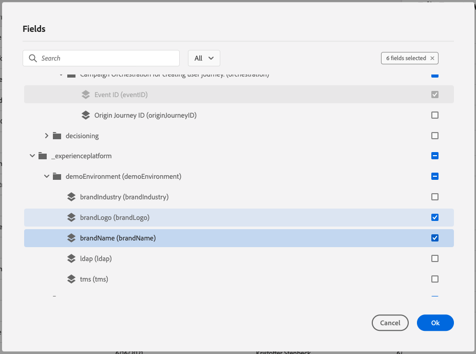

# 7.1创建事件

通过转到Adobe Journey Optimizer [Adobe Experience Cloud](https://experience.adobe.com). 单击 **Journey Optimizer**.

您将被重定向到 **主页**  查看Journey Optimizer。 首先，确保您使用的是正确的沙盒。 要使用的沙盒称为 `--aepSandboxId--`. 要从一个沙盒更改为另一个沙盒，请单击 **生产产品(VA7)** 并从列表中选择沙盒。 在此示例中，沙盒名为 **2022财年AEP启用**. 然后你会在 **主页** 沙盒视图 `--aepSandboxId--`.

在左侧菜单中，向下滚动并单击 **配置**. 接下来，单击 **管理** 按钮 **事件**.

然后，您将看到所有可用事件的概述。 单击 **创建事件** 以开始创建您自己的事件。

随后将弹出一个新的空事件窗口。

首先，为您的事件指定如下名称： `--demoProfileLdap--AccountCreationEvent`.

接下来，添加如下描述 `Account Creation Event`.

接下来，确保 **类型** 设置为 **单一**、和 **事件ID类型** 选择，选择 **系统生成**.

接下来是架构选择。 为本练习准备了一个模式。 请使用架构 `Demo System - Event Schema for Website (Global v1.1) v.1`.

选择架构后，您将在 **负载** 中。 现在，您应将鼠标悬停在 **负载** 部分，您将看到3个图标弹出窗口。 单击 **编辑** 图标。

你会看到 **字段** 窗口弹出窗口，您需要在其中选择一些个性化电子邮件所需的字段。  我们稍后将使用Adobe Experience Platform中已有的数据选择其他配置文件属性。

在对象中 `--aepTenantId--.demoEnvironment`，请确保选择字段 **brandLogo** 和 **brandName**.

在对象中 `--aepTenantId--.identification.core`，请确保选择字段 **电子邮件**.

单击 **确定** 以保存更改。

然后，您应会看到以下内容：

单击 **保存** 再次保存更改。

您的事件现已配置并保存。

再次单击您的事件以打开 **编辑事件** 屏幕。 将鼠标悬停在 **负载** 字段，以再次查看3个图标。 单击 **查看有效负载** 图标。

您现在将看到预期有效负载的示例。

您的事件具有唯一的编排事件ID，您可以通过在该有效负载中向下滚动直到您看到为止，来查找该事件 `_experience.campaign.orchestration.eventID`.

事件ID是需要发送到Adobe Experience Platform的历程，以便触发您将在练习7.2中构建的事件。请记住此eventID，因为您将在练习7.3中需要它。
`"eventID": "227402c540eb8f8855c6b2333adf6d54d7153d9d7d56fa475a6866081c574736"`

单击 **确定**，然后单击 **取消**.

你现在已经完成了这个练习。

下一步： [7.2Journey Optimizer:创建历程和电子邮件消息](./ex2.md)

[返回到模块7](./journey-orchestration-create-account.md)

[返回到所有模块](../../overview.md)
