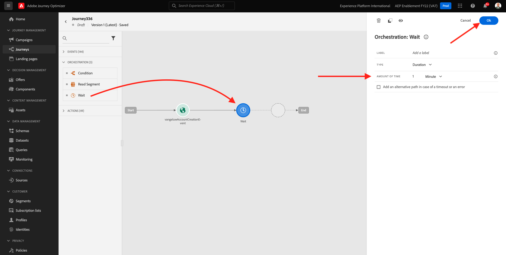
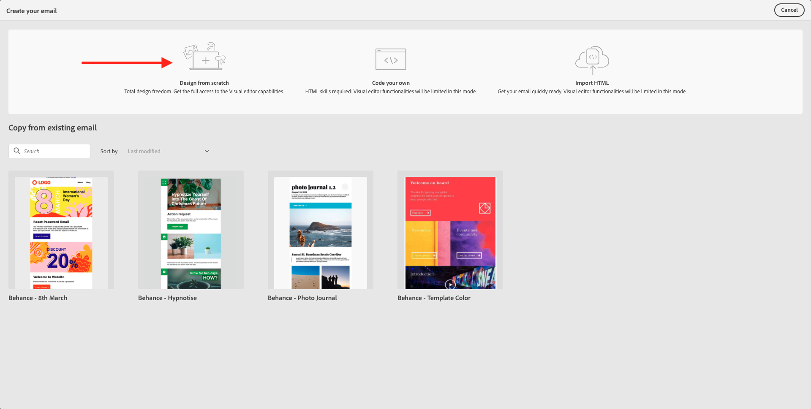
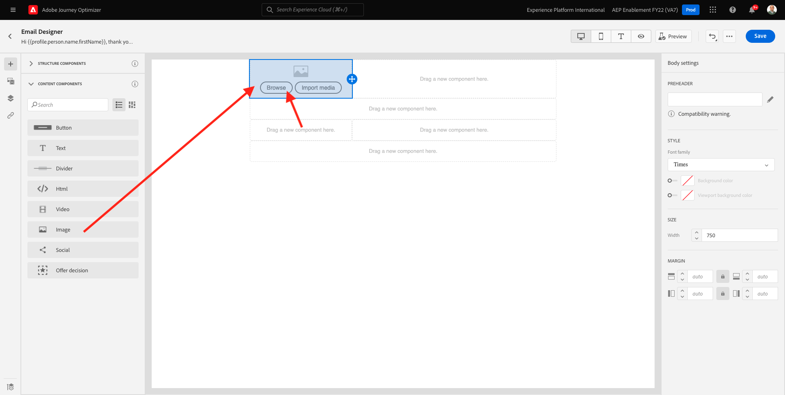
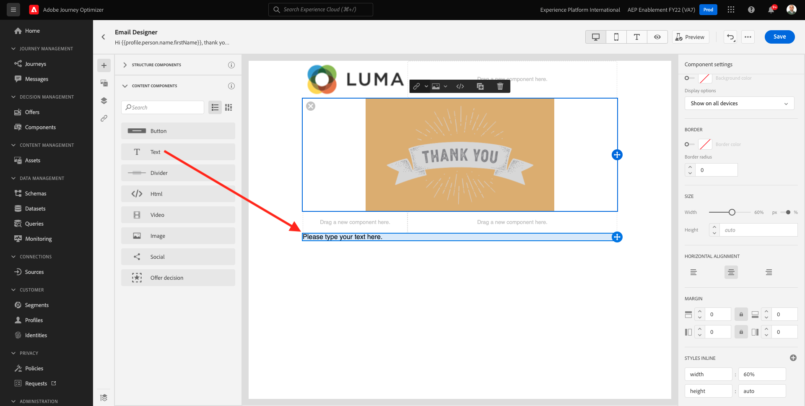
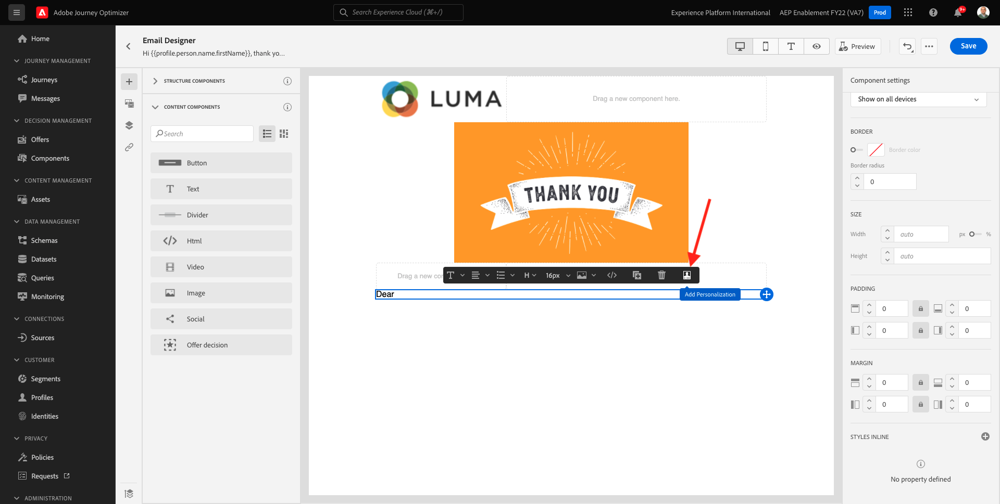

# 7.2创建历程和电子邮件消息

在本练习中，您将配置用户在演示网站上创建帐户时需要触发的历程和消息。

通过转到Adobe Journey Optimizer [Adobe Experience Cloud](https://experience.adobe.com). 单击 **Journey Optimizer**.

您将被重定向到 **主页**  查看Journey Optimizer。 首先，确保您使用的是正确的沙盒。 要使用的沙盒称为 `--aepSandboxId--`. 要从一个沙盒更改为另一个沙盒，请单击 **生产产品(VA7)** 并从列表中选择沙盒。 在此示例中，沙盒名为 **2022财年AEP启用**. 然后你会在 **主页** 沙盒视图 `--aepSandboxId--`.

## 7.2.1创建历程

在左侧菜单中，单击 **历程**. 接下来，单击 **创建历程** 以创建新历程。

然后，您将看到一个空历程屏幕。

在上一个练习中，您创建了一个 **事件**. 你这样命名的 `ldapAccountCreationEvent` 替换 `ldap` 的URL。 这是事件创建的结果：

现在，您需要将此事件作为此历程的开始。 为此，您可以转到屏幕左侧，并在事件列表中搜索您的事件。

选择您的事件，将其拖放到历程画布上。 您的历程现在如下所示：

作为历程的第二步，您需要添加一个 **等待** 中。 转到屏幕的左侧，转到 **编排** 中找到此内容。 您将使用配置文件属性，并且需要确保将其填充到实时客户配置文件中。

你的旅程现在是这样。 您需要在屏幕右侧配置等待时间。 设置为1分钟。 这将为在事件触发后配置文件属性的可用性提供充足的时间。

单击 **确定** 以保存更改。

作为历程的第三步，您需要添加 **电子邮件** 操作。 转到屏幕左侧的 **操作**，选择 **电子邮件** 操作，然后将其拖放到历程中的第二个节点。 你现在看到这个。

设置 **类别** to **营销** 并选择用于发送电子邮件的电子邮件界面。 在这种情况下，要选择的电子邮件界面是 **电子邮件**. 确保对应的复选框 **电子邮件的点击** 和 **电子邮件打开** 都已启用。

下一步是创建消息。 要实现此目的，请单击 **编辑内容**.

## 7.2.2创建消息

要创建消息，请单击 **编辑内容**.

你现在看到这个。

单击 **主题行** 文本。

在文本区域中开始写入 **你好**

主题行尚未完成。 接下来，您需要为字段引入个性化令牌 **名字** 存储在 `profile.person.name.firstName`. 在左侧菜单中，向下滚动以查找 **人员** 元素并单击箭头可更深入地查看级别。

现在，查找 **全名** 元素并单击箭头可更深入地查看级别。

最后，找到 **名字** ，然后单击 **+** 签到旁边。 然后，您将看到文本字段中会显示个性化令牌。

接下来，添加文本 **，感谢您注册！**&#x200B;的问题。单击&#x200B;**保存**。

然后你会回来。 单击 **Email Designer** 以创建电子邮件的内容。

在下一个屏幕中，系统将显示3种提供电子邮件内容的不同方法：

- **从头开始设计**:从空白画布开始，然后使用WYSIWYG编辑器拖放结构和内容组件以直观地构建电子邮件的内容。
- **编码您自己的**:使用HTML对电子邮件模板进行编码，以创建您自己的电子邮件模板
- **导入HTML**:导入现有HTML模板，您将能够对其进行编辑。

单击 **从头开始设计**.

在左侧菜单中，您将找到可用于定义电子邮件结构（行和列）的结构组件。

拖放 **左1:2列** 菜单中。 这将是徽标图像的占位符。

拖放 **1:1列** 在上一个组件下。 这将是横幅块。

拖放 **左1:2列** 在上一个组件下。 这将是实际内容，左侧为图像，右侧为文本。

接下来，拖放 **1:1列** 在上一个组件下。 这将是电子邮件的页脚。 您的画布现在应当如下所示：

接下来，让我们使用内容组件在这些块中添加内容。 单击 **内容组件** 菜单项目

拖放 **图像** 组件。 单击&#x200B;**浏览**。

然后你会看到这个。 导航到文件夹 **启用资产** 并选择文件 **luma-logo.png**. 单击&#x200B;**选择**。

你现在回来了：

转到 **内容组件** 拖放 **图像** 组件。 单击&#x200B;**浏览**。

在 **资产** 弹出窗口，转到 **启用资产** 文件夹。 在此文件夹中，您将找到创意团队之前准备并上传的所有资产。 选择 **module23-thankyou-new.png** 单击 **选择**.

然后，您将拥有：

选择您的图像，在右侧菜单中，向下滚动直到您看到 **大小** 宽度滑块组件。 使用滑块将宽度更改为f.i。 **60%**.

接下来，转到 **内容组件** 拖放 **文本** 组件。

选择默认文本 **请在此处键入您的文本。** 与使用任何文本编辑器时一样。 写入 **亲爱的** 中。 请注意在文本模式下显示的文本工具栏。

在工具栏中，单击 **添加个性化** 图标。

接下来，您需要将 **名字** 存储在 `profile.person.name.firstName`. 在菜单中，找到 **人员** 元素，向下展开到 **全名** 元素，然后单击 **+** 图标将名字字段添加到表达式编辑器中。

单击&#x200B;**保存**。

现在，您会注意到个性化字段是如何添加到文本的。

在同一文本字段中，点击 **输入** 添加两行并写入 **感谢您为Luma创建帐户！**.

要执行最终检查以确保电子邮件已准备就绪以进行预览，请单击 **模拟内容** 按钮。

首先，确定要用于预览的用户档案。 选择 **电子邮件** 命名空间，方法是单击 **输入身份命名空间** 字段。

在身份命名空间列表中，选择 **电子邮件** 命名空间。

在 **标识值** 字段中，输入已存储在实时客户用户档案中的上一个演示用户档案的电子邮件地址。 例如 **woutervangeluwe+06022022-01@gmail.com** 并单击 **查找测试用户档案** 按钮

在您的用户档案显示在表格中后，单击 **预览** 选项卡来访问预览屏幕。

预览准备就绪后，验证主题行中的个性化是否正确，将以超链接形式突出显示正文文本和退订链接。

单击 **关闭** 来关闭预览。

单击 **保存** 来保存您的消息。

通过单击 **箭头** 主题行文本旁边的。

您现在已完成创建注册电子邮件。 单击左上角的箭头以返回您的历程。

单击 **确定**.

## 7.2.3发布历程

您仍需要为历程提供一个名称。 为此，您可以单击 **属性** 图标。

然后，您可以在此处输入历程的名称。 请使用 `--demoProfileLdap-- - Account Creation Journey`. 单击 **确定** 以保存更改。

您现在可以通过单击 **发布**.

单击 **发布** 再次。

然后，您将看到一个绿色确认栏，表示您的历程现已发布。

你现在已经完成了这个练习。

下一步： [7.3更新数据收集资产并测试历程](./ex3.md)

[返回到模块7](./journey-orchestration-create-account.md)

[返回到所有模块](../../overview.md)
