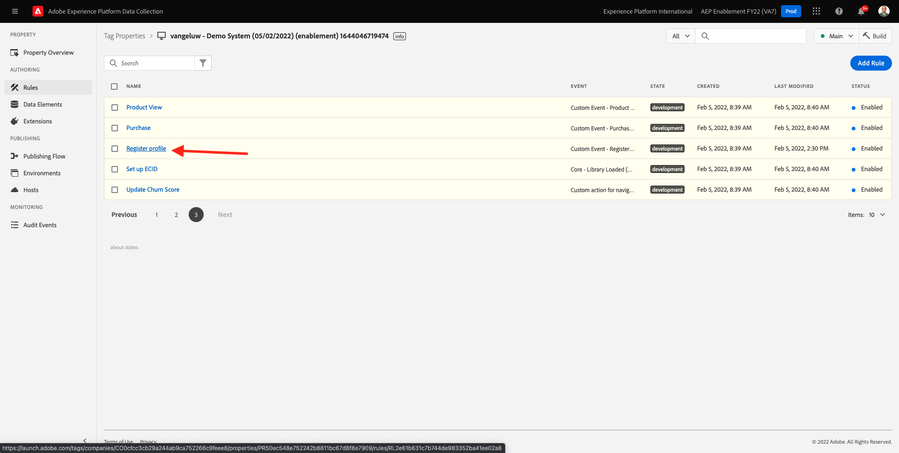
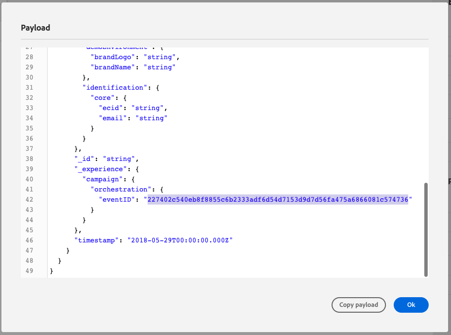
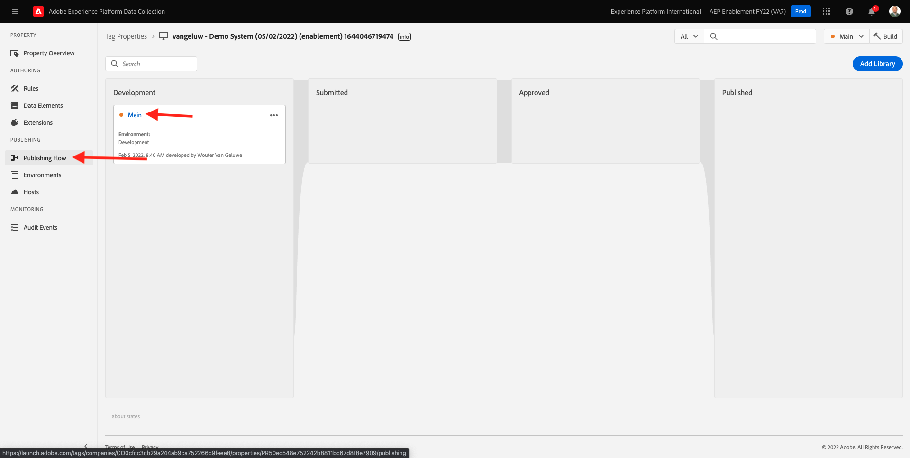
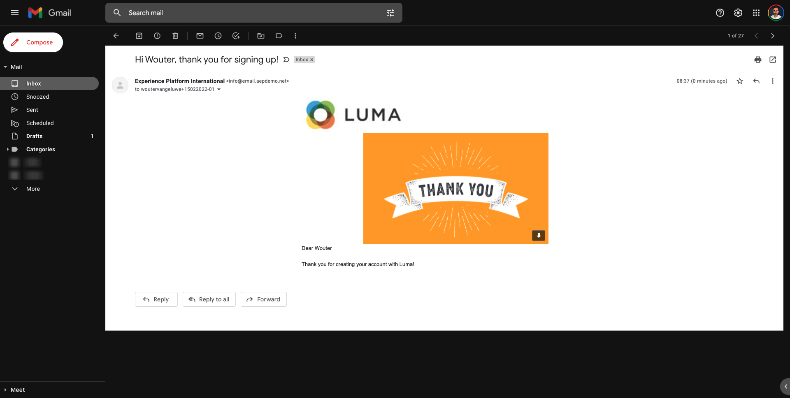

# 7.3更新数据收集资产并测试历程

## 7.3.1更新数据收集资产

转到 [Adobe Experience Platform数据收集](https://experience.adobe.com/launch/) 选择 **标记**.

这是您之前看到的Adobe Experience Platform数据收集属性页面。

在模块0中，演示系统为您创建了两个客户端属性：一个用于网站，一个用于移动设备应用程序。 通过搜索来查找 `--demoProfileLdap--` 在 **[!UICONTROL 搜索]** 框中。 单击以打开 **Web** 属性。

然后你会看到这个。

在左侧菜单中，转到 **规则** 和搜索规则 **注册用户档案**. 单击规则 **注册用户档案** 打开它。

然后，您将看到此规则的详细信息。 单击以打开操作 **将“注册事件”发送到AEP — 触发JO**.

然后，您将看到触发此操作时，会使用特定的数据元素来定义XDM数据结构。 您需要更新该数据元素，并且您需要定义 **事件ID** 的 [练习7.1](./ex1.md).

您现在需要更新数据元素 **XDM — 注册事件**. 要执行此操作，请转到 **数据元素**. 搜索 **XDM — 注册事件** 并单击以打开该数据元素。

然后您将看到：

导航到字段 `_experience.campaign.orchestration.eventID`. 删除当前值，并将您的eventID粘贴到此处。

事件ID位于Adobe Journey Optimizer的 **“配置”>“事件”** 然后，您将在even的示例有效负载中找到事件ID，如下所示： `"eventID": "227402c540eb8f8855c6b2333adf6d54d7153d9d7d56fa475a6866081c574736"`.

粘贴eventID后，屏幕应该如下所示。 接下来，单击 **保存** 或 **保存到库**.

最后，您需要发布更改。 转到 **发布流程** 中。

单击 **Add All Changed Resources** 然后单击 **保存并构建到开发环境**.

随后将更新您的库，1-2分钟后，您可以继续并测试您的配置。

## 7.3.2测试历程

转到 [https://builder.adobedemo.com/projects](https://builder.adobedemo.com/projects). 使用Adobe ID登录后，您将看到此内容。 单击您的网站项目以将其打开。

在 **Screens** 页面，单击 **运行**.

然后，您将看到您的演示网站已打开。 选择URL并将其复制到剪贴板。

打开新的隐身浏览器窗口。

粘贴您在上一步中复制的演示网站的URL。 然后，系统将要求您使用Adobe ID登录。

选择您的帐户类型并完成登录过程。

然后，您将在无痕浏览器窗口中看到您的网站已加载。 对于每个演示，您需要使用全新的、隐身的浏览器窗口来加载演示网站URL。

单击屏幕左上角的Adobe徽标图标以打开“配置文件查看器”。

查看“配置文件查看器”面板和“实时客户配置文件”，其中 **Experience CloudID** 作为此当前未知客户的主要标识符。

转到注册/登录页面。 单击 **创建帐户**.

填写详细信息并单击 **注册** 之后，您将被重定向到上一页。

打开“配置文件查看器”面板，然后转到“实时客户配置文件”。 在“配置文件查看器”面板上，您应会看到显示的所有个人数据，如新添加的电子邮件和电话标识符。

创建帐户1分钟后，您将收到来自Adobe Journey Optimizer的帐户创建电子邮件。

下一步： [摘要和优点](./summary.md)

[返回到模块7](./journey-orchestration-create-account.md)

[返回到所有模块](../../overview.md)
