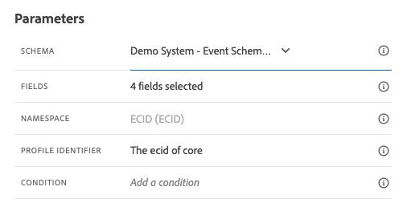

# 8.1定义事件

通过转到Adobe Journey Optimizer [Adobe Experience Cloud](https://experience.adobe.com). 单击 **Journey Optimizer**.

您将被重定向到 **主页**  查看Journey Optimizer。 首先，确保您使用的是正确的沙盒。 要使用的沙盒称为 `--aepSandboxId--`. 要从一个沙盒更改为另一个沙盒，请单击 **生产产品(VA7)** 并从列表中选择沙盒。 在此示例中，沙盒名为 **2022财年AEP启用**. 然后你会在 **主页** 沙盒视图 `--aepSandboxId--`.

在左侧菜单中，向下滚动并单击 **配置**. 接下来，单击 **管理** 按钮 **事件**.

然后，您将看到所有可用事件的概述。 单击 **创建事件** 以开始创建您自己的事件。

随后将弹出一个新的空事件窗口。

作为事件的名称，请使用 `--demoProfileLdap--GeofenceEntry`. 在此示例中，事件名称为 `vangeluwGeofenceEntry`.

将描述设置为： `Geofence Entry Event`.

接下来，确保 **类型** 设置为 **单一**、和 **事件ID类型** 选择，选择 **系统生成**

接下来，您需要选择一个架构。 此处显示的所有架构都是Adobe Experience Platform架构。

您会注意到并非显示了所有架构。 Adobe Experience Platform中提供了更多模式。
要显示在此列表中，架构需要有一个非常特定的字段组才能链接到它。 在此显示所需的字段组称为 `Orchestration eventID`.

让我们快速了解如何在Adobe Experience Platform中定义这些架构。

在左侧菜单中，转到 **模式** 并在新的浏览器选项卡中打开它。 在 **模式**，转到 **浏览** 查看可用架构的列表。
打开架构 `Demo System - Event Schema for Website (Global v1.1)`.

打开架构后，您将看到字段组 `Orchestration eventID` 是架构的一部分。
此字段组只有两个字段， `_experience.campaign.orchestration.eventID` 和 `originJourneyID`.

当此字段组和此特定eventID字段成为架构的一部分后，该架构便可供Adobe Journey Optimizer使用。

返回到Adobe Journey Optimizer中的事件配置。

在此用例中，您希望侦听地理围栏事件以了解客户是否位于特定位置，因此现在，请选择架构 `Demo System - Event Schema for Website (Global v1.1)` 作为事件的架构。

然后，Adobe Journey Optimizer将自动选择一些必填字段，但您可以编辑可用于Adobe Journey Optimizer的字段。

单击 **铅笔** 图标来编辑字段。

然后，您将看到一个弹出窗口，其中具有允许您选择字段的架构层次结构。

ECID和Orchestration事件ID等字段是必填字段，并且会进行预选。

但是，营销人员需要能够灵活访问为历程提供上下文的所有数据点。 因此，我们还要确保至少选择以下字段（位于“置入”上下文节点中）：

- 城市

完成后，单击 **确定**.

Adobe Journey Optimizer还需要一个标识符来标识客户。 由于Adobe Journey Optimizer已链接到Adobe Experience Platform，因此架构的主要标识符会自动用作历程的标识符。
主标识符还将自动考虑Adobe Experience Platform的完整身份图，并将所有可用身份、设备和渠道中的所有行为关联到同一配置文件，以便Adobe Journey Optimizer具有上下文、相关且一致性。

单击 **保存** 保存自定义事件。

然后，您的事件将包含在可用事件列表中。

最后，您需要恢复 `Orchestration eventID` 自定义事件。

在事件列表中单击事件以再次打开您的事件。
在您的事件中，单击 **查看有效负载** 图标 **字段**.

单击 **查看有效负载** 图标会打开此事件的XDM有效负载示例。

在 **负载** 直到你看到这条线 `eventID`.

记下 `eventID` 因为您将在最后一个版本中需要它来测试配置。

在本例中， `eventID` is `fa42ab7982ba55f039eacec24c1e32e5c51b310c67f0fa559ab49b89b63f4934`.

您现在已定义将触发我们构建的历程的事件。 触发历程后，历程将可使用诸如城市之类的地理字段以及您选择的任何其他字段（如国家/地区、纬度和经度）。

如用例描述中所述，我们随后需要提供取决于天气的情境式促销活动。 为了获取天气信息，我们需要定义外部数据源，以便为我们提供该位置的天气信息。 您将使用 **OpenWeather** 服务，以便提供这些信息，作为2的一部分。

下一步： [8.2定义外部数据源](./ex2.md)

[返回模块8](journey-orchestration-external-weather-api-sms.md)

[返回到所有模块](../../overview.md)
