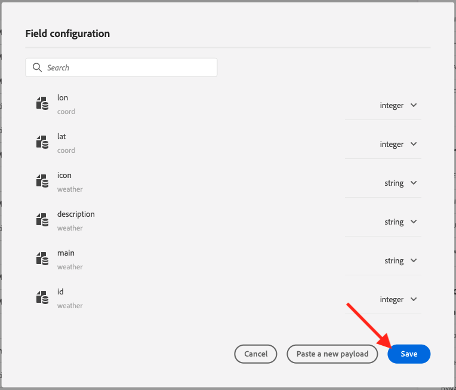

# 8.2定义外部数据源

在本练习中，您将使用Adobe Journey Optimizer创建自定义外部数据源。

通过转到Adobe Journey Optimizer [Adobe Experience Cloud](https://experience.adobe.com). 单击 **Journey Optimizer**.


您将被重定向到 **主页**  查看Journey Optimizer。 首先，确保您使用的是正确的沙盒。 要使用的沙盒称为 `--aepSandboxId--`. 要从一个沙盒更改为另一个沙盒，请单击 **生产产品(VA7)** 并从列表中选择沙盒。 在此示例中，沙盒名为 **2022财年AEP启用**. 然后你会在 **主页** 沙盒视图 `--aepSandboxId--`.


在左侧菜单中，向下滚动并单击 **配置**. 接下来，单击 **管理** 按钮 **数据源**.


然后您将看到 **数据源** 列表。
单击 **创建数据源** 开始添加数据源。


您将看到一个空数据源弹出窗口。


在开始配置之前，您需要一个帐户 **打开天气图** 服务。 按照以下步骤创建帐户并获取API密钥。

转到 [https://openweathermap.org/](https://openweathermap.org/). 在主页上，单击 **登录**.


单击 **创建帐户**.


填好细节。


单击 **创建帐户**.


然后，您将被重定向到您的帐户页面。


在菜单中，单击 **API密钥** 要检索API密钥，您需要设置自定义外部数据源。


安 **API密钥** 如下所示： `b2c4c36b6bb59c3458d6686b05311dc3`.

您可以在 **API文档** 对于 **当前天气** [此处](https://openweathermap.org/current).

在我们的用例中，我们将根据客户所在的城市，实施与开放天气图的连接。


返回 **Adobe Journey Optimizer**，则 **外部数据源** 弹出窗口。


作为数据源的名称，请使用 `--demoProfileLdap--WeatherApi`. 在本例中，数据源名称为 `vangeluwWeatherApi `.

将描述设置为： `Access to the Open Weather Map`.

打开的天气图API的URL是： **http://api.openweathermap.org/data/2.5/weather?units=metric**


接下来，您需要选择要使用的身份验证。

使用以下变量：

| 字段 | 值 |
|:-----------------------:| :-----------------------|
| 类型 | **API密钥** |
| 名称 | **APPID** |
| 值 | **您的API密钥** |
| 位置 | **查询参数** |


最后，您需要定义 **字段组**，这基本上就是您要发送到天气API的请求。 在本例中，我们希望使用城市的名称来请求该城市的当前天气。


根据天气API文档，我们需要发送参数 `q=City`.


为了匹配预期的API请求，请按如下方式配置FieldGroup:

>[!IMPORTANT]
>
>字段组名称必须唯一，请使用以下命名约定： `--demoProfileLdap--WeatherByCity` 因此，在这种情况下，名称应为 `vangeluwWeatherByCity`


对于响应负载，您需要粘贴将由天气API发送的响应示例。

您可以在API文档页面上找到预期的API JSON响应 [此处](https://openweathermap.org/current).


或者，您也可以从此处复制JSON响应：

```json
{"coord": { "lon": 139,"lat": 35},
  "weather": [
    {
      "id": 800,
      "main": "Clear",
      "description": "clear sky",
      "icon": "01n"
    }
  ],
  "base": "stations",
  "main": {
    "temp": 281.52,
    "feels_like": 278.99,
    "temp_min": 280.15,
    "temp_max": 283.71,
    "pressure": 1016,
    "humidity": 93
  },
  "wind": {
    "speed": 0.47,
    "deg": 107.538
  },
  "clouds": {
    "all": 2
  },
  "dt": 1560350192,
  "sys": {
    "type": 3,
    "id": 2019346,
    "message": 0.0065,
    "country": "JP",
    "sunrise": 1560281377,
    "sunset": 1560333478
  },
  "timezone": 32400,
  "id": 1851632,
  "name": "Shuzenji",
  "cod": 200
}
```

将上述JSON响应复制到剪贴板，然后转到自定义数据源配置屏幕。

单击 **编辑负载** 图标。


您将看到一个弹出窗口，您现在必须在其中粘贴上述JSON响应。


粘贴您的JSON响应，之后您将看到此响应。 单击&#x200B;**保存**。



您的自定义数据源配置现已完成。 向上滚动并单击 **保存**.


您的数据源现在已成功创建，并且是 **数据源** 列表。


下一步： [8.3定义自定义操作](./ex3.md)

[返回模块8](journey-orchestration-external-weather-api-sms.md)

[返回到所有模块](../../overview.md)
