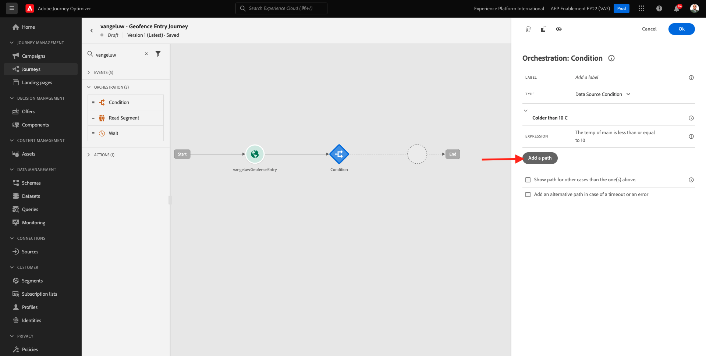
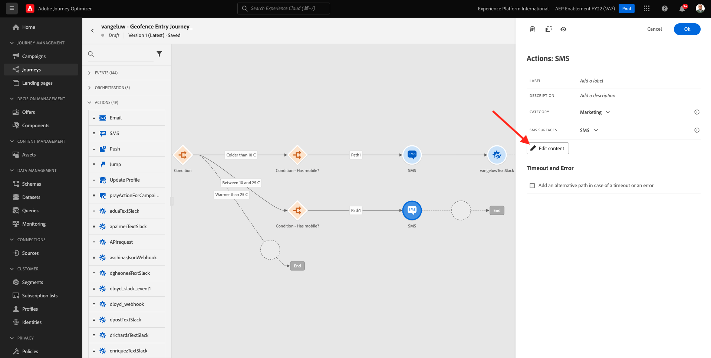
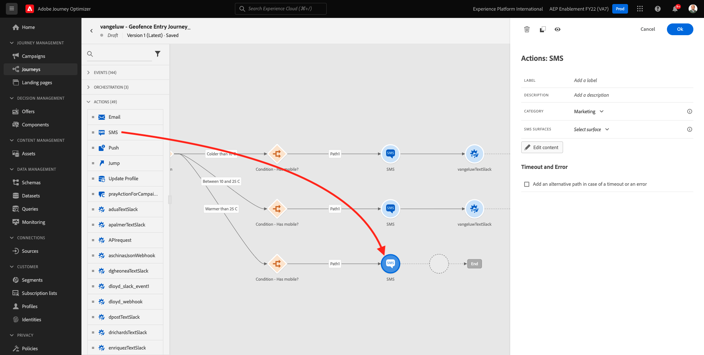
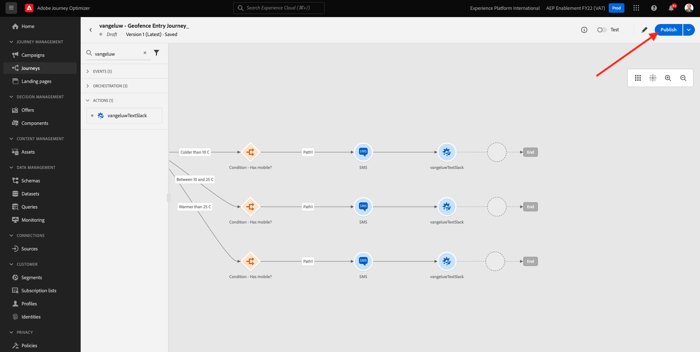

# 8.4创建历程和消息

在本练习中，您将使用Adobe Journey Optimizer创建一个历程和多条文本消息。

对于此用例，目标是根据客户位置的天气条件发送不同的短信消息。 已定义3个方案：

- 冷于10°C
- 10°至25°C
- 25°摄氏度

对于这3种情况，您需要在Adobe Journey Optimizer中定义3条短信消息。

## 8.4.1创建历程

通过转到Adobe Journey Optimizer [Adobe Experience Cloud](https://experience.adobe.com). 单击 **Journey Optimizer**.


您将被重定向到 **主页**  查看Journey Optimizer。 首先，确保您使用的是正确的沙盒。 要使用的沙盒称为 `--aepSandboxId--`. 要从一个沙盒更改为另一个沙盒，请单击 **生产产品(VA7)** 并从列表中选择沙盒。 在此示例中，沙盒名为 **2022财年AEP启用**. 然后你会在 **主页** 沙盒视图 `--aepSandboxId--`.


在左侧菜单中，转到 **历程** 单击 **创建历程** 以开始创建历程。


您应该首先命名您的历程。

作为历程的名称，请使用 `--demoProfileLdap-- - Geofence Entry Journey`. 在此示例中，历程名称为 `vangeluw - Geofence Entry Journey`. 目前不得设置任何其他值。 单击&#x200B;**确定**。


在屏幕左侧，查看 **事件**. 您应会在该列表中看到之前创建的事件。 选择它，然后将其拖放到历程画布上。 然后你的旅程就是这样。 单击 **确定**.


接下来，单击 **编排**. 您现在可以看到 **编排** 功能。 选择 **条件**，然后将其拖放到历程画布上。


您现在必须定义三个条件：

- 气温低于10°C
- 摄氏10°到25°之间
- 温度高于25°C

让我们定义第一个条件。

### 条件1:冷于10°C

单击 **条件**.  单击 **路径1** 和编辑路径的名称 **冷于10摄氏度**. 单击 **编辑** 图标。


然后，您会看到一个空的 **简单编辑器** 屏幕。 您的查询将更高级，因此您需要 **高级模式**. 单击 **高级模式**.


然后您将看到 **高级编辑器** 允许代码输入。


选择以下代码，并将其粘贴到 **高级编辑器**.

`#{--demoProfileLdap--WeatherApi.--demoProfileLdap--WeatherByCity.main.temp} <= 10`

然后你会看到这个。


为了在这种情况下检索温度，您需要提供客户当前所在的城市。
的 **城市** 需要链接到动态参数 `q`，与之前在Open Weather API文档中看到的一样。

单击字段 **动态值：q** 如屏幕截图所示。


然后，您需要在其中一个可用数据源中找到包含客户当前所在城市的字段。


您可以通过导航到 `--demoProfileLdap--GeofenceEntry.placeContext.geo.city`.

通过单击该字段，将添加为参数的动态值 `q`. 此字段将由填充，例如，您在移动设备应用程序中实施的地理位置服务。 在本例中，我们将使用演示网站的管理控制台来模拟此过程。 单击&#x200B;**确定**。


### 条件2:10°至25°C

添加第一个条件后，您将看到此屏幕。 单击 **添加路径**.



双击 **路径1** 和编辑 **10到25摄氏度**. 单击 **编辑** 图标。


然后，您会看到一个空的 **简单编辑器** 屏幕。 您的查询将更高级，因此您需要 **高级模式**. 单击 **高级模式**.


然后您将看到 **高级编辑器** 允许代码输入。


选择以下代码，并将其粘贴到 **高级编辑器**.

`#{--demoProfileLdap--WeatherApi.--demoProfileLdap--WeatherByCity.main.temp} > 10 and #{--demoProfileLdap--WeatherApi.--demoProfileLdap--WeatherByCity.main.temp} <= 25`

然后你会看到这个。


为了在此条件中检索温度，您需要提供客户当前所在的城市。
的 **城市** 需要链接到动态参数 **q**，与之前在Open Weather API文档中看到的一样。

单击字段 **动态值：q** 如屏幕截图所示。


然后，您需要在其中一个可用数据源中找到包含客户当前所在城市的字段。


您可以通过导航到 `--demoProfileLdap--GeofenceEntry.placeContext.geo.city`. 通过单击该字段，将添加为参数的动态值 **q**. 此字段将由填充，例如，您在移动设备应用程序中实施的地理位置服务。 在本例中，我们将使用演示网站的管理控制台来模拟此过程。 单击&#x200B;**确定**。


接下来，您将添加第3个条件。

### 条件3:25°摄氏度

添加第二个条件后，您将看到此屏幕。 单击 **添加路径**.


双击路径1将名称更改为 **温度高于25摄氏度**.
然后，单击 **编辑** 图标。


然后，您会看到一个空的 **简单编辑器** 屏幕。 您的查询将更高级，因此您需要 **高级模式**. 单击 **高级模式**.


然后您将看到 **高级编辑器** 允许代码输入。


选择以下代码，并将其粘贴到 **高级编辑器**.

`#{--demoProfileLdap--WeatherApi.--demoProfileLdap--WeatherByCity.main.temp} > 25`

然后你会看到这个。


为了在此条件中检索温度，您需要提供客户当前所在的城市。
的 **城市** 需要链接到动态参数 **q**，与之前在Open Weather API文档中看到的一样。

单击字段 **动态值：q** 如屏幕截图所示。


然后，您需要在其中一个可用数据源中找到包含客户当前所在城市的字段。


您可以通过导航到 ```--demoProfileLdap--GeofenceEntry.placeContext.geo.city```. 通过单击该字段，将添加为参数的动态值 **q**. 此字段将由填充，例如，您在移动设备应用程序中实施的地理位置服务。 在本例中，我们将使用演示网站的管理控制台来模拟此过程。 单击&#x200B;**确定**。


您现在有三个已配置的路径。 单击 **确定**.


由于这是一个用于学习目的的历程，我们现在将配置几个操作，以展示营销人员现在必须投放消息的各种选项。

## 8.4.2发送路径消息：冷于10°C

对于每个温度环境，我们将尝试向客户发送一条短信。 我们只能在客户有手机号码时发送短信，因此我们必须首先确认是否有。

让我们专注于 **冷于10摄氏度**.


我们再来一个 **条件** 元素，并按照以下屏幕截图所示拖动该元素。 我们会核实此客户是否有可用的手机号码。


由于这只是一个示例，我们仅在配置客户具有可用手机号码的选项。 添加标签 **有手机吗？**.

单击 **编辑** 图标 **路径1** 路径。


在左侧显示的数据源中，导航到 **ExperiencePlatform.ProfileFieldGroup.profile.mobilePhone.number**. 您现在直接从Adobe Experience Platform的实时客户资料中读取手机号码。


选择字段 **数值**，然后将其拖放到条件画布中。

选择运算符 **不为空**. 单击 **确定**.


然后你会看到这个。 单击 **确定** 再次。


然后，您的历程将如下所示。 单击 **操作** 如屏幕截图所示。


选择操作 **短信**，然后将其拖放到刚刚添加的条件之后。


设置 **类别** to **营销** 并选择一个短信界面，以便您发送短信。 在这种情况下，要选择的电子邮件界面是 **短信**.


下一步是创建消息。 要实现此目的，请单击 **编辑内容**.


现在，您会看到消息仪表板，您可以在其中配置短信的文本。 单击 **撰写消息** 区域创建消息。


输入以下文本： `Brrrr... {{profile.person.name.firstName}}, it's freezing. 20% discount on jackets today!`. 单击&#x200B;**保存**。


然后你会看到这个。 单击左上角的箭头以返回您的历程。


然后你会回来。 单击 **确定**.


在左侧菜单中，返回 **操作**，选择操作 `--demoProfileLdap--TextSlack`，然后将其拖放到 **消息** 操作。


转到 **操作参数** ，然后单击 **编辑** 图标 `TEXTTOSLACK`.


在弹出窗口中，单击 **高级模式**.


选择以下代码，复制该代码并将其粘贴到 **高级模式编辑器**. 单击 **确定**.

`"Brrrr..." + #{ExperiencePlatform.ProfileFieldGroup.profile.person.name.firstName} + " It's freezing. 20% discount on Jackets today!"`


您将看到已完成的操作。 单击 **确定**.


历程的此路径现已准备就绪。

## 8.4.3发送路径消息：10°至25°C

对于每个温度环境，我们将尝试向客户发送一条短信。 我们只能在客户有手机号码时发送短信，因此我们必须首先确认是否有。

让我们专注于 **10到25摄氏度** 路径。


我们再来一个 **条件** 元素，并按照以下屏幕截图所示拖动该元素。 我们会核实此客户是否有可用的手机号码。


由于这只是一个示例，我们仅在配置客户具有可用手机号码的选项。 添加标签 **有手机吗？**.

单击 **编辑** 图标 **路径1** 路径。


在左侧显示的数据源中，导航到 **ExperiencePlatform.ProfileFieldGroup.profile.mobilePhone.number**. 您现在直接从Adobe Experience Platform的实时客户资料中读取手机号码。


选择字段 **数值**，然后将其拖放到条件画布中。

选择运算符 **不为空**. 单击 **确定**.


然后你会看到这个。 单击 **确定**.


然后，您的历程将如下所示。 单击 **操作** 如屏幕截图所示。


选择操作 **短信**，然后将其拖放到刚刚添加的条件之后。


设置 **类别** to **营销** 并选择一个短信界面，以便您发送短信。 在这种情况下，要选择的电子邮件界面是 **短信**.


下一步是创建消息。 要实现此目的，请单击 **编辑内容**.



现在，您会看到消息仪表板，您可以在其中配置短信的文本。 单击 **撰写消息** 区域创建消息。


输入以下文本： `What a nice weather for the time of year, {{profile.person.name.firstName}} - 20% discount on Sweaters today!`. 单击&#x200B;**保存**。


然后你会看到这个。 单击左上角的箭头以返回您的历程。


您现在将看到已完成的操作。 单击 **确定**.


在左侧菜单中，返回 **操作**，选择操作 `--demoProfileLdap--TextSlack`，然后将其拖放到 **消息** 操作。


转到 **操作参数** ，然后单击 **编辑** 图标 `TEXTTOSLACK`.


在弹出窗口中，单击 **高级模式**.


选择以下代码，复制该代码并将其粘贴到 **高级模式编辑器**. 单击 **确定**.

`"What nice weather for the time of year, " + #{ExperiencePlatform.ProfileFieldGroup.profile.person.name.firstName} + " 20% discount on Sweaters today!"`


您将看到已完成的操作。 单击 **确定**.


历程的此路径现已准备就绪。

## 8.4.4发送路径消息：25°摄氏度

对于每个温度环境，我们将尝试向客户发送一条短信。 我们只能在客户有手机号码时发送短信，因此我们必须首先确认是否有。

让我们专注于 **温度高于25摄氏度** 路径。


我们再来一个 **条件** 元素，并按照以下屏幕截图所示拖动该元素。 您将验证此客户是否有可用的手机号码。


由于这只是一个示例，我们仅在配置客户具有可用手机号码的选项。 添加标签 **有手机吗？**.

单击 **编辑** 图标 **路径1** 路径。


在左侧显示的数据源中，导航到 **ExperiencePlatform.ProfileFieldGroup.profile.mobilePhone.number**. 您现在直接从Adobe Experience Platform的实时客户资料中读取手机号码。


选择字段 **数值**，然后将其拖放到条件画布中。

选择运算符 **不为空**. 单击 **确定**.


然后你会看到这个。 单击&#x200B;**确定**。


然后，您的历程将如下所示。 单击 **操作** 如屏幕截图所示。


选择操作 **短信**，然后将其拖放到刚刚添加的条件之后。



设置 **类别** to **营销** 并选择一个短信界面，以便您发送短信。 在这种情况下，要选择的电子邮件界面是 **短信**.


下一步是创建消息。 要实现此目的，请单击 **编辑内容**.


现在，您会看到消息仪表板，您可以在其中配置短信的文本。 单击 **撰写消息** 区域创建消息。


输入以下文本： `So warm, {{profile.person.name.firstName}}! 20% discount on swimwear today!`. 单击&#x200B;**保存**。


然后你会看到这个。 单击左上角的箭头以返回您的历程。


您现在将看到已完成的操作。 单击 **确定**.


在左侧菜单中，返回 **操作**，选择操作 `--demoProfileLdap--TextSlack`，然后将其拖放到 **消息** 操作。


转到 **操作参数** ，然后单击 **编辑** 图标 `TEXTTOSLACK`.


在弹出窗口中，单击 **高级模式**.


选择以下代码，复制该代码并将其粘贴到 **高级模式编辑器**. 单击 **确定**.

`"So warm, " + #{ExperiencePlatform.ProfileFieldGroup.profile.person.name.firstName} + "! 20% discount on swimwear today!"`


您将看到已完成的操作。 单击 **确定**.


历程的此路径现已准备就绪。

## 8.4.5发布历程

您的历程现已完全配置。 单击 **发布**.



单击 **发布** 再次。


您的历程现已发布。


下一步： [8.5触发您的历程](./ex5.md)

[返回模块8](journey-orchestration-external-weather-api-sms.md)

[返回到所有模块](../../overview.md)
