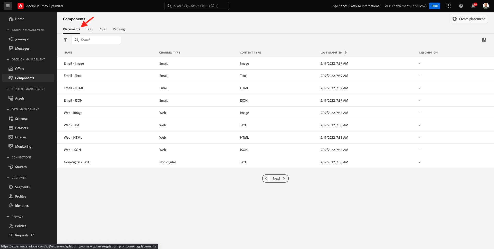
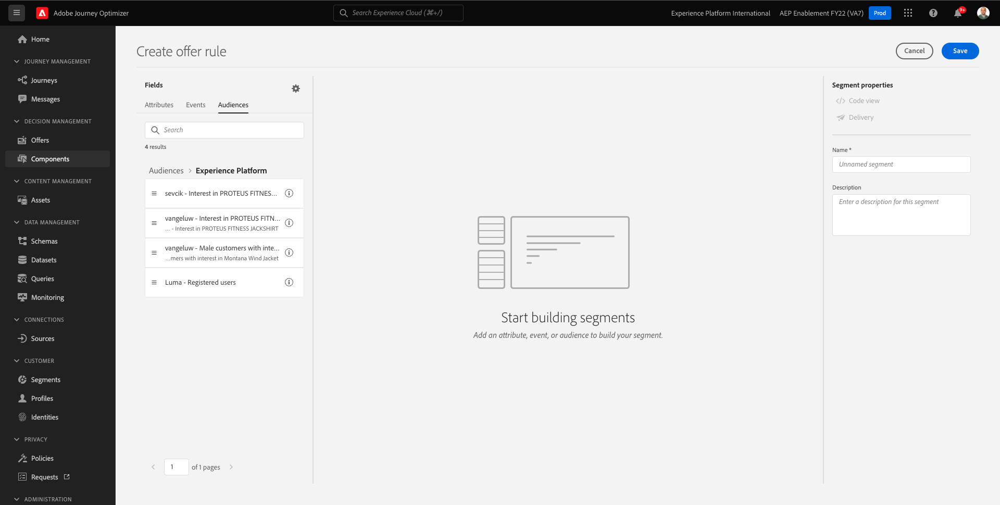

# 9.1Offer decisioning101

## 9.1.1术语

为了更好地了解Offer decisioning，我们强烈建议您阅读 [概述](https://experienceleague.adobe.com/docs/journey-optimizer/using/offer-decisioniong/get-started-decision/starting-offer-decisioning.html?lang=en) 介绍Offer decisioning应用程序服务如何与Adobe Experience Platform配合使用。

使用Offer decisioning时，您需要了解以下概念：

| 搜索词 | 解释 |
| ------------------------- | -------------------------------------------------------------------------------------------------------------------------------------------------------------------------------------------------------------------------------------------------------- |
| **选件** | 选件是营销消息，其中可能包含与其关联的规则，以指定有资格查看选件的用户。 选件的状态为：草稿、批准或存档。 |
| **版面** | 为最终用户显示选件的位置（或渠道类型）和上下文（或内容类型）的组合。 它实际上是移动、Web、社交、即时消息和非数字渠道中的文本、HTML、图像、JSON的组合。 |
| **规则** | 定义和控制最终用户选件资格的逻辑。 |
| **个性化优惠** | 基于资格规则和限制的可自定义营销消息。 |
| **后备优惠** | 当最终用户不符合所用集合中的任何选件的条件时，会显示默认选件。 |
| **上限** | 在选件定义中使用，以定义选件总显示次数以及可向特定用户显示的次数。 |
| **优先级** | 级别，用于根据选件的结果集确定优先级等级。 |
| **收藏集** | 用于从个性化选件列表中筛选出一组选件，以加快offer decisioning过程。 |
| **决策** | 营销人员希望决策引擎提供最佳选件的一组选件、版面和用户档案的组合。 |
| **AEM Assets Essentials** | 跨Adobe Experience Cloud解决方案和Adobe Experience Platform存储、查找和选择资产的通用且集中的体验。 |

{style=&quot;table-layout:auto&quot;}

## 9.1.2Offer decisioning

通过转到Adobe Journey Optimizer [Adobe Experience Cloud](https://experience.adobe.com). 单击 **Journey Optimizer**.

您将被重定向到 **主页**  查看Journey Optimizer。 首先，确保您使用的是正确的沙盒。 要使用的沙盒称为 `--aepSandboxId--`. 要从一个沙盒更改为另一个沙盒，请单击 **生产产品(VA7)** 并从列表中选择沙盒。 在此示例中，沙盒名为 **2022财年AEP启用**. 然后你会在 **主页** 沙盒视图 `--aepSandboxId--`.

在左侧菜单中，单击 **选件**. 您现在将看到“选件”菜单，其中包含选件、收藏集和决策等内容。

单击 **组件**. 现在，您将看到“选件”菜单，其中包含“版面”、“标记”、“规则”和“排名”等内容。

## 9.1.3版面

转到 **版面**.

在 **版面** 选项卡，您可以为选件定义版面。 在定义决策时，版面会定义将显示结果选件的位置（渠道类型）以及形状或形式（内容类型）。

如果您在Adobe Experience Platform实例中看不到任何版面，请按照下面和屏幕截图中的指示创建它们。

| 名称 | 渠道类型 | 内容类型 |
| ---------------------- | ------------ | ------------ |
| **非数字 — 文本** | 非数字 | 文本 |
| **Web - JSON** | Web | JSON |
| **Web -HTML** | Web | HTML |
| **Web — 文本** | Web | 文本 |
| **Web — 图像** | Web | 图像 |
| **电子邮件 — JSON** | 电子邮件 | JSON |
| **电子邮件 — HTML** | 电子邮件 | HTML |
| **电子邮件 — 文本** | 电子邮件 | 文本 |
| **电子邮件 — 图像** | 电子邮件 | 图像 |

{style=&quot;table-layout:auto&quot;}

**注意**:请勿将任何内容更改为已可用的版面。

单击任意版面可显示其设置。

现在，您将看到版面的所有字段：

- **名称** 版面
- **版面 ID**
- **渠道类型** 的
- **内容类型** 的页面， **文本**, **HTML**, **图像** 或 **JSON**
- **描述** 字段，以便为版面添加其他描述

## 9.1.4决定规则

规则（也称为资格规则）等同于 **区段**. 规则实际上是区段本身，它唯一的区别在于规则可以与选件一起使用，以向Adobe Experience Platform中的用户档案提供最佳选件。

正如您已经知道如何根据以前的支持模块定义区段一样，让我们快速重新访问分段环境：

转到 **规则**. 单击 **+创建规则**.

然后，您将看到Adobe Experience Platform的分段环境。

现在，您可以访问属于实时客户用户档案联合架构一部分的所有字段，并可以构建任何规则。

另外，您还可以通过以下路径重新使用Adobe Experience Platform中已定义的区段，即： **受众** > ``--aepTenantIdSchema--``.

然后您将看到：

如果您愿意，您现在可以配置自己的规则。 在本练习中，您需要两条规则：

- 所有 — 男性客户
- 所有 — 女性客户

如果这些规则尚不存在，请创建它们。 如果它们已存在，请使用这些规则，但不要创建新规则。

用于构建规则的属性为 **XDM个人配置文件** > **人员** > **性别**.

例如，以下是规则的规则定义 **所有 — 男性客户**:

例如，以下是规则的规则定义 **所有 — 女性客户**:

## 9.1.5选件

转到 **选件** 选择 **选件**. 单击 **+创建选件**.

然后，您将看到此弹出窗口。

现在不要创建任何选件 — 您将在下一个练习中执行此操作。

您现在可以看到有两种类型的选件：

- 个性化优惠
- 后备优惠

个性化选件是特定情况下应显示的特定内容。 专门构建个性化选件，以在满足特定条件时提供个人和情境式体验。

备用选件是在不满足个性化选件标准时显示的选件。

## 9.1.6决定

决策将投放、个性化选件集合和备用选件整合在一起，最终由Offer decisioning引擎根据每个个性化选件特性（如优先级、资格约束和总/用户上限）来查找特定用户档案的最佳选件。

配置 **决策**，单击 **决策**.

在下一个练习中，您将配置自己的选件并做出决策。

下一步： [9.2配置选件和决策](./ex2.md)

[返回模块9](./offer-decisioning.md)

[返回到所有模块](./../../overview.md)
