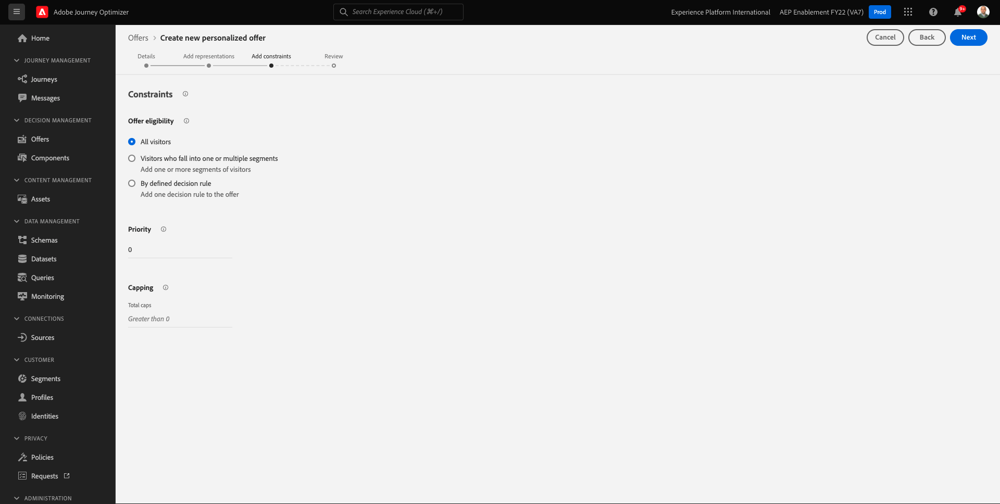
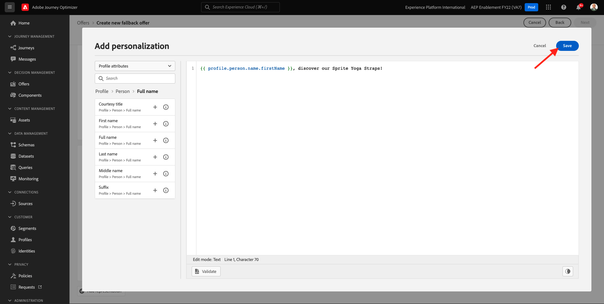
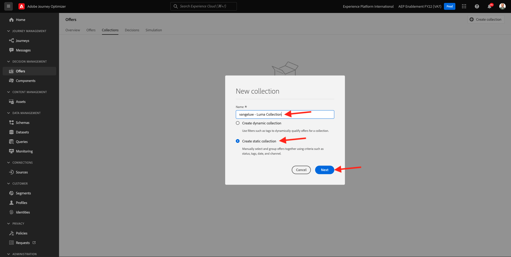

# 9.2配置优惠和决策

## 9.2.1创建个性化优惠

在本练习中，您将创建四个 **个性化优惠**. 以下是创建这些选件时需要考虑的详细信息：

| 名称 | Date Range | 电子邮件的图像链接 | Web图像链接 | 文本 | 优先级 | 资格 | 语言 |
|-----|------------|----------------------|--------------------|------|:--------:|--------------|:-------:|
| `--demoProfileLdap-- - Nadia Elements Shell` | 今天 — 1个月后 | https://bit.ly/3nPiwdZ | https://bit.ly/2INwXjt | `{{ profile.person.name.firstName }}, 10% discount on Nadia Elements Shell` | 25 | 所有 — 女性客户 | 英语（美国） |
| `--demoProfileLdap-- - Radiant Tee` | 今天 — 1个月后 | https://bit.ly/2HfA17v | https://bit.ly/3pEIdzn | `{{ profile.person.name.firstName }}, 5% discount on Radiant Tee` | 15 | 所有 — 女性客户 | 英语（美国） |
| `--demoProfileLdap-- - Zeppelin Yoga Pant` | 今天 — 1个月后 | https://bit.ly/2IOaItW | https://bit.ly/2INZHZd | `{{ profile.person.name.firstName }}, 10% discount on Zeppelin Yoga Pant` | 25 | 所有 — 男性客户 | 英语（美国） |
| `--demoProfileLdap-- - Proteus Fitness Jackshirt` | 今天 — 1个月后 | https://bit.ly/330a43n | https://bit.ly/36USaQW | `{{ profile.person.name.firstName }}, 5% discount on Proteus Fitness Jackshirt` | 15 | 所有 — 男性客户 | 英语（美国） |

{style=&quot;table-layout:auto&quot;}

通过转到Adobe Journey Optimizer [Adobe Experience Cloud](https://experience.adobe.com). 单击 **Journey Optimizer**.

您将被重定向到 **主页**  查看Journey Optimizer。 首先，确保您使用的是正确的沙盒。 要使用的沙盒称为 `--aepSandboxId--`. 要从一个沙盒更改为另一个沙盒，请单击 **生产产品(VA7)** 并从列表中选择沙盒。 在此示例中，沙盒名为 **2022财年AEP启用**. 然后你会在 **主页** 沙盒视图 `--aepSandboxId--`.

在左侧菜单中，单击 **选件** 然后转到 **选件**. 单击 **+创建选件**.

然后，您将看到此弹出窗口。 选择 **个性化优惠** 单击 **下一个**.

你现在在 **详细信息** 中。

在这种情况下，您需要配置选件 `--demoProfileLdap-- - Nadia Elements Shell`. 使用上表中的信息填写字段。 在此示例中，个性化选件的名称是 **vangeluw - Nadia Elements Shell**. 此外，设置 **开始日期和时间** 设置为昨天，并将 **结束日期和时间** 一个月后的日期。

完成后，你就该拿这个。 单击&#x200B;**下一步**。

您现在需要创建 **表示**. 表示是 **版面** 和真正的资产。

对于 **表示1**，选择：

- 渠道：Web
- 版面：Web — 图像
- 内容：URL
- 公共位置：从列中复制URL **Web图像链接** 上表

或者，您也可以选择 **资产库** ，然后单击 **浏览**.

然后，您将看到资产库的弹出窗口，转到文件夹 **启用资产** 并选择图像文件 **nadia-web.png**. 然后，单击 **选择**.

然后您将看到：

单击 **+添加表示法**.

对于 **表示2**，选择：

- 渠道：电子邮件
- 版面：电子邮件 — 图像
- 内容：URL
- 公共位置：从列中复制URL **电子邮件的图像链接** 上表

或者，您也可以选择 **资产库** ，然后单击 **浏览**.

然后，您将看到资产库的弹出窗口，转到文件夹 **启用资产** 并选择图像文件 **nadia-email.png**. 然后，单击 **选择**.

然后您将看到：

接下来，单击 **+添加表示法**.

对于 **表示3**，选择：

- 渠道：非数字
- 版面：非数字 — 文本

接下来，您需要添加内容。 在本例中，这意味着添加要用作行动动员的文本。

单击 **添加内容**.

然后，您将看到此弹出窗口。

选择 **自定义文本** 并填写以下字段：

查看 **文本** 字段并在此处输入该文本，在此例中为： `{{ profile.person.name.firstName }}, 10% discount on Nadia Elements Shell`.

您还会注意到，您可以选择任何配置文件属性并将其作为动态字段包含在选件文本中。 在本例中，字段 `{{ profile.person.name.firstName }}` 将确保接收此选件的客户的名字将包含在选件文本中。

然后你会看到这个。 单击&#x200B;**保存**。

你现在有这个。 单击&#x200B;**下一步**。

然后您将看到：

选择 **按定义的决策规则** ，然后单击 **+** 图标以添加规则 **所有 — 女性客户**.

然后你会看到这个。 填写 **优先级** 如上表所示。 单击&#x200B;**下一步**。

然后，您将看到新 **个性化优惠**.

最后，单击 **保存和批准**.

然后，您会在选件概述中看到新创建的个性化选件可供使用：

现在，您应该重复上述步骤，为Readient Tee、Zeppelin Yoga Pant和Proteus Fitness Jackshirt等产品创建另外三个个性化优惠。

完成后，您的 **选件概述** 屏幕 **个性化优惠** 应显示您的所有选件。

## 9.2.2创建后备优惠

创建四个个性化选件后，您现在应当配置 **后备优惠**.

确保你在 **选件** 视图：

单击 **+创建选件**.

然后，您将看到此弹出窗口。 选择 **后备优惠** 单击 **下一个**.

然后您将看到：

为您的备用选件输入此名称： `--demoProfileLdap-- - Luma Fallback Offer`. 单击&#x200B;**下一步**。

您现在需要创建 **表示**. 表示是 **版面** 和真正的资产。

对于 **表示1**，选择：

- 渠道：Web
- 版面：Web — 图像
- 内容：URL
- 公共位置： `https://bit.ly/3nBOt9h`

或者，您也可以选择 **资产库** ，然后单击 **浏览**.

然后，您将看到资产库的弹出窗口，转到文件夹 **启用资产** 并选择图像文件 **spriteyograps-web.png**. 然后，单击 **选择**.

然后您将看到：

对于 **表示2**，选择：

- 渠道：电子邮件
- 版面：电子邮件 — 图像
- 内容：URL
- 公共位置： `https://bit.ly/3nF4qvE`

或者，您也可以选择 **资产库** ，然后单击 **浏览**.

然后，您将看到资产库的弹出窗口，转到文件夹 **启用资产** 并选择图像文件 **spriteyograst-email.png**. 然后，单击 **选择**.

然后您将看到：

接下来，单击 **+添加表示法**.

对于 **表示3**，选择：

- 渠道：非数字
- 版面：非数字 — 文本

接下来，您需要添加内容。 在这种情况下，这意味着添加图像链接。

单击 **添加内容**.

然后，您将看到此弹出窗口。

选择 **自定义文本** 并填写以下字段：

输入文本 `{{ profile.person.name.firstName }}, discover our Sprite Yoga Straps!` 单击 **保存**.

然后你会看到这个。 单击&#x200B;**下一步**。

然后，您将看到新 **后备优惠**. 单击&#x200B;**完成**。

最后，单击 **保存和批准**.

在 **选件概述** 屏幕，您现在将看到以下内容：

## 9.2.3创建集合

收藏集用于 **过滤器** 从个性化选件列表中生成一个子选件集，并将其用作决策的一部分以加快决策过程。

转到 **收藏集**. 单击 **+创建收藏集**.

然后你会看到这个弹出窗口。 按此方式配置您的收藏集。 单击&#x200B;**下一步**。

- 集合名称：use `--demoProfileLdap-- - Luma Collection`
- 选择 **创建静态集合**.

在下一个屏幕中，选择四个 **个性化优惠** 您在上一个练习中创建。 单击&#x200B;**保存**。

您现在将看到以下内容：

## 9.2.4创建您的决策

决策将版面、个性化选件集合和后备选件整合在一起，最终由Offer decisioning引擎根据各个个性化选件特性（如优先级、资格约束和总/用户上限）来为特定用户档案查找最佳选件。

配置 **决策**，转到 **决策**. 单击 **+创建活动**.

然后您将看到：

这样填写字段。 单击&#x200B;**下一步**。

- 名称: `--demoProfileLdap-- - Luma Decision`
- 开始日期和时间：昨天
- 结束日期和时间：今天+1个月

在下一个屏幕中，您需要将版面添加到决策范围中。 您需要为版面创建决策范围 **Web — 图像**, **电子邮件 — 图像** 和 **非数字 — 文本**.

首先，为 **非数字 — 文本** ，方法是在下拉菜单中选择该版面。 然后，单击 **添加** 按钮以添加评估标准。

选择您的收藏集 `--demoProfileLdap-- - Luma Collection` 单击 **添加**.

然后你会看到这个。 单击 **-** 按钮以添加新决策范围。

选择版面 **Web — 图像** 添加您的收藏集 `--demoProfileLdap-- - Luma Collection` 评估标准。 然后，单击 **+** 按钮以添加新的决策范围。

选择版面 **电子邮件 — 图像** 添加您的收藏集 `--demoProfileLdap-- - Luma Collection` 评估标准。 然后，单击 **下一个**.

您现在需要选择 **后备优惠**，该名称为 `--demoProfileLdap-- - Luma Fallback Offer`. 单击&#x200B;**下一步**。

查看您的决策。 单击&#x200B;**完成**。

在弹出窗口中，单击 **保存并激活**.

最后，您将在概述中看到您的决定：

您现在已成功配置了决策。 您的决策现已上线，可用于实时为客户提供优化和个性化的优惠。

下一步： [9.3准备数据收集客户端属性和Web SDK设置以进行Offer decisioning](./ex3.md)

[返回模块9](./offer-decisioning.md)

[返回到所有模块](./../../overview.md)
