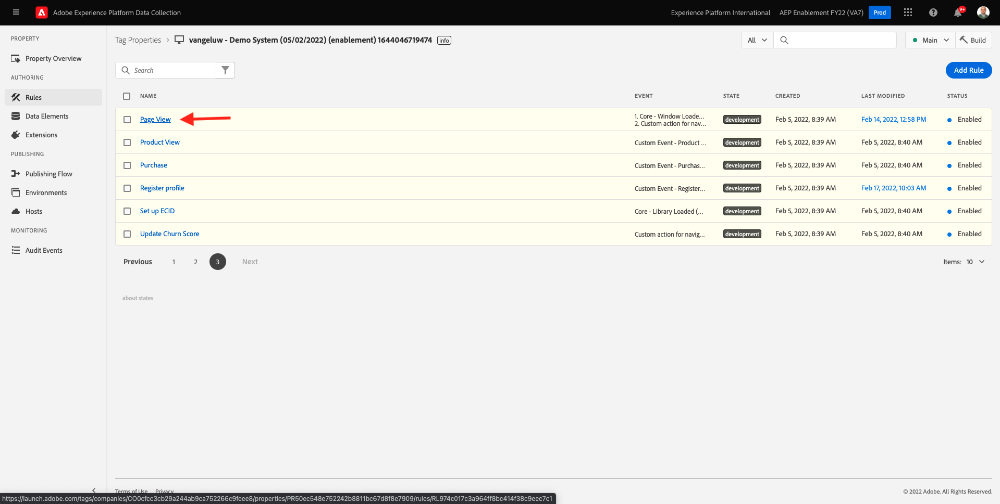
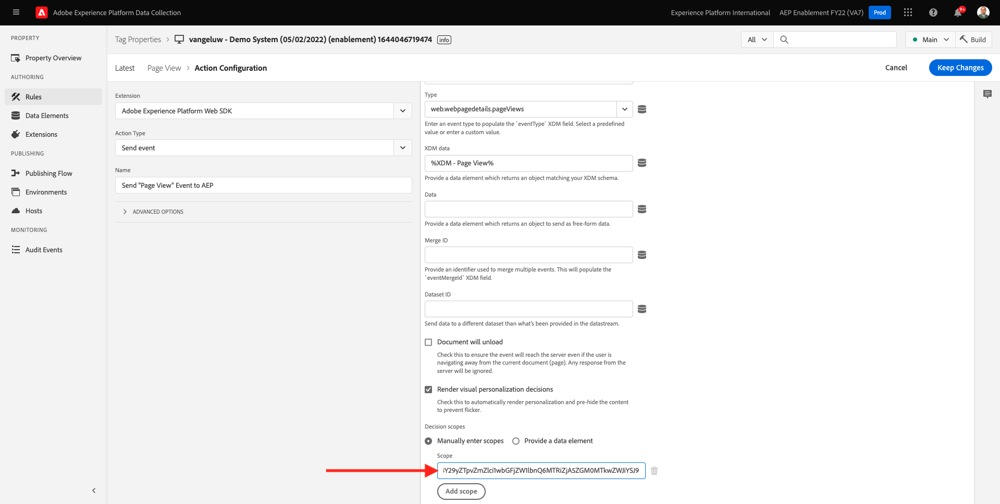
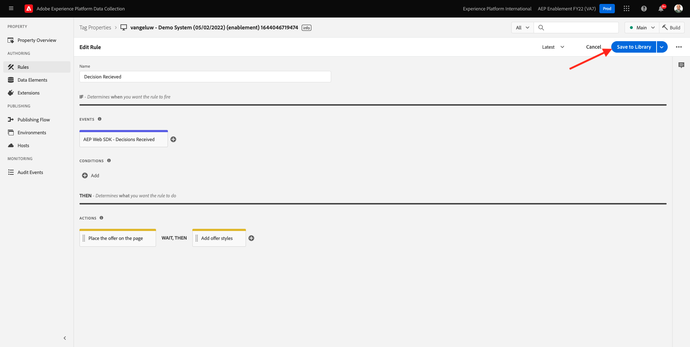
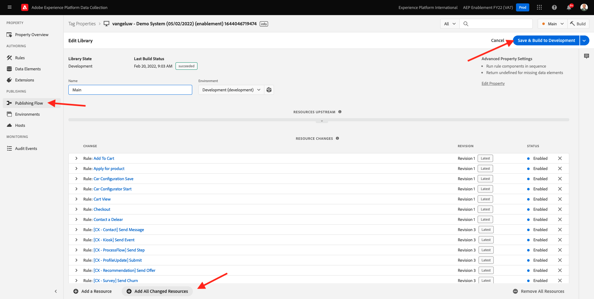

# 9.3准备Adobe Experience Platform数据收集客户端属性和Web SDK设置以进行Offer decisioning

>[!NOTE]
>
>目前，在Adobe Experience Platform Web SDK中使用Offer decisioning可供选定用户抢先体验。 并非所有IMS组织都能使用此功能。

## 9.3.1更新数据流

在 [练习0.2](./../../modules/module0/ex2.md)，您自己创建了 **[!UICONTROL 数据流]**. 然后使用名称 `--demoProfileLdap-- - Demo System Datastream`.

在本练习中，您需要配置 **[!UICONTROL 数据流]** 使用 **[!DNL Offer Decisioning]**.

为此，请转至 [https://experience.adobe.com/#/data-collection/](https://experience.adobe.com/#/data-collection/). 然后你会看到这个。 单击 **[!UICONTROL 数据流]** 或 **[!UICONTROL 数据流（测试版）]**.

在屏幕的右上角，选择您的沙盒名称，该名称应为 `--aepSandboxId--`.


搜索 **[!UICONTROL 数据流]**，该名称为 `--demoProfileLdap-- - Demo System Datastream`. 单击 **[!UICONTROL 数据流]** 打开它。


然后你会看到这个。 单击 **...** 下一页 **Adobe Experience Platform** 然后单击 **编辑**.


启用 **[!DNL Offer Decisioning]**，请勾选 **[!DNL Offer Decisioning]**. 单击&#x200B;**保存**。


您的 **[!UICONTROL 数据流]** 现已准备好使用 **[!DNL Offer Decisioning]**.


## 9.3.2配置Adobe Experience Platform数据收集客户端属性以请求个性化优惠

转到 [https://experience.adobe.com/#/data-collection/](https://experience.adobe.com/#/data-collection/)，更改为 **[!UICONTROL 客户端]**. 搜索数据收集属性，该属性名为 `--demoProfileLdap-- - Demo System (DD/MM/YYYY)`. 打开Web的数据收集客户端属性。


在您的资产中，转到 **[!UICONTROL 规则]** 并打开规则 **[!UICONTROL 页面查看]**.



单击以打开 [!UICONTROL 操作] **[!UICONTROL AEP Web SDK — 发送事件]**.


然后你会看到这个。 您会注意到 **[!UICONTROL 决策范围]**.


对于发送到边缘和Adobe Experience Platform的每个请求，都可以提供一个或多个 **[!UICONTROL 决策范围]**. A **[!UICONTROL 决策范围]** 是两个元素的组合：

- [!UICONTROL 决策ID]
- [!UICONTROL 版面 ID]

让我们首先查看一下您可以在何处找到这两个元素。

### 9.3.2.1检索您的 [!UICONTROL 版面ID]

的 [!UICONTROL 版面ID] 标识所需资产的位置和类型。 例如，Luma网站主页上的主页图像与 [!UICONTROL 版面ID] 表示 [!UICONTROL Web — 图像].

>[!NOTE]
>
>在模块6中，您已配置了Adobe Target体验定位活动，该活动将更改主页上主页位置的图像，如屏幕截图中所示。 为了进行练习，您现在将让选件显示在主页图像下方的图像上，如屏幕截图所示。


查找 [!UICONTROL 版面ID] 表示 [!UICONTROL Web — 图像] 去Adobe Journey Optimizer [Adobe Experience Cloud](https://experience.adobe.com). 单击 **Journey Optimizer**.


您将被重定向到 **主页**  查看Journey Optimizer。 首先，确保您使用的是正确的沙盒。 要使用的沙盒称为 `--aepSandboxId--`. 要从一个沙盒更改为另一个沙盒，请单击 **生产产品(VA7)** 并从列表中选择沙盒。 在此示例中，沙盒名为 **2022财年AEP启用**. 然后你会在 **主页** 沙盒视图 `--aepSandboxId--`.


接下来，转到 [!UICONTROL 组件] 然后 [!UICONTROL 版面]. 单击 [!UICONTROL Web — 图像] 版面以查看其详细信息。


如上图所示，在本例中， [!UICONTROL 版面ID] is `xcore:offer-placement:14bf09dc4190ebba`. 记下 [!UICONTROL 版面ID] 的 [!UICONTROL Web — 图像] 你下次练习时会需要它。

### 9.3.2.2检索您的 [!UICONTROL 决策ID]

的 [!UICONTROL 决策ID] 确定您希望使用的个性化选件和备用选件的组合。 在上一个练习中，您创建了自己的 [!UICONTROL 决策] 并命名 `--demoProfileLdap-- - Luma Decision`.

查找 [!UICONTROL 决策ID] , `--demoProfileLdap-- - Luma Decision`，转到 [https://platform.adobe.com](https://platform.adobe.com).

接下来，转到 [!UICONTROL 选件] 然后转到 [!UICONTROL 决策]. 单击以选择 [!UICONTROL 决策]，该名称为 `--demoProfileLdap-- - Luma Decision`.


如上图所示，在本例中， [!UICONTROL 决策ID] is `xcore:offer-activity:14c052382e1b6505`. 记下 [!UICONTROL 决策ID] 你的决定 `--demoProfileLdap-- - Luma Decision` 你下次练习时会需要它。

现在，您已检索到创建 **[!UICONTROL 决策范围]**，则可以继续下一步骤，其中涉及对决策范围进行编码。

### 9.3.2.3 BASE64编码

的 **[!UICONTROL 决策范围]** 您需要输入一个BASE64编码的字符串。 此BASE64编码的字符串是 [!UICONTROL 版面ID] 和 [!UICONTROL 决策ID]，如下所示。

```json
{
  "activityId":"xcore:offer-activity:14c052382e1b6505",
  "placementId":"xcore:offer-placement:14bf09dc4190ebba"
}
```

的 **[!UICONTROL 决策范围]** 可通过两种方式生成：

- 使用公共服务，如 [https://www.base64encode.org/](https://www.base64encode.org/). 按照上述方式输入JSON代码，单击 **[!UICONTROL 编码]** 下面将显示BASE64编码字符串。

   

- 从Adobe Experience Platform中检索BASE64编码字符串。 转到 [!UICONTROL 决策] 并单击以打开 [!UICONTROL 决策]，该名称为 `--demoProfileLdap-- - Luma Decision`.

   

   打开后 `--demoProfileLdap-- - Luma Decision`，您将看到此内容。 找到版面 [!UICONTROL Web — 图像] ，然后单击 **[!UICONTROL 复制]** 按钮。 接下来，单击 **[!UICONTROL 编码决策范围]**. 的 **[!UICONTROL 决策范围]** 现在会复制到剪贴板。

   

接下来，返回到Launch，然后转到您的操作 **[!UICONTROL AEP Web SDK — 发送事件]**.


将编码的决策范围粘贴到输入字段中。



在操作中保存所做更改 **[!UICONTROL AEP Web SDK — 发送事件]** 单击 **[!UICONTROL 保留更改]**.


接下来，单击 **[!UICONTROL 保存]** 或 **[!UICONTROL 保存到库]**


在Adobe Experience Platform数据收集中，转到 **[!UICONTROL 发布流程]** 打开 **[!UICONTROL 开发库]** 它名为 **[!UICONTROL 主要]**. 单击 **[!UICONTROL +添加所有已更改的资源]** 然后单击 **[!UICONTROL 保存并构建以用于开发]**. 您所做的更改现在将发布到您的演示网站。


每次您加载 **“一般信息”页** 现在，与演示网站的主页一样，Offer decisioning将评估适用的选件，并返回回网站的响应，其中包含要显示的选件详细信息。 在网站上显示选件需要额外的配置，您将在下一步中执行此配置。

## 9.3.3配置Adobe Experience Platform数据收集客户端属性以接收和应用个性化选件

转到 [https://experience.adobe.com/#/data-collection/](https://experience.adobe.com/#/data-collection/)，更改为 **[!UICONTROL 属性]**. 搜索数据收集属性，该属性名为 `--demoProfileLdap-- - Demo System (DD/MM/YYYY)`. 打开Web的数据收集属性。


在您的资产中，转到 **[!UICONTROL 规则]**.


搜索并打开规则 **收到的决定**.


然后你会看到这个。 打开操作 **将选件放在页面上**.


单击 **[!UICONTROL Open Editor]**


通过在编辑器中粘贴以下代码来覆盖代码。

```javascript
if(!Array.isArray(event.decisions)) {
  console.log('No decisions returned')
  return;
}
console.log("decision",event.decisions)

event.decisions.forEach(function(payload) {
  payload.items.forEach(function(item){
    console.log("Response from Offer Decisioning ", item.data.content);
   
    var element = document.querySelector("#root > div > div > div.app-content > div > section.feature_part.padding_top > div > div.row.align-items-center.justify-content-between > div.col-lg-7.col-sm-6.\\30  > div");
    if(!element){
      console.log("Offer Placement Area Selector not found")
      return;
    }
    if(!item.data){
      return
    }
    //check if offer already exists
    var offer = document.querySelector("#root > div > div > div.app-content > div > section.feature_part.padding_top > div > div.row.align-items-center.justify-content-between > div.col-lg-7.col-sm-6.\\30  > div");
    if(!offer){ 
      element.insertAdjacentHTML('afterbegin', item.data.content) 
    }
    else { 
      console.log("item.data.deliveryURL: " + item.data.deliveryURL)
      document.querySelector("#root > div > div > div.app-content > div > section.feature_part.padding_top > div > div.row.align-items-center.justify-content-between > div.col-lg-7.col-sm-6.\\30  > div").style.background="url('"+item.data.deliveryURL+"')";
      document.querySelector("#root > div > div > div.app-content > div > section.feature_part.padding_top > div > div.row.align-items-center.justify-content-between > div.col-lg-7.col-sm-6.\\30  > div").style.backgroundRepeat="no-repeat";
      document.querySelector("#root > div > div > div.app-content > div > section.feature_part.padding_top > div > div.row.align-items-center.justify-content-between > div.col-lg-7.col-sm-6.\\30  > div").style.backgroundPosition="center center";
      document.querySelector("#root > div > div > div.app-content > div > section.feature_part.padding_top > div > div.row.align-items-center.justify-content-between > div.col-lg-7.col-sm-6.\\30  > div").style.backgroundSize = "contain";
    }  
  })
});
```

第26-27-28-29行将应用Offer decisioning返回到网站的图像。 单击&#x200B;**[!UICONTROL 保存]**。


单击 **[!UICONTROL Keep Changes]**.


接下来，单击 **[!UICONTROL 保存]** 或 **[!UICONTROL 保存到库]**



在Adobe Experience Platform数据收集中，转到 **[!UICONTROL 发布流程]** 打开 **[!UICONTROL 开发库]** 它名为 **[!UICONTROL 主要]**. 单击 **[!UICONTROL +添加所有已更改的资源]** 然后单击 **[!UICONTROL 保存并构建以用于开发]**. 您所做的更改现在将发布到您的演示网站。



根据这项更改，Adobe Experience Platform数据收集中的此规则现在将侦听来自Offer decisioning的响应（Web SDK响应的一部分），当收到响应时，选件的图像将显示在主页上。

查看演示网站，您会看到此图像将立即被替换：

>[!NOTE]
>
>在模块6中，您已配置了Adobe Target体验定位活动，该活动将更改主页上主页位置的图像，如屏幕截图中所示。 为了进行练习，您现在将让选件显示在主页图像下方的图像上，如屏幕截图所示。


现在，您将看到类似于此类选件，而不是默认的Luma网站图像。 在这种情况下，会显示备用选件。


您现在配置了2种类型的个性化：

- 在模块6中使用Adobe Target定位1个体验活动
- 1使用数据收集资产实施Offer decisioning

在下一个练习中，您将了解如何将在Adobe Journey Optimizer中创建的选件和决策与Adobe Target体验定位活动结合使用。

下一步： [9.4将Adobe Target与Offer decisioning结合使用](./ex4.md)

[返回模块9](./offer-decisioning.md)

[返回到所有模块](./../../overview.md)
