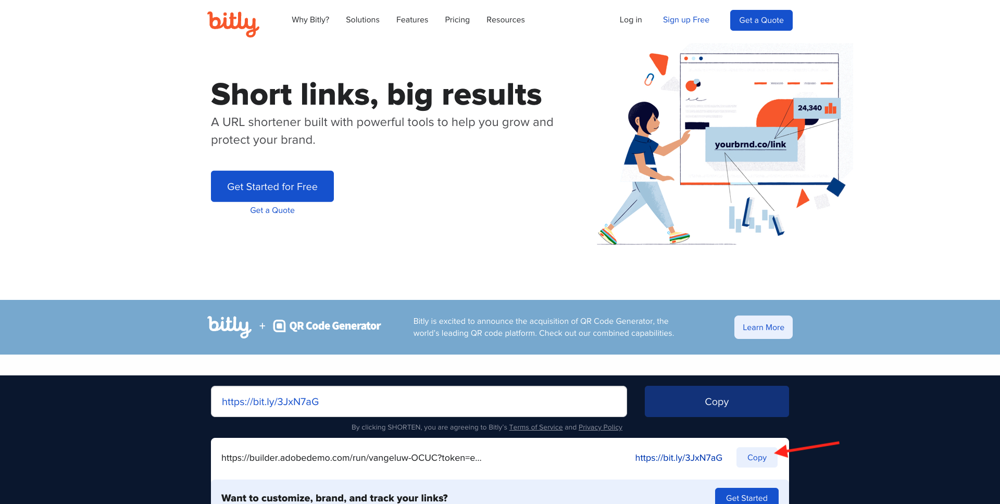
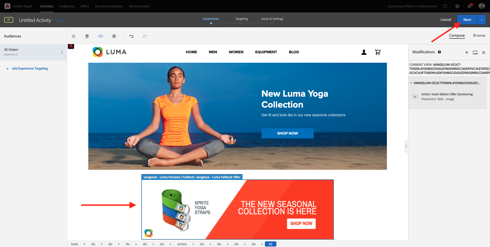

# 9.4将Adobe Target与Offer decisioning结合使用

## 9.4.1收集演示项目的可共享链接

要在Adobe Target中加载演示网站项目，您首先需要收集一个特殊链接，以允许Adobe Target加载您的演示网站项目。

为此，请转至 [https://builder.adobedemo.com/projects](https://builder.adobedemo.com/projects). 使用Adobe ID登录后，您将看到此内容。 单击您的网站项目以将其打开。

你现在会看到这个。 单击&#x200B;**共享**。

单击 **生成链接** 然后将链接复制到剪贴板。

转到 [https://bitly.com](https://bitly.com)，粘贴您复制的链接并单击 **缩短**. 现在，您将获得一个缩短链接，该链接如下所示： `https://bit.ly/3JxN7aG`. 在下一个练习中，您将需要该链接。

## 9.4.2收集

现在，转到Adobe Experience Cloud主页 [https://experiencecloud.adobe.com/](https://experiencecloud.adobe.com/). 单击 **Target**.

在 **Adobe Target** 主页，您将看到所有现有活动。

单击 **+创建活动** 创建新活动。

选择 **体验定位**.

现在，选择 **可视** 并将您的短链接粘贴到字段中 **输入活动URL**. 单击&#x200B;**下一步**。

然后，您将看到在可视化体验编辑器中加载演示网站项目。

转到 **浏览** 模式 **允许所有** 在Cookie同意弹出窗口中。

单击包含文本的区域 **特色类别**. 单击 **此项前插入** 然后选择 **选件决策**.

然后，您将看到此弹出窗口。 选择沙盒 `--aepSandboxId--` 然后选择版面 **Web — 图像**.

接下来，选择您的决策 `--demoProfileLdap-- - Luma Decision`. 单击&#x200B;**保存**。

然后你会看到这个。 确保添加其他模板规则 **URL** **包含** **your-project-name**. 快速 **保存**.

然后你会看到这个。 单击&#x200B;**下一步**。

输入选件的名称，请使用此名称： `--demoProfileLdap-- - XT with Offers (VEC)`. 单击&#x200B;**下一步**。

然后你会看到这个。 定义 **目标量度** 如所示。 单击“**保存并关闭**”。

您的选件现已创建并正在发布。

发布选件后，即可启用它。

下一步： [9.5通过电子邮件和短信使用您的决策](./ex5.md)

[返回模块9](./offer-decisioning.md)

[返回到所有模块](./../../overview.md)
