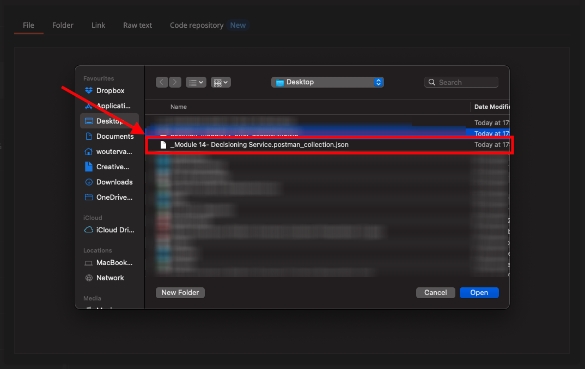
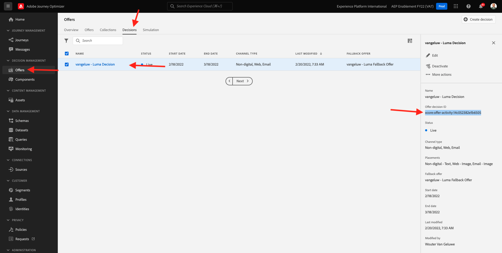
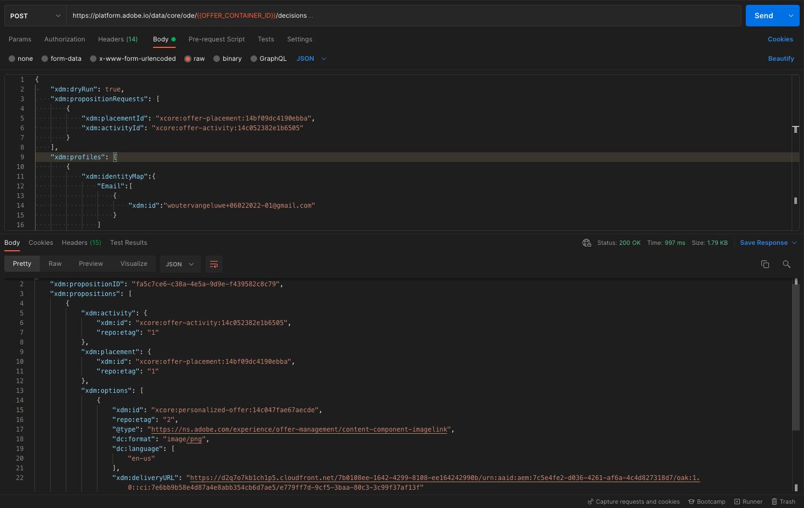

# 9.6使用API测试您的决策

## 9.6.1使用Postman使用Offer decisioningAPI

下载 [此Postman收藏集用于Offer decisioning](./../../assets/postman/postman_offer-decisioning.zip) 并解压缩到桌面。 然后，您将拥有：

现在，您的桌面上有此文件：

- [!UICONTROL _模块14 — 决策服务.postman_collection.json]

在 [练习3.3.3 -Postman身份验证以Adobe I/O](./../../modules/module3/ex3.md) 您安装了Postman。 在本练习中，您需要再次使用Postman。

打开Postman。 单击&#x200B;**[!UICONTROL 导入]**。

单击 **[!UICONTROL 上传文件]**.

选择文件 **[!UICONTROL _模块14 — 决策服务.postman_collection.json]** 单击 **[!UICONTROL 打开]**.

然后，此集合将在Postman中可用。

现在，您可以在Postman中获得开始通过API与Adobe Experience Platform交互所需的一切功能。

### 9.6.1.1列表容器

单击以打开请求 **[!UICONTROL GET — 列表容器]**.

在 **[!UICONTROL 参数]**，您将看到以下内容：

- 属性： `_instance.parentName==aepenablementfy22`

在该参数中， **[!UICONTROL aepenablementfy22]** 是在Adobe Experience Platform中使用的沙盒的名称。 您应使用的沙盒为 `--aepSandboxId--`. 替换文本 **[!UICONTROL aepenablementfy22]** by `--aepSandboxId--`.

替换沙盒名称后，单击 **[!UICONTROL 发送]**.

此响应将显示您指定的沙盒的选件容器。 请复制 **[!UICONTROL 容器实例ID]** 如下所示，并将其写在计算机上的文本文件中。 您需要使用此 **[!UICONTROL 容器实例ID]** 下次练习！

### 9.6.1.2列表放置

单击以打开请求 **[!UICONTROL GET — 列表版面]**. 单击 **[!UICONTROL 发送]**.

现在，您在选件容器中看到所有可用版面。 您看到的版面在Adobe Experience Platform UI中定义，如您在 [练习9.1.3](./ex1.md).

### 9.6.1.3列出决定规则

单击以打开请求 **[!UICONTROL GET — 列出决策规则]**. 单击 **[!UICONTROL 发送]**.

在响应中，您将看到您在Adobe Experience Platform UI中定义的决策规则，如 [练习9.1.4](./ex1.md).

### 9.6.1.4列出个性化优惠

单击以打开请求 **[!UICONTROL GET — 列出个性化优惠]**. 单击 **[!UICONTROL 发送]**.

在响应过程中，您将看到您在Adobe Experience Platform UI中定义的个性化选件(位于 [练习9.2.1](./ex2.md).

### 9.6.1.5列出后备优惠

单击以打开请求 **[!UICONTROL GET — 列出后备优惠]**. 单击 **[!UICONTROL 发送]**.

在响应中，您将看到您在Adobe Experience Platform UI中定义的备用选件(位于 [练习9.2.2](./ex2.md).

### 9.6.1.6列出集合

单击以打开请求 **[!UICONTROL GET — 列出收藏集]**.

在响应中，您将看到您在Adobe Experience Platform UI中定义的收藏集(位于 [练习9.2.3](./ex2.md).

### 9.6.1.7获取客户用户档案的详细选件

单击以打开请求 **[!UICONTROL POST — 获取客户用户档案的详细选件]**. 此请求与上一个请求类似，但实际上会返回图像URL、文本等详细信息。

对于此请求，与之前具有类似要求的练习类似，您需要为 **[!UICONTROL xdm:placementId]** 和 **[!UICONTROL xdm:activityId]** 以检索客户的特定选件详细信息。

字段 **[!UICONTROL xdm:activityId]** 需要填好。 您可以在Adobe Experience Platform UI中检索该内容，如下所示。

字段 **[!UICONTROL xdm:placementId]** 需要填好。 您可以在Adobe Experience Platform UI中检索该内容，如下所示。 在以下示例中，您可以看到版面的placementId **[!UICONTROL Web — 图像]**.

转到 **[!UICONTROL 正文]** 并输入要向其请求选件的客户的电子邮件地址。 单击 **[!UICONTROL 发送]**.

最后，您将看到哪种个性化选件以及需要向此客户显示哪些资产的结果。

您现在已完成此练习。

下一步： [摘要和优点](./summary.md)

[返回模块9](./offer-decisioning.md)

[返回到所有模块](./../../overview.md)
