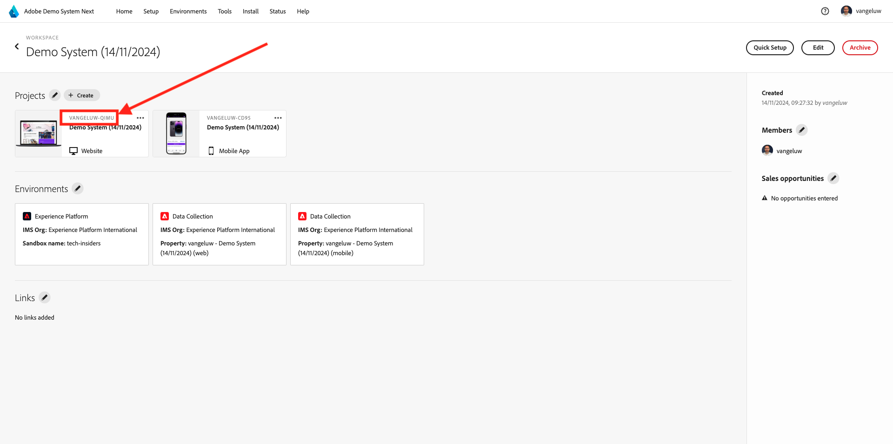
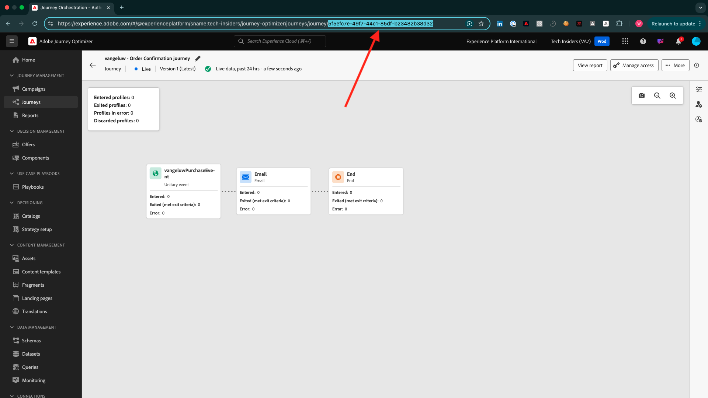

# 如何衡量完成情况？

转到[https://certification.adobe.com/courses/1258](https://certification.adobe.com/courses/1258)。

要完成模块，您需要提供完成证明。

以下是每个模块的预期完成校样。

## 开始使用

模块&#x200B;**快速入门**&#x200B;的预期完成证明是您创建的Web演示系统项目的ID。

Web格式的演示系统项目的ID如下所示： `--aepUserLdap-- - QIMU`。

## 1.1 Adobe Experience Platform数据收集和Web SDK扩展

模块&#x200B;**Data Collection &amp; Web SDK**&#x200B;的预期完成证明是Web的Data Collection属性的&#x200B;**环境ID**。

Web格式的数据收集属性的环境ID如下所示： `EN5211f7792b4442f8a45deb68f8902d3a`。

## 1.2数据摄取

模块&#x200B;**数据摄取**&#x200B;的预期完成证明是数据登陆区域Source连接的数据流ID。

数据流ID如下所示： **374c2c6d-f39a-4b0b-b568-40c41e6c4e8e**。

## 1.3联合受众构成

模块&#x200B;**联合受众组合**&#x200B;的预期完成证明是您创建的联合数据模型的ID。

Federated Data Model的ID如下所示：**DMO5110**，可从下图中所述的URL获取。

## 2.1实时客户资料

模块&#x200B;**实时客户个人资料**&#x200B;的预期完成证明是您通过UI `--aepUserLdap-- - Male customers with interest in iPhone 15 Pro`创建的受众的&#x200B;**受众ID**。

受众ID如下所示： **81a9acbe-12e6-424b-b658-abba3a435c83**。

## 2.2智能服务

模块&#x200B;**Intelligent Services**&#x200B;的预期完成证明是您通过UI `--aepUserLdap-- - Customer AI High Propensity`创建的受众的&#x200B;**受众ID**。

受众ID如下所示： **cb6db21d-8fa3-484a-93ac-25aa1ab48412**。

## 2.3 Real-Time CDP：构建受众并采取行动！

模块&#x200B;**Real-Time CDP的预期完成证明：构建受众并采取行动！**&#x200B;是您的&#x200B;**目标SDK Webhook目标**&#x200B;的ID。

Webhook目标的ID如下所示：**b5b4b959-3166-40e2-8279-8223d00c3987**，可以从下图所示的URL中获取。

## 2.4 Real-Time CDP：Audience Activation到Microsoft Azure事件中心

模块&#x200B;**Real-Time CDP：Audience Activation到Microsoft Azure事件中心**&#x200B;的预期完成证明是Adobe Experience Platform中&#x200B;**Microsoft Azure事件中心**&#x200B;目标的ID。

您可以在URL中找到类似于&#x200B;**43cf85bc-3d01-49fd-80c9-a2913db45e3c**&#x200B;的&#x200B;**Microsoft Azure事件中心目标ID**，如下所示：

## 2.5 Real-Time CDP连接：事件转发

模块&#x200B;**Real-Time CDP连接：事件转发**&#x200B;的预期完成证明是您的&#x200B;**事件转发属性ID**。

您可以在URL中找到&#x200B;**事件转发属性ID**，它类似于&#x200B;**PRa18819171c1241dfb16d74a49993dd5b**，如下图所示：

## 2.6将数据从Apache Kafka流式传输到Real-Time CDP

模块&#x200B;**将数据从Apache Kafka流式传输到Real-Time CDP**&#x200B;的预期完成证明是源连接器`--aepUserLdap-- - Kafka`的ID。

ID类似于&#x200B;**f843d50a-ee30-4ca8-a766-0e4f3d29a2f7**，您可以在此处找到它：

## 3.1 Adobe Journey Optimizer：编排

模块&#x200B;**Adobe Journey Optimizer：编排**&#x200B;的预期完成证明是您创建的历程的ID。

旅程的ID如下所示： **594fa01f-1a3b-450c-ba09-b7e3ff377c0f**，可以从下图所示的URL中获取。

## 3.2 Adobe Journey Optimizer：外部数据源和自定义操作

模块&#x200B;**Adobe Journey Optimizer：外部数据源和自定义操作**&#x200B;的预期完成证明是您创建的历程的ID。

历程的ID如下所示： **6962d3bc-4f44-4f9c-b326-83978f245f2a**，可以从下图所示的URL中获取。

## 3.3 Adobe Journey Optimizer：Offer decisioning

模块&#x200B;**Adobe Journey Optimizer：Offer decisioning**&#x200B;的预期完成证明是您创建的&#x200B;**决策**&#x200B;的ID。

您可在以下位置找到与此&#x200B;**dps:offer-activity:1a08ba4b529b2fb2**&#x200B;类似的&#x200B;**决策ID**：

## 3.4 Adobe Journey Optimizer：基于事件的历程

模块&#x200B;**Adobe Journey Optimizer：基于事件的历程**&#x200B;的预期完成证明是您创建的旅程的ID。

旅程的ID如下所示： **5f5efc7e-49f7-44c1-85df-b23482b38d32**，可以从下图所示的URL中获取。

## 4.1Customer Journey Analytics：使用Analysis Workspace构建功能板

模块&#x200B;**Customer Journey Analytics的预期完成证明：使用Analysis Workspace**&#x200B;构建功能板是项目`--aepUserLdap-- - Omnichannel Analysis`的ID。

格式如下所示： **677bcb247064db3c7de2a0e4**，打开项目后，可以在URL中找到它。

## 4.2Customer Journey Analytics：使用BigQuery Source Connector在Adobe Experience Platform中摄取和分析Google Analytics数据

模块&#x200B;**Customer Journey Analytics的预期完成证明：使用BigQuery Source Connector**&#x200B;在Adobe Experience Platform中摄取和分析Google Analytics数据是您的&#x200B;**BigQuery**&#x200B;源连接的ID。

您可在以下位置找到与此&#x200B;**b63a810c-a8cc-4c6b-a57e-dcb7e3368cf8**&#x200B;类似的&#x200B;**BigQuery连接ID**：

## 5.1查询服务

模块&#x200B;**查询服务**&#x200B;的预期完成证明是`--aepUserLdap--_callcenter_interaction_analysis`的数据集ID — 完成模块后获得的数据集。

ID如下所示： **675033c903fb3b2aefed8a0a**。

{width="50px" align="left"}

>[!NOTE]
>
>如果您有任何疑问，希望分享对未来内容提出建议的一般反馈，请直接联系技术业内人士，方式是向&#x200B;**techinsiders@adobe.com**&#x200B;发送电子邮件。

[返回所有模块](./overview.md)